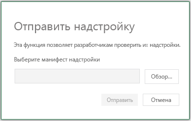

# <a name="sideload-office-add-ins-in-office-on-the-web-for-testing"></a>Загрузка неопубликованных надстроек Office в Office в Интернете для тестирования

При боковой загрузке надстройки можно установить надстройку, не помещая ее в каталог надстройки. Это полезно при тестировании и разработке надстройки, так как вы можете видеть, как будет отображаться и функционировать надстройка.

При боковой загрузке надстройки манифест надстройки хранится в локальном хранилище браузера, поэтому при очистке кэша браузера или переходе в другой браузер необходимо снова перезагрузить надстройку.

Sideloading varies between host applications (for example, Excel).

> [!NOTE]
> Боковая загрузка, как описано в этой статье, поддерживается в Excel, OneNote, PowerPoint и Word. Соответствующие действия касательно надстройки Outlook приведены в статье [Загрузка неопубликованных надстроек Outlook для тестирования](../outlook/sideload-outlook-add-ins-for-testing.md).

## <a name="sideload-an-office-add-in-in-office-on-the-web"></a>Загрузка неопубликованной надстройки Office в Office в Интернете

Этот процесс поддерживается только **для Excel,** **OneNote,** **PowerPoint** и **Word.** Инструкции по боковой загрузке вручную см. в следующем разделе. В этом примере предполагается, что вы используете проект, созданный с [генератором Yeoman для надстройок Office.](https://github.com/OfficeDev/generator-office)

1. Откройте [Office в Интернете.](https://office.live.com/) С помощью **параметра Create** сделайте документ в **Excel,** **OneNote,** **PowerPoint** или **Word.** В этом новом документе выберите **раздел Share** в ленте, выберите **ссылку на** копию и скопируйте URL-адрес.

2. В корневом каталоге файлов проектов yo office откройтеpackage.js **файл.** В разделе **config** этого файла создайте `"document"` свойство. Вклеить URL-адрес, скопированные в качестве значения `"document"` для свойства. Например, ваша будет выглядеть так:

    ```json
      "config": {
        "document": "<YOUR URL>",
        ...
      }
    ```

    > [!TIP]
    > Если вы создаете надстройку, не использующую генератор Yeoman, вы можете добавить параметры запроса в URL-адрес документа, применив к существующему URL-адресу следующее:

    - Порт сервера разработчиков, например `&wdaddindevserverport=3000` .
    - Имя файла манифеста, например `&wdaddinmanifestfile=manifest1.xml` .
    - GuID манифеста, например `&wdaddinmanifestguid=05c2e1c9-3e1d-406e-9a91-e9ac64854143` .

    > Если вы используете генератор Yeoman, добавление этой информации не требуется, так как приложение yeoman tooling автоматически добавляет эту информацию.
    > Обратите внимание, что в обоих случаях можно загружать манифесты только из localhost.

3. В командной строке, начиная с корневого каталога проекта, запустите следующую команду: `npm run start:web` .

4. При первом использовании этого метода для загрузки надстройки в Интернете вы увидите диалоговое окно с просьбой включить режим разработчика. Выберите контрольный ящик **для включить режим разработчика сейчас** и выберите **ОК**.

5. Вы увидите второй диалоговое окно с вопросом, хотите ли вы зарегистрировать манифест надстройки Office с компьютера. Вы должны выбрать **Да**.

6. Установлена надстройка. Если это команда надстройки, она должна отображаться в ленте или контекстном меню. Если это надстройка области задач, должна появиться области задач.

## <a name="sideload-an-office-add-in-in-office-on-the-web-manually"></a>Sideload an Office add-in in Office on the web manually

Этот метод не использует командную строку и может выполняться с помощью команд только в хост-приложении (например, в Excel).

1. Откройте [Office в Интернете.](https://office.live.com/) Откройте документ в **Excel,** **Word** или **PowerPoint.** На **вкладке Вставка** на ленте в разделе **Надстройки** выберите **надстройки Office.**

1. В **диалоговом** окантовке Надстройки Office выберите вкладку **MY ADD-INS,** выберите **Управление** надстройками, а затем загрузите мои **надстройки.**

    

1. **Найдите** файл манифеста надстройки и выберите **Отправить**.

    

1. Убедитесь, что надстройка установлена. Например, если надстройка вызывается командой, эта команда должна появиться на ленте или в контекстном меню. Если же у вас надстройка области задач, должна появиться область.

> [!NOTE]
> Чтобы проверить надстройку Office в Microsoft Edge с помощью исходного WebView (EdgeHTML), требуется дополнительный шаг конфигурации. В командной строке Windows запустите следующую строку: `npx office-addin-dev-settings appcontainer EdgeWebView --loopback --yes` . Это не требуется, если Office использует edge WebView2 на основе хрома. Дополнительные сведения см. в [браузерах, используемых надстройки Office.](../concepts/browsers-used-by-office-web-add-ins.md)

## <a name="sideload-an-office-add-in"></a>Sideload an Office Add-in

1. Вопишите в свою учетную запись Microsoft 365.

2. Откройте пусковую панель приложения в левом конце панели инструментов и выберите **Excel,** **Word** или **PowerPoint,** а затем создайте новый документ.

3. Действия 3–6 совпадают с действиями в предыдущем разделе **Загрузка неопубликованной надстройки Office в Office в Интернете**.

## <a name="sideload-an-add-in-when-using-visual-studio"></a>Загрузка неопубликованной настройки при использовании Visual Studio

Если вы используете Visual Studio разработку надстройки, процесс загрузки побок похож на ручную загрузку в Интернете. Единственное различие состоит в том, что необходимо обновить значение элемента **SourceURL** в манифесте, чтобы включить в него полный URL-адрес расположения, в котором развернута надстройка.

> [!NOTE]
> Хотя неопубликованные надстройки можно загружать из Visual Studio в Office в Интернете, их невозможно отлаживать из Visual Studio. Для этого вам потребуются средства отладки браузера. Дополнительные сведения см. в статье [Отладка надстроек в Office в Интернете](debug-add-ins-in-office-online.md).

1. В Visual Studio откройте окно **Свойства**, выбрав **Вид** > **Окно свойств**.
2. В **обозревателе решений** выберите веб-проект. В окне **Свойства** отобразятся свойства проекта.
3. В окне "Свойства" скопируйте **URL-адрес SSL**.
4. В проекте надстройки откройте XML-файл манифеста. Убедитесь, что вы изменяете исходный XML-файл. Для проектов некоторых типов в Visual Studio откроется визуальное представление XML-файла, которое не будет работать на следующем шаге.
5. Найдите и замените все экземпляры **~remoteAppUrl/** только что скопированным URL-адресом SSL. В зависимости от типа проекта отобразится несколько вариантов замены, и появятся новые URL-адреса, похожие на `https://localhost:44300/Home.html`.
6. Сохраните XML-файл.
7. Щелкните веб-проект правой кнопкой мыши и выберите **Отладка** > **Запустить новый экземпляр**. Веб-проект будет выполнен без запуска Office.
8. В Office в Интернете загрузите неопубликованную надстройку согласно инструкциям, приведенным выше в разделе [Загрузка неопубликованной надстройки Office в Office в Интернете](#sideload-an-office-add-in-in-office-on-the-web).

## <a name="remove-a-sideloaded-add-in"></a>Удаление боковой надстройки

Вы можете удалить ранее загруженную надстройку, очищая кэш браузера. Если вы внося изменения в манифест надстройки (например, обновите имена файлов значков или текст команд надстройки), возможно, потребуется очистить кэш [Office,](clear-cache.md) а затем повторно перезагрузить надстройку с помощью обновленного манифеста. В этом случае надстройка будет отображаться в Office в соответствии с обновленным манифестом.

## <a name="see-also"></a>См. также

- [Загрузка неопубликованных надстроек Office на iPad и Mac](sideload-an-office-add-in-on-ipad-and-mac.md)
- [Загрузка неопубликованных надстроек Outlook для тестирования](../outlook/sideload-outlook-add-ins-for-testing.md)
- [Очистка кэша Office](clear-cache.md)
