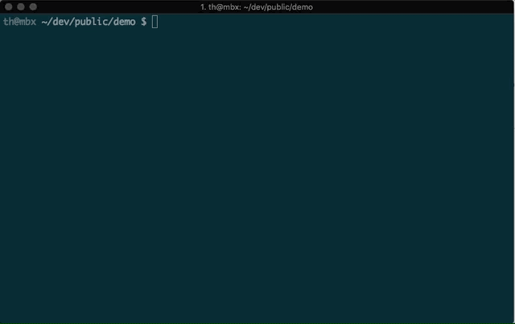

# <a name="validate-an-office-add-ins-manifest"></a>Проверка манифеста надстройки Office

Может потребоваться проверить файл манифеста надстройки, чтобы убедиться в его правильности и полноте. Проверка может также выявлять проблемы, которые приводят к появлению ошибки "Манифест надстройки недействителен" при попытке загрузить неопубликованную надстройку. В этой статье описаны разные способы проверки файла манифеста.

> [!NOTE]
> Сведения об использовании журнала среды выполнения для устранения неполадок с манифестом надстройки см. в статье [Отладка надстройки с помощью журнала среды выполнения](runtime-logging.md).

## <a name="validate-your-manifest-with-the-yeoman-generator-for-office-add-ins"></a>Проверка манифеста с помощью генератора Yeoman для надстроек Office

Если для создания надстройки использовался [генератор Yeoman для надстроек Office](https://www.npmjs.com/package/generator-office), вы также можете использовать его для проверки файла манифеста проекта. Выполните следующую команду в корневом каталоге своего проекта.

```command&nbsp;line
npm run validate
```



> [!NOTE]
> Для доступа к этой функции проект надстройки должен быть создан с помощью [генератора Yeoman](https://www.npmjs.com/package/generator-office) 1.1.17 или более поздней версии.

## <a name="validate-your-manifest-with-office-addin-manifest"></a>Проверка манифеста с помощью office-addin-manifest

Если для создания надстройки использовался не [генератор Yeoman для надстроек Office](https://www.npmjs.com/package/generator-office), вы можете проверить манифест, используя [office-addin-manifest](https://www.npmjs.com/package/office-addin-manifest).

1. Установите [Node.js](https://nodejs.org/download/).

2. Выполните следующую команду в корневом каталоге своего проекта. Замените `MANIFEST_FILE` на имя файла манифеста.

    ```command&nbsp;line
    npx office-addin-manifest validate MANIFEST_FILE
    ```

    > [!NOTE]
    > Если эта команда приводит к появлению сообщения об ошибке "Недопустимый синтаксис команды" (так как команда `validate` не распознается), выполните следующую команду для проверки манифеста (заменив `MANIFEST_FILE` именем файла манифеста): 
    >
    > `npx --ignore-existing office-addin-manifest validate MANIFEST_FILE`

## <a name="validate-your-manifest-against-the-xml-schema"></a>Проверка манифеста на соответствие схеме XML

Вы можете проверить файл манифеста на соответствие файлам [XML Schema Definition (XSD)](/openspecs/office_file_formats/ms-owemxml/c6a06390-34b8-4b42-82eb-b28be12494a8). Так вы сможете убедиться в том, что файл манифеста соответствует правильной схеме, включая любые пространства имен для используемых элементов. Если вы скопировали элементы из других примеров манифеста, еще раз проверьте, **включены ли соответствующие пространства имен**. Для этой проверки можно использовать средство проверки на соответствие схеме XML.

### <a name="to-use-a-command-line-xml-schema-validation-tool-to-validate-your-manifest"></a>Как проверить манифест на соответствие схеме XML с помощью программы командной строки

1. Установите [tar](https://www.gnu.org/software/tar/) и [libxml](http://xmlsoft.org/FAQ.html), если вы еще этого не сделали.

2. Выполните указанную ниже команду. Вместо `XSD_FILE` укажите путь к XSD-файлу манифеста, а вместо `XML_FILE` — путь к XML-файлу манифеста.
    
    ```command&nbsp;line
    xmllint --noout --schema XSD_FILE XML_FILE
    ```

## <a name="see-also"></a>См. также

- [XML-манифест надстройки Office](../develop/add-in-manifests.md)
- [Очистка кэша Office](clear-cache.md)
- [Отладка надстройки с помощью журнала среды выполнения](runtime-logging.md)
- [Загрузка неопубликованных надстроек Office для тестирования](sideload-office-add-ins-for-testing.md)
- [Отладка надстроек Office](debug-add-ins-using-f12-developer-tools-on-windows-10.md)
