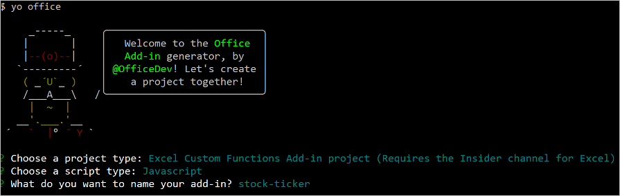
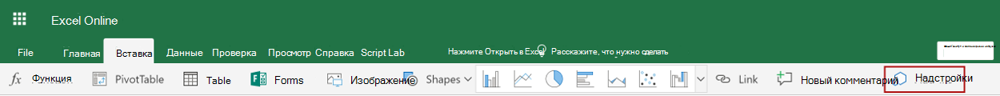
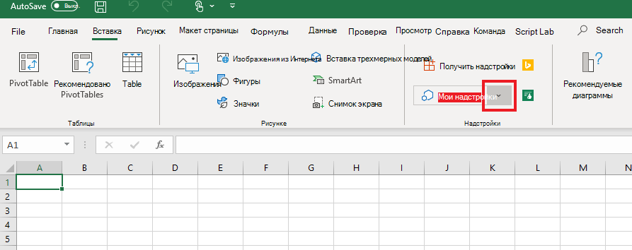

# <a name="tutorial-create-custom-functions-in-excel"></a><span data-ttu-id="99547-103">Руководство: создание пользовательских функций в Excel</span><span class="sxs-lookup"><span data-stu-id="99547-103">Tutorial: Create custom functions in Excel</span></span>

<span data-ttu-id="99547-104">Пользовательские функции позволяют добавлять новые функции в Excel путем определения этих функций в JavaScript как части надстройки.</span><span class="sxs-lookup"><span data-stu-id="99547-104">Custom functions enable you to add new functions to Excel by defining those functions in JavaScript as part of an add-in.</span></span> <span data-ttu-id="99547-105">Пользователи в Excel могут получить доступ к пользовательским функциям так же, как и к любой встроенной функции в Excel, например `SUM()`.</span><span class="sxs-lookup"><span data-stu-id="99547-105">Users within Excel can access custom functions as they would any native function in Excel, such as `SUM()`.</span></span> <span data-ttu-id="99547-106">Вы можете создавать пользовательские функции, которые будут выполнять простые задачи, такие как вычисления, или более сложные задачи, такие как потоковая передача данных в режиме реального времени из Интернета на лист.</span><span class="sxs-lookup"><span data-stu-id="99547-106">You can create custom functions that perform simple tasks like calculations or more complex tasks such as streaming real-time data from the web into a worksheet.</span></span>

<span data-ttu-id="99547-107">В этом руководстве описан порядок выполнения перечисленных ниже задач.</span><span class="sxs-lookup"><span data-stu-id="99547-107">In this tutorial, you will:</span></span>
> [!div class="checklist"]
> * <span data-ttu-id="99547-108">Создание надстройки пользовательской функции с помощью [генератора Yeoman для надстроек Office](https://www.npmjs.com/package/generator-office).</span><span class="sxs-lookup"><span data-stu-id="99547-108">Create a custom function add-in using the [Yeoman generator for Office Add-ins](https://www.npmjs.com/package/generator-office).</span></span> 
> * <span data-ttu-id="99547-109">Использование готовой пользовательской функции для выполнения простых вычислений</span><span class="sxs-lookup"><span data-stu-id="99547-109">Use a prebuilt custom function to perform a simple calculation.</span></span>
> * <span data-ttu-id="99547-110">Создание пользовательской функции, которая получает данные из сети Интернет.</span><span class="sxs-lookup"><span data-stu-id="99547-110">Create a custom function that gets data from the web.</span></span>
> * <span data-ttu-id="99547-111">Создание пользовательской функции, которая осуществляет потоковую передачу данных в реальном времени из сети Интернет</span><span class="sxs-lookup"><span data-stu-id="99547-111">Create a custom function that streams real-time data from the web.</span></span>

## <a name="prerequisites"></a><span data-ttu-id="99547-112">Необходимые компоненты</span><span class="sxs-lookup"><span data-stu-id="99547-112">Prerequisites</span></span>

[!include[Yeoman generator prerequisites](../includes/quickstart-yo-prerequisites.md)]

* <span data-ttu-id="99547-113">Excel в Windows (64-разрядная версия 1810 или более поздняя) или Excel Online</span><span class="sxs-lookup"><span data-stu-id="99547-113">Excel on Windows (64-bit version 1810 or later) or Excel Online</span></span>

* <span data-ttu-id="99547-114">Присоединитесь к [Программе предварительной оценки Office](https://products.office.com/office-insider) (уровень **Участник**; ранее "Предварительная оценка — ранний доступ")</span><span class="sxs-lookup"><span data-stu-id="99547-114">Join the [Office Insider program](https://products.office.com/office-insider) (**Insider** level -- formerly called "Insider Fast")</span></span>

## <a name="create-a-custom-functions-project"></a><span data-ttu-id="99547-115">Создание проекта пользовательских функций</span><span class="sxs-lookup"><span data-stu-id="99547-115">Create a custom functions project</span></span>

 <span data-ttu-id="99547-116">Чтобы начать, вам необходимо создать проект кода для разработки надстройки пользовательской функции.</span><span class="sxs-lookup"><span data-stu-id="99547-116">To start, you'll create the code project to build your custom function add-in.</span></span> <span data-ttu-id="99547-117">[Генератор Yeoman для надстроек Office](https://www.npmjs.com/package/generator-office) настроит проект с помощью некоторых предварительно созданных настраиваемых функций, которые можно испытать. Если вы уже запустили функцию быстрого запуска пользовательских функций и создали проект, продолжайте использовать этот проект и переходите к [этому шагу](#create-a-custom-function-that-requests-data-from-the-web) .</span><span class="sxs-lookup"><span data-stu-id="99547-117">The [Yeoman generator for Office Add-ins](https://www.npmjs.com/package/generator-office) will set up your project with some prebuilt custom functions that you can try out. If you have already run the custom functions quick start and generated a project, continue to use that project and skip to [this step](#create-a-custom-function-that-requests-data-from-the-web) instead.</span></span>

1. <span data-ttu-id="99547-118">Выполните указанную ниже команду и ответьте на вопросы, как показано ниже.</span><span class="sxs-lookup"><span data-stu-id="99547-118">Run the following command and then answer the prompts as follows.</span></span>
    
    ```command&nbsp;line
    yo office
    ```
    
    * <span data-ttu-id="99547-119">**Выберите тип проекта:** `Excel Custom Functions Add-in project (...)`</span><span class="sxs-lookup"><span data-stu-id="99547-119">**Choose a project type:** `Excel Custom Functions Add-in project (...)`</span></span>
    * <span data-ttu-id="99547-120">**Выберите тип сценария:** `JavaScript`</span><span class="sxs-lookup"><span data-stu-id="99547-120">**Choose a script type:** `JavaScript`</span></span>
    * <span data-ttu-id="99547-121">**Как вы хотите назвать надстройку?**</span><span class="sxs-lookup"><span data-stu-id="99547-121">**What do you want to name your add-in?**</span></span> `stock-ticker`

    
    
    <span data-ttu-id="99547-123">Генератор Yeoman создаст файлы проекта и установит вспомогательные компоненты Node.</span><span class="sxs-lookup"><span data-stu-id="99547-123">The Yeoman generator will create the project files and install supporting Node components.</span></span>

2. <span data-ttu-id="99547-124">Перейдите к корневой папке проекта.</span><span class="sxs-lookup"><span data-stu-id="99547-124">Navigate to the root folder of the project.</span></span>
    
    ```command&nbsp;line
    cd stock-ticker
    ```

3. <span data-ttu-id="99547-125">Выполните сборку проекта.</span><span class="sxs-lookup"><span data-stu-id="99547-125">Build the project.</span></span>
    
    ```command&nbsp;line
    npm run build
    ```

4. <span data-ttu-id="99547-126">Запустите локальный веб-сервер, работающий на Node.js.</span><span class="sxs-lookup"><span data-stu-id="99547-126">Start the local web server, which runs in Node.js.</span></span> <span data-ttu-id="99547-127">Вы можете испытать надстройку настраиваемой функции в Excel для Windows или Excel Online.</span><span class="sxs-lookup"><span data-stu-id="99547-127">You can try out the custom function add-in in Excel on Windows or Excel Online.</span></span>

# <a name="excel-on-windowstabexcel-windows"></a>[<span data-ttu-id="99547-128">Excel в Windows</span><span class="sxs-lookup"><span data-stu-id="99547-128">Excel on Windows</span></span>](#tab/excel-windows)

<span data-ttu-id="99547-129">Чтобы протестировать надстройку в Excel в Windows, выполните следующую команду.</span><span class="sxs-lookup"><span data-stu-id="99547-129">To test your add-in in Excel on Windows, run the following command.</span></span> <span data-ttu-id="99547-130">При выполнении этой команды локальный веб-сервер запустится и откроется приложение Excel в Windows с загруженной надстройкой.</span><span class="sxs-lookup"><span data-stu-id="99547-130">When you run this command, the local web server will start and Excel on Windows will open with your add-in loaded.</span></span>

```command&nbsp;line
npm run start:desktop
```

> [!NOTE]
> <span data-ttu-id="99547-131">Надстройки Office должны использовать HTTPS, а не HTTP, даже в случае разработки.</span><span class="sxs-lookup"><span data-stu-id="99547-131">Office Add-ins should use HTTPS, not HTTP, even when you are developing.</span></span> <span data-ttu-id="99547-132">Если вам будет предложено установить сертификат после того, как вы запустите `npm run start:desktop`, примите предложение установить сертификат от генератора Yeoman.</span><span class="sxs-lookup"><span data-stu-id="99547-132">If you are prompted to install a certificate after you run `npm run start:desktop`, accept the prompt to install the certificate that the Yeoman generator provides.</span></span>

# <a name="excel-onlinetabexcel-online"></a>[<span data-ttu-id="99547-133">Excel Online</span><span class="sxs-lookup"><span data-stu-id="99547-133">Excel Online</span></span>](#tab/excel-online)

<span data-ttu-id="99547-134">Чтобы протестировать надстройку в Excel Online, выполните следующую команду.</span><span class="sxs-lookup"><span data-stu-id="99547-134">To test your add-in in Excel Online, run the following command.</span></span> <span data-ttu-id="99547-135">После выполнения этой команды запустится локальный веб-сервер.</span><span class="sxs-lookup"><span data-stu-id="99547-135">When you run this command, the local web server will start.</span></span>

```command&nbsp;line
npm run start:web
```

> [!NOTE]
> <span data-ttu-id="99547-136">Надстройки Office должны использовать HTTPS, а не HTTP, даже в случае разработки.</span><span class="sxs-lookup"><span data-stu-id="99547-136">Office Add-ins should use HTTPS, not HTTP, even when you are developing.</span></span> <span data-ttu-id="99547-137">Если вам будет предложено установить сертификат после того, как вы запустите `npm run start:web`, примите предложение установить сертификат от генератора Yeoman.</span><span class="sxs-lookup"><span data-stu-id="99547-137">If you are prompted to install a certificate after you run `npm run start:web`, accept the prompt to install the certificate that the Yeoman generator provides.</span></span>

<span data-ttu-id="99547-138">Чтобы использовать надстройку с пользовательскими функциями, откройте новую книгу в Excel Online.</span><span class="sxs-lookup"><span data-stu-id="99547-138">To use your custom functions add-in, open a new workbook in Excel Online.</span></span> <span data-ttu-id="99547-139">В этой книге выполните следующие действия, чтобы Загрузка неопубликованных надстройку.</span><span class="sxs-lookup"><span data-stu-id="99547-139">In this workbook, complete the following steps to sideload your add-in.</span></span>

1. <span data-ttu-id="99547-140">В Excel Online на вкладке **Вставка** выберите пункт **Надстройки**.</span><span class="sxs-lookup"><span data-stu-id="99547-140">In Excel Online, choose the **Insert** tab and then choose **Add-ins**.</span></span>

   
   
2. <span data-ttu-id="99547-142">Выберите пункт **Управление моими надстройками**, а затем выберите **Отправить мою надстройку**.</span><span class="sxs-lookup"><span data-stu-id="99547-142">Choose **Manage My Add-ins** and select **Upload My Add-in**.</span></span>

3. <span data-ttu-id="99547-143">Выберите \*\*Обзор... \*\* и откройте корневой каталог проекта, созданный генератором Yeoman.</span><span class="sxs-lookup"><span data-stu-id="99547-143">Choose **Browse...** and navigate to the root directory of the project that the Yeoman generator created.</span></span>

4. <span data-ttu-id="99547-144">Выберите файл **manifest.xml** и нажмите кнопку **Открыть**, затем нажмите кнопку **Отправить**.</span><span class="sxs-lookup"><span data-stu-id="99547-144">Select the file **manifest.xml** and choose **Open**, then choose **Upload**.</span></span>

--- 
    
## <a name="try-out-a-prebuilt-custom-function"></a><span data-ttu-id="99547-145">Проверка работы готовой пользовательской функции</span><span class="sxs-lookup"><span data-stu-id="99547-145">Try out a prebuilt custom function</span></span>

<span data-ttu-id="99547-146">Созданный проект пользовательских функций содержит некоторые предварительно созданные пользовательские функции, определенные в файле **./СРК/функтионс/функтионс.ЖС** .</span><span class="sxs-lookup"><span data-stu-id="99547-146">The custom functions project that you created contains some prebuilt custom functions, defined within the **./src/functions/functions.js** file.</span></span> <span data-ttu-id="99547-147">Файл **./manifest.xml** указывает, что все пользовательские функции принадлежат пространству имен `CONTOSO`.</span><span class="sxs-lookup"><span data-stu-id="99547-147">The **./manifest.xml** file specifies that all custom functions belong to the `CONTOSO` namespace.</span></span> <span data-ttu-id="99547-148">Вы будете использовать пространство имен CONTOSO для доступа к пользовательским функциям в Excel.</span><span class="sxs-lookup"><span data-stu-id="99547-148">You'll use the CONTOSO namespace to access the custom functions in Excel.</span></span>

<span data-ttu-id="99547-149">Затем вы проверите пользовательскую функцию `ADD`, выполнив описанные ниже действия:</span><span class="sxs-lookup"><span data-stu-id="99547-149">Next you'll try out the `ADD` custom function by completing the following steps:</span></span>

1. <span data-ttu-id="99547-150">В Excel перейдите в любую ячейку и введите `=CONTOSO`.</span><span class="sxs-lookup"><span data-stu-id="99547-150">In Excel, go to any cell and enter `=CONTOSO`.</span></span> <span data-ttu-id="99547-151">Обратите внимание на то, что в меню автозаполнения содержится список всех функций в пространстве имен `CONTOSO`.</span><span class="sxs-lookup"><span data-stu-id="99547-151">Notice that the autocomplete menu shows the list of all functions in the `CONTOSO` namespace.</span></span>

2. <span data-ttu-id="99547-152">Выполните запуск функции `CONTOSO.ADD` с числами `10` и `200` в качестве входных параметров, введя значение `=CONTOSO.ADD(10,200)` в ячейке и нажав клавишу ВВОД.</span><span class="sxs-lookup"><span data-stu-id="99547-152">Run the `CONTOSO.ADD` function, with numbers `10` and `200` as input parameters, by typing the value `=CONTOSO.ADD(10,200)` in the cell and pressing enter.</span></span>

<span data-ttu-id="99547-153">Пользовательская функция `ADD` вычисляет сумму двух чисел, которые вы указываете и возвращает результат **210**.</span><span class="sxs-lookup"><span data-stu-id="99547-153">The `ADD` custom function computes the sum of the two numbers that you provided and returns the result of **210**.</span></span>

## <a name="create-a-custom-function-that-requests-data-from-the-web"></a><span data-ttu-id="99547-154">Создание пользовательской функции, которая запрашивает данные из сети Интернет</span><span class="sxs-lookup"><span data-stu-id="99547-154">Create a custom function that requests data from the web</span></span>

<span data-ttu-id="99547-155">Интеграция данных из Интернета — отличный способ расширения функционала Excel через пользовательские функции.</span><span class="sxs-lookup"><span data-stu-id="99547-155">Integrating data from the Web is a great way to extend Excel through custom functions.</span></span> <span data-ttu-id="99547-156">Далее необходимо создать пользовательскую функцию под именем `stockPrice`, которая получает котировки акций из Web API и возвращает результат в ячейку на листе.</span><span class="sxs-lookup"><span data-stu-id="99547-156">Next you’ll create a custom function named `stockPrice` that gets a stock quote from a Web API and returns the result to the cell of a worksheet.</span></span> <span data-ttu-id="99547-157">Вы будете использовать API IEX Trading, который предоставляется бесплатно и не требует проверки подлинности.</span><span class="sxs-lookup"><span data-stu-id="99547-157">You’ll use the IEX Trading API, which is free and does not require authentication.</span></span>

1. <span data-ttu-id="99547-158">В проекте **Stocks —** найдите файл **./СРК/функтионс/функтионс.ЖС** и откройте его в редакторе кода.</span><span class="sxs-lookup"><span data-stu-id="99547-158">In the **stock-ticker** project, find the file **./src/functions/functions.js** and open it in your code editor.</span></span>

2. <span data-ttu-id="99547-159">В файле Function **. js**нахождение `increment` функции и добавление следующего кода после этой функции.</span><span class="sxs-lookup"><span data-stu-id="99547-159">In **functions.js**, locate the `increment` function and add the following code after that function.</span></span>

    ```js
    /**
    * Fetches current stock price
    * @customfunction 
    * @param {string} ticker Stock symbol
    * @returns {number} The current stock price.
    */
    function stockPrice(ticker) {
        var url = "https://api.iextrading.com/1.0/stock/" + ticker + "/price";
        return fetch(url)
            .then(function(response) {
                return response.text();
            })
            .then(function(text) {
                return parseFloat(text);
            });

        // Note: in case of an error, the returned rejected Promise
        //    will be bubbled up to Excel to indicate an error.
    }
    CustomFunctions.associate("STOCKPRICE", stockPrice);
    ```

    <span data-ttu-id="99547-160">Код `CustomFunctions.associate` сопоставляет `id` функции с адресом функции `stockPrice` в JavaScript, чтобы Excel мог вызвать вашу функцию.</span><span class="sxs-lookup"><span data-stu-id="99547-160">The `CustomFunctions.associate` code associates the `id` of the function with the function address of `stockPrice` in JavaScript so that Excel can call your function.</span></span>

3. <span data-ttu-id="99547-161">Выполните указанную ниже команду, чтобы повторно собрать проект.</span><span class="sxs-lookup"><span data-stu-id="99547-161">Run the following command to rebuild the project.</span></span>

    ```command&nbsp;line
    npm run build
    ```

4. <span data-ttu-id="99547-162">Выполните следующие действия (для Excel в Windows или Excel Online), чтобы повторно зарегистрировать надстройку в Excel.</span><span class="sxs-lookup"><span data-stu-id="99547-162">Complete the following steps (for either Excel on Windows or Excel Online) to re-register the add-in in Excel.</span></span> <span data-ttu-id="99547-163">Прежде чем новая функция станет доступна, необходимо выполнить указанные ниже действия.</span><span class="sxs-lookup"><span data-stu-id="99547-163">You must complete these steps before the new function will be available.</span></span> 

# <a name="excel-on-windowstabexcel-windows"></a>[<span data-ttu-id="99547-164">Excel в Windows</span><span class="sxs-lookup"><span data-stu-id="99547-164">Excel on Windows</span></span>](#tab/excel-windows)

1. <span data-ttu-id="99547-165">Закройте Excel, а затем откройте Excel повторно.</span><span class="sxs-lookup"><span data-stu-id="99547-165">Close Excel and then reopen Excel.</span></span>

2. <span data-ttu-id="99547-166">В Excel перейдите на вкладку **Вставка** , а затем щелкните стрелку вниз, расположенную справа от **моих надстроек**.  </span><span class="sxs-lookup"><span data-stu-id="99547-166">In Excel, choose the **Insert** tab and then choose the down-arrow located to the right of **My Add-ins**.  </span></span>

3. <span data-ttu-id="99547-167">В списке доступных надстроек найдите раздел **Надстройки разработчика** и выберите надстройку **stock-ticker**, чтобы зарегистрировать ее.</span><span class="sxs-lookup"><span data-stu-id="99547-167">In the list of available add-ins, find the **Developer Add-ins** section and select the **stock-ticker** add-in to register it.</span></span>
    <span data-ttu-id="99547-168"></span><span class="sxs-lookup"><span data-stu-id="99547-168"></span></span>

# <a name="excel-onlinetabexcel-online"></a>[<span data-ttu-id="99547-169">Excel Online</span><span class="sxs-lookup"><span data-stu-id="99547-169">Excel Online</span></span>](#tab/excel-online)

1. <span data-ttu-id="99547-170">В Excel Online выберите вкладку **Вставка**, а затем выберите **Надстройки**. </span><span class="sxs-lookup"><span data-stu-id="99547-170">In Excel Online, choose the **Insert** tab and then choose **Add-ins**.  </span></span>

2. <span data-ttu-id="99547-171">Выберите пункт **Управление моими надстройками**, а затем выберите **Отправить мою надстройку**.</span><span class="sxs-lookup"><span data-stu-id="99547-171">Choose **Manage My Add-ins** and select **Upload My Add-in**.</span></span> 

3. <span data-ttu-id="99547-172">Выберите \*\*Обзор... \*\* и откройте корневой каталог проекта, созданный генератором Yeoman.</span><span class="sxs-lookup"><span data-stu-id="99547-172">Choose **Browse...** and navigate to the root directory of the project that the Yeoman generator created.</span></span> 

4. <span data-ttu-id="99547-173">Выберите файл **manifest.xml** и нажмите **Открыть**, затем нажмите кнопку **Отправить**.</span><span class="sxs-lookup"><span data-stu-id="99547-173">Select the file **manifest.xml** and choose **Open**, then choose **Upload**.</span></span>

---

<ol start="5">
<li> <span data-ttu-id="99547-174">Теперь давайте оценим, как работает новая функция.</span><span class="sxs-lookup"><span data-stu-id="99547-174">Try out the new function.</span></span> <span data-ttu-id="99547-175">В ячейке <strong>B1</strong> введите нужный текст <strong>= CONTOSO. STOCKPRICE("MSFT")</strong> и нажмите ВВОД.</span><span class="sxs-lookup"><span data-stu-id="99547-175">In cell <strong>B1</strong>, type the text <strong>=CONTOSO.STOCKPRICE("MSFT")</strong> and press enter.</span></span> <span data-ttu-id="99547-176">Вы должны увидеть, что результат в ячейке <strong>B1</strong> является текущей ценой одной акции корпорации Майкрософт.</span><span class="sxs-lookup"><span data-stu-id="99547-176">You should see that the result in cell <strong>B1</strong> is the current stock price for one share of Microsoft stock.</span></span></li>
</ol>

## <a name="create-a-streaming-asynchronous-custom-function"></a><span data-ttu-id="99547-177">Создание потоковой асинхронной пользовательской функции</span><span class="sxs-lookup"><span data-stu-id="99547-177">Create a streaming asynchronous custom function</span></span>

<span data-ttu-id="99547-178">Функция `stockPrice` возвращает цену акции в конкретный момент времени, однако цены на акции всегда меняются.</span><span class="sxs-lookup"><span data-stu-id="99547-178">The `stockPrice` function returns the price of a stock at a specific moment in time, but stock prices are always changing.</span></span> <span data-ttu-id="99547-179">Далее вы создадите пользовательскую функцию с именем `stockPriceStream`, которая получает цену акции каждые 1000 милисекунд.</span><span class="sxs-lookup"><span data-stu-id="99547-179">Next you’ll create a custom function named `stockPriceStream` that gets the price of a stock every 1000 milliseconds.</span></span>

1. <span data-ttu-id="99547-180">В проекте **Stocks – Tick** добавьте следующий код в файл **./СРК/функтионс/функтионс.ЖС** и сохраните его.</span><span class="sxs-lookup"><span data-stu-id="99547-180">In the **stock-ticker** project, add the following code to **./src/functions/functions.js** and save the file.</span></span>

    ```js
    /**
    * Streams real time stock price
    * @customfunction 
    * @param {string} ticker Stock symbol
    * @param {CustomFunctions.StreamingInvocation<number>} invocation
    */
    function stockPriceStream(ticker, invocation) {
        var updateFrequency = 1000 /* milliseconds*/;
        var isPending = false;

        var timer = setInterval(function() {
            // If there is already a pending request, skip this iteration:
            if (isPending) {
                return;
            }

            var url = "https://api.iextrading.com/1.0/stock/" + ticker + "/price";
            isPending = true;

            fetch(url)
                .then(function(response) {
                    return response.text();
                })
                .then(function(text) {
                    invocation.setResult(parseFloat(text));
                })
                .catch(function(error) {
                    invocation.setResult(error);
                })
                .then(function() {
                    isPending = false;
                });
        }, updateFrequency);

        invocation.onCanceled = () => {
            clearInterval(timer);
        };
    }
    CustomFunctions.associate("STOCKPRICESTREAM", stockPriceStream);
    ```
    
    <span data-ttu-id="99547-181">Код `CustomFunctions.associate` сопоставляет `id` функции с адресом функции `stockPriceStream` в JavaScript, чтобы Excel мог вызвать вашу функцию.</span><span class="sxs-lookup"><span data-stu-id="99547-181">The `CustomFunctions.associate` code associates the `id` of the function with the function address of `stockPriceStream` in JavaScript so that Excel can call your function.</span></span>
    
2. <span data-ttu-id="99547-182">Выполните указанную ниже команду, чтобы повторно собрать проект.</span><span class="sxs-lookup"><span data-stu-id="99547-182">Run the following command to rebuild the project.</span></span>

    ```command&nbsp;line
    npm run build
    ```

3. <span data-ttu-id="99547-183">Выполните следующие действия (для Excel в Windows или Excel Online), чтобы повторно зарегистрировать надстройку в Excel.</span><span class="sxs-lookup"><span data-stu-id="99547-183">Complete the following steps (for either Excel on Windows or Excel Online) to re-register the add-in in Excel.</span></span> <span data-ttu-id="99547-184">Прежде чем новая функция станет доступна, необходимо выполнить указанные ниже действия.</span><span class="sxs-lookup"><span data-stu-id="99547-184">You must complete these steps before the new function will be available.</span></span> 

# <a name="excel-on-windowstabexcel-windows"></a>[<span data-ttu-id="99547-185">Excel в Windows</span><span class="sxs-lookup"><span data-stu-id="99547-185">Excel on Windows</span></span>](#tab/excel-windows)

1. <span data-ttu-id="99547-186">Закройте Excel, а затем откройте Excel повторно.</span><span class="sxs-lookup"><span data-stu-id="99547-186">Close Excel and then reopen Excel.</span></span>

2. <span data-ttu-id="99547-187">В Excel перейдите на вкладку **Вставка** , а затем щелкните стрелку вниз, расположенную справа от **моих надстроек**.  </span><span class="sxs-lookup"><span data-stu-id="99547-187">In Excel, choose the **Insert** tab and then choose the down-arrow located to the right of **My Add-ins**.  </span></span>

3. <span data-ttu-id="99547-188">В списке доступных надстроек найдите раздел **Надстройки разработчика** и выберите надстройку **stock-ticker**, чтобы зарегистрировать ее.</span><span class="sxs-lookup"><span data-stu-id="99547-188">In the list of available add-ins, find the **Developer Add-ins** section and select the **stock-ticker** add-in to register it.</span></span>
    <span data-ttu-id="99547-189"></span><span class="sxs-lookup"><span data-stu-id="99547-189"></span></span>

# <a name="excel-onlinetabexcel-online"></a>[<span data-ttu-id="99547-190">Excel Online</span><span class="sxs-lookup"><span data-stu-id="99547-190">Excel Online</span></span>](#tab/excel-online)

1. <span data-ttu-id="99547-191">В Excel Online выберите вкладку **Вставка**, а затем выберите **Надстройки**. </span><span class="sxs-lookup"><span data-stu-id="99547-191">In Excel Online, choose the **Insert** tab and then choose **Add-ins**.  </span></span>

2. <span data-ttu-id="99547-192">Выберите пункт **Управление моими надстройками**, а затем выберите **Отправить мою надстройку**.</span><span class="sxs-lookup"><span data-stu-id="99547-192">Choose **Manage My Add-ins** and select **Upload My Add-in**.</span></span>

3. <span data-ttu-id="99547-193">Выберите \*\*Обзор... \*\* и откройте корневой каталог проекта, созданный генератором Yeoman.</span><span class="sxs-lookup"><span data-stu-id="99547-193">Choose **Browse...** and navigate to the root directory of the project that the Yeoman generator created.</span></span>

4. <span data-ttu-id="99547-194">Выберите файл **manifest.xml** и нажмите **Открыть**, затем нажмите кнопку **Отправить**.</span><span class="sxs-lookup"><span data-stu-id="99547-194">Select the file **manifest.xml** and choose **Open**, then choose **Upload**.</span></span>

--- 

<ol start="4">
<li><span data-ttu-id="99547-195">Теперь давайте оценим, как работает новая функция.</span><span class="sxs-lookup"><span data-stu-id="99547-195">Try out the new function.</span></span> <span data-ttu-id="99547-196">В ячейке <strong>C1</strong> введите нужный текст <strong>=CONTOSO.STOCKPRICESTREAM("MSFT")</strong> и нажмите ВВОД.</span><span class="sxs-lookup"><span data-stu-id="99547-196">In cell <strong>C1</strong>, type the text <strong>=CONTOSO.STOCKPRICESTREAM("MSFT")</strong> and press enter.</span></span> <span data-ttu-id="99547-197">Если рынок ценных бумаг открыт, вы увидите, что результат в ячейке <strong>C1</strong> постоянно обновляется, отражая в режиме реального времени цену одной акции корпорации Майкрософт.</span><span class="sxs-lookup"><span data-stu-id="99547-197">Provided that the stock market is open, you should see that the result in cell <strong>C1</strong> is constantly updated to reflect the real-time price for one share of Microsoft stock.</span></span></li>
</ol>

## <a name="next-steps"></a><span data-ttu-id="99547-198">Дальнейшие действия</span><span class="sxs-lookup"><span data-stu-id="99547-198">Next steps</span></span>

<span data-ttu-id="99547-199">Поздравляем!</span><span class="sxs-lookup"><span data-stu-id="99547-199">Congratulations!</span></span> <span data-ttu-id="99547-200">Вы создали новый проект пользовательских функций, попробовали, как работает готовая функция, создали пользовательскую функцию, которая запрашивает данные из Интернета, а также создали пользовательскую функцию, которая осуществляет потоковую передачу данных в реальном времени из сети Интернет.</span><span class="sxs-lookup"><span data-stu-id="99547-200">You've created a new custom functions project, tried out a prebuilt function, created a custom function that requests data from the web, and created a custom function that streams real-time data from the web.</span></span> <span data-ttu-id="99547-201">Вы также можете попробовать выполнить отладку этой функции [, используя инструкции по отладке пользовательских функций](../excel/custom-functions-debugging.md).</span><span class="sxs-lookup"><span data-stu-id="99547-201">You can also try out debugging this function using [the custom function debugging instructions](../excel/custom-functions-debugging.md).</span></span> <span data-ttu-id="99547-202">Чтобы узнать больше о пользовательских функции в Excel, перейдите к следующей статье:</span><span class="sxs-lookup"><span data-stu-id="99547-202">To learn more about custom functions in Excel, continue to the following article:</span></span>

> [!div class="nextstepaction"]
> [<span data-ttu-id="99547-203">Создание пользовательских функций в Excel</span><span class="sxs-lookup"><span data-stu-id="99547-203">Create custom functions in Excel</span></span>](../excel/custom-functions-overview.md)

### <a name="legal-information"></a><span data-ttu-id="99547-204">Юридические сведения</span><span class="sxs-lookup"><span data-stu-id="99547-204">Legal information</span></span>

<span data-ttu-id="99547-205">Данные предоставлены бесплатно компанией [IEX](https://iextrading.com/developer/).</span><span class="sxs-lookup"><span data-stu-id="99547-205">Data provided free by [IEX](https://iextrading.com/developer/).</span></span> <span data-ttu-id="99547-206">Ознакомьтесь с [Условиями использования IEX](https://iextrading.com/api-exhibit-a/).</span><span class="sxs-lookup"><span data-stu-id="99547-206">View [IEX's Terms of Use](https://iextrading.com/api-exhibit-a/).</span></span> <span data-ttu-id="99547-207">Корпорация Майкрософт использует API компании IEX в этом руководстве исключительно в ознакомительных целях.</span><span class="sxs-lookup"><span data-stu-id="99547-207">Microsoft's use of the IEX API in this tutorial is for educational purposes only.</span></span>
