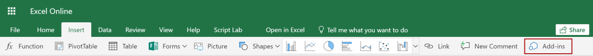

# <a name="tutorial-create-custom-functions-in-excel-preview"></a><span data-ttu-id="c6fee-103">Руководство: создание пользовательских функций в Excel (предварительная версия)</span><span class="sxs-lookup"><span data-stu-id="c6fee-103">Tutorial: Create custom functions in Excel (preview)</span></span>

<span data-ttu-id="c6fee-104">Пользовательские функции позволяют добавлять новые функции в Excel путем определения этих функций в JavaScript как части надстройки.</span><span class="sxs-lookup"><span data-stu-id="c6fee-104">Custom functions enable you to add new functions to Excel by defining those functions in JavaScript as part of an add-in.</span></span> <span data-ttu-id="c6fee-105">Пользователи в Excel могут получить доступ к пользовательским функциям так же, как и к любой встроенной функции в Excel, например `SUM()`.</span><span class="sxs-lookup"><span data-stu-id="c6fee-105">Users within Excel can access custom functions as they would any native function in Excel, such as `SUM()`.</span></span> <span data-ttu-id="c6fee-106">Вы можете создавать пользовательские функции, которые будут выполнять простые задачи, такие как вычисления, или более сложные задачи, такие как потоковая передача данных в режиме реального времени из Интернета на лист.</span><span class="sxs-lookup"><span data-stu-id="c6fee-106">You can create custom functions that perform simple tasks like calculations or more complex tasks such as streaming real-time data from the web into a worksheet.</span></span>

<span data-ttu-id="c6fee-107">В этом руководстве описан порядок выполнения перечисленных ниже задач.</span><span class="sxs-lookup"><span data-stu-id="c6fee-107">In this tutorial, you will:</span></span>
> [!div class="checklist"]
> * <span data-ttu-id="c6fee-108">Создание надстройки пользовательской функции с помощью [генератора Yeoman для надстроек Office](https://www.npmjs.com/package/generator-office).</span><span class="sxs-lookup"><span data-stu-id="c6fee-108">Create a custom function add-in using the [Yeoman generator for Office Add-ins](https://www.npmjs.com/package/generator-office).</span></span> 
> * <span data-ttu-id="c6fee-109">Использование готовой пользовательской функции для выполнения простых вычислений</span><span class="sxs-lookup"><span data-stu-id="c6fee-109">Use a prebuilt custom function to perform a simple calculation.</span></span>
> * <span data-ttu-id="c6fee-110">Создание пользовательской функции, которая получает данные из сети Интернет.</span><span class="sxs-lookup"><span data-stu-id="c6fee-110">Create a custom function that gets data from the web.</span></span>
> * <span data-ttu-id="c6fee-111">Создание пользовательской функции, которая осуществляет потоковую передачу данных в реальном времени из сети Интернет</span><span class="sxs-lookup"><span data-stu-id="c6fee-111">Create a custom function that streams real-time data from the web.</span></span>

[!include[Excel custom functions note](../includes/excel-custom-functions-note.md)]

## <a name="prerequisites"></a><span data-ttu-id="c6fee-112">Необходимые компоненты</span><span class="sxs-lookup"><span data-stu-id="c6fee-112">Prerequisites</span></span>

* <span data-ttu-id="c6fee-113">[Node.js](https://nodejs.org/en/) (версия 8.0.0 или более поздняя)</span><span class="sxs-lookup"><span data-stu-id="c6fee-113">[Node.js](https://nodejs.org/en/) (version 8.0.0 or later)</span></span>

* <span data-ttu-id="c6fee-114">[Git Bash](https://git-scm.com/downloads) (или другой клиент Git)</span><span class="sxs-lookup"><span data-stu-id="c6fee-114">[Git Bash](https://git-scm.com/downloads) (or another Git client)</span></span>

* <span data-ttu-id="c6fee-115">Последняя версия [Yeoman](https://yeoman.io/) и [генератора Yeoman для надстроек Office](https://www.npmjs.com/package/generator-office). Выполните в командной строке указанную ниже команду, чтобы установить эти инструменты глобально.</span><span class="sxs-lookup"><span data-stu-id="c6fee-115">The latest version of [Yeoman](https://yeoman.io/) and the [Yeoman generator for Office Add-ins](https://www.npmjs.com/package/generator-office). To install these tools globally, run the following command via the command prompt:</span></span>

    ```
    npm install -g yo generator-office
    ```

    > [!NOTE]
    > <span data-ttu-id="c6fee-116">Даже если у вас установлен генератор Yeoman, рекомендуется обновить пакет до последней версии из npm.</span><span class="sxs-lookup"><span data-stu-id="c6fee-116">Even if you have previously installed the Yeoman generator, we recommend updating your package to the latest version from npm.</span></span>

* <span data-ttu-id="c6fee-117">Excel для Windows (64-разрядная версия 1810 или более поздняя) или Excel Online</span><span class="sxs-lookup"><span data-stu-id="c6fee-117">Excel for Windows (64-bit version 1810 or later) or Excel Online</span></span>

* <span data-ttu-id="c6fee-118">Присоединитесь к [Программе предварительной оценки Office](https://products.office.com/office-insider) (уровень **Участник**; ранее "Предварительная оценка — ранний доступ")</span><span class="sxs-lookup"><span data-stu-id="c6fee-118">Join the [Office Insider program](https://products.office.com/office-insider) (**Insider** level -- formerly called "Insider Fast")</span></span>

## <a name="create-a-custom-functions-project"></a><span data-ttu-id="c6fee-119">Создание проекта пользовательских функций</span><span class="sxs-lookup"><span data-stu-id="c6fee-119">Create a custom functions project</span></span>

 <span data-ttu-id="c6fee-120">Чтобы начать, вам необходимо создать проект кода для разработки надстройки пользовательской функции.</span><span class="sxs-lookup"><span data-stu-id="c6fee-120">To start, you'll create the code project to build your custom function add-in.</span></span> <span data-ttu-id="c6fee-121">[Генератор Yeoman для надстройки Office](https://www.npmjs.com/package/generator-office) настроит ваш проект с некоторыми начальными пользовательскими функциями, которые вы можете попробовать использовать.</span><span class="sxs-lookup"><span data-stu-id="c6fee-121">The [Yeoman generator for Office Add-ins](https://www.npmjs.com/package/generator-office) will set up your project with some initial custom functions that you can try out.</span></span>

1. <span data-ttu-id="c6fee-122">Выполните указанную ниже команду и ответьте на вопросы, как показано ниже.</span><span class="sxs-lookup"><span data-stu-id="c6fee-122">Run the following command and then answer the prompts as follows.</span></span>
    
    ```
    yo office
    ```
    
    * <span data-ttu-id="c6fee-123">Выберите тип проекта: `Excel Custom Functions Add-in project (...)`</span><span class="sxs-lookup"><span data-stu-id="c6fee-123">Choose a project type: `Excel Custom Functions Add-in project (...)`</span></span>
    * <span data-ttu-id="c6fee-124">Выберите тип сценария: `JavaScript`</span><span class="sxs-lookup"><span data-stu-id="c6fee-124">Choose a script type: `JavaScript`</span></span>
    * <span data-ttu-id="c6fee-125">Как вы хотите назвать свою надстройку?</span><span class="sxs-lookup"><span data-stu-id="c6fee-125">What do you want to name your add-in?</span></span> `stock-ticker`
    
    
    
    <span data-ttu-id="c6fee-127">Генератор Yeoman создает файлы проекта и устанавливает вспомогательные компоненты Node.js.</span><span class="sxs-lookup"><span data-stu-id="c6fee-127">The Yeoman generator creates the project files and installs supporting Node.js components.</span></span>

2. <span data-ttu-id="c6fee-128">Перейдите в папку проекта.</span><span class="sxs-lookup"><span data-stu-id="c6fee-128">Go to the project folder.</span></span>
    
    ```
    cd stock-ticker
    ```

3. <span data-ttu-id="c6fee-129">Сделайте доверенным самозаверяющий сертификат, необходимый для выполнения этого проекта.</span><span class="sxs-lookup"><span data-stu-id="c6fee-129">Trust the self-signed certificate that is needed to run this project.</span></span> <span data-ttu-id="c6fee-130">Подробные инструкции для Windows или Mac см. в статье [Добавление самозаверяющих сертификатов в качестве доверенных корневых сертификатов](https://github.com/OfficeDev/generator-office/blob/master/src/docs/ssl.md).</span><span class="sxs-lookup"><span data-stu-id="c6fee-130">For detailed instructions for either Windows or Mac, see [Adding Self Signed Certificates as Trusted Root Certificate](https://github.com/OfficeDev/generator-office/blob/master/src/docs/ssl.md).</span></span>  

4. <span data-ttu-id="c6fee-131">Выполните сборку проекта.</span><span class="sxs-lookup"><span data-stu-id="c6fee-131">Build the project.</span></span>
    
    ```
    npm run build
    ```

5. <span data-ttu-id="c6fee-132">Запустите локальный веб-сервер, работающий на Node.js.</span><span class="sxs-lookup"><span data-stu-id="c6fee-132">Start the local web server, which runs in Node.js.</span></span> <span data-ttu-id="c6fee-133">Вы можете попробовать использовать надстройку пользовательской функции в Excel для Windows или в Excel Online.</span><span class="sxs-lookup"><span data-stu-id="c6fee-133">You can try out the custom function add-in in Excel for Windows, or Excel Online.</span></span>

# <a name="excel-for-windowstabexcel-windows"></a>[<span data-ttu-id="c6fee-134">Excel для Windows</span><span class="sxs-lookup"><span data-stu-id="c6fee-134">Excel for Windows</span></span>](#tab/excel-windows)

<span data-ttu-id="c6fee-135">Выполните следующую команду.</span><span class="sxs-lookup"><span data-stu-id="c6fee-135">Run the following command.</span></span>

```
npm run start
```

<span data-ttu-id="c6fee-136">Эта команда запускает веб-сервер и загружает неопубликованную надстройку пользовательской функции в Excel для Windows.</span><span class="sxs-lookup"><span data-stu-id="c6fee-136">This command starts the web server, and sideloads your custom function add-in into Excel for Windows.</span></span>

> [!NOTE]
> <span data-ttu-id="c6fee-137">Если надстройка не загружается, проверьте правильность выполнения шага 3.</span><span class="sxs-lookup"><span data-stu-id="c6fee-137">If your add-in does not load, check that you have completed step 3 properly.</span></span> <span data-ttu-id="c6fee-138">Кроме того, можно включить **[ведение журнала в среде выполнения](../testing/troubleshoot-manifest.md#use-runtime-logging-to-debug-your-add-in)** для устранения неполадок в XML-файле манифеста надстройки, а также при любых проблемах установки или выполнения.</span><span class="sxs-lookup"><span data-stu-id="c6fee-138">You can also enable **[runtime logging](../testing/troubleshoot-manifest.md#use-runtime-logging-to-debug-your-add-in)** to troubleshoot issues with your add-in's XML manifest file, as well as any installation or runtime problems.</span></span> <span data-ttu-id="c6fee-139">Инструкции Write `console.log` в файл журнала в среде выполнения, чтобы помочь найти и устранить проблемы.</span><span class="sxs-lookup"><span data-stu-id="c6fee-139">Runtime logging writes `console.log` statements to a log file to help you find and fix issues.</span></span>

# <a name="excel-onlinetabexcel-online"></a>[<span data-ttu-id="c6fee-140">Excel Online</span><span class="sxs-lookup"><span data-stu-id="c6fee-140">Excel Online</span></span>](#tab/excel-online)

<span data-ttu-id="c6fee-141">Выполните следующую команду.</span><span class="sxs-lookup"><span data-stu-id="c6fee-141">Run the following command.</span></span>

```
npm run start-web
```

<span data-ttu-id="c6fee-142">Эта команда запускает веб-сервер.</span><span class="sxs-lookup"><span data-stu-id="c6fee-142">This command starts the web server.</span></span> <span data-ttu-id="c6fee-143">Выполните шаги, описанные ниже, чтобы загрузить неопубликованную надстройку.</span><span class="sxs-lookup"><span data-stu-id="c6fee-143">Use the following steps to sideload your add-in.</span></span>

<ol type="a">
   <li><span data-ttu-id="c6fee-144">В Excel Online на вкладке <strong>Вставка</strong> выберите пункт <strong>Надстройки</strong>.</span><span class="sxs-lookup"><span data-stu-id="c6fee-144">In Excel Online, choose the <strong>Insert</strong> tab and then choose <strong>Add-ins</strong>.</span></span><br/>
   </li>
   <li><span data-ttu-id="c6fee-145">Выберите пункт <strong>Управление моими надстройками</strong>, а затем выберите <strong>Отправить мою надстройку</strong>.</span><span class="sxs-lookup"><span data-stu-id="c6fee-145">Choose <strong>Manage My Add-ins</strong> and select <strong>Upload My Add-in</strong>.</span></span></li> 
   <li><span data-ttu-id="c6fee-146">Выберите <strong>Обзор... </strong> и откройте корневой каталог проекта, созданный генератором Yeoman.</span><span class="sxs-lookup"><span data-stu-id="c6fee-146">Choose <strong>Browse...</strong> and navigate to the root directory of the project that the Yeoman generator created.</span></span></li> 
   <li><span data-ttu-id="c6fee-147">Выберите файл <strong>manifest.xml</strong> и нажмите <strong>Открыть</strong>, а затем выберите <strong>Отправить</strong>.</span><span class="sxs-lookup"><span data-stu-id="c6fee-147">Select the file <strong>manifest.xml</strong> and choose <strong>Open</strong>, then choose <strong>Upload</strong>.</span></span></li>
</ol>

> [!NOTE]
> <span data-ttu-id="c6fee-148">Если надстройка не загружается, проверьте правильность выполнения шага 3.</span><span class="sxs-lookup"><span data-stu-id="c6fee-148">If your add-in does not load, check that you have completed step 3 properly.</span></span>

--- 
    
## <a name="try-out-a-prebuilt-custom-function"></a><span data-ttu-id="c6fee-149">Проверка работы готовой пользовательской функции</span><span class="sxs-lookup"><span data-stu-id="c6fee-149">Try out a prebuilt custom function</span></span>

<span data-ttu-id="c6fee-150">В проекте пользовательской функции, который вы создали, уже имеются две готовые пользовательские функции с именами ADD (Добавить) и INCREMENT (Увеличить).</span><span class="sxs-lookup"><span data-stu-id="c6fee-150">The custom functions project that you created alrady has two prebuilt custom functions named ADD and INCREMENT.</span></span> <span data-ttu-id="c6fee-151">Код для этих встроенных функций содержится в файле **src/customfunctions.js**.</span><span class="sxs-lookup"><span data-stu-id="c6fee-151">The code for these prebuilt functions is in the  **src/customfunctions.js** file.</span></span> <span data-ttu-id="c6fee-152">Файл **./manifest.xml** указывает, что все пользовательские функции принадлежат пространству имен `CONTOSO`.</span><span class="sxs-lookup"><span data-stu-id="c6fee-152">The **./manifest.xml** file specifies that all custom functions belong to the `CONTOSO` namespace.</span></span> <span data-ttu-id="c6fee-153">Вы будете использовать пространство имен CONTOSO для доступа к пользовательским функциям в Excel.</span><span class="sxs-lookup"><span data-stu-id="c6fee-153">You'll use the CONTOSO namespace to access the custom functions in Excel.</span></span>

<span data-ttu-id="c6fee-154">Затем вы проверите пользовательскую функцию `ADD`, выполнив описанные ниже действия:</span><span class="sxs-lookup"><span data-stu-id="c6fee-154">Next you'll try out the `ADD` custom function by completing the following steps:</span></span>

1. <span data-ttu-id="c6fee-155">В Excel перейдите в любую ячейку и введите `=CONTOSO`.</span><span class="sxs-lookup"><span data-stu-id="c6fee-155">In Excel, go to any cell and enter `=CONTOSO`.</span></span> <span data-ttu-id="c6fee-156">Обратите внимание на то, что в меню автозаполнения содержится список всех функций в пространстве имен `CONTOSO`.</span><span class="sxs-lookup"><span data-stu-id="c6fee-156">Notice that the autocomplete menu shows the list of all functions in the `CONTOSO` namespace.</span></span>

2. <span data-ttu-id="c6fee-157">Выполните запуск функции `CONTOSO.ADD` с числами `10` и `200` в качестве входных параметров, введя значение `=CONTOSO.ADD(10,200)` в ячейке и нажав клавишу ВВОД.</span><span class="sxs-lookup"><span data-stu-id="c6fee-157">Run the `CONTOSO.ADD` function, with numbers `10` and `200` as input parameters, by typing the value `=CONTOSO.ADD(10,200)` in the cell and pressing enter.</span></span>

<span data-ttu-id="c6fee-158">Пользовательская функция `ADD` вычисляет сумму двух чисел, которые вы указываете и возвращает результат **210**.</span><span class="sxs-lookup"><span data-stu-id="c6fee-158">The `ADD` custom function computes the sum of the two numbers that you provided and returns the result of **210**.</span></span>

## <a name="create-a-custom-function-that-requests-data-from-the-web"></a><span data-ttu-id="c6fee-159">Создание пользовательской функции, которая запрашивает данные из сети Интернет</span><span class="sxs-lookup"><span data-stu-id="c6fee-159">Create a custom function that requests data from the web</span></span>

<span data-ttu-id="c6fee-160">Интеграция данных из Интернета — отличный способ расширения функционала Excel через пользовательские функции.</span><span class="sxs-lookup"><span data-stu-id="c6fee-160">Integrating data from the Web is a great way to extend Excel through custom functions.</span></span> <span data-ttu-id="c6fee-161">Далее необходимо создать пользовательскую функцию под именем `stockPrice`, которая получает котировки акций из Web API и возвращает результат в ячейку на листе.</span><span class="sxs-lookup"><span data-stu-id="c6fee-161">Next you’ll create a custom function named `stockPrice` that gets a stock quote from a Web API and returns the result to the cell of a worksheet.</span></span> <span data-ttu-id="c6fee-162">Вы будете использовать API IEX Trading, который предоставляется бесплатно и не требует проверки подлинности.</span><span class="sxs-lookup"><span data-stu-id="c6fee-162">You’ll use the IEX Trading API, which is free and does not require authentication.</span></span>

1. <span data-ttu-id="c6fee-163">В проекте **stock-ticker** найдите файл **src/customfunctions.js** и откройте его в редакторе кода.</span><span class="sxs-lookup"><span data-stu-id="c6fee-163">In the **stock-ticker** project, find the file **src/customfunctions.js** and open it in your code editor.</span></span>

2. <span data-ttu-id="c6fee-164">В **customfunctions.js** найдите функцию `increment` и добавьте приведенный ниже код сразу после этой функции.</span><span class="sxs-lookup"><span data-stu-id="c6fee-164">In **customfunctions.js**, locate the `increment` function and add the following code immediately after that function.</span></span>

    ```js
    function stockPrice(ticker) {
        var url = "https://api.iextrading.com/1.0/stock/" + ticker + "/price";
        return fetch(url)
            .then(function(response) {
                return response.text();
            })
            .then(function(text) {
                return parseFloat(text);
            });

        // Note: in case of an error, the returned rejected Promise
        //    will be bubbled up to Excel to indicate an error.
    }

> [!NOTE]
> In the January Insiders 1901 Build, there is a bug preventing fetch calls from executing which will result in #VALUE!.
> To workaround this please use the [XMLHTTPRequest API](/office/dev/add-ins/excel/custom-functions-runtime#requesting-external-data) to make the web request.

3. In **customfunctions.js**, locate the line `CustomFunctions.associate("INCREMENT", increment);`. Add the following line of code immediately after that line, and save the file.

    ```js
    CustomFunctions.associate("STOCKPRICE", stockprice);
    ```

    <span data-ttu-id="c6fee-165">Код `CustomFunctions.associate` сопоставляет `id` функции с адресом функции `increment` в JavaScript, чтобы Excel мог вызвать вашу функцию.</span><span class="sxs-lookup"><span data-stu-id="c6fee-165">The `CustomFunctions.associate` code associates the `id` of the function with the function address of `increment` in JavaScript so that Excel can call your function.</span></span>

    <span data-ttu-id="c6fee-166">Прежде чем Excel сможет использовать вашу пользовательскую функцию, необходимо описать ее с помощью метаданных.</span><span class="sxs-lookup"><span data-stu-id="c6fee-166">Before Excel can use your custom function, you need to describe it using metadata.</span></span> <span data-ttu-id="c6fee-167">Вам нужно определить `id`, используемый в методе `associate` ранее, а также некоторые другие метаданные.</span><span class="sxs-lookup"><span data-stu-id="c6fee-167">You need to define the `id` used in the `associate` method previously, along with some other metadata.</span></span>


4. <span data-ttu-id="c6fee-168">Откройте файл **config/customfunctions.json**.</span><span class="sxs-lookup"><span data-stu-id="c6fee-168">Open the **config/customfunctions.json** file.</span></span> <span data-ttu-id="c6fee-169">Добавьте указанный ниже объект JSON в массив 'functions' и сохраните файл.</span><span class="sxs-lookup"><span data-stu-id="c6fee-169">Add the following JSON object to the 'functions' array and save the file.</span></span>

    ```JSON
    {
        "id": "STOCKPRICE",
        "name": "STOCKPRICE",
        "description": "Fetches current stock price",
        "helpUrl": "http://www.contoso.com/help",
        "result": {
            "type": "number",
            "dimensionality": "scalar"
        },  
        "parameters": [
            {
                "name": "ticker",
                "description": "stock symbol",
                "type": "string",
                "dimensionality": "scalar"
            }
        ]
    }
    ```

    <span data-ttu-id="c6fee-170">Этот объект JSON описывает функцию `stockPrice`, ее параметры и тип результатов, который она возвращает.</span><span class="sxs-lookup"><span data-stu-id="c6fee-170">This JSON describes the `stockPrice` function, its parameters, and the type of result it returns.</span></span>

5. <span data-ttu-id="c6fee-171">Повторно зарегистрируйте надстройку в Excel, чтобы новая функция стала доступной.</span><span class="sxs-lookup"><span data-stu-id="c6fee-171">Re-register the add-in in Excel so that the new function is available.</span></span> 

# <a name="excel-for-windowstabexcel-windows"></a>[<span data-ttu-id="c6fee-172">Excel для Windows</span><span class="sxs-lookup"><span data-stu-id="c6fee-172">Excel for Windows</span></span>](#tab/excel-windows)

1. <span data-ttu-id="c6fee-173">Закройте Excel, а затем откройте Excel повторно.</span><span class="sxs-lookup"><span data-stu-id="c6fee-173">Close Excel and then reopen Excel.</span></span>

2. <span data-ttu-id="c6fee-174">В Excel выберите вкладку **Вставка**, а затем нажмите стрелку вниз, которая находится справа от пункта **Мои надстройки**. .</span><span class="sxs-lookup"><span data-stu-id="c6fee-174">In Excel, choose the **Insert** tab and then choose the down-arrow located to the right of **My Add-ins**.  </span></span>

3. <span data-ttu-id="c6fee-175">В списке доступных надстроек найдите раздел **Надстройки разработчика** и выберите надстройку **stock-ticker**, чтобы зарегистрировать ее.</span><span class="sxs-lookup"><span data-stu-id="c6fee-175">In the list of available add-ins, find the **Developer Add-ins** section and select the **stock-ticker** add-in to register it.</span></span>
    <span data-ttu-id="c6fee-176">.</span><span class="sxs-lookup"><span data-stu-id="c6fee-176"></span></span>

# <a name="excel-onlinetabexcel-online"></a>[<span data-ttu-id="c6fee-177">Excel Online</span><span class="sxs-lookup"><span data-stu-id="c6fee-177">Excel Online</span></span>](#tab/excel-online)

1. <span data-ttu-id="c6fee-178">В Excel Online выберите вкладку **Вставка**, а затем выберите **Надстройки**. </span><span class="sxs-lookup"><span data-stu-id="c6fee-178">In Excel Online, choose the **Insert** tab and then choose **Add-ins**.  </span></span>

2. <span data-ttu-id="c6fee-179">Выберите пункт **Управление моими надстройками**, а затем выберите **Отправить мою надстройку**.</span><span class="sxs-lookup"><span data-stu-id="c6fee-179">Choose **Manage My Add-ins** and select **Upload My Add-in**.</span></span> 

3. <span data-ttu-id="c6fee-180">Выберите \*\*Обзор... \*\* и откройте корневой каталог проекта, созданный генератором Yeoman.</span><span class="sxs-lookup"><span data-stu-id="c6fee-180">Choose **Browse...** and navigate to the root directory of the project that the Yeoman generator created.</span></span> 

4. <span data-ttu-id="c6fee-181">Выберите файл **manifest.xml** и нажмите **Открыть**, затем нажмите кнопку **Отправить**.</span><span class="sxs-lookup"><span data-stu-id="c6fee-181">Select the file **manifest.xml** and choose **Open**, then choose **Upload**.</span></span>

--- 

<ol start="6">
<li> <span data-ttu-id="c6fee-182">Теперь давайте оценим, как работает новая функция.</span><span class="sxs-lookup"><span data-stu-id="c6fee-182">Try out the new function.</span></span> <span data-ttu-id="c6fee-183">В ячейке <strong>B1</strong> введите нужный текст <strong>= CONTOSO. STOCKPRICE("MSFT")</strong> и нажмите ВВОД.</span><span class="sxs-lookup"><span data-stu-id="c6fee-183">In cell <strong>B1</strong>, type the text <strong>=CONTOSO.STOCKPRICE("MSFT")</strong> and press enter.</span></span> <span data-ttu-id="c6fee-184">Вы должны увидеть, что результат в ячейке <strong>B1</strong> является текущей ценой одной акции корпорации Майкрософт.</span><span class="sxs-lookup"><span data-stu-id="c6fee-184">You should see that the result in cell <strong>B1</strong> is the current stock price for one share of Microsoft stock.</span></span></li>
</ol>

## <a name="create-a-streaming-asynchronous-custom-function"></a><span data-ttu-id="c6fee-185">Создание потоковой асинхронной пользовательской функции</span><span class="sxs-lookup"><span data-stu-id="c6fee-185">Create a streaming asynchronous custom function</span></span>

<span data-ttu-id="c6fee-186">Функция `stockPrice` возвращает цену акции в конкретный момент времени, однако цены на акции всегда меняются.</span><span class="sxs-lookup"><span data-stu-id="c6fee-186">The `stockPrice` function returns the price of a stock at a specific moment in time, but stock prices are always changing.</span></span> <span data-ttu-id="c6fee-187">Далее вы создадите пользовательскую функцию с именем `stockPriceStream`, которая получает цену акции каждые 1000 милисекунд.</span><span class="sxs-lookup"><span data-stu-id="c6fee-187">Next you’ll create a custom function named `stockPriceStream` that gets the price of a stock every 1000 milliseconds.</span></span>

1. <span data-ttu-id="c6fee-188">В проекте **stock-ticker** добавьте указанный ниже код в файл **src/customfunctions.js** и сохраните его.</span><span class="sxs-lookup"><span data-stu-id="c6fee-188">In the **stock-ticker** project, add the following code to **src/customfunctions.js** and save the file.</span></span>

    ```js
    function stockPriceStream(ticker, handler) {
        var updateFrequency = 1000 /* milliseconds*/;
        var isPending = false;

        var timer = setInterval(function() {
            // If there is already a pending request, skip this iteration:
            if (isPending) {
                return;
            }

            var url = "https://api.iextrading.com/1.0/stock/" + ticker + "/price";
            isPending = true;

            fetch(url)
                .then(function(response) {
                    return response.text();
                })
                .then(function(text) {
                    handler.setResult(parseFloat(text));
                })
                .catch(function(error) {
                    handler.setResult(error);
                })
                .then(function() {
                    isPending = false;
                });
        }, updateFrequency);

        handler.onCanceled = () => {
            clearInterval(timer);
        };
    }
    
    CustomFunctions.associate("STOCKPRICESTREAM", stockpricestream);
    ```
    
    <span data-ttu-id="c6fee-189">Прежде чем Excel сможет использовать вашу пользовательскую функцию, необходимо описать ее с помощью метаданных.</span><span class="sxs-lookup"><span data-stu-id="c6fee-189">Before Excel can use your custom function, you need to describe it using metadata.</span></span>
    
2. <span data-ttu-id="c6fee-190">В проекте **stock-ticker** добавьте указанный ниже объект в массив `functions` в файле **config/customfunctions.json** и сохраните файл.</span><span class="sxs-lookup"><span data-stu-id="c6fee-190">In the **stock-ticker** project add the following object to the `functions` array within the **config/customfunctions.json** file and save the file.</span></span>
    
    ```json
    { 
        "id": "STOCKPRICESTREAM",
        "name": "STOCKPRICESTREAM",
        "description": "Streams real time stock price",
        "helpUrl": "http://www.contoso.com/help",
        "result": {
            "type": "number",
            "dimensionality": "scalar"
        },  
        "parameters": [
            {
                "name": "ticker",
                "description": "stock symbol",
                "type": "string",
                "dimensionality": "scalar"
            }
        ],
        "options": {
            "stream": true,
            "cancelable": true
        }
    }
    ```

    <span data-ttu-id="c6fee-191">Объект JSON описывает функцию `stockPriceStream`.</span><span class="sxs-lookup"><span data-stu-id="c6fee-191">This JSON describes the `stockPriceStream` function.</span></span> <span data-ttu-id="c6fee-192">Для любой функции потоковой передачи свойство `stream` и свойство `cancelable` должны быть заданы как `true` в объекте `options`, как показано в этом примере кода.</span><span class="sxs-lookup"><span data-stu-id="c6fee-192">For any streaming function, the `stream` property and the `cancelable` property must be set to `true` within the `options` object, as shown in this code sample.</span></span>

3. <span data-ttu-id="c6fee-193">Повторно зарегистрируйте надстройку в Excel, чтобы новая функция стала доступной.</span><span class="sxs-lookup"><span data-stu-id="c6fee-193">Re-register the add-in in Excel so that the new function is available.</span></span>

# <a name="excel-for-windowstabexcel-windows"></a>[<span data-ttu-id="c6fee-194">Excel для Windows</span><span class="sxs-lookup"><span data-stu-id="c6fee-194">Excel for Windows</span></span>](#tab/excel-windows)

1. <span data-ttu-id="c6fee-195">Закройте Excel, а затем откройте Excel повторно.</span><span class="sxs-lookup"><span data-stu-id="c6fee-195">Close Excel and then reopen Excel.</span></span>

2. <span data-ttu-id="c6fee-196">В Excel выберите вкладку **Вставка**, а затем нажмите стрелку вниз, которая находится справа от пункта **Мои надстройки**. .</span><span class="sxs-lookup"><span data-stu-id="c6fee-196">In Excel, choose the **Insert** tab and then choose the down-arrow located to the right of **My Add-ins**.  </span></span>

3. <span data-ttu-id="c6fee-197">В списке доступных надстроек найдите раздел **Надстройки разработчика** и выберите надстройку **stock-ticker**, чтобы зарегистрировать ее.</span><span class="sxs-lookup"><span data-stu-id="c6fee-197">In the list of available add-ins, find the **Developer Add-ins** section and select the **stock-ticker** add-in to register it.</span></span>
    <span data-ttu-id="c6fee-198">.</span><span class="sxs-lookup"><span data-stu-id="c6fee-198"></span></span>

# <a name="excel-onlinetabexcel-online"></a>[<span data-ttu-id="c6fee-199">Excel Online</span><span class="sxs-lookup"><span data-stu-id="c6fee-199">Excel Online</span></span>](#tab/excel-online)

1. <span data-ttu-id="c6fee-200">В Excel Online выберите вкладку **Вставка**, а затем выберите **Надстройки**. </span><span class="sxs-lookup"><span data-stu-id="c6fee-200">In Excel Online, choose the **Insert** tab and then choose **Add-ins**.  </span></span>

2. <span data-ttu-id="c6fee-201">Выберите пункт **Управление моими надстройками**, а затем выберите **Отправить мою надстройку**.</span><span class="sxs-lookup"><span data-stu-id="c6fee-201">Choose **Manage My Add-ins** and select **Upload My Add-in**.</span></span>

3. <span data-ttu-id="c6fee-202">Выберите \*\*Обзор... \*\* и откройте корневой каталог проекта, созданный генератором Yeoman.</span><span class="sxs-lookup"><span data-stu-id="c6fee-202">Choose **Browse...** and navigate to the root directory of the project that the Yeoman generator created.</span></span>

4. <span data-ttu-id="c6fee-203">Выберите файл **manifest.xml** и нажмите **Открыть**, затем нажмите кнопку **Отправить**.</span><span class="sxs-lookup"><span data-stu-id="c6fee-203">Select the file **manifest.xml** and choose **Open**, then choose **Upload**.</span></span>

--- 

<ol start="4">
<li><span data-ttu-id="c6fee-204">Теперь давайте оценим, как работает новая функция.</span><span class="sxs-lookup"><span data-stu-id="c6fee-204">Try out the new function.</span></span> <span data-ttu-id="c6fee-205">В ячейке <strong>C1</strong> введите нужный текст <strong>=CONTOSO.STOCKPRICESTREAM("MSFT")</strong> и нажмите ВВОД.</span><span class="sxs-lookup"><span data-stu-id="c6fee-205">In cell <strong>C1</strong>, type the text <strong>=CONTOSO.STOCKPRICESTREAM("MSFT")</strong> and press enter.</span></span> <span data-ttu-id="c6fee-206">Если рынок ценных бумаг открыт, вы увидите, что результат в ячейке <strong>C1</strong> постоянно обновляется, отражая в режиме реального времени цену одной акции корпорации Майкрософт.</span><span class="sxs-lookup"><span data-stu-id="c6fee-206">Provided that the stock market is open, you should see that the result in cell <strong>C1</strong> is constantly updated to reflect the real-time price for one share of Microsoft stock.</span></span></li>
</ol>


## <a name="next-steps"></a><span data-ttu-id="c6fee-207">Дальнейшие действия</span><span class="sxs-lookup"><span data-stu-id="c6fee-207">Next steps</span></span>

<span data-ttu-id="c6fee-208">Поздравляем!</span><span class="sxs-lookup"><span data-stu-id="c6fee-208">Congratulations!</span></span> <span data-ttu-id="c6fee-209">Вы создали новый проект пользовательских функций, попробовали, как работает готовая функция, создали пользовательскую функцию, которая запрашивает данные из Интернета, а также создали пользовательскую функцию, которая осуществляет потоковую передачу данных в реальном времени из сети Интернет.</span><span class="sxs-lookup"><span data-stu-id="c6fee-209">You've created a new custom functions project, tried out a prebuilt function, created a custom function that requests data from the web, and created a custom function that streams real-time data from the web.</span></span> <span data-ttu-id="c6fee-210">Чтобы узнать больше о пользовательских функции в Excel, перейдите к следующей статье:</span><span class="sxs-lookup"><span data-stu-id="c6fee-210">To learn more about custom functions in Excel, continue to the following article:</span></span>

> [!div class="nextstepaction"]
> [<span data-ttu-id="c6fee-211">Создание пользовательских функций в Excel</span><span class="sxs-lookup"><span data-stu-id="c6fee-211">Create custom functions in Excel</span></span>](../excel/custom-functions-overview.md)

### <a name="legal-information"></a><span data-ttu-id="c6fee-212">Юридические сведения</span><span class="sxs-lookup"><span data-stu-id="c6fee-212">Legal information</span></span>

<span data-ttu-id="c6fee-213">Данные предоставлены бесплатно компанией [IEX](https://iextrading.com/developer/).</span><span class="sxs-lookup"><span data-stu-id="c6fee-213">Data provided free by [IEX](https://iextrading.com/developer/).</span></span> <span data-ttu-id="c6fee-214">Ознакомьтесь с [Условиями использования IEX](https://iextrading.com/api-exhibit-a/).</span><span class="sxs-lookup"><span data-stu-id="c6fee-214">View [IEX's Terms of Use](https://iextrading.com/api-exhibit-a/).</span></span> <span data-ttu-id="c6fee-215">Корпорация Майкрософт использует API компании IEX в этом руководстве исключительно в ознакомительных целях.</span><span class="sxs-lookup"><span data-stu-id="c6fee-215">Microsoft's use of the IEX API in this tutorial is for educational purposes only.</span></span>


