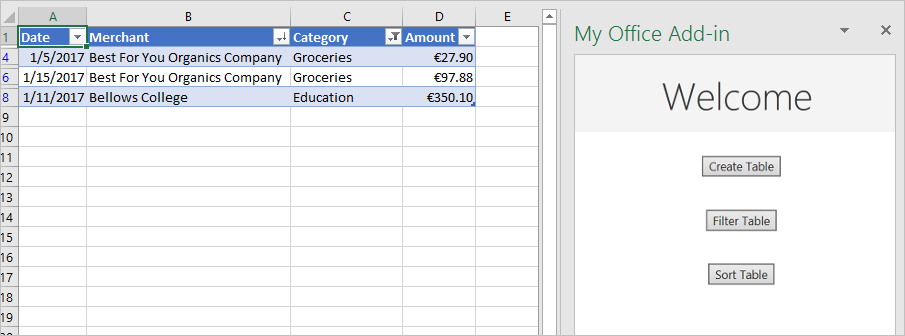
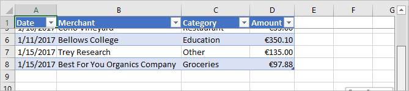

# <a name="tutorial-create-an-excel-task-pane-add-in"></a>Учебник: Создание надстройки области задач Excel

С помощью данного учебника вы сможете создать надстройку области задач Excel, которая выполняет следующие действия:

> [!div class="checklist"]
> * Создание таблицы
> * Фильтрация и сортировка таблицы
> * Создание графика
> * Закрепление заголовка таблицы
> * Защита листа
> * Открытие диалогового окна

> [!TIP]
> Если вы уже завершили[создание надстройки панели задач Excel](../quickstarts/excel-quickstart-jquery.md)с помощью генератора Yeoman, и хотите использовать этот проект в качестве отправной точки для данного руководства, перейдите непосредственно в раздел[Создание таблицы](#create-a-table), чтобы начать работу с этим руководством.

## <a name="prerequisites"></a>Предварительные требования

[!include[Yeoman generator prerequisites](../includes/quickstart-yo-prerequisites.md)]

## <a name="create-your-add-in-project"></a>Создание проекта надстройки

[!include[Yeoman generator create project guidance](../includes/yo-office-command-guidance.md)]

- **Выберите тип проекта:** `Office Add-in Task Pane project`
- **Выберите тип сценария:** `Javascript`
- **Как вы хотите назвать надстройку?** `My Office Add-in`
- **Какое клиентское приложение Office должно поддерживаться?** `Excel`


После завершения работы мастера генератор создаст проект и установит вспомогательные компоненты Node.

[!include[Yeoman generator next steps](../includes/yo-office-next-steps.md)]

## <a name="create-a-table"></a>Создание таблицы

На этом этапе руководства мы проверим программным способом, поддерживает ли надстройка текущую версию Excel, установленную у пользователя, а также добавим таблицу на лист, заполним ее данными и отформатируем.

### <a name="code-the-add-in"></a>Написание кода надстройки

1. Откройте проект в редакторе кода.

2. Откройте файл **./src/taskpane/taskpane.html**.  Этот файл содержит HTML-разметку для панели задач.

3. Найдите элемент `<main>` и удалите все строки, которые появляются после открывающего тега `<main>` и перед закрывающим тегом `</main>`.

4. Добавляйте указанные ниже исправления сразу после открывающего тега `<main>`.

    ```html
    <button class="ms-Button" id="create-table">Create Table</button><br/><br/>
    ```

5. Откройте файл **./src/taskpane/taskpane.js**. Этот файл содержит код API JavaScript Office, который облегчает взаимодействие между областью задач и основным приложением Office.

6. Удалите все ссылки на кнопку`run` и функцию`run()`, выполнив следующие действия:

    - Найдите и удалите строку `document.getElementById("run").onclick = run;`.

    - Найдите и удалите всю функцию `run()`.

7. В вызове метода `Office.onReady` найдите строку `if (info.host === Office.HostType.Excel) {` и добавьте следующий код непосредственно после этой строки. Примечание.

    - Первая часть этого кода определяет, поддерживает ли установленная у пользователя версия Excel ту версию файла Excel.js, которая включает все API, используемые в этой серии руководств. В рабочей надстройке можно использовать текст условного блока, чтобы скрыть или отключить пользовательский интерфейс, где вызываются неподдерживаемые API. При этом пользователь по-прежнему сможет использовать те части надстройки, которые поддерживаются в его версии Excel.

    - Вторая часть этого кода добавляет обработчик событий для кнопки `create-table`.

    ```js
    // Determine if the user's version of Office supports all the Office.js APIs that are used in the tutorial.
    if (!Office.context.requirements.isSetSupported('ExcelApi', '1.7')) {
        console.log('Sorry. The tutorial add-in uses Excel.js APIs that are not available in your version of Office.');
    }

    // Assign event handlers and other initialization logic.
    document.getElementById("create-table").onclick = createTable;
    ```

8. Добавьте следующую функцию в конец файла. Примечание.

    - Бизнес-логика Excel.js будет добавлена в функцию, передаваемую методу `Excel.run`. Эта логика выполняется не сразу. Вместо этого она добавляется в очередь ожидания команд.

    - Метод `context.sync` отправляет все команды из очереди в Excel для выполнения.

    - За методом `Excel.run` следует блок `catch`. Рекомендуется всегда следовать этой методике. 

    ```js
    function createTable() {
        Excel.run(function (context) {

            // TODO1: Queue table creation logic here.

            // TODO2: Queue commands to populate the table with data.

            // TODO3: Queue commands to format the table.

            return context.sync();
        })
        .catch(function (error) {
            console.log("Error: " + error);
            if (error instanceof OfficeExtension.Error) {
                console.log("Debug info: " + JSON.stringify(error.debugInfo));
            }
        });
    }
    ```

9. В функции `createTable()` замените `TODO1` следующим кодом: Примечание.

    - Код создает таблицу с помощью метода `add` коллекции таблиц листов, которая существует всегда, даже если она пуста. Это стандартный способ создания объектов Excel.js. API конструкторов классов не существуют, а для создания объекта Excel никогда не следует использовать оператор `new`. Вместо этого следует добавить его к объекту родительской коллекции.

    - Первый параметр метода `add`— это диапазон, содержащий только первую строку, а не весь диапазон таблицы, который мы в конечном итоге будем использовать. Это связано с тем, что при заполнении строк данных (на следующем этапе) надстройка добавляет к таблице новые строки, а не записывает их в ячейки имеющихся строк. Это обычный шаблон, потому что количество строк в таблице часто неизвестно на момент ее создания.

    - Имена таблиц должны быть уникальными в рамках всей книги, а не только одного листа.

    ```js
    var currentWorksheet = context.workbook.worksheets.getActiveWorksheet();
    var expensesTable = currentWorksheet.tables.add("A1:D1", true /*hasHeaders*/);
    expensesTable.name = "ExpensesTable";
    ```

10. В функции `createTable()` замените `TODO2` следующим кодом. Примечание.

    - значения ячеек диапазона задаются с помощью массива массивов.

    - Новые строки создаются в таблице путем вызова метода `add` коллекции ее строк. Вы можете добавить несколько строк в одном вызове метода `add`, включив несколько массивов значений ячеек в родительский массив, передаваемый в качестве второго параметра.

    ```js
    expensesTable.getHeaderRowRange().values =
        [["Date", "Merchant", "Category", "Amount"]];

    expensesTable.rows.add(null /*add at the end*/, [
        ["1/1/2017", "The Phone Company", "Communications", "120"],
        ["1/2/2017", "Northwind Electric Cars", "Transportation", "142.33"],
        ["1/5/2017", "Best For You Organics Company", "Groceries", "27.9"],
        ["1/10/2017", "Coho Vineyard", "Restaurant", "33"],
        ["1/11/2017", "Bellows College", "Education", "350.1"],
        ["1/15/2017", "Trey Research", "Other", "135"],
        ["1/15/2017", "Best For You Organics Company", "Groceries", "97.88"]
    ]);
    ```

11. В функции `createTable()` замените `TODO3` следующим кодом. Примечание.

    - код получает ссылку на столбец **Сумма**, передавая его индекс (с отсчетом от нуля) в метод `getItemAt` коллекции столбцов таблицы.

        > [!NOTE]
        > У объектов коллекций Excel.js (например, `TableCollection`, `WorksheetCollection` и `TableColumnCollection`) есть свойство `items`, представляющее собой массив дочерних типов объектов (например, `Table`, `Worksheet` или `TableColumn`). Однако сам объект `*Collection` не является массивом.

    - Затем код форматирует диапазон столбца **Сумма** как денежные суммы в евро с точностью до второго знака после запятой. 

    - Напоследок он обеспечивает достаточные ширину столбцов и высоту строк для размещения самого длинного (или самого высокого) элемента данных. Обратите внимание, что код должен привести объекты `Range` к нужному формату. У объектов `TableColumn` и `TableRow` нет свойств формата.

    ```js
    expensesTable.columns.getItemAt(3).getRange().numberFormat = [['\u20AC#,##0.00']];
    expensesTable.getRange().format.autofitColumns();
    expensesTable.getRange().format.autofitRows();
    ```

12. Убедитесь, что вы сохранили все изменения, внесенные в проект.

### <a name="test-the-add-in"></a>Тестирование надстройки

1. Выполните указанные ниже действия, чтобы запустить локальный веб-сервер и загрузить неопубликованную надстройку.

    > [!NOTE]
    > Надстройки Office должны использовать HTTPS, а не HTTP, даже в случае разработки. Если вам будет предложено установить сертификат после того, как вы запустите одну из указанных ниже команд, примите предложение установить сертификат, предоставленный генератором Yeoman.

    > [!TIP]
    > Если вы тестируете свою надстройку на Mac, перед продолжением выполните следующую команду в корневом каталоге вашего проекта. После выполнения этой команды запустится локальный веб-сервер.
    >
    > ```command&nbsp;line
    > npm run dev-server
    > ```

    - Чтобы проверить надстройку в Excel, выполните приведенную ниже команду в корневом каталоге своего проекта. При этом запускается локальный веб-сервер (если он еще не запущен) и открывается приложение Excel с загруженной надстройкой.

        ```command&nbsp;line
        npm start
        ```

    - Чтобы проверить надстройку в Excel в Интернете, выполните следующую команду в корневом каталоге своего проекта. После выполнения этой команды запустится локальный веб-сервер (если он еще не запущен).

        ```command&nbsp;line
        npm run start:web
        ```

        Чтобы использовать надстройку, откройте новый документ в Excel в Интернете, а затем загрузите неопубликованную надстройку, следуя инструкциям из статьи [Загрузка неопубликованных надстроек Office в Office в Интернете](../testing/sideload-office-add-ins-for-testing.md#sideload-an-office-add-in-in-office-on-the-web).

2. В Excel выберите вкладку **Главная** и нажмите кнопку **Показать область задач** на ленте, чтобы открыть область задач надстройки.

    

3. В области задач нажмите кнопку **Создать таблицу**.

    

## <a name="filter-and-sort-a-table"></a>Фильтрация и сортировка таблицы

Из этого раздела руководства вы узнаете, как отфильтровать и отсортировать созданную ранее таблицу.

### <a name="filter-the-table"></a>Фильтрация таблицы

1. Откройте файл **./src/taskpane/taskpane.html**.

2. Найдите элемент `<button>` для кнопки `create-table` и после нее добавьте следующий текст:

    ```html
    <button class="ms-Button" id="filter-table">Filter Table</button><br/><br/>
    ```

3. Откройте файл **./src/taskpane/taskpane.js**.

4. В вызове метода `Office.onReady` найдите строку, которая назначает обработчик щелчка для кнопки `create-table`, и добавьте следующий код после этой строки:

    ```js
    document.getElementById("filter-table").onclick = filterTable;
    ```

5. Добавьте следующую функцию в конец файла:

    ```js
    function filterTable() {
        Excel.run(function (context) {

            // TODO1: Queue commands to filter out all expense categories except
            //        Groceries and Education.

            return context.sync();
        })
        .catch(function (error) {
            console.log("Error: " + error);
            if (error instanceof OfficeExtension.Error) {
                console.log("Debug info: " + JSON.stringify(error.debugInfo));
            }
        });
    }
    ```

6. В функции `filterTable()` замените `TODO1` следующим кодом: Примечание.

   - Код получает ссылку на столбец, который нужно отфильтровать, передавая имя столбца методу `getItem`, а не передавая его индекс методу `getItemAt`, как это делает метод `createTable`. Так как пользователи могут перемещать столбцы, по заданному индексу может располагаться уже другой столбец. Следовательно, для получения ссылки безопаснее использовать имя столбца. Мы спокойно использовали метод `getItemAt` в предыдущем разделе, потому что мы использовали его в методе, который создает таблицу, и пользователь никак не мог переместить столбец.

   - Метод `applyValuesFilter` является одним из нескольких методов фильтрации объекта `Filter`.

    ```js
    var currentWorksheet = context.workbook.worksheets.getActiveWorksheet();
    var expensesTable = currentWorksheet.tables.getItem('ExpensesTable');
    var categoryFilter = expensesTable.columns.getItem('Category').filter;
    categoryFilter.applyValuesFilter(['Education', 'Groceries']);
    ``` 

### <a name="sort-the-table"></a>Сортировка таблицы

1. Откройте файл **./src/taskpane/taskpane.html**.

2. Найдите элемент `<button>` для кнопки `filter-table` и после нее добавьте следующий текст: 

    ```html
    <button class="ms-Button" id="sort-table">Sort Table</button><br/><br/>
    ```

3. Откройте файл **./src/taskpane/taskpane.js**.

4. В вызове метода `Office.onReady` найдите строку, которая назначает обработчик щелчка для кнопки `filter-table`, и добавьте следующий код после этой строки:

    ```js
    document.getElementById("sort-table").onclick = sortTable;
    ```

5. Добавьте следующую функцию в конец файла:

    ```js
    function sortTable() {
        Excel.run(function (context) {

            // TODO1: Queue commands to sort the table by Merchant name.

            return context.sync();
        })
        .catch(function (error) {
            console.log("Error: " + error);
            if (error instanceof OfficeExtension.Error) {
                console.log("Debug info: " + JSON.stringify(error.debugInfo));
            }
        });
    }
    ```

6. В функции `sortTable()` замените `TODO1` следующим кодом: Примечание.

   - Код создает массив объектов `SortField`, состоящий из одного элемента, так как надстройка сортирует таблицу только по столбцу Merchant.

   - Свойство `key` объекта `SortField` — это нулевой индекс столбца, который используется для сортировки таблицы. Строки в таблице сортируются на основе значений в столбце в соотетствующем столбце.

   - Элемент `sort` объекта `Table` — это объект `TableSort`, а не метод. Объекты `SortField` передаются методу `apply` объекта `TableSort`.

    ```js
    var currentWorksheet = context.workbook.worksheets.getActiveWorksheet();
    var expensesTable = currentWorksheet.tables.getItem('ExpensesTable');
    var sortFields = [
        {
            key: 1,            // Merchant column
            ascending: false,
        }
    ];

    expensesTable.sort.apply(sortFields);
    ```

7. Убедитесь, что вы сохранили все изменения, внесенные в проект.

### <a name="test-the-add-in"></a>Тестирование надстройки

1. [!include[Start server and sideload add-in instructions](../includes/tutorial-excel-start-server.md)]

2. Если область задач надстройки еще не открыта в Excel, перейдите на вкладку **Главная** и нажмите кнопку **Показать область задач** на ленте, чтобы открыть ее.

3. Если таблица, ранее добавленная в этом руководстве, отсутствует на открытом листе, нажмите кнопку **Создать таблицу** в области задач.

4. Нажмите кнопки **Фильтровать таблицу** и **Сортировать таблицу** в любом порядке.

    

## <a name="create-a-chart"></a>Создание диаграммы

На этом этапе руководства мы создадим диаграмму, используя данные из ранее созданной таблицы, а затем отформатируем эту диаграмму.

### <a name="chart-a-chart-using-table-data"></a>Создание диаграммы с помощью таблицы данных

1. Откройте файл **./src/taskpane/taskpane.html**.

2. Найдите элемент `<button>` для кнопки `sort-table` и после нее добавьте следующий текст: 

    ```html
    <button class="ms-Button" id="create-chart">Create Chart</button><br/><br/>
    ```

3. Откройте файл **./src/taskpane/taskpane.js**.

4. В вызове метода `Office.onReady` найдите строку, которая назначает обработчик щелчка для кнопки `sort-table`, и добавьте следующий код после этой строки:

    ```js
    document.getElementById("create-chart").onclick = createChart;
    ```

5. Добавьте следующую функцию в конец файла:

    ```js
    function createChart() {
        Excel.run(function (context) {

            // TODO1: Queue commands to get the range of data to be charted.

            // TODO2: Queue command to create the chart and define its type.

            // TODO3: Queue commands to position and format the chart.

            return context.sync();
        })
        .catch(function (error) {
            console.log("Error: " + error);
            if (error instanceof OfficeExtension.Error) {
                console.log("Debug info: " + JSON.stringify(error.debugInfo));
            }
        });
    }
    ```

6. В функции `createChart()` замените `TODO1` следующим кодом. Обратите внимание, что для исключения строки заголовков в коде вместо метода `getRange` используется метод `Table.getDataBodyRange`, чтобы получить нужный диапазон данных для диаграммы.

    ```js
    var currentWorksheet = context.workbook.worksheets.getActiveWorksheet();
    var expensesTable = currentWorksheet.tables.getItem('ExpensesTable');
    var dataRange = expensesTable.getDataBodyRange();
    ```

7. В функции `createChart()` замените `TODO2` следующим кодом. Обратите внимание на следующие параметры:

   - Первый параметр метода `add` задает тип диаграммы. Существует несколько десятков типов.

   - Второй параметр задает диапазон данных, включаемых в диаграмму.

   - Третий параметр определяет, как следует отображать на диаграмме ряд точек данных из таблицы: по строкам или по столбцам. Значение `auto` сообщает Excel, что следует выбрать оптимальный способ.

    ```js
    var chart = currentWorksheet.charts.add('ColumnClustered', dataRange, 'auto');
    ```

8. В функции `createChart()` замените `TODO3` следующим кодом. Большая часть этого кода не требует объяснений. Примечание.
   
   - Параметры метода `setPosition` задают левую верхнюю и правую нижнюю ячейки области листа, которые должны содержать диаграмму. Excel может настраивать такие параметры, как ширина линий, чтобы диаграмма хорошо выглядела в выделенном для нее пространстве.
   
   - "Ряд" — это набор точек данных из столбца таблицы. Так как в таблице есть только один нестроковый столбец, Excel делает вывод, что это единственный столбец точек данных для диаграммы. Он рассматривает другие столбцы как метки диаграммы. Следовательно, в диаграмме будет только один ряд, обозначенный индексом 0. Это тот, на котором стоит «Стоимость в &euro;».

    ```js
    chart.setPosition("A15", "F30");
    chart.title.text = "Expenses";
    chart.legend.position = "right"
    chart.legend.format.fill.setSolidColor("white");
    chart.dataLabels.format.font.size = 15;
    chart.dataLabels.format.font.color = "black";
    chart.series.getItemAt(0).name = 'Value in &euro;';
    ```

9. Убедитесь, что вы сохранили все изменения, внесенные в проект.

### <a name="test-the-add-in"></a>Тестирование надстройки

1. [!include[Start server and sideload add-in instructions](../includes/tutorial-excel-start-server.md)]

2. Если область задач надстройки еще не открыта в Excel, перейдите на вкладку **Главная** и нажмите кнопку **Показать область задач** на ленте, чтобы открыть ее.

3. Если таблица, ранее добавленная в этом руководстве, отсутствует на открытом листе, нажмите кнопку **Создать таблицу**, а затем кнопки **Фильтровать таблицу** и **Сортировать таблицу** в любом порядке.

4. Нажмите кнопку **Create Chart** (Создать диаграмму). Будет создана диаграмма, включающая только данные из отфильтрованных строк. Метки точек данных в нижней части диаграммы отсортированы согласно заданному для нее порядку, то есть по именам продавцов в обратном алфавитном порядке.

    

## <a name="freeze-a-table-header"></a>Закрепление заголовка таблицы

Когда таблица достаточно длинная, при прокрутке строка заголовков может исчезать с экрана. В этом разделе учебника мы расскажем, как закрепить строку заголовков созданной ранее таблицы, чтобы она была видна, даже когда пользователь прокручивает лист.

### <a name="freeze-the-tables-header-row"></a>Закрепление строки заголовков таблицы

1. Откройте файл **./src/taskpane/taskpane.html**.

2. Найдите элемент `<button>` для кнопки `create-chart` и после нее добавьте следующий текст: 

    ```html
    <button class="ms-Button" id="freeze-header">Freeze Header</button><br/><br/>
    ```

3. Откройте файл **./src/taskpane/taskpane.js**.

4. В вызове метода `Office.onReady` найдите строку, которая назначает обработчик щелчка для кнопки `create-chart`, и добавьте следующий код после этой строки:

    ```js
    document.getElementById("freeze-header").onclick = freezeHeader;
    ```

5. Добавьте следующую функцию в конец файла:

    ```js
    function freezeHeader() {
        Excel.run(function (context) {

            // TODO1: Queue commands to keep the header visible when the user scrolls.

            return context.sync();
        })
        .catch(function (error) {
            console.log("Error: " + error);
            if (error instanceof OfficeExtension.Error) {
                console.log("Debug info: " + JSON.stringify(error.debugInfo));
            }
        });
    }
    ```

6. В функции `freezeHeader()` замените `TODO1` следующим кодом: Примечание.

   - Коллекция `Worksheet.freezePanes` — это набор закрепленных строк, которые не исчезают с экрана при прокрутке листа.

   - Метод `freezeRows` принимает в качестве параметра количество строк сверху, которые необходимо закрепить. Мы передаем `1`, чтобы закрепить первую строку.

    ```js
    var currentWorksheet = context.workbook.worksheets.getActiveWorksheet();
    currentWorksheet.freezePanes.freezeRows(1);
    ```

7. Убедитесь, что вы сохранили все изменения, внесенные в проект.

### <a name="test-the-add-in"></a>Тестирование надстройки

1. [!include[Start server and sideload add-in instructions](../includes/tutorial-excel-start-server.md)]

2. Если область задач надстройки еще не открыта в Excel, перейдите на вкладку **Главная** и нажмите кнопку **Показать область задач** на ленте, чтобы открыть ее.

3. Если таблица, ранее добавленная в этом руководстве, присутствует на листе, удалите ее.

4. В области задач нажмите кнопку **Создать таблицу**.

5. Нажмите кнопку **Закрепить заголовок**.

6. Прокрутите лист вниз, чтобы убедиться, что заголовок таблицы по-прежнему остается на экране, даже когда верхние строки исчезают.

    

## <a name="protect-a-worksheet"></a>Защита листа

На этом этапе обучения, вы добавите на ленту кнопку, с помощью которой можно включить и выключить защиту листа.

### <a name="configure-the-manifest-to-add-a-second-ribbon-button"></a>Настройка манифеста для добавления второй кнопки на ленту

1. Откройте файл манифеста **./manifest.xml**.

2. Найдите элемент `<Control>`. Этот элемент определяет кнопку **Show Taskpane** (Показать область задач) на вкладке **Главная**, которую вы используете для запуска надстройки. Мы добавим вторую кнопку в эту же группу на ленте **Главная**. Добавьте следующий код между закрывающим тегом`</Control>` и закрывающим тегом`</Group>`.

    ```xml
    <Control xsi:type="Button" id="<!--TODO1: Unique (in manifest) name for button -->">
        <Label resid="<!--TODO2: Button label -->" />
        <Supertip>            
            <Title resid="<!-- TODO3: Button tool tip title -->" />
            <Description resid="<!-- TODO4: Button tool tip description -->" />
        </Supertip>
        <Icon>
            <bt:Image size="16" resid="Icon.16x16"/>
            <bt:Image size="32" resid="Icon.32x32"/>
            <bt:Image size="80" resid="Icon.80x80"/>
        </Icon>
        <Action xsi:type="<!-- TODO5: Specify the type of action-->">
            <!-- TODO6: Identify the function.-->
        </Action>
    </Control>
    ```

3. В XML-коде, добавленном в файл манифеста, замените `TODO1` строкой, которая присваивает кнопке идентификатор, уникальный в пределах этого файла манифеста. Так как кнопка будет включать и выключать защиту листа, укажите "ToggleProtection". После завершения открывающий тег элемента `Control` должен выглядеть следующим образом:

    ```xml
    <Control xsi:type="Button" id="ToggleProtection">
    ```

4. Следующие три `TODO`s устанавливают идентификаторы ресурсов или `resid`s. Ресурс должен быть строкой, и вы создадите эти три строки на следующем этапе. Сейчас вам нужно присвоить идентификаторы ресурсам. Кнопка должна называться "Переключение защиты", но у строки должен быть *идентификатор* "ProtectionButtonLabel", поэтому элемент `Label` выглядит следующим образом:

    ```xml
    <Label resid="ProtectionButtonLabel" />
    ```

5. Элемент `SuperTip` определяет подсказку для кнопки. Заголовок этой подсказки должен совпадать с названием кнопки, поэтому мы используем тот же ИД ресурса — "ProtectionButtonLabel". Описание подсказки будет следующим: "Click to turn protection of the worksheet on and off" (Нажмите для включения или выключения защиты листа). У `resid` должно быть значение "ProtectionButtonToolTip". Поэтому после завершения элемент `SuperTip` должен выглядеть следующим образом: 

    ```xml
    <Supertip>            
        <Title resid="ProtectionButtonLabel" />
        <Description resid="ProtectionButtonToolTip" />
    </Supertip>
    ```

   > [!NOTE] 
   > В рабочей надстройке не нужно использовать один и тот же значок для двух разных кнопок, но сейчас мы предлагаем сделать это для простоты. Поэтому код `Icon` в новом теге `Control` представляет собой лишь копию элемента `Icon` из существующего тега `Control`. 

6. Для элемента `Action` в исходном элементе `Control`, задан тип `ShowTaskpane`, но новая кнопка будет не открывать область задач, а выполнять специальную функцию, которую вы создадите позже. Поэтому замените `TODO5` на `ExecuteFunction` (тип действия для кнопок, запускающих специальные функции). Открывающий тег элемента `Action` должен выглядеть следующим образом:
 
    ```xml
    <Action xsi:type="ExecuteFunction">
    ```

7. У исходного элемента `Action` есть дочерние элементы, определяющие идентификатор области задач и URL-адрес страницы, которая должна быть открыта в области задач. Но у элемента `Action` типа `ExecuteFunction` есть один дочерний элемент, который именует функцию, выполняемую элементом управления. На более позднем этапе вы создадите функцию `toggleProtection`. Поэтому замените `TODO6` следующим кодом:
 
    ```xml
    <FunctionName>toggleProtection</FunctionName>
    ```

    Теперь весь код `Control` должен выглядеть вот так:

    ```xml
    <Control xsi:type="Button" id="ToggleProtection">
        <Label resid="ProtectionButtonLabel" />
        <Supertip>            
            <Title resid="ProtectionButtonLabel" />
            <Description resid="ProtectionButtonToolTip" />
        </Supertip>
        <Icon>
            <bt:Image size="16" resid="Icon.16x16"/>
            <bt:Image size="32" resid="Icon.32x32"/>
            <bt:Image size="80" resid="Icon.80x80"/>
        </Icon>
        <Action xsi:type="ExecuteFunction">
           <FunctionName>toggleProtection</FunctionName>
        </Action>
    </Control>
    ```

8. Прокрутите страницу вниз до раздела `Resources` манифеста.

9. Добавьте приведенный ниже код в качестве дочернего элемента `bt:ShortStrings`.

    ```xml
    <bt:String id="ProtectionButtonLabel" DefaultValue="Toggle Worksheet Protection" />
    ```

10. Добавьте приведенный ниже код в качестве дочернего элемента `bt:LongStrings`.

    ```xml
    <bt:String id="ProtectionButtonToolTip" DefaultValue="Click to protect or unprotect the current worksheet." />
    ```

11. Сохраните файл.

### <a name="create-the-function-that-protects-the-sheet"></a>Создание функции защиты листа

1. Откройте файл **.\commands\commands.js**.

2. Добавьте указанную ниже функцию сразу после функции `action`. Обратите внимание, что мы указываем параметр `args` для функции, а самая последняя строка функции вызывает `args.completed`. Это требование для всех команд надстройки типа **ExecuteFunction**. Это сигнализирует ведущему приложению Office о том, что работа функции завершена и пользовательский интерфейс снова может реагировать.

    ```js
    function toggleProtection(args) {
        Excel.run(function (context) {
            
            // TODO1: Queue commands to reverse the protection status of the current worksheet.

            return context.sync();
        })
        .catch(function (error) {
            console.log("Error: " + error);
            if (error instanceof OfficeExtension.Error) {
                console.log("Debug info: " + JSON.stringify(error.debugInfo));
            }
        });
        args.completed();
    }
    ```

3. Добавьте следующую строку в конец файла:

    ```js
    g.toggleProtection = toggleProtection;
    ```

4. В функции `toggleProtection` замените `TODO1` следующим кодом. В этом коде используется свойство защиты объекта листа в стандартном шаблоне переключателя. Объяснение `TODO2` будет приведено в следующем разделе.

    ```js
    var sheet = context.workbook.worksheets.getActiveWorksheet();

    // TODO2: Queue command to load the sheet's "protection.protected" property from
    //        the document and re-synchronize the document and task pane.

    if (sheet.protection.protected) {
        sheet.protection.unprotect();
    } else {
        sheet.protection.protect();
    }
    ``` 

### <a name="add-code-to-fetch-document-properties-into-the-task-panes-script-objects"></a>Добавление кода для получения свойств документа в объекты скрипта области задач

В каждой функции, созданной в этом руководстве до настоящего момента, вы помещаете в очередь команды на *запись* в документе Office. Каждая функция заканчивалась вызовом метода `context.sync()`, который отправляет выставленные в очередь команды документу для выполнения. При этом код, который вы добавили на последнем этапе, вызывает свойство`sheet.protection.protected property`. В этом заключается существенное отличие от ранее написанных функций, так как `sheet` является лишь объектом прокси, существующим в скрипте вашей области задач. Объект-прокси не знает о фактическом состоянии защиты документа, поэтому его свойство `protection.protected` не может иметь реального значения. Чтобы избежать возникновения ошибки, сначала нужно получить сведения о состоянии защиты от документа и задать значение `sheet.protection.protected`, используя их. Процесс получения делится на три этапа:

   1. Добавление в очередь команды для загрузки (т. е. получения) свойств, которые должен прочесть ваш код.

   2. Вызов метода `sync` объекта контекста, чтобы можно было отправить документу находящуюся в очереди команду для выполнения, а также для возврата запрошенных данных.

   3. Метод `sync` асинхронный, поэтому его выполнение должно быть завершено до того, как код вызовет полученные свойства.

Эти три действия должны выполняться каждый раз, когда коду нужно *прочесть* данные из документа Office.

1. В функции `toggleProtection` замените `TODO2` следующим кодом. Примечание.
   
   - У каждого объекта Excel есть метод `load`. Вы указываете свойства объекта, которые нужно прочесть в параметре как строку имен, разделенных запятыми. В этом случае нужно прочесть подсвойство свойства `protection`. На подсвойство нужно ссылаться почти так же, как и в остальных частях кода. Отличие заключается в том, что вместо символа "." нужно указать косую черту ("/").

   - Чтобы логика переключения, которая считывает `sheet.protection.protected`, не срабатывала до выполнения `sync` и присвоения `sheet.protection.protected` правильного значения, полученного из документа, она будет перемещена (на следующем этапе) в функцию `then`, которая не выполняется до завершения `sync`. 

    ```js
    sheet.load('protection/protected');
    return context.sync()
        .then(
            function() {
                // TODO3: Move the queued toggle logic here.
            }
        )
        // TODO4: Move the final call of `context.sync` here and ensure that it
        //        does not run until the toggle logic has been queued.
    ``` 

2. Для двух операторов `return` не может использоваться один путь кода, который не разветвляется, поэтому удалите последнюю строку `return context.sync();` в конце `Excel.run`. Вы добавите новую последнюю строку `context.sync` позже.

3. Вырежьте структуру `if ... else` в функции `toggleProtection` и вставьте вместо `TODO3`.

4. Замените `TODO4` приведенным ниже кодом. Примечание:

   - Благодаря тому, что метод `sync` передается функции `then`, он не будет запускаться до добавления `sheet.protection.unprotect()` или `sheet.protection.protect()` в очередь.

   - Метод `then` вызывает любую функцию, которая ему передана. Не нужно вызывать `sync` дважды, поэтому уберите "()" после `context.sync`.

    ```js
    .then(context.sync);
    ```

   Когда все будет готово, функция должна выглядеть так:

    ```js
    function toggleProtection(args) {
        Excel.run(function (context) {            
          var sheet = context.workbook.worksheets.getActiveWorksheet();          
          sheet.load('protection/protected');

          return context.sync()
              .then(
                  function() {
                    if (sheet.protection.protected) {
                        sheet.protection.unprotect();
                    } else {
                        sheet.protection.protect();
                    }
                  }
              )
              .then(context.sync);
        })
        .catch(function (error) {
            console.log("Error: " + error);
            if (error instanceof OfficeExtension.Error) {
                console.log("Debug info: " + JSON.stringify(error.debugInfo));
            }
        });
        args.completed();
    }
    ```

5. Убедитесь, что вы сохранили все изменения, внесенные в проект.

### <a name="test-the-add-in"></a>Тестирование надстройки

1. Закройте все приложения Office, в том числе Excel. 

2. Очистите кэш Office, удалив содержимое (все файлы и вложенные папки) папки кэша. Это необходимо, чтобы можно было полностью удалить старую версию надстройки из ведущего приложения.

    - Для Windows: `%LOCALAPPDATA%\Microsoft\Office\16.0\Wef\`.

    - Для Mac: `~/Library/Containers/com.Microsoft.OsfWebHost/Data/`. 
    
        > [!NOTE]
        > Если эта папка не существует, проверьте наличие следующих папок и в случае их присутствия удалите содержимое папки:
        >    - `~/Library/Containers/com.microsoft.{host}/Data/Library/Caches/`, где `{host}` — ведущее приложение Office (например, `Excel`)
        >    - `~/Library/Containers/com.microsoft.{host}/Data/Library/Application Support/Microsoft/Office/16.0/Wef/`, где `{host}` — ведущее приложение Office (например, `Excel`)
        >    - `com.microsoft.Office365ServiceV2/Data/Caches/com.microsoft.Office365ServiceV2/`
        >    - `com.microsoft.Office365ServiceV2/Data/Library/Caches/com.microsoft.Office365ServiceV2/`

3. Если локальный веб-сервер уже запущен, остановите его, закрыв окно команды узла.

4. Так как файл манифеста был обновлен, требуется повторно загрузить неопубликованную надстройку, используя обновленный файл манифеста. Запустите локальный веб-сервер и загрузите неопубликованную надстройку: 

    - Чтобы проверить надстройку в Excel, выполните приведенную ниже команду в корневом каталоге своего проекта. При этом запускается локальный веб-сервер (если он еще не запущен) и открывается приложение Excel с загруженной надстройкой.

        ```command&nbsp;line
        npm start
        ```

    - Чтобы проверить надстройку в Excel в Интернете, выполните следующую команду в корневом каталоге своего проекта. После выполнения этой команды запустится локальный веб-сервер (если он еще не запущен).

        ```command&nbsp;line
        npm run start:web
        ```

        Чтобы использовать надстройку, откройте новый документ в Excel в Интернете, а затем загрузите неопубликованную надстройку, следуя инструкциям из статьи [Загрузка неопубликованных надстроек Office в Office в Интернете](../testing/sideload-office-add-ins-for-testing.md#sideload-an-office-add-in-in-office-on-the-web).

5. На вкладке **Главная** в Excel нажмите кнопку **Переключение защиты листа**. Обратите внимание, что большинство элементов управления на ленте отключены (серые), как показано на следующем снимке экрана. 

    

6. Выберите ячейку, как если бы вы хотели изменить ее содержимое. В Excel отобразится сообщение об ошибке, указывающее, что лист защищен.

7. Нажмите кнопку **Переключение защиты листа** еще раз, и элементы управления включатся, после чего вы сможете изменить значения ячеек.

## <a name="open-a-dialog"></a>Открытие диалогового окна

На данном заключительном этапе, указанном в руководстве, вы откроете диалоговое окно в своей надстройке, передадите сообщение из процесса диалогового окна в процесс области задач и закроете диалоговое окно. Диалоговые окна надстройки Office *не модальные*: пользователь может продолжать работать и с документом в ведущем приложении Office, и с главной страницей в области задач.

### <a name="create-the-dialog-page"></a>Создание страницы диалогового окна

1. В папке **./src**, расположенной в корне проекта, создайте папку с именем **dialogs**.

2. В папке **./src/dialogs** создайте файл с именем **popup.html**.

3. Добавьте в файл **popup.html** приведенный ниже код. Примечание:

   - На странице есть поле`<input>`, где пользователь будет вводить свое имя, и кнопка, при нажатии которой это имя будет отправлено в панель задач, где оно будет отображаться.

   - Код загружает скрипт под названием **popup.js**, который будет создан на более позднем этапе.

   - Он также загружает библиотеку Office.js, так как она будет использоваться в **popup.js**.

    ```html
    <!DOCTYPE html>
    <html>
        <head lang="en">
            <title>Dialog for My Office Add-in</title>
            <meta charset="UTF-8">
            <meta name="viewport" content="width=device-width, initial-scale=1">

            <!-- For more information on Office UI Fabric, visit https://developer.microsoft.com/fabric. -->
            <link rel="stylesheet" href="https://static2.sharepointonline.com/files/fabric/office-ui-fabric-core/9.6.1/css/fabric.min.css"/>

            <script type="text/javascript" src="https://appsforoffice.microsoft.com/lib/1/hosted/office.js"></script>
            <script type="text/javascript" src="popup.js"></script>

        </head>
        <body style="display:flex;flex-direction:column;align-items:center;justify-content:center">
            <p class="ms-font-xl">ENTER YOUR NAME</p>
            <input id="name-box" type="text"/><br/><br/>
            <button id="ok-button" class="ms-Button">OK</button>
        </body>
    </html>
    ```

4. В папке **./src/dialogs** создайте файл с именем **popup.js**.

5. Добавьте указанный ниже код в файл **popup.js**. Обратите внимание на следующие особенности этого кода:

   - *Каждая страница, вызывающая API в библиотеке Office.js, должна сначала убедиться, что библиотека полностью инициализирована.* Лучший способ сделать это — вызвать метод `Office.onReady()`. Если у вашей надстройки есть собственные задачи инициализации, код должен перейти к методу `then()`, связанному с вызовом `Office.onReady()`. Вызов метода `Office.onReady()` должен выполняться до каких-либо вызовов Office.js, поэтому назначение указано в файле скрипта, загружаемом страницей, как в этом случае.

    ```js
    (function () {
    "use strict";

        Office.onReady()
            .then(function() {

                // TODO1: Assign handler to the OK button.

            });

        // TODO2: Create the OK button handler

    }());
    ```

6. Замените `TODO1` приведенным ниже кодом. Вы создадите функцию `sendStringToParentPage` на следующем этапе.

    ```js
    document.getElementById("ok-button").onclick = sendStringToParentPage;
    ```

7. Замените `TODO2` приведенным ниже кодом. Метод `messageParent` передает свой параметр родительской странице (в данном случае это страница на панели задач). Параметр может быть логическим или строковым. Во втором случае подразумевается все, что можно сериализовать, представив в виде строки (например, XML или JSON).

    ```js
    function sendStringToParentPage() {
        var userName = document.getElementById("name-box").value;
        Office.context.ui.messageParent(userName);
    }
    ```

> [!NOTE]
> Файл **popup.html** и загружаемый им файл **popup.js** выполняются в полностью отдельном процессе Microsoft Edge или Internet Explorer 11 из области задач надстройки. Если файл **popup.js** был передан в тот же файл **bundle.js**, что и файл **app.js**, надстройка загрузит два экземпляра файла **bundle.js**, что противоречит цели объединения. Поэтому эта надстройка вообще не передает файл **popup.js**.

### <a name="update-webpack-config-settings"></a>Обновление настроек конфигурации webpack

Откройте файл **webpack.config.js** в корневом каталоге проекта и выполните описанные ниже шаги.

1. Найдите объект `entry` в объекте `config` и добавьте новую запись для `popup`.

    ```js
    popup: "./src/dialogs/popup.js"
    ```

    После этого новый объект `entry` будет выглядеть следующим образом:

    ```js
    entry: {
      polyfill: "@babel/polyfill",
      taskpane: "./src/taskpane/taskpane.js",
      commands: "./src/commands/commands.js",
      popup: "./src/dialogs/popup.js"
    },
    ```
  
2. Найдите массив `plugins` в объекте `config` и добавьте следующий объект в конец массива.

    ```js
    new HtmlWebpackPlugin({
      filename: "popup.html",
      template: "./src/dialogs/popup.html",
      chunks: ["polyfill", "popup"]
    })
    ```

    После этого новый массив `plugins` будет выглядеть следующим образом:

    ```js
    plugins: [
      new CleanWebpackPlugin(),
      new HtmlWebpackPlugin({
        filename: "taskpane.html",
        template: "./src/taskpane/taskpane.html",
        chunks: ['polyfill', 'taskpane']
      }),
      new CopyWebpackPlugin([
      {
        to: "taskpane.css",
        from: "./src/taskpane/taskpane.css"
      }
      ]),
      new HtmlWebpackPlugin({
        filename: "commands.html",
        template: "./src/commands/commands.html",
        chunks: ["polyfill", "commands"]
      }),
      new HtmlWebpackPlugin({
        filename: "popup.html",
        template: "./src/dialogs/popup.html",
        chunks: ["polyfill", "popup"]
      })
    ],
    ```

3. Если локальный веб-сервер запущен, остановите его, закрыв окно команды узла.

4. Выполните указанную ниже команду, чтобы повторно собрать проект.

    ```command&nbsp;line
    npm run build
    ```

### <a name="open-the-dialog-from-the-task-pane"></a>Открытие диалогового окна из области задач

1. Откройте файл **./src/taskpane/taskpane.html**.

2. Найдите элемент `<button>` для кнопки `freeze-header` и после нее добавьте следующий текст:

    ```html
    <button class="ms-Button" id="open-dialog">Open Dialog</button><br/><br/>
    ```

3. В диалоговом окне пользователю будет предложено ввести имя и передать имя пользователя в область задач. Область задач отобразит его в подписи. Непосредственно после только что добавленного тега `button` добавьте приведенный ниже код.

    ```html
    <label id="user-name"></label><br/><br/>
    ```

4. Откройте файл **./src/taskpane/taskpane.js**.

5. В вызове метода `Office.onReady` найдите строку, назначающую обработчик щелчка для кнопки `freeze-header`, и добавьте следующий код после этой строки. Вы создадите метод `openDialog` на одном из следующих шагов.

    ```js
    document.getElementById("open-dialog").onclick = openDialog;
    ```

6. Добавьте следующее объявление в конец файла. Эта переменная удерживает объект в контексте выполнения родительской страницы, который служит посредником для контекста выполнения страницы диалогового окна.

    ```js
    var dialog = null;
    ```

7. Добавьте следующую функцию в конец файла (после объявления `dialog`). Важно отметить, что в этом коде *отсутствует* вызов `Excel.run`. Это связано с тем, что API, открывающий диалоговое окно, совместно используется всеми ведущими приложениями Office, поэтому относится к общему API JavaScript для Office, а не API для Excel.

    ```js
    function openDialog() {
        // TODO1: Call the Office Common API that opens a dialog
    }
    ```

8. Замените `TODO1` приведенным ниже кодом. Примечание:

   - Метод `displayDialogAsync` открывает диалоговое окно в центре экрана.

   - Первый параметр — это URL-адрес открываемой страницы.

   - Второй параметр передает параметры. `height` и `width` — процентные значения размера окна для приложения Office.

    ```js
    Office.context.ui.displayDialogAsync(
        'https://localhost:3000/popup.html',
        {height: 45, width: 55},

        // TODO2: Add callback parameter.
    );
    ```

### <a name="process-the-message-from-the-dialog-and-close-the-dialog"></a>Обработка сообщения из диалогового окна и закрытие диалогового окна

1. В функции `openDialog` в файле **./src/taskpane/taskpane.js** замените `TODO2` следующим кодом. Примечание.

   - Обратный вызов выполняется сразу же после успешного открытия диалогового окна и до того, как пользователь предпримет какие-либо действия в диалоговом окне.

   - `result.value` — это объект, который выступает в качестве посредника между контекстами выполнения родительских страниц и страниц диалоговых окон.

   - Функция `processMessage` будет создана на более позднем этапе. Этот обработчик будет обрабатывать любые значения, которые отправляются со страницы диалогового окна с вызовами функции `messageParent`.

    ```js
    function (result) {
        dialog = result.value;
        dialog.addEventHandler(Microsoft.Office.WebExtension.EventType.DialogMessageReceived, processMessage);
    }
    ```

2. Добавьте указанную ниже функцию после функции `openDialog`.

    ```js
    function processMessage(arg) {
        document.getElementById("user-name").innerHTML = arg.message;
        dialog.close();
    }
    ```

3. Убедитесь, что вы сохранили все изменения, внесенные в проект.

### <a name="test-the-add-in"></a>Тестирование надстройки

1. [!include[Start server and sideload add-in instructions](../includes/tutorial-excel-start-server.md)]

2. Если область задач надстройки еще не открыта в Excel, перейдите на вкладку **Главная** и нажмите кнопку **Показать область задач** на ленте, чтобы открыть ее.

3. Нажмите кнопку **Open Dialog** (Открыть диалоговое окно) в области задач.

4. Когда диалоговое окно открыто, перетащите его и измените его размер. Обратите внимание, что вы можете взаимодействовать с листом и нажимать другие кнопки в области задач, но вы не можете запустить второе диалоговое окно на одной и той же странице панели задач.

5. В диалоговом окне введите имя и нажмите кнопку **OK**. В области задач отобразится имя, и диалоговое окно закроется.

6. При желании можно закомментировать строку `dialog.close();` в функции `processMessage`. Повторите шаги этого раздела. Диалоговое окно остается открытым, и вы можете изменить имя. Можно закрыть его вручную, нажав кнопку **X** в правом верхнему углу.

    

## <a name="next-steps"></a>Дальнейшие действия

В этом руководстве показано создание надстройки Excel для области задач, которая взаимодействует с таблицами, диаграммами, листами, диалоговыми окнами в книге Excel. Чтобы узнать больше о создании надстроек Excel, перейдите к следующей статье:

> [!div class="nextstepaction"]
> [Общие сведения о надстройках Excel](../excel/excel-add-ins-overview.md)

## <a name="see-also"></a>См. также

* [Обзор платформы надстроек Office](../overview/office-add-ins.md)
* [Создание надстроек Office](../overview/office-add-ins-fundamentals.md)
* [Разработка надстроек Office](../develop/develop-overview.md)
* [Основные концепции программирования с помощью API JavaScript для Excel](../excel/excel-add-ins-core-concepts.md)
