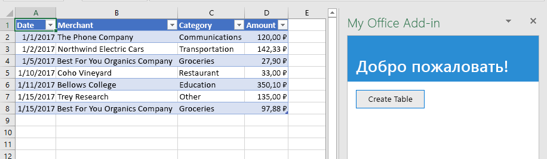
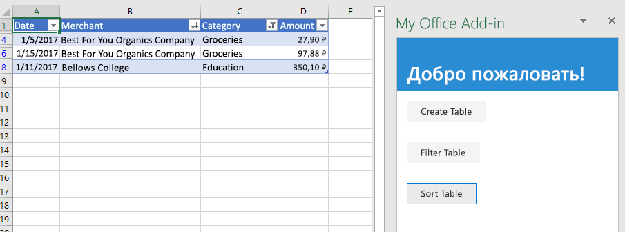
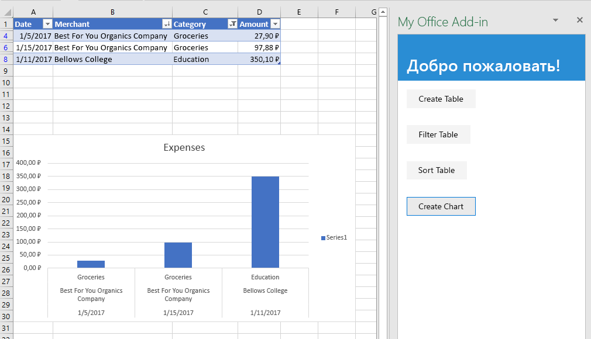
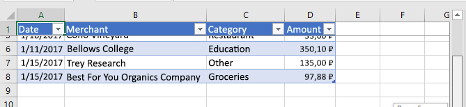
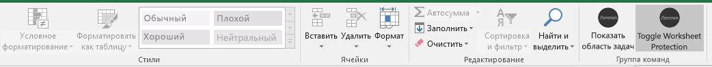
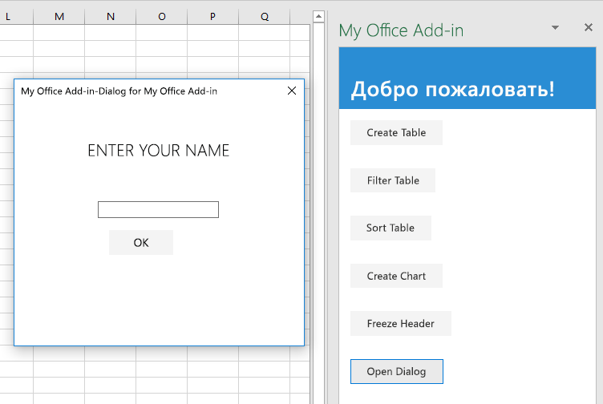

# <a name="tutorial-create-an-excel-task-pane-add-in"></a>Учебник: Создание надстройки области задач Excel

С помощью данного учебника вы сможете создать надстройку области задач Excel, которая выполняет следующие действия:

> [!div class="checklist"]
> * Создание таблицы
> * Фильтрация и сортировка таблицы
> * Создание графика
> * Закрепление заголовка таблицы
> * Защита листа
> * Открытие диалогового окна

## <a name="prerequisites"></a>Необходимые компоненты

Для работы с этим учебником необходимо установить указанные ниже компоненты. 

- Excel 2016, версия 1711 (сборка 8730.1000 "нажми и работай") или более поздняя. Чтобы установить эту версию, необходимо быть участником программы предварительной оценки Office. [Дополнительные сведения](https://products.office.com/office-insider?tab=tab-1)

- [Node](https://nodejs.org/en/) 

- [Git Bash](https://git-scm.com/downloads) (или другой клиент Git)

- Необходимо иметь подключение к Интернету для тестирования надстройки в этом руководстве.

## <a name="create-your-add-in-project"></a>Создание проекта надстройки

Выполните указанные ниже действия для создания проекта надстройки Excel, который будет использоваться в качестве основы для этого учебника.

1. Клонируйте репозиторий GitHub [Excel Add-in Tutorial](https://github.com/OfficeDev/Excel-Add-in-Tutorial).

2. Откройте окно Git Bash или системную командную строку с поддержкой Node.JS и перейдите к папке **Start** проекта.

3. Выполните команду `npm install`, чтобы установить инструменты и библиотеки, указанные в файле package.json. 

4. Сделайте так, чтобы операционная система компьютера разработки доверяла сертификату. Для этого выполните действия, описанные в [этой статье](https://github.com/OfficeDev/generator-office/blob/master/src/docs/ssl.md).

## <a name="create-a-table"></a>Создание таблицы

На этом этапе руководства мы проверим программным способом, поддерживает ли надстройка текущую версию Excel, установленную у пользователя, а также добавим таблицу на лист, заполним ее данными и отформатируем.

### <a name="code-the-add-in"></a>Написание кода надстройки

1. Откройте проект в редакторе кода.

2. Откройте файл index.html.

3. Замените `TODO1` на следующую разметку:

    ```html
    <button class="ms-Button" id="create-table">Create Table</button>
    ```

4. Откройте файл app.js.

5. Замените `TODO1` на приведенный ниже код. Этот код определяет, поддерживает ли установленная у пользователя версия Excel ту версию файла Excel.js, которая включает все API, используемые в этой серии руководств. В рабочей надстройке можно использовать текст условного блока, чтобы скрыть или отключить пользовательский интерфейс, где вызываются неподдерживаемые API. При этом пользователь по-прежнему сможет использовать те части надстройки, которые поддерживаются в его версии Excel.

    ```js
    if (!Office.context.requirements.isSetSupported('ExcelApi', 1.7)) {
        console.log('Sorry. The tutorial add-in uses Excel.js APIs that are not available in your version of Office.');
    }
    ```

6. Замените `TODO2` на следующий код:

    ```js
    $('#create-table').click(createTable);
    ```

7. Замените `TODO3` приведенным ниже кодом. Примечание.

   - Бизнес-логика Excel.js будет добавлена в функцию, передаваемую методу `Excel.run`. Эта логика выполняется не сразу. Вместо этого она добавляется в очередь ожидания команд.

   - Метод `context.sync` отправляет все команды из очереди в Excel для выполнения.

   - За методом `Excel.run` следует блок `catch`. Рекомендуется всегда следовать этой методике. 

    ```js
    function createTable() {
        Excel.run(function (context) {

            // TODO4: Queue table creation logic here.

            // TODO5: Queue commands to populate the table with data.

            // TODO6: Queue commands to format the table.

            return context.sync();
        })
        .catch(function (error) {
            console.log("Error: " + error);
            if (error instanceof OfficeExtension.Error) {
                console.log("Debug info: " + JSON.stringify(error.debugInfo));
            }
        });
    }
    ```

8. Замените `TODO4` приведенным ниже кодом. Примечание:

   - код создает таблицу с помощью метода `add` коллекции таблиц на листе, которая всегда существует, даже если она пуста. Это стандартный способ создания объектов Excel.js. API конструкторов классов не существуют, а для создания объекта Excel никогда не следует использовать оператор `new`. Вместо этого следует добавить его к объекту родительской коллекции.

   - Первый параметр метода `add` — это диапазон, содержащий только первую строку, а не весь диапазон таблицы, который мы в конечном итоге будем использовать. Это связано с тем, что при заполнении строк данных (на следующем этапе) надстройка добавляет к таблице новые строки, а не записывает их в ячейки имеющихся строк. Такой шаблон более распространен, так как количество строк в таблице часто неизвестно на момент ее создания.

   - Имена таблиц должны быть уникальными в рамках всей книги, а не только одного листа.

    ```js
    var currentWorksheet = context.workbook.worksheets.getActiveWorksheet();
    var expensesTable = currentWorksheet.tables.add("A1:D1", true /*hasHeaders*/);
    expensesTable.name = "ExpensesTable";
    ```

9. Замените `TODO5` на приведенный ниже код. Примечание:

   - значения ячеек диапазона задаются с помощью массива массивов.

   - Новые строки создаются в таблице путем вызова метода `add` коллекции ее строк. Вы можете добавить несколько строк в одном вызове метода `add`, включив несколько массивов значений ячеек в родительский массив, передаваемый в качестве второго параметра.

    ```js
    expensesTable.getHeaderRowRange().values =
        [["Date", "Merchant", "Category", "Amount"]];

    expensesTable.rows.add(null /*add at the end*/, [
        ["1/1/2017", "The Phone Company", "Communications", "120"],
        ["1/2/2017", "Northwind Electric Cars", "Transportation", "142.33"],
        ["1/5/2017", "Best For You Organics Company", "Groceries", "27.9"],
        ["1/10/2017", "Coho Vineyard", "Restaurant", "33"],
        ["1/11/2017", "Bellows College", "Education", "350.1"],
        ["1/15/2017", "Trey Research", "Other", "135"],
        ["1/15/2017", "Best For You Organics Company", "Groceries", "97.88"]
    ]);
    ```

10. Замените `TODO6` на приведенный ниже код. Примечание:

   - код получает ссылку на столбец **Сумма**, передавая его индекс (с отсчетом от нуля) в метод `getItemAt` коллекции столбцов таблицы.

     > [!NOTE]
     > У объектов коллекций Excel.js (например, `TableCollection`, `WorksheetCollection` и `TableColumnCollection`) есть свойство `items`, представляющее собой массив дочерних типов объектов (например, `Table`, `Worksheet` или `TableColumn`). Однако сам объект `*Collection` не является массивом.

   - Затем код форматирует диапазон столбца **Сумма** как денежные суммы в евро с точностью до второго знака после запятой. 

   - Напоследок он обеспечивает достаточные ширину столбцов и высоту строк для размещения самого длинного (или самого высокого) элемента данных. Обратите внимание, что код должен привести объекты `Range` к нужному формату. У объектов `TableColumn` и `TableRow` нет свойств формата.

        ```js
        expensesTable.columns.getItemAt(3).getRange().numberFormat = [['€#,##0.00']];
        expensesTable.getRange().format.autofitColumns();
        expensesTable.getRange().format.autofitRows();
        ```

### <a name="test-the-add-in"></a>Тестирование надстройки

1. Откройте окно Git Bash или системную командную строку с поддержкой Node.JS и перейдите к папке **Start** проекта.

2. Выполните команду `npm run build`, чтобы преобразовать исходный код ES6 в JavaScript более ранней версии, которую поддерживает Internet Explorer (используется приложением Excel в фоновом режиме для запуска надстроек Excel).

3. Выполните команду `npm start`, чтобы запустить веб-сервер, работающий на localhost.

4. Загрузите неопубликованную надстройку одним из следующих способов:

    - Windows: [загрузка неопубликованных надстроек Office в Windows](../testing/create-a-network-shared-folder-catalog-for-task-pane-and-content-add-ins.md)

    - [Office Online](../testing/sideload-office-add-ins-for-testing.md#sideload-an-office-add-in-in-office-online)

    - iPad и Mac: [загрузка неопубликованных надстроек Office на iPad и Mac](../testing/sideload-an-office-add-in-on-ipad-and-mac.md)

5. В меню **Главная** выберите пункт **Показать область задач**.

6. В области задач нажмите кнопку **Create Table** (Создать таблицу).

    

## <a name="filter-and-sort-a-table"></a>Фильтрация и сортировка таблицы

Из этого раздела руководства вы узнаете, как отфильтровать и отсортировать созданную ранее таблицу.

### <a name="filter-the-table"></a>Фильтрация таблицы

1. Откройте проект в редакторе кода.

2. Откройте файл index.html.

3. Под элементом `div`, содержащим кнопку `create-table`, добавьте следующую разметку:

    ```html
    <div class="padding">
        <button class="ms-Button" id="filter-table">Filter Table</button>
    </div>
    ```

4. Откройте файл app.js.

5. Под строкой, назначающей обработчик нажатия кнопки `create-table`, добавьте следующий код:

    ```js
    $('#filter-table').click(filterTable);
    ```

6. Под функцией `createTable` добавьте следующую функцию:

    ```js
    function filterTable() {
        Excel.run(function (context) {

            // TODO1: Queue commands to filter out all expense categories except
            //        Groceries and Education.

            return context.sync();
        })
        .catch(function (error) {
            console.log("Error: " + error);
            if (error instanceof OfficeExtension.Error) {
                console.log("Debug info: " + JSON.stringify(error.debugInfo));
            }
        });
    }
    ```

7. Замените `TODO1` приведенным ниже кодом. Обратите внимание:

   - Код получает ссылку на столбец, который нужно отфильтровать, передавая имя столбца методу `getItem`, а не передавая его индекс методу `getItemAt`, как это делает метод `createTable`. Так как пользователи могут перемещать столбцы, по заданному индексу может располагаться уже другой столбец. Следовательно, для получения ссылки безопаснее использовать имя столбца. Мы спокойно использовали метод `getItemAt` в предыдущем разделе, потому что мы использовали его в методе, который создает таблицу, и пользователь никак не мог переместить столбец.

   - Метод `applyValuesFilter` является одним из нескольких методов фильтрации объекта `Filter`.

    ```js
    var currentWorksheet = context.workbook.worksheets.getActiveWorksheet();
    var expensesTable = currentWorksheet.tables.getItem('ExpensesTable');
    var categoryFilter = expensesTable.columns.getItem('Category').filter;
    categoryFilter.applyValuesFilter(["Education", "Groceries"]);
    ``` 

### <a name="sort-the-table"></a>Сортировка таблицы

1. Откройте файл index.html.

2. Под элементом `div`, содержащим кнопку `filter-table`, добавьте следующую разметку:

    ```html
    <div class="padding">
        <button class="ms-Button" id="sort-table">Sort Table</button>
    </div>
    ```

3. Откройте файл app.js.

4. Под строкой, назначающей обработчик нажатия кнопки `filter-table`, добавьте следующий код:

    ```js
    $('#sort-table').click(sortTable);
    ```

5. Под функцией `filterTable` добавьте приведенную ниже функцию.

    ```js
    function sortTable() {
        Excel.run(function (context) {

            // TODO1: Queue commands to sort the table by Merchant name.

            return context.sync();
        })
        .catch(function (error) {
            console.log("Error: " + error);
            if (error instanceof OfficeExtension.Error) {
                console.log("Debug info: " + JSON.stringify(error.debugInfo));
            }
        });
    }
    ```

6. Замените `TODO1` приведенным ниже кодом. Обратите внимание:

   - Код создает массив объектов `SortField`, состоящий из одного элемента, так как надстройка сортирует таблицу только по столбцу Merchant.

   - Свойство `key` объекта `SortField` — это отсчитываемый от нуля индекс столбца, по которому необходимо сортировать таблицу.

   - Элемент `sort` объекта `Table` — это объект `TableSort`, а не метод. Объекты `SortField` передаются методу `apply` объекта `TableSort`.

    ```js
    var currentWorksheet = context.workbook.worksheets.getActiveWorksheet();
    var expensesTable = currentWorksheet.tables.getItem('ExpensesTable');
    var sortFields = [
        {
            key: 1,            // Merchant column
            ascending: false,
        }
    ];

    expensesTable.sort.apply(sortFields);
    ```

### <a name="test-the-add-in"></a>Тестирование надстройки

1. Если окно Git Bash или системная командная строка с поддержкой Node.JS, открытые на предыдущем этапе руководства, все еще открыты, дважды нажмите клавиши **Ctrl+C**, чтобы остановить работу веб-сервера. Если они закрыты, откройте окно Git Bash или системную командную строку с поддержкой Node.JS и перейдите к папке **Start** проекта.

     > [!NOTE]
     > Хотя сервер синхронизации браузера будет повторно загружать надстройку в области задач при каждом изменении любого файла (в том числе app.js), он не передает повторно код JavaScript, поэтому нужно будет снова выполнить команду сборки, чтобы изменения, внесенные в файл app.js, вступили в силу. Для этого следует завершить процесс сервера, чтобы можно было получить приглашение на ввод команды сборки. После сборки необходимо перезапустить сервер. Для этого выполните указанные ниже действия.

2. Выполните команду `npm run build`, чтобы преобразовать исходный код ES6 в JavaScript более ранней версии, которую поддерживает Internet Explorer (используется приложением Excel в фоновом режиме для запуска надстроек Excel).

3. Выполните команду `npm start`, чтобы запустить веб-сервер, работающий на localhost.

4. Перезагрузите область задач. Для этого закройте ее, а затем выберите в меню **Главная** пункт **Показать область задач**, чтобы заново открыть надстройку.

5. Если по той или иной причине на открытом листе нет таблицы, нажмите в области задач кнопку **Create Table** (Создать таблицу).

6. Нажмите кнопки **Filter Table** (Фильтровать таблицу) и **Sort Table** (Сортировать таблицу) в любом порядке.

    

## <a name="create-a-chart"></a>Создание диаграммы

На этом этапе руководства мы создадим диаграмму, используя данные из ранее созданной таблицы, а затем отформатируем эту диаграмму.

### <a name="chart-a-chart-using-table-data"></a>Создание диаграммы с помощью таблицы данных

1. Откройте проект в редакторе кода.

2. Откройте файл index.html.

3. Под элементом `div`, содержащим кнопку `sort-table`, добавьте следующую разметку:

    ```html
    <div class="padding">
        <button class="ms-Button" id="create-chart">Create Chart</button>
    </div>
    ```

4. Откройте файл app.js.

5. Под строкой, назначающей обработчик нажатия кнопки `sort-chart`, добавьте следующий код:

    ```js
    $('#create-chart').click(createChart);
    ```

6. Под функцией `sortTable` добавьте приведенную ниже функцию.

    ```js
    function createChart() {
        Excel.run(function (context) {

            // TODO1: Queue commands to get the range of data to be charted.

            // TODO2: Queue command to create the chart and define its type.

            // TODO3: Queue commands to position and format the chart.

            return context.sync();
        })
        .catch(function (error) {
            console.log("Error: " + error);
            if (error instanceof OfficeExtension.Error) {
                console.log("Debug info: " + JSON.stringify(error.debugInfo));
            }
        });
    }
    ```

7. Замените `TODO1` приведенным ниже кодом. Обратите внимание на то, что для исключения строки заголовков в коде вместо метода `getRange` используется метод `Table.getDataBodyRange`, чтобы получить нужный диапазон данных для диаграммы.

    ```js
    var currentWorksheet = context.workbook.worksheets.getActiveWorksheet();
    var expensesTable = currentWorksheet.tables.getItem('ExpensesTable');
    var dataRange = expensesTable.getDataBodyRange();
    ```

8. Замените `TODO2` приведенным ниже кодом. Обратите внимание на следующие параметры:

   - Первый параметр метода `add` задает тип диаграммы. Существует несколько десятков типов.

   - Второй параметр задает диапазон данных, включаемых в диаграмму.

   - Третий параметр определяет, как следует отображать на диаграмме ряд точек данных из таблицы: по строкам или по столбцам. Значение `auto` сообщает Excel, что следует выбрать оптимальный способ.

    ```js
    var chart = currentWorksheet.charts.add('ColumnClustered', dataRange, 'auto');
    ```

9. Замените `TODO3` на приведенный ниже код. Большая часть этого кода не требует объяснений. Примечание.
   
   - Параметры метода `setPosition` задают левую верхнюю и правую нижнюю ячейки области листа, которые должны содержать диаграмму. Excel может настраивать такие параметры, как ширина линий, чтобы диаграмма хорошо выглядела в выделенном для нее пространстве.
   
   - "Ряд" — это набор точек данных из столбца таблицы. Так как в таблице есть только один нестроковый столбец, Excel делает вывод, что это единственный столбец точек данных для диаграммы. Он рассматривает другие столбцы как метки диаграммы. Следовательно, в диаграмме будет только один ряд, обозначенный индексом 0. К нему следует добавить метку "Значение в €".

    ```js
    chart.setPosition("A15", "F30");
    chart.title.text = "Expenses";
    chart.legend.position = "right"
    chart.legend.format.fill.setSolidColor("white");
    chart.dataLabels.format.font.size = 15;
    chart.dataLabels.format.font.color = "black";
    chart.series.getItemAt(0).name = 'Value in €';
    ```

### <a name="test-the-add-in"></a>Тестирование надстройки

1. Если окно Git Bash или системная командная строка с поддержкой Node.JS, открытые на предыдущем этапе руководства, все еще открыты, дважды нажмите клавиши **Ctrl+C**, чтобы остановить работу веб-сервера. Если они закрыты, откройте окно Git Bash или системную командную строку с поддержкой Node.JS и перейдите к папке **Start** проекта.

     > [!NOTE]
     > Хотя сервер синхронизации браузера будет повторно загружать надстройку в области задач при каждом изменении любого файла (в том числе app.js), он не передает повторно код JavaScript, поэтому нужно будет снова выполнить команду сборки, чтобы изменения, внесенные в файл app.js, вступили в силу. Для этого следует завершить процесс сервера, чтобы можно было получить приглашение на ввод команды сборки. После сборки необходимо перезапустить сервер. Для этого выполните указанные ниже действия.

2. Выполните команду `npm run build`, чтобы преобразовать исходный код ES6 в JavaScript более ранней версии, которую поддерживает Internet Explorer (используется приложением Excel в фоновом режиме для запуска надстроек Excel).

3. Выполните команду `npm start`, чтобы запустить веб-сервер, работающий на localhost.

4. Перезагрузите область задач. Для этого закройте ее, а затем выберите в меню **Главная** пункт **Показать область задач**, чтобы заново открыть надстройку.

5. Если по той или иной причине на открытом листе нет таблицы, нажмите в области задач кнопку **Create Table** (Создать таблицу), а затем — кнопки **Filter Table** (Фильтровать таблицу) и **Sort Table** (Сортировать таблицу) в любом порядке.

6. Нажмите кнопку **Create Chart** (Создать диаграмму). Будет создана диаграмма, включающая только данные из отфильтрованных строк. Метки точек данных в нижней части диаграммы отсортированы согласно заданному для нее порядку, то есть по именам продавцов в обратном алфавитном порядке.

    

## <a name="freeze-a-table-header"></a>Закрепление заголовка таблицы

Когда таблица достаточно длинная, при прокрутке строка заголовков может исчезать с экрана. В этом разделе учебника мы расскажем, как закрепить строку заголовков созданной ранее таблицы, чтобы она была видна, даже когда пользователь прокручивает лист.

### <a name="freeze-the-tables-header-row"></a>Закрепление строки заголовков таблицы

1. Откройте проект в редакторе кода.

2. Откройте файл index.html.

3. Под элементом `div`, содержащим кнопку `create-chart`, добавьте следующую разметку:

    ```html
    <div class="padding">
        <button class="ms-Button" id="freeze-header">Freeze Header</button>
    </div>
    ```

4. Откройте файл app.js.

5. Под строкой, назначающей обработчик нажатия кнопки `create-chart`, добавьте следующий код:

    ```js
    $('#freeze-header').click(freezeHeader);
    ```

6. Под функцией `createChart` добавьте следующую функцию:

    ```js
    function freezeHeader() {
        Excel.run(function (context) {

            // TODO1: Queue commands to keep the header visible when the user scrolls.

            return context.sync();
        })
        .catch(function (error) {
            console.log("Error: " + error);
            if (error instanceof OfficeExtension.Error) {
                console.log("Debug info: " + JSON.stringify(error.debugInfo));
            }
        });
    }
    ```

7. Замените `TODO1` приведенным ниже кодом. Обратите внимание:

   - Коллекция `Worksheet.freezePanes` — это набор закрепленных строк, которые не исчезают с экрана при прокрутке листа.

   - Метод `freezeRows` принимает в качестве параметра количество строк сверху, которые необходимо закрепить. Мы передаем значение `1`, чтобы закрепить первую строку.

    ```js
    var currentWorksheet = context.workbook.worksheets.getActiveWorksheet();
    currentWorksheet.freezePanes.freezeRows(1);
    ```

### <a name="test-the-add-in"></a>Тестирование надстройки

1. Если окно Git Bash или системная командная строка с поддержкой Node.JS, открытые на предыдущем этапе руководства, все еще открыты, дважды нажмите клавиши **Ctrl+C**, чтобы остановить работу веб-сервера. Если они закрыты, откройте окно Git Bash или системную командную строку с поддержкой Node.JS и перейдите к папке **Start** проекта.

     > [!NOTE]
     > Хотя сервер синхронизации браузера будет повторно загружать надстройку в области задач при каждом изменении любого файла (в том числе app.js), он не передает повторно код JavaScript, поэтому нужно будет снова выполнить команду сборки, чтобы изменения, внесенные в файл app.js, вступили в силу. Для этого следует завершить процесс сервера, чтобы можно было получить приглашение на ввод команды сборки. После сборки необходимо перезапустить сервер. Для этого выполните указанные ниже действия.

2. Выполните команду `npm run build`, чтобы преобразовать исходный код ES6 в JavaScript более ранней версии, которую поддерживает Internet Explorer (используется приложением Excel в фоновом режиме для запуска надстроек Excel).

3. Выполните команду `npm start`, чтобы запустить веб-сервер, работающий на localhost.

4. Повторно загрузите область задач. Для этого закройте ее, а затем выберите в меню **Главная** пункт **Показать область задач**.

5. Если таблица на листе, удалите ее.

6. В области задач нажмите кнопку **Create Table** (Создать таблицу).

7. Нажмите кнопку **Freeze Header** (Закрепить заголовок).

8. Прокрутите лист вниз, чтобы убедиться, что заголовок таблицы по-прежнему остается на экране, даже когда более высокие строки исчезают.

    

## <a name="protect-a-worksheet"></a>Защита листа

На данном этапе, описанном в руководстве, вы добавите на ленту еще одну кнопку, при нажатии которой будет выполнена определенная вами функция включения или выключения защиты листа.

### <a name="configure-the-manifest-to-add-a-second-ribbon-button"></a>Настройка манифеста для добавления второй кнопки на ленту

1. Откройте файл манифеста my-office-add-in-manifest.xml.

2. Найдите элемент `<Control>`. Этот элемент определяет кнопку **Show Taskpane** (Показать область задач) на вкладке **Главная**, которую вы используете для запуска надстройки. Мы добавим вторую кнопку в эту же группу на ленте **Главная**. Добавьте приведенный ниже код между закрывающим тегом элемента управления (`</Control>`) и закрывающим тегом группы (`</Group>`).

    ```xml
    <Control xsi:type="Button" id="<!--TODO1: Unique (in manifest) name for button -->">
        <Label resid="<!--TODO2: Button label -->" />
        <Supertip>            
            <Title resid="<!-- TODO3: Button tool tip title -->" />
            <Description resid="<!-- TODO4: Button tool tip description -->" />
        </Supertip>
        <Icon>
            <bt:Image size="16" resid="Contoso.tpicon_16x16" />
            <bt:Image size="32" resid="Contoso.tpicon_32x32" />
            <bt:Image size="80" resid="Contoso.tpicon_80x80" />
        </Icon>
        <Action xsi:type="<!-- TODO5: Specify the type of action-->">
            <!-- TODO6: Identify the function.-->
        </Action>
    </Control>
    ```

3. Замените `TODO1` строкой, которая присваивает кнопке идентификатор, уникальный в пределах этого файла манифеста. Так как кнопка будет включать и выключать защиту листа, укажите "ToggleProtection". Когда сделаете это, весь открывающий тег элемента управления должен выглядеть следующим образом:

    ```xml
    <Control xsi:type="Button" id="ToggleProtection">
    ```

4. Следующие три элемента `TODO` устанавливают "resid", или идентификаторы ресурса. Ресурс должен быть строкой, и вы создадите эти три строки на следующем этапе. Сейчас вам нужно присвоить идентификаторы ресурсам. Кнопка должна называться "Toggle Protection" (Переключение защиты), но у строки должен быть *идентификатор* "ProtectionButtonLabel", поэтому готовый элемент `Label` выглядит следующим образом:

    ```xml
    <Label resid="ProtectionButtonLabel" />
    ```

5. Элемент `SuperTip` определяет подсказку для кнопки. Заголовок этой подсказки должен совпадать с названием кнопки, поэтому мы используем тот же ИД ресурса — "ProtectionButtonLabel". Описание подсказки будет следующим: "Click to turn protection of the worksheet on and off" (Нажмите для включения или выключения защиты листа). У `ID` должно быть значение "ProtectionButtonToolTip". После выполнения весь код `SuperTip` должен выглядеть следующим образом: 

    ```xml
    <Supertip>            
        <Title resid="ProtectionButtonLabel" />
        <Description resid="ProtectionButtonToolTip" />
    </Supertip>
    ```

   > [!NOTE] 
   > В рабочей надстройке не нужно использовать один и тот же значок для двух разных кнопок, но сейчас мы предлагаем сделать это для простоты. Поэтому код `Icon` в новом теге `Control` представляет собой лишь копию элемента `Icon` из существующего тега `Control`. 

6. Для элемента `Action` в исходном элементе `Control`, уже присутствующем в манифесте, задан тип `ShowTaskpane`, но новая кнопка будет не открывать область задач, а выполнять специальную функцию, которую вы создадите позже. Поэтому замените `TODO5` на `ExecuteFunction` (тип действия для кнопок, запускающих специальные функции). Открывающий тег `Action` должен выглядеть следующим образом:
 
    ```xml
    <Action xsi:type="ExecuteFunction">
    ```

7. У исходного элемента `Action` есть дочерние элементы, определяющие идентификатор области задач и URL-адрес страницы, которая должна быть открыта в области задач. Но у элемента `Action` типа `ExecuteFunction` есть один дочерний элемент, который именует функцию, выполняемую элементом управления. На более позднем этапе вы создадите функцию `toggleProtection`. Поэтому замените `TODO6` следующим кодом:
 
    ```xml
    <FunctionName>toggleProtection</FunctionName>
    ```

    Теперь весь код `Control` должен выглядеть вот так:

    ```xml
    <Control xsi:type="Button" id="ToggleProtection">
        <Label resid="ProtectionButtonLabel" />
        <Supertip>            
            <Title resid="ProtectionButtonLabel" />
            <Description resid="ProtectionButtonToolTip" />
        </Supertip>
        <Icon>
            <bt:Image size="16" resid="Contoso.tpicon_16x16" />
            <bt:Image size="32" resid="Contoso.tpicon_32x32" />
            <bt:Image size="80" resid="Contoso.tpicon_80x80" />
        </Icon>
        <Action xsi:type="ExecuteFunction">
           <FunctionName>toggleProtection</FunctionName>
        </Action>
    </Control>
    ```

8. Прокрутите страницу вниз до раздела `Resources` манифеста.

9. Добавьте приведенный ниже код в качестве дочернего элемента `bt:ShortStrings`.

    ```xml
    <bt:String id="ProtectionButtonLabel" DefaultValue="Toggle Worksheet Protection" />
    ```

10. Добавьте приведенный ниже код в качестве дочернего элемента `bt:LongStrings`.

    ```xml
    <bt:String id="ProtectionButtonToolTip" DefaultValue="Click to protect or unprotect the current worksheet." />
    ```

11. Сохраните файл.

### <a name="create-the-function-that-protects-the-sheet"></a>Создание функции защиты листа

1. Откройте файл \function-file\function-file.js.

2. В файле уже есть функция-выражение, вызываемая сразу после создания (IIFE). *За пределами IIFE*, добавьте следующий код. Обратите внимание на то, что мы указываем параметр `args` для метода, а самая последняя строка метода вызывает `args.completed`. Это требование для всех команд надстройки типа **ExecuteFunction**. Это сигнализирует ведущему приложению Office о том, что работа функции завершена и пользовательский интерфейс снова может реагировать.

    ```js
    function toggleProtection(args) {
        Excel.run(function (context) {
            
            // TODO1: Queue commands to reverse the protection status of the current worksheet.

            return context.sync();
        })
        .catch(function (error) {
            console.log("Error: " + error);
            if (error instanceof OfficeExtension.Error) {
                console.log("Debug info: " + JSON.stringify(error.debugInfo));
            }
        });
        args.completed();
    }
    ```

3. Замените `TODO1` приведенным ниже кодом. В этом коде используется свойство защиты объекта листа в стандартном шаблоне переключателя. Объяснение `TODO2` будет приведено в следующем разделе.

    ```js
    var sheet = context.workbook.worksheets.getActiveWorksheet();

    // TODO2: Queue command to load the sheet's "protection.protected" property from
    //        the document and re-synchronize the document and task pane.

     if (sheet.protection.protected) {
        sheet.protection.unprotect();
    } else {
        sheet.protection.protect();
    }
    ``` 

### <a name="add-code-to-fetch-document-properties-into-the-task-panes-script-objects"></a>Добавление кода для получения свойств документа в объекты скрипта области задач

В случае всех описанных ранее функций из этой серии руководств вы ставили в очередь команды для *записи* данных в документ Office. Каждая функция заканчивалась вызовом метода `context.sync()`, который отправляет выставленные в очередь команды документу для выполнения. Но код, который вы добавили на последнем этапе, вызывает свойство `sheet.protection.protected`, и в этом заключается существенное отличие от ранее написанных функций, так как `sheet` является лишь объектом прокси, существующим в скрипте вашей области задач. В нем нет сведений о фактическом состоянии защиты документа, поэтому его свойство `protection.protected` не может иметь реального значения. Сначала нужно получить сведения о состоянии защиты от документа и задать значение `sheet.protection.protected`, используя их. Только после этого станет возможным вызов `sheet.protection.protected` без исключения. Процесс получения делится на три этапа:

   1. Добавление в очередь команды для загрузки (т. е. получения) свойств, которые должен прочесть ваш код.

   2. Вызов метода `sync` объекта контекста, чтобы можно было отправить документу находящуюся в очереди команду для выполнения, а также для возврата запрошенных данных.

   3. Метод `sync` асинхронный, поэтому его выполнение должно быть завершено до того, как код вызовет полученные свойства.

Эти три действия должны выполняться каждый раз, когда коду нужно *прочесть* данные из документа Office.

1. В функции `toggleProtection` замените `TODO2` приведенным ниже кодом. Обратите внимание:
   
   - У каждого объекта Excel есть метод `load`. Вы указываете свойства объекта, которые нужно прочесть в параметре как строку имен, разделенных запятыми. В этом случае нужно прочесть подсвойство свойства `protection`. На подсвойство нужно ссылаться почти так же, как и в остальных частях кода. Отличие заключается в том, что вместо символа "." нужно указать косую черту ("/").

   - Чтобы логика переключения, которая считывает `sheet.protection.protected`, не срабатывала до выполнения `sync` и присвоения `sheet.protection.protected` правильного значения, полученного из документа, она будет перемещена (на следующем этапе) в функцию `then`, которая не выполняется до завершения `sync`. 

    ```js
    sheet.load('protection/protected');
    return context.sync()
        .then(
            function() {
                // TODO3: Move the queued toggle logic here.
            }
        )
        // TODO4: Move the final call of `context.sync` here and ensure that it
        //        does not run until the toggle logic has been queued.
    ``` 

2. Для двух операторов `return` не может использоваться один путь кода, который не разветвляется, поэтому удалите последнюю строку `return context.sync();` в конце `Excel.run`. Вы добавите новую последнюю строку `context.sync` позже.

3. Вырежьте структуру `if ... else` в функции `toggleProtection` и вставьте вместо `TODO3`.

4. Замените `TODO4` приведенным ниже кодом. Примечание:

   - Благодаря тому, что метод `sync` передается функции `then`, он не будет запускаться до добавления `sheet.protection.unprotect()` или `sheet.protection.protect()` в очередь.

   - Метод `then` вызывает любую функцию, которая ему передана. Не нужно вызывать `sync` дважды, поэтому уберите "()" после `context.sync`.

    ```js
    .then(context.sync);
    ```

   Когда все будет готово, функция должна выглядеть так:

    ```js
    function toggleProtection(args) {
        Excel.run(function (context) {            
          var sheet = context.workbook.worksheets.getActiveWorksheet();          
          sheet.load('protection/protected');

          return context.sync()
              .then(
                  function() {
                    if (sheet.protection.protected) {
                        sheet.protection.unprotect();
                    } else {
                        sheet.protection.protect();
                    }
                  }
              )
              .then(context.sync);
        })
        .catch(function (error) {
            console.log("Error: " + error);
            if (error instanceof OfficeExtension.Error) {
                console.log("Debug info: " + JSON.stringify(error.debugInfo));
            }
        });
        args.completed();
    }
    ```

### <a name="configure-the-script-loading-html-file"></a>Настройка HTML-файла для загрузки скрипта

Откройте файл /function-file/function-file.html. Это HTML-файл без пользовательского интерфейса, вызываемый, когда пользователь нажимает кнопку **Toggle Worksheet Protection** (Переключение защиты листа). Он предназначен для загрузки метода JavaScript, который должен выполняться при нажатии кнопки. Вы не будете изменять этот файл. Просто обратите внимание на то, что второй тег `<script>` загружает functionfile.js.

   > [!NOTE]
   > Файл function-file.html и загружаемый им файл function-file.js выполняются в полностью отдельном процессе IE из области задач надстройки. Если файл function-file.js был передан в тот же файл bundle.js, что и файл app.js, надстройка загрузит два экземпляра файла bundle.js, и это отменяет цель объединения. Кроме того, файл function-file.js не содержит код JavaScript, который не поддерживается в IE. По этим двум причинам такая надстройка не передает файл function-file.js вообще. 

### <a name="test-the-add-in"></a>Тестирование надстройки

1. Закройте все приложения Office, в том числе Excel. 

2. Очистите кэш Office, удалив содержимое папки кэша. Это необходимо, чтобы можно было полностью удалить старую версию надстройки из ведущего приложения. 

    - Для Windows: `%LOCALAPPDATA%\Microsoft\Office\16.0\Wef\`.

    - Для Mac: `/Users/{your_name_on_the_device}/Library/Containers/com.Microsoft.OsfWebHost/Data/`.

3. Если по той или иной причине ваш сервер не работает, в окне Git Bash или системной командной строке с поддержкой Node.JS перейдите к папке **Start** проекта и выполните команду `npm start`. Повторную сборку проекта выполнять не нужно, так как единственный файл JavaScript, который вы изменили, не относится к сборке bundle.js.

4. Используя новую версию измененного файла манифеста, повторите процесс загрузки неопубликованного приложения с помощью одного из указанных далее методов. *Нужно перезаписать предыдущий экземпляр файла манифеста.*

    - Windows: [загрузка неопубликованных надстроек Office в Windows](../testing/create-a-network-shared-folder-catalog-for-task-pane-and-content-add-ins.md)

    - [Office Online](../testing/sideload-office-add-ins-for-testing.md#sideload-an-office-add-in-in-office-online)

    - iPad и Mac: [загрузка неопубликованных надстроек Office на iPad и Mac](../testing/sideload-an-office-add-in-on-ipad-and-mac.md)

5. Откройте любой лист в Excel.

6. На ленте **Главная** нажмите кнопку **Toggle Worksheet Protection** (Переключение защиты листа). Обратите внимание на то, что большинство элементов управления на ленте отключены (серые), как показано на приведенном ниже снимке экрана. 

7. Выберите ячейку, как если бы вы хотели изменить ее содержимое. Появится сообщение об ошибке и защите листа.

8. Нажмите кнопку **Toggle Worksheet Protection** (Переключение защиты листа) еще раз, и элементы управления включатся, после чего вы сможете изменить значения ячеек.

    

## <a name="open-a-dialog"></a>Открытие диалогового окна

На данном заключительном этапе, указанном в руководстве, вы откроете диалоговое окно в своей надстройке, передадите сообщение из процесса диалогового окна в процесс области задач и закроете диалоговое окно. Диалоговые окна надстройки Office *не модальные*: пользователь может продолжать работать и с документом в ведущем приложении Office, и с главной страницей в области задач.

### <a name="create-the-dialog-page"></a>Создание страницы диалогового окна

1. Откройте проект в редакторе кода.

2. Создайте в корневой папке проекта (где находится index.html) файл popup.html.

3. Добавьте в файл popup.html приведенный ниже код. Обратите внимание:

   - На странице находится `<input>`, где пользователь будет вводить свое имя, и кнопка, при нажатии которой имя будет отправлено на страницу области задач, где оно отобразится.

   - Код загружает скрипт под названием popup.js, который будет создан на более позднем этапе.

   - Он загружает также библиотеку Office.JS и jQuery, так как они будут использоваться в popup.js.

    ```html
    <!DOCTYPE html>
    <html>
        <head lang="en">
            <title>Dialog for My Office Add-in</title>
            <meta charset="UTF-8">
            <meta name="viewport" content="width=device-width, initial-scale=1">

            <link rel="stylesheet" href="node_modules/office-ui-fabric-js/dist/css/fabric.min.css" />
            <link rel="stylesheet" href="node_modules/office-ui-fabric-js/dist/css/fabric.components.css" />
            <link rel="stylesheet" href="app.css" />

            <script type="text/javascript" src="https://appsforoffice.microsoft.com/lib/1.1/hosted/office.js"></script>
            <script type="text/javascript" src="https://ajax.aspnetcdn.com/ajax/jQuery/jquery-2.2.1.min.js"></script>
            <script type="text/javascript" src="popup.js"></script>

        </head>
        <body style="display:flex;flex-direction:column;align-items:center;justify-content:center">
            <div class="padding">
                <p class="ms-font-xl">ENTER YOUR NAME</p>
            </div>
            <div class="padding">
                <input id="name-box" type="text"/>
            </div>
            <div class="padding">
                <button id="ok-button" class="ms-Button">OK</button>
            </div>
        </body>
    </html>
    ```

4. Создайте файл в корневой папке проекта с именем popup.js.

5. Добавьте указанный ниже код в файл popup.js. Обратите внимание на указанные ниже особенности этого кода.

   - *Каждая страница, вызывающая API в библиотеке Office.JS, должна сначала убедиться, что библиотека полностью инициализирована.* Лучший способ сделать это — вызвать метод `Office.onReady()`. Если у вашей надстройки есть собственные задачи инициализации, код должен перейти к методу `then()`, связанному с вызовом `Office.onReady()`. Файл app.js в корневом каталоге проекта можно рассматривать как пример. Вызов метода `Office.onReady()` должен выполняться до каких-либо вызовов Office.JS, поэтому назначение указано в файле скрипта, загружаемом страницей, как в этом случае.
   - Функция jQuery `ready` вызывается в методе `then()`. В большинстве случаев код загрузки (в том числе начальной) или инициализации из других библиотек JavaScript должен находиться в методе `then()`, связанном с вызовом `Office.onReady()`.

    ```js
    (function () {
    "use strict";

        Office.onReady()
            .then(function() {
                $(document).ready(function () {  

                    // TODO1: Assign handler to the OK button.

                });
            });

        // TODO2: Create the OK button handler

    }());
    ```

6. Замените `TODO1` приведенным ниже кодом. Вы создадите функцию `sendStringToParentPage` на следующем этапе.

    ```js
    $('#ok-button').click(sendStringToParentPage);
    ```

7. Замените `TODO2` приведенным ниже кодом. Метод `messageParent` передает свой параметр родительской странице (в данном случае это страница на панели задач). Параметр может быть логическим или строковым. Во втором случае подразумевается все, что можно сериализовать, представив в виде строки (например, XML или JSON).

    ```js
    function sendStringToParentPage() {
        var userName = $('#name-box').val();
        Office.context.ui.messageParent(userName);
    }
    ```

8. Сохраните файл.

   > [!NOTE]
   > Файл popup.html и загружаемый им файл popup.js выполняются в полностью отдельном процессе Internet Explorer из области задач надстройки. Если файл popup.js был передан в тот же файл bundle.js, что и файл app.js, надстройка загрузит два экземпляра файла bundle.js, и это отменяет цель объединения. Кроме того, файл popup.js не содержит код JavaScript, который не поддерживается в IE. По этим двум причинам эта надстройка не передает файл popup.js вообще.

### <a name="open-the-dialog-from-the-task-pane"></a>Открытие диалогового окна из области задач

1. Откройте файл index.html.

2. Под `div` с кнопкой `freeze-header` добавьте приведенный ниже код.

    ```html
    <div class="padding">
        <button class="ms-Button" id="open-dialog">Open Dialog</button>
    </div>
    ```

3. В диалоговом окне пользователю будет предложено ввести имя и передать имя пользователя в область задач. Область задач отобразит его в подписи. Непосредственно под только что добавленным тегом `div` добавьте приведенный ниже код.

    ```html
    <div class="padding">
        <label id="user-name"></label>
    </div>
    ```

4. Откройте файл app.js.

5. Под строкой, назначающей обработчик щелчков для кнопки `freeze-header`, добавьте приведенный ниже код. Вы создадите метод `openDialog` на одном из следующих шагов.

    ```js
    $('#open-dialog').click(openDialog);
    ```

6. Под функцией `freezeHeader` добавьте указанное ниже объявление. Эта переменная удерживает объект в контексте выполнения родительской страницы, который служит посредником для контекста выполнения страницы диалогового окна.

    ```js
    var dialog = null;
    ```

7. Добавьте приведенную ниже функцию под объявлением `dialog`. Важно отметить, что в этом коде *отсутствует* вызов `Excel.run`. Это связано с тем, что API, открывающий диалоговое окно, совместно используется всеми ведущими приложениями Office, поэтому относится к общему API JavaScript для Office, а не API для Excel.

    ```js
    function openDialog() {
        // TODO1: Call the Office Common API that opens a dialog
    }
    ```

8. Замените `TODO1` приведенным ниже кодом. Примечание:

   - Метод `displayDialogAsync` открывает диалоговое окно в центре экрана.

   - Первый параметр — это URL-адрес открываемой страницы.

   - Второй параметр передает параметры. `height` и `width` — процентные значения размера окна для приложения Office.

    ```js
    Office.context.ui.displayDialogAsync(
        'https://localhost:3000/popup.html',
        {height: 45, width: 55},

        // TODO2: Add callback parameter.
    );
    ```

### <a name="process-the-message-from-the-dialog-and-close-the-dialog"></a>Обработка сообщения из диалогового окна и закрытие диалогового окна

1. Продолжайте работать в файле app.js. Замените `TODO2` приведенным ниже кодом. Обратите внимание:

   - Обратный вызов выполняется сразу же после успешного открытия диалогового окна и до того, как пользователь предпримет какие-либо действия в диалоговом окне.

   - `result.value` — это объект, который выступает в качестве посредника между контекстами выполнения родительских страниц и страниц диалоговых окон.

   - Функция `processMessage` будет создана на более позднем этапе. Этот обработчик будет обрабатывать любые значения, которые отправляются со страницы диалогового окна с вызовами функции `messageParent`.

    ```js
    function (result) {
        dialog = result.value;
        dialog.addEventHandler(Microsoft.Office.WebExtension.EventType.DialogMessageReceived, processMessage);
    }
    ```

2. Добавьте указанную ниже функцию под функцией `openDialog`.

    ```js
    function processMessage(arg) {
        $('#user-name').text(arg.message);
        dialog.close();
    }
    ```

### <a name="test-the-add-in"></a>Тестирование надстройки

1. Если окно Git Bash или системная командная строка с поддержкой Node.JS, открытые на предыдущем этапе руководства, все еще открыты, дважды нажмите клавиши **Ctrl+C**, чтобы остановить работу веб-сервера. Если они закрыты, откройте окно Git Bash или системную командную строку с поддержкой Node.JS и перейдите к папке **Start** проекта.

     > [!NOTE]
     > Хотя сервер синхронизации браузера будет повторно загружать надстройку в области задач при каждом изменении любого файла (в том числе app.js), он не передает повторно код JavaScript, поэтому нужно будет снова выполнить команду сборки, чтобы изменения, внесенные в файл app.js, вступили в силу. Для этого следует завершить процесс сервера, чтобы можно было получить приглашение на ввод команды сборки. После сборки необходимо перезапустить сервер. Для этого выполните указанные ниже действия.

2. Выполните команду `npm run build`, чтобы преобразовать исходный код ES6 в JavaScript более ранней версии, которую поддерживает Internet Explorer (используется приложением Excel в фоновом режиме для запуска надстроек Excel).

3. Выполните команду `npm start`, чтобы запустить веб-сервер, работающий на localhost.

4. Повторно загрузите область задач. Для этого закройте ее, а затем выберите в меню **Главная** пункт **Show Taskpane** (Показать область задач) для повторного открытия надстройки.

5. Нажмите кнопку **Open Dialog** (Открыть диалоговое окно) в области задач.

6. Когда диалоговое окно открыто, перетащите его и измените его размер. Обратите внимание, что вы можете взаимодействовать с листом и нажимать другие кнопки в области задач, но вы не можете запустить второе диалоговое окно на одной и той же странице панели задач.

7. В диалоговом окне введите имя и нажмите кнопку **OK**. В области задач отобразится имя, и диалоговое окно закроется.

8. При желании можно закомментировать строку `dialog.close();` в функции `processMessage`. Повторите шаги этого раздела. Диалоговое окно остается открытым, и вы можете изменить имя. Можно закрыть его вручную, нажав кнопку **X** в правом верхнему углу.

    

## <a name="next-steps"></a>Дальнейшие действия

В этом руководстве показано создание надстройки Excel для области задач, которая взаимодействует с таблицами, диаграммами, листами, диалоговыми окнами в книге Excel. Чтобы узнать больше о создании надстроек Excel, перейдите к следующей статье:

> [!div class="nextstepaction"]
> [Общие сведения о надстройках Excel](../excel/excel-add-ins-overview.md)
