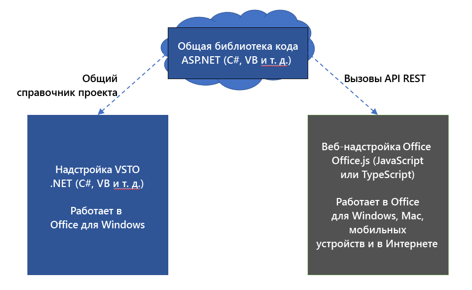
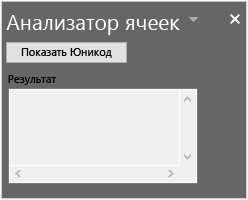

# <a name="tutorial-share-code-between-both-a-vsto-add-in-and-an-office-add-in-with-a-shared-code-library"></a><span data-ttu-id="b21b0-103">Руководство. Обмен кодом между надстройкой VSTO и надстройкой Office с помощью общей библиотеки кода</span><span class="sxs-lookup"><span data-stu-id="b21b0-103">Tutorial: Share code between both a VSTO Add-in and an Office add-in with a shared code library</span></span>

<span data-ttu-id="b21b0-104">Надстройки набора средств Visual Studio для Office (VSTO) отлично подходят для расширения возможностей Office с предоставлением решений для вашей компании и других пользователей.</span><span class="sxs-lookup"><span data-stu-id="b21b0-104">Visual Studio Tools for Office (VSTO) Add-ins are great for extending Office to provide solutions for your business or others.</span></span> <span data-ttu-id="b21b0-105">Они используются уже давно, и существуют тысячи решений, созданных с помощью VSTO.</span><span class="sxs-lookup"><span data-stu-id="b21b0-105">They've been around for a long time and there are thousands of solutions built with VSTO.</span></span> <span data-ttu-id="b21b0-106">Однако они работают только в Office для Windows.</span><span class="sxs-lookup"><span data-stu-id="b21b0-106">However, they only run on Office on Windows.</span></span> <span data-ttu-id="b21b0-107">На компьютерах Mac, мобильных платформах и в Интернете невозможно запустить надстройки VSTO.</span><span class="sxs-lookup"><span data-stu-id="b21b0-107">You can't run VSTO Add-ins on Mac, online, or mobile platforms.</span></span>

<span data-ttu-id="b21b0-108">Надстройки Office используют HTML, JavaScript и другие веб-технологии для создания решений Office для всех платформ.</span><span class="sxs-lookup"><span data-stu-id="b21b0-108">Office Add-ins use HTML, JavaScript, and additional web technologies to build Office solutions on all platforms.</span></span> <span data-ttu-id="b21b0-109">Перенос существующей надстройки VSTO в надстройку Office — это отличный способ обеспечить доступность решения на всех платформах.</span><span class="sxs-lookup"><span data-stu-id="b21b0-109">Migrating your existing VSTO Add-in to an Office add-in is a great way to make your solution available across all platforms.</span></span>

<span data-ttu-id="b21b0-110">Вам может потребоваться сохранить как надстройку VSTO, так и новую надстройку Office с одинаковыми функциями.</span><span class="sxs-lookup"><span data-stu-id="b21b0-110">You may want to maintain both your VSTO Add-in and a new Office add-in that both have the same functionality.</span></span> <span data-ttu-id="b21b0-111">Это позволяет продолжать обслуживание клиентов, использующих надстройку VSTO в Office для Windows.</span><span class="sxs-lookup"><span data-stu-id="b21b0-111">This enables you to continue servicing your customers that use the VSTO Add-in on Office on Windows.</span></span> <span data-ttu-id="b21b0-112">Кроме того, это позволяет предоставлять те же функции в надстройке Office для клиентов на любых платформах.</span><span class="sxs-lookup"><span data-stu-id="b21b0-112">This also enables you to provide the same functionality in an Office add-in for customers across all platforms.</span></span> <span data-ttu-id="b21b0-113">Вы также можете [убедиться, что надстройка Office совместима с существующей надстройкой VSTO](../develop/make-office-add-in-compatible-with-existing-com-add-in.md).</span><span class="sxs-lookup"><span data-stu-id="b21b0-113">You can also [Make your Office add-in compatible with the existing VSTO Add-in](../develop/make-office-add-in-compatible-with-existing-com-add-in.md).</span></span>

<span data-ttu-id="b21b0-114">Но лучше не переписывать весь код из надстройки VSTO для надстройки Office.</span><span class="sxs-lookup"><span data-stu-id="b21b0-114">However it is best to avoid rewriting all the code from your VSTO Add-in for the Office add-in.</span></span> <span data-ttu-id="b21b0-115">В этом руководстве показано, как избежать переписывания кода с использованием общей библиотеки кода для обеих надстроек.</span><span class="sxs-lookup"><span data-stu-id="b21b0-115">This tutorial shows how to avoid rewriting code by using a shared code library for both add-ins.</span></span>

## <a name="shared-code-library"></a><span data-ttu-id="b21b0-116">Общая библиотека кода</span><span class="sxs-lookup"><span data-stu-id="b21b0-116">Shared code library</span></span>

<span data-ttu-id="b21b0-117">В этом руководстве вы ознакомитесь с действиями по определению общего кода и обмен им между надстройкой VSTO и современной надстройкой Office.</span><span class="sxs-lookup"><span data-stu-id="b21b0-117">This tutorial will walk you through the steps of identifying and sharing common code between your VSTO Add-in and a modern Office add-in.</span></span> <span data-ttu-id="b21b0-118">В нем используется простейший пример надстройки VSTO, чтобы вы могли сосредоточиться на навыках и методах, необходимых для работы с собственными надстройками VSTO.</span><span class="sxs-lookup"><span data-stu-id="b21b0-118">It uses a very simple VSTO Add-in example for the steps so that you can focus on the skills and techniques you will need for working with your own VSTO Add-ins.</span></span>

<span data-ttu-id="b21b0-119">На следующей схеме показано, как общая библиотека кода используется для миграции.</span><span class="sxs-lookup"><span data-stu-id="b21b0-119">The following diagram shows how the shared code library works for migration.</span></span> <span data-ttu-id="b21b0-120">Распространенный код перерабатывается в новую общую библиотеку кода.</span><span class="sxs-lookup"><span data-stu-id="b21b0-120">Common code is refactored into a new shared code library.</span></span> <span data-ttu-id="b21b0-121">Код может оставаться на исходном языке, например C# или VB.</span><span class="sxs-lookup"><span data-stu-id="b21b0-121">The code can remain written in its original language, such as C# or VB.</span></span> <span data-ttu-id="b21b0-122">Это означает, что вы можете продолжить использование кода в существующей надстройке VSTO, создав ссылку на проект.</span><span class="sxs-lookup"><span data-stu-id="b21b0-122">This means you can continue using the code in the existing VSTO Add-in by creating a project reference.</span></span> <span data-ttu-id="b21b0-123">При создании надстройки Office она также будет использовать общую библиотеку кода, вызывая ее с помощью API REST.</span><span class="sxs-lookup"><span data-stu-id="b21b0-123">When you create the Office add-in, it will also use the shared code library by calling into it through REST APIs.</span></span>



<span data-ttu-id="b21b0-125">Навыки и методы, рассматриваемые в этом руководстве:</span><span class="sxs-lookup"><span data-stu-id="b21b0-125">Skills and techniques in this tutorial:</span></span>

- <span data-ttu-id="b21b0-126">Создание общей библиотеки классов путем преобразования кода в библиотеку классов .NET.</span><span class="sxs-lookup"><span data-stu-id="b21b0-126">Create a shared class library by refactoring code into a .NET class library.</span></span>
- <span data-ttu-id="b21b0-127">Создание оболочки API REST с использованием ASP.NET Core для общей библиотеки классов.</span><span class="sxs-lookup"><span data-stu-id="b21b0-127">Create a REST API wrapper using ASP.NET Core for the shared class library.</span></span>
- <span data-ttu-id="b21b0-128">Вызов API REST из надстройки Office для доступа к общему коду.</span><span class="sxs-lookup"><span data-stu-id="b21b0-128">Call the REST API from the Office add-in to access shared code.</span></span>

## <a name="prerequisites"></a><span data-ttu-id="b21b0-129">Предварительные требования</span><span class="sxs-lookup"><span data-stu-id="b21b0-129">Prerequisites</span></span>

<span data-ttu-id="b21b0-130">Чтобы настроить среду разработки:</span><span class="sxs-lookup"><span data-stu-id="b21b0-130">To set up your development environment:</span></span>

1. <span data-ttu-id="b21b0-131">Установите [Visual Studio 2019](https://visualstudio.microsoft.com/downloads/).</span><span class="sxs-lookup"><span data-stu-id="b21b0-131">Install [Visual Studio 2019](https://visualstudio.microsoft.com/downloads/).</span></span>
2. <span data-ttu-id="b21b0-132">Установите следующие рабочие нагрузки:</span><span class="sxs-lookup"><span data-stu-id="b21b0-132">Install the following workloads:</span></span>
    - <span data-ttu-id="b21b0-133">ASP.NET и веб-разработка.</span><span class="sxs-lookup"><span data-stu-id="b21b0-133">ASP.NET and web development</span></span>
    - <span data-ttu-id="b21b0-134">Кроссплатформенная разработка .NET Core.</span><span class="sxs-lookup"><span data-stu-id="b21b0-134">.NET Core cross-platform development.</span></span>
    - <span data-ttu-id="b21b0-135">Разработка для SharePoint или Office.</span><span class="sxs-lookup"><span data-stu-id="b21b0-135">Office/SharePoint development</span></span>
    - <span data-ttu-id="b21b0-136">Следующие **отдельные** компоненты.</span><span class="sxs-lookup"><span data-stu-id="b21b0-136">The following **Individual** components.</span></span>
        - <span data-ttu-id="b21b0-137">Набор средств Visual Studio для Office (VSTO).</span><span class="sxs-lookup"><span data-stu-id="b21b0-137">Visual Studio Tools for Office (VSTO).</span></span>
        - <span data-ttu-id="b21b0-138">Среда выполнения .NET Core 3.0.</span><span class="sxs-lookup"><span data-stu-id="b21b0-138">.NET Core 3.0 Runtime.</span></span>

<span data-ttu-id="b21b0-139">Кроме того, необходимо следующее:</span><span class="sxs-lookup"><span data-stu-id="b21b0-139">You also need the following:</span></span>

- <span data-ttu-id="b21b0-140">Учетная запись Office 365.</span><span class="sxs-lookup"><span data-stu-id="b21b0-140">An Office 365 account.</span></span> <span data-ttu-id="b21b0-141">Вы можете присоединиться к [программе для разработчиков Office 365](https://aka.ms/devprogramsignup), включающей бесплатную подписку на Office 365 сроком на 1 год.</span><span class="sxs-lookup"><span data-stu-id="b21b0-141">You can join the [Office 365 Developer Program](https://aka.ms/devprogramsignup) that includes a free 1 year subscription to Office 365.</span></span>
- <span data-ttu-id="b21b0-142">Клиент Microsoft Azure.</span><span class="sxs-lookup"><span data-stu-id="b21b0-142">A Microsoft Azure Tenant.</span></span> <span data-ttu-id="b21b0-143">Пробную подписку можно получить на сайте [Microsoft Azure](https://account.windowsazure.com/SignUp).</span><span class="sxs-lookup"><span data-stu-id="b21b0-143">A trial subscription can be acquired here: [Microsoft Azure](https://account.windowsazure.com/SignUp).</span></span>

## <a name="the-cell-analyzer-vsto-add-in"></a><span data-ttu-id="b21b0-144">Надстройка VSTO для анализа ячеек</span><span class="sxs-lookup"><span data-stu-id="b21b0-144">The Cell analyzer VSTO Add-in</span></span>

<span data-ttu-id="b21b0-145">В этом руководстве используется решение PnP [общей библиотеки надстройки VSTO для надстройки Office](https://github.com/OfficeDev/PnP-OfficeAddins/tree/master/Samples/VSTO-shared-code-migration).</span><span class="sxs-lookup"><span data-stu-id="b21b0-145">This tutorial uses the [VSTO Add-in shared library for Office add-in](https://github.com/OfficeDev/PnP-OfficeAddins/tree/master/Samples/VSTO-shared-code-migration) PnP solution.</span></span> <span data-ttu-id="b21b0-146">В папке **/start** содержится решение надстройки VSTO, которое нужно перенести.</span><span class="sxs-lookup"><span data-stu-id="b21b0-146">The **/start** folder contains the VSTO Add-in solution that you will migrate.</span></span> <span data-ttu-id="b21b0-147">Целью является перенос надстройки VSTO в современную надстройку Office с помощью общего кода, когда это возможно.</span><span class="sxs-lookup"><span data-stu-id="b21b0-147">Your goal is to migrate the VSTO Add-in to a modern Office add-in by sharing code when possible.</span></span>

> [!NOTE]
> <span data-ttu-id="b21b0-148">В примере используется C#, но вы можете применить представленные в этом руководстве методы для надстройки VSTO, написанной на любом языке .NET.</span><span class="sxs-lookup"><span data-stu-id="b21b0-148">The sample uses C# but you can apply the techniques in this tutorial to a VSTO Add-in written in any .NET language.</span></span>

1. <span data-ttu-id="b21b0-149">Скачайте решение PnP [общей библиотеки надстройки VSTO для надстройки Office](https://github.com/OfficeDev/PnP-OfficeAddins/tree/master/Samples/VSTO-shared-code-migration) в рабочую папку на своем компьютере.</span><span class="sxs-lookup"><span data-stu-id="b21b0-149">Download the [VSTO Add-in shared library for Office add-in](https://github.com/OfficeDev/PnP-OfficeAddins/tree/master/Samples/VSTO-shared-code-migration) PnP solution to a working folder on your computer.</span></span>
2. <span data-ttu-id="b21b0-150">Запустите Visual Studio 2019 и откройте решение **/start/Cell-Analyzer.sln**.</span><span class="sxs-lookup"><span data-stu-id="b21b0-150">Start Visual Studio 2019 and open the **/start/Cell-Analyzer.sln** solution.</span></span>
3. <span data-ttu-id="b21b0-151">В меню **Отладка** выберите команду **Начать отладку**.</span><span class="sxs-lookup"><span data-stu-id="b21b0-151">On the **Debug** menu, choose **Start Debugging**.</span></span>
3. <span data-ttu-id="b21b0-152">В **обозревателе решений** щелкните правой кнопкой мыши проект **Cell-Analyzer** и выберите пункт **Свойства**.</span><span class="sxs-lookup"><span data-stu-id="b21b0-152">In **Solution Explorer**, right-click the **Cell-Analyzer** project, and choose **Properties**.</span></span>
4. <span data-ttu-id="b21b0-153">В свойствах выберите категорию **Подписывание**.</span><span class="sxs-lookup"><span data-stu-id="b21b0-153">Choose the **Signing** category in the properties.</span></span>
5. <span data-ttu-id="b21b0-154">Установите флажок **Подписать манифесты ClickOnce** и нажмите кнопку **Создать тестовый сертификат**.</span><span class="sxs-lookup"><span data-stu-id="b21b0-154">Choose **Sign the ClickOnce manifests**, and then chose **Create Test Certificate**.</span></span>
6. <span data-ttu-id="b21b0-155">В диалоговом окне **Создание тестового сертификата** введите и подтвердите пароль.</span><span class="sxs-lookup"><span data-stu-id="b21b0-155">In the **Create Test Certificate** dialog, enter and confirm a password.</span></span> <span data-ttu-id="b21b0-156">Затем нажмите кнопку **OK**.</span><span class="sxs-lookup"><span data-stu-id="b21b0-156">Then choose **OK**.</span></span>

<span data-ttu-id="b21b0-157">Надстройка является настраиваемой областью задач для Excel.</span><span class="sxs-lookup"><span data-stu-id="b21b0-157">The add-in is a custom task pane for Excel.</span></span> <span data-ttu-id="b21b0-158">Вы можете выделить любую ячейку с текстом и нажать кнопку **Показать Юникод**.</span><span class="sxs-lookup"><span data-stu-id="b21b0-158">You can select any cell with text, and then choose the **Show Unicode** button.</span></span> <span data-ttu-id="b21b0-159">Надстройка отобразит список всех символов в тексте вместе с соответствующим номером Юникода.</span><span class="sxs-lookup"><span data-stu-id="b21b0-159">The add-in will display a list of each character in the text along with its corresponding Unicode number.</span></span>



## <a name="analyze-types-of-code-in-the-vsto-add-in"></a><span data-ttu-id="b21b0-161">Анализ типов кода в надстройке VSTO</span><span class="sxs-lookup"><span data-stu-id="b21b0-161">Analyze types of code in the VSTO Add-in</span></span>

<span data-ttu-id="b21b0-162">Первым применяемым методом является анализ надстройки, с которой можно поделиться частями кода.</span><span class="sxs-lookup"><span data-stu-id="b21b0-162">The first technique to apply is to analyze the add-in for which parts of code can be shared.</span></span> <span data-ttu-id="b21b0-163">Обычно проект разделяется на три типа кода.</span><span class="sxs-lookup"><span data-stu-id="b21b0-163">In general, project will break down into three types of code.</span></span>

### <a name="ui-code"></a><span data-ttu-id="b21b0-164">Код пользовательского интерфейса</span><span class="sxs-lookup"><span data-stu-id="b21b0-164">UI code</span></span>

<span data-ttu-id="b21b0-165">Код пользовательского интерфейса взаимодействует с пользователем.</span><span class="sxs-lookup"><span data-stu-id="b21b0-165">UI code interacts with the user.</span></span> <span data-ttu-id="b21b0-166">В VSTO код пользовательского интерфейса работает через Windows Forms.</span><span class="sxs-lookup"><span data-stu-id="b21b0-166">In VSTO UI code works through Windows Forms.</span></span> <span data-ttu-id="b21b0-167">Надстройки Office используют HTML, CSS и JavaScript для пользовательского интерфейса.</span><span class="sxs-lookup"><span data-stu-id="b21b0-167">Office Add-ins use HTML, CSS, and JavaScript for UI.</span></span> <span data-ttu-id="b21b0-168">Из-за этих различий невозможно поделиться кодом пользовательского интерфейса с надстройкой Office.</span><span class="sxs-lookup"><span data-stu-id="b21b0-168">Because of these differences you cannot share UI code to the Office add-in.</span></span> <span data-ttu-id="b21b0-169">Пользовательский интерфейс требуется воссоздать в JavaScript.</span><span class="sxs-lookup"><span data-stu-id="b21b0-169">UI will need to be recreated in JavaScript.</span></span>

### <a name="document-code"></a><span data-ttu-id="b21b0-170">Код документов</span><span class="sxs-lookup"><span data-stu-id="b21b0-170">Document code</span></span>

<span data-ttu-id="b21b0-171">В VSTO код взаимодействует с документом через объекты .NET, такие как `Microsoft.Office.Interop.Excel.Range`.</span><span class="sxs-lookup"><span data-stu-id="b21b0-171">In VSTO code interacts with the document through .NET objects such as `Microsoft.Office.Interop.Excel.Range`.</span></span> <span data-ttu-id="b21b0-172">Но надстройки Office используют библиотеку Office.js.</span><span class="sxs-lookup"><span data-stu-id="b21b0-172">But Office Add-ins use the Office.js library.</span></span> <span data-ttu-id="b21b0-173">Они похожи, но не идентичны.</span><span class="sxs-lookup"><span data-stu-id="b21b0-173">Although these are similar, they are not exactly the same.</span></span> <span data-ttu-id="b21b0-174">Таким образом, вы не сможете поделиться кодом взаимодействия с документом с надстройкой Office.</span><span class="sxs-lookup"><span data-stu-id="b21b0-174">So again, you cannot share document interaction code to the Office add-in.</span></span>

### <a name="logic-code"></a><span data-ttu-id="b21b0-175">Код логики</span><span class="sxs-lookup"><span data-stu-id="b21b0-175">Logic code</span></span>

<span data-ttu-id="b21b0-176">Бизнес-логика, алгоритмы, вспомогательные функции и аналогичный код часто являются основой надстройки VSTO.</span><span class="sxs-lookup"><span data-stu-id="b21b0-176">Business logic, algorithms, helper functions, and similar code often make up the heart of a VSTO Add-in.</span></span> <span data-ttu-id="b21b0-177">Этот код работает независимо от пользовательского интерфейса и кода документов с целью выполнения анализа, подключения к серверным службам, выполнения вычислений и т. д.</span><span class="sxs-lookup"><span data-stu-id="b21b0-177">This code works independently of the UI and document code to perform analysis, connect to backend services, run calculations, and more.</span></span> <span data-ttu-id="b21b0-178">Этим кодом можно поделиться, чтобы не переписывать его в JavaScript.</span><span class="sxs-lookup"><span data-stu-id="b21b0-178">This is the code that can be shared so that you don't have to rewrite it in JavaScript.</span></span>

<span data-ttu-id="b21b0-179">Рассмотрим надстройку VSTO.</span><span class="sxs-lookup"><span data-stu-id="b21b0-179">Let's examine the VSTO Add-in.</span></span> <span data-ttu-id="b21b0-180">В коде ниже каждый раздел определен как код ДОКУМЕНТА, ПОЛЬЗОВАТЕЛЬСКОГО ИНТЕРФЕЙСА или АЛГОРИТМА.</span><span class="sxs-lookup"><span data-stu-id="b21b0-180">In the following code, each section is identified as DOCUMENT, UI, or ALGORITHM code.</span></span>

```csharp
// *** UI CODE ***
private void btnUnicode_Click(object sender, EventArgs e)
{
    // *** DOCUMENT CODE ***
    Microsoft.Office.Interop.Excel.Range rangeCell;
    rangeCell = Globals.ThisAddIn.Application.ActiveCell;

    string cellValue = "";

    if (null != rangeCell.Value)
    {
        cellValue = rangeCell.Value.ToString();
    }

    // *** ALGORITHM CODE ***
    //convert string to Unicode listing
    string result = "";
    foreach (char c in cellValue)
    {
        int unicode = c;

        result += $"{c}: {unicode}\r\n";
    }
    
    // *** UI CODE ***
    //Output the result
    txtResult.Text = result;
}
```

<span data-ttu-id="b21b0-181">С помощью этого подхода вы можете увидеть, что один раздел кода можно предоставить для надстройки Office.</span><span class="sxs-lookup"><span data-stu-id="b21b0-181">Using this approach you can see that one section of code can be shared to the Office add-in.</span></span> <span data-ttu-id="b21b0-182">Следующий код потребуется преобразовать в отдельную библиотеку классов.</span><span class="sxs-lookup"><span data-stu-id="b21b0-182">The following code will need to be refactored into a separate class library.</span></span>

```csharp
// *** ALGORITHM CODE ***
//convert string to Unicode listing
string result = "";
foreach (char c in cellValue)
{
    int unicode = c;

    result += $"{c}: {unicode}\r\n";
}
```

## <a name="create-a-shared-class-library"></a><span data-ttu-id="b21b0-183">Создание общей библиотеки классов</span><span class="sxs-lookup"><span data-stu-id="b21b0-183">Create a shared class library</span></span>

<span data-ttu-id="b21b0-184">Надстройки VSTO создаются в Visual Studio в виде проектов .NET, поэтому мы будем по возможности использовать .NET, чтобы не усложнять процесс.</span><span class="sxs-lookup"><span data-stu-id="b21b0-184">VSTO Add-ins are created in Visual Studio as .NET projects, so we'll reuse .NET as much as possible to keep things simple.</span></span> <span data-ttu-id="b21b0-185">Наш следующий метод заключается в создании библиотеки классов и преобразовании общего кода в библиотеку классов.</span><span class="sxs-lookup"><span data-stu-id="b21b0-185">Our next technique is to create a class library and refactor shared code into that class library.</span></span>

1. <span data-ttu-id="b21b0-186">Если вы этого еще не сделали, запустите Visual Studio 2019 и откройте решение **/start/Cell-Analyzer.sln**.</span><span class="sxs-lookup"><span data-stu-id="b21b0-186">If you haven't already, start Visual Studio 2019 and open the **\start\Cell-Analyzer.sln** solution.</span></span>
2. <span data-ttu-id="b21b0-187">Щелкните решение правой кнопкой мыши в **обозревателе решений** и выберите пункты **Добавить > Создать проект**.</span><span class="sxs-lookup"><span data-stu-id="b21b0-187">Right-click the solution in **Solution Explorer** and choose **Add > New Project**.</span></span>
3. <span data-ttu-id="b21b0-188">В диалоговом окне **Добавить новый проект** выберите **Библиотека классов (.NET Framework)** и нажмите кнопку **Далее**.</span><span class="sxs-lookup"><span data-stu-id="b21b0-188">In the **Add a new project dialog**, choose **Class Library (.NET Framework)**, and choose **Next**.</span></span>
    > [!NOTE]
    > <span data-ttu-id="b21b0-189">Не используйте библиотеку классов .NET Core, так как она не будет работать с проектом VSTO.</span><span class="sxs-lookup"><span data-stu-id="b21b0-189">Don't use the .NET Core class library because it will not work with your VSTO project.</span></span>
4. <span data-ttu-id="b21b0-190">В диалоговом окне **Настроить новый проект** настройте следующие поля.</span><span class="sxs-lookup"><span data-stu-id="b21b0-190">In the **Configure your new project** dialog, set the following fields.</span></span>
    - <span data-ttu-id="b21b0-191">Укажите в поле **Имя проекта** значение **CellAnalyzerSharedLibrary**.</span><span class="sxs-lookup"><span data-stu-id="b21b0-191">Set the **Project name** to **CellAnalyzerSharedLibrary**.</span></span>
    - <span data-ttu-id="b21b0-192">Оставьте в поле **Расположение** значение по умолчанию.</span><span class="sxs-lookup"><span data-stu-id="b21b0-192">Leave the **Location** at it's default value.</span></span>
    - <span data-ttu-id="b21b0-193">Присвойте параметру **Платформа** значение **4.7.2**.</span><span class="sxs-lookup"><span data-stu-id="b21b0-193">Set the **Framework** to **4.7.2**.</span></span>
5. <span data-ttu-id="b21b0-194">Нажмите кнопку **Создать**.</span><span class="sxs-lookup"><span data-stu-id="b21b0-194">Choose **Create**.</span></span>
6. <span data-ttu-id="b21b0-195">После создания проекта измените имя файла **Class1.cs** на **CellOperations.cs**.</span><span class="sxs-lookup"><span data-stu-id="b21b0-195">After the project is created, rename the **Class1.cs** file to **CellOperations.cs**.</span></span> <span data-ttu-id="b21b0-196">Появится запрос на переименование класса.</span><span class="sxs-lookup"><span data-stu-id="b21b0-196">A prompt to rename the class appears.</span></span> <span data-ttu-id="b21b0-197">Измените имя класса, чтобы оно соответствовало имени файла.</span><span class="sxs-lookup"><span data-stu-id="b21b0-197">Rename the class name so that it matches the file name.</span></span>
7. <span data-ttu-id="b21b0-198">Добавьте следующий код в класс `CellOperations`, чтобы создать метод `GetUnicodeFromText`.</span><span class="sxs-lookup"><span data-stu-id="b21b0-198">Add the following code to the `CellOperations` class to create a method named `GetUnicodeFromText`.</span></span>

```csharp
public class CellOperations
{
    static public string GetUnicodeFromText(string value)
    {
        string result = "";
        foreach (char c in value)
        {
            int unicode = c;

            result += $"{c}: {unicode}\r\n";
        }
        return result;
    }
}
```

### <a name="use-the-shared-class-library-in-the-vsto-add-in"></a><span data-ttu-id="b21b0-199">Использование общей библиотеки классов в надстройке VSTO</span><span class="sxs-lookup"><span data-stu-id="b21b0-199">Use the shared class library in the VSTO Add-in</span></span>

<span data-ttu-id="b21b0-200">Чтобы использовать библиотеку классов, требуется обновить надстройку VSTO.</span><span class="sxs-lookup"><span data-stu-id="b21b0-200">Now you need to update the VSTO Add-in to use the class library.</span></span> <span data-ttu-id="b21b0-201">Важно, что надстройка VSTO и надстройка Office используют одну общую библиотеку классов, благодаря чему будущие исправления ошибок и возможности создаются в одном расположении.</span><span class="sxs-lookup"><span data-stu-id="b21b0-201">This is important that both the VSTO Add-in and Office add-in use the same shared class library so that future bug fixes or features are made in one location.</span></span>

1. <span data-ttu-id="b21b0-202">В **обозревателе решений** щелкните правой кнопкой мыши проект **Cell-Analyzer** и выберите пункт **Добавить ссылку**.</span><span class="sxs-lookup"><span data-stu-id="b21b0-202">In **Solution Explorer** right-click the **Cell-Analyzer** project, and choose **Add Reference**.</span></span>
2. <span data-ttu-id="b21b0-203">Выберите **CellAnalyzerSharedLibrary** и нажмите кнопку **ОК**.</span><span class="sxs-lookup"><span data-stu-id="b21b0-203">Select **CellAnalyzerSharedLibrary**, and choose **OK**.</span></span>
3. <span data-ttu-id="b21b0-204">В **обозревателе решений** разверните проект **Cell-Analyzer**, щелкните правой кнопкой мыши файл **CellAnalyzerPane.cs** и выберите пункт **Просмотреть код**.</span><span class="sxs-lookup"><span data-stu-id="b21b0-204">In **Solution Explorer** expand the **Cell-Analyzer** project, right-click the **CellAnalyzerPane.cs** file, and choose **View Code**.</span></span>
4. <span data-ttu-id="b21b0-205">В методе `btnUnicode_Click` удалите следующие строки кода.</span><span class="sxs-lookup"><span data-stu-id="b21b0-205">In the `btnUnicode_Click` method, delete the following lines of code.</span></span>
    
    ```csharp
    //Convert to Unicode listing
    string result = "";
    foreach (char c in cellValue)
    {
      int unicode = c;
      result += $"{c}: {unicode}\r\n";
    }
    ```
    
5. <span data-ttu-id="b21b0-206">Обновите строку кода под комментарием `//Output the result` следующим образом:</span><span class="sxs-lookup"><span data-stu-id="b21b0-206">Update the line of code under the `//Output the result` comment to read as follows:</span></span>
    
    ```csharp
    //Output the result
    txtResult.Text = CellAnalyzerSharedLibrary.CellOperations.GetUnicodeFromText(cellValue);
    ```
    
6. <span data-ttu-id="b21b0-207">В меню **Отладка** выберите команду **Начать отладку**.</span><span class="sxs-lookup"><span data-stu-id="b21b0-207">On the **Debug** menu, choose **Start Debugging**.</span></span> <span data-ttu-id="b21b0-208">Настраиваемая область задач должна работать правильно.</span><span class="sxs-lookup"><span data-stu-id="b21b0-208">The custom task pane should work as expected.</span></span> <span data-ttu-id="b21b0-209">Введите текст в ячейке и проверьте, можно ли преобразовать его в список Юникод в надстройке.</span><span class="sxs-lookup"><span data-stu-id="b21b0-209">Enter some text in a cell, and then test that you can convert it to a Unicode list with the add-in.</span></span>

## <a name="create-a-rest-api-wrapper"></a><span data-ttu-id="b21b0-210">Создание оболочки API REST</span><span class="sxs-lookup"><span data-stu-id="b21b0-210">Create a REST API wrapper</span></span>

<span data-ttu-id="b21b0-211">Надстройка VSTO может использовать общую библиотеку классов напрямую, так как они обе являются проектами .NET.</span><span class="sxs-lookup"><span data-stu-id="b21b0-211">The VSTO Add-in can use the shared class library directly since they are both .NET projects.</span></span> <span data-ttu-id="b21b0-212">Однако надстройка Office не сможет использовать .NET, так как она использует JavaScript.</span><span class="sxs-lookup"><span data-stu-id="b21b0-212">However the Office add-in won't be able to use .NET since it uses JavaScript.</span></span> <span data-ttu-id="b21b0-213">Затем требуется создать оболочку API REST.</span><span class="sxs-lookup"><span data-stu-id="b21b0-213">Next you will need to create a REST API wrapper.</span></span> <span data-ttu-id="b21b0-214">Это позволяет надстройке Office вызывать API REST, который затем передает вызов в общую библиотеку классов.</span><span class="sxs-lookup"><span data-stu-id="b21b0-214">This enables the Office add-in to call a REST API, which then passes the call along to the shared class library.</span></span>

1. <span data-ttu-id="b21b0-215">В **обозревателе решений** щелкните правой кнопкой мыши проект **Cell-Analyzer** и выберите **Добавить > Создать проект**.</span><span class="sxs-lookup"><span data-stu-id="b21b0-215">In **Solution Explorer**, right-click the **Cell-Analyzer** project, and choose **Add > New Project**.</span></span>
2. <span data-ttu-id="b21b0-216">В диалоговом окне **Добавить новый проект** выберите **Веб-приложение ASP.NET Core** и нажмите кнопку **Далее**.</span><span class="sxs-lookup"><span data-stu-id="b21b0-216">In the **Add a new project dialog**, choose **ASP.NET Core Web Application**, and choose **Next**.</span></span>
3. <span data-ttu-id="b21b0-217">В диалоговом окне **Настроить новый проект** настройте следующие поля:</span><span class="sxs-lookup"><span data-stu-id="b21b0-217">In the **Configure your new project** dialog, set the following fields:</span></span>
    - <span data-ttu-id="b21b0-218">Укажите в поле **Имя проекта** значение **CellAnalyzerRESTAPI**.</span><span class="sxs-lookup"><span data-stu-id="b21b0-218">Set the **Project name** to **CellAnalyzerRESTAPI**.</span></span>
    - <span data-ttu-id="b21b0-219">В поле **Расположение** оставьте значение по умолчанию.</span><span class="sxs-lookup"><span data-stu-id="b21b0-219">In the **Location** field, leave the default value.</span></span>
4. <span data-ttu-id="b21b0-220">Нажмите кнопку **Создать**.</span><span class="sxs-lookup"><span data-stu-id="b21b0-220">Choose **Create**.</span></span>
5. <span data-ttu-id="b21b0-221">В диалоговом окне **Создание веб-приложения ASP.NET Core** выберите **ASP.NET Core 3.1** для версии и выберите **API** в списке проектов.</span><span class="sxs-lookup"><span data-stu-id="b21b0-221">In the **Create a new ASP.NET Core web application** dialog, select **ASP.NET Core 3.1** for the version, and select **API** in the list of projects.</span></span>
6. <span data-ttu-id="b21b0-222">Оставьте для всех остальных полей значения по умолчанию и нажмите кнопку **Создать**.</span><span class="sxs-lookup"><span data-stu-id="b21b0-222">Leave all other fields at default values and choose the **Create** button.</span></span>
7. <span data-ttu-id="b21b0-223">После создания проекта разверните проект **CellAnalyzerRESTAPI** в **обозревателе решений**.</span><span class="sxs-lookup"><span data-stu-id="b21b0-223">After the project is created, expand the **CellAnalyzerRESTAPI** project in **Solution Explorer**.</span></span>
8. <span data-ttu-id="b21b0-224">Щелкните правой кнопкой мыши пункт **Зависимости** и выберите команду **Добавить ссылку**.</span><span class="sxs-lookup"><span data-stu-id="b21b0-224">Right-click **Dependencies**, and choose **Add Reference**.</span></span>
9. <span data-ttu-id="b21b0-225">Выберите **CellAnalyzerSharedLibrary** и нажмите кнопку **ОК**.</span><span class="sxs-lookup"><span data-stu-id="b21b0-225">Select **CellAnalyzerSharedLibrary**, and choose **OK**.</span></span>
10. <span data-ttu-id="b21b0-226">Щелкните правой кнопкой мыши папку **Контроллеры** и выберите пункты **Добавить > Контроллер**.</span><span class="sxs-lookup"><span data-stu-id="b21b0-226">Right-click the **Controllers** folder, and choose **Add > Controller**.</span></span>
11. <span data-ttu-id="b21b0-227">В диалоговом окне **Добавить новый шаблонный элемент** выберите **Контроллер API — пустой** и нажмите **Добавить**.</span><span class="sxs-lookup"><span data-stu-id="b21b0-227">In the **Add New Scaffolded Item** dialog, choose **API Controller - Empty** and then **Add**.</span></span>
12. <span data-ttu-id="b21b0-228">В диалоговом окне **Добавление пустого контроллера API** присвойте контроллеру имя **AnalyzeUnicodeController** и нажмите **Добавить**.</span><span class="sxs-lookup"><span data-stu-id="b21b0-228">In the **Add Empty API Controller** dialog, name the controller **AnalyzeUnicodeController**, and then choose **Add**.</span></span>
13. <span data-ttu-id="b21b0-229">Откройте файл **AnalyzeUnicodeController.cs** и добавьте следующий код в качестве метода для класса `AnalyzeUnicodeController`.</span><span class="sxs-lookup"><span data-stu-id="b21b0-229">Open the **AnalyzeUnicodeController.cs** file and add the following code as a method to the `AnalyzeUnicodeController` class.</span></span>
    
    ```csharp
    [HttpGet]
    public ActionResult<string> AnalyzeUnicode(string value)
    {
      if (value == null)
      {
        return BadRequest();
      }
      return CellAnalyzerSharedLibrary.CellOperations.GetUnicodeFromText(value);
    }
    ```
    
14. <span data-ttu-id="b21b0-230">Щелкните правой кнопкой мыши проект **CellAnalyzerRESTAPI** и выберите команду **Назначить автозагружаемым проектом**.</span><span class="sxs-lookup"><span data-stu-id="b21b0-230">Right-click the **CellAnalyzerRESTAPI** project, and choose **Set as Startup Project**.</span></span>
15. <span data-ttu-id="b21b0-231">В меню **Отладка** выберите команду **Начать отладку**.</span><span class="sxs-lookup"><span data-stu-id="b21b0-231">On the **Debug** menu, choose **Start Debugging**.</span></span>
16. <span data-ttu-id="b21b0-232">Запустится браузер.</span><span class="sxs-lookup"><span data-stu-id="b21b0-232">A browser will launch.</span></span> <span data-ttu-id="b21b0-233">Чтобы проверить, работает ли API REST, введите следующий URL-адрес: `https://localhost:<ssl port number>/api/analyzeunicode?value=test`.</span><span class="sxs-lookup"><span data-stu-id="b21b0-233">Enter the following URL to test that the REST API is working: `https://localhost:<ssl port number>/api/analyzeunicode?value=test`.</span></span> <span data-ttu-id="b21b0-234">Вы можете повторно использовать номер порта из URL-адреса в браузере, который запущен приложением Visual Studio.</span><span class="sxs-lookup"><span data-stu-id="b21b0-234">You can reuse the port number from the URL in the browser that Visual Studio launched.</span></span> <span data-ttu-id="b21b0-235">Должна возвратиться строка со значениями Юникода для каждого символа.</span><span class="sxs-lookup"><span data-stu-id="b21b0-235">You should see a string returned with Unicode values for each character.</span></span>

## <a name="create-the-office-add-in"></a><span data-ttu-id="b21b0-236">Создание надстройки Office</span><span class="sxs-lookup"><span data-stu-id="b21b0-236">Create the Office add-in</span></span>

<span data-ttu-id="b21b0-237">Когда вы создаете надстройку Office, она вызывает API REST.</span><span class="sxs-lookup"><span data-stu-id="b21b0-237">When you create the Office add-in, it will make a call to the REST API.</span></span> <span data-ttu-id="b21b0-238">Но сначала требуется получить номер порта сервера API REST и сохранить его для последующего использования.</span><span class="sxs-lookup"><span data-stu-id="b21b0-238">But first, you need to get the port number of the REST API server and save it for later.</span></span>

### <a name="save-the-ssl-port-number"></a><span data-ttu-id="b21b0-239">Сохранение номера порта SSL</span><span class="sxs-lookup"><span data-stu-id="b21b0-239">Save the SSL port number</span></span>

1. <span data-ttu-id="b21b0-240">Если вы этого еще не сделали, запустите Visual Studio 2019 и откройте решение **/start/Cell-Analyzer.sln**.</span><span class="sxs-lookup"><span data-stu-id="b21b0-240">If you haven't already, start Visual Studio 2019, and open the **\start\Cell-Analyzer.sln** solution.</span></span>
2. <span data-ttu-id="b21b0-241">В проекте **CellAnalyzerRESTAPI** разверните пункт **Свойства** и откройте файл **launchSettings.json**.</span><span class="sxs-lookup"><span data-stu-id="b21b0-241">In the **CellAnalyzerRESTAPI** project, expand **Properties**, and open the **launchSettings.json** file.</span></span>
3. <span data-ttu-id="b21b0-242">Найдите строку кода со значением **sslPort**, скопируйте номер порта и сохраните его в другом месте.</span><span class="sxs-lookup"><span data-stu-id="b21b0-242">Find the line of code with the **sslPort** value, copy the port number, and save it somewhere.</span></span>

### <a name="add-the-office-add-in-project"></a><span data-ttu-id="b21b0-243">Добавление проекта надстройки Office</span><span class="sxs-lookup"><span data-stu-id="b21b0-243">Add the Office add-in project</span></span>

<span data-ttu-id="b21b0-244">Для удобства храните весь код в одном решении.</span><span class="sxs-lookup"><span data-stu-id="b21b0-244">To keep things simple, keep all the code in one solution.</span></span> <span data-ttu-id="b21b0-245">Добавьте проект надстройки Office в существующее решение Visual Studio.</span><span class="sxs-lookup"><span data-stu-id="b21b0-245">Add the Office add-in project to the existing Visual Studio solution.</span></span> <span data-ttu-id="b21b0-246">Но если вы знакомы с [генератором Yeoman для надстроек Office](https://github.com/OfficeDev/generator-office) и Visual Studio Code, для создания проекта вы также можете запустить `yo office`.</span><span class="sxs-lookup"><span data-stu-id="b21b0-246">However, if you are familiar with the [Yeoman generator for Office Add-ins](https://github.com/OfficeDev/generator-office) and Visual Studio Code you can also run `yo office` to build the project.</span></span> <span data-ttu-id="b21b0-247">Действия очень похожи.</span><span class="sxs-lookup"><span data-stu-id="b21b0-247">The steps are very similar.</span></span>

1. <span data-ttu-id="b21b0-248">В **обозревателе решений** щелкните правой кнопкой мыши решение **Cell-Analyzer** и выберите **Добавить > Создать проект**.</span><span class="sxs-lookup"><span data-stu-id="b21b0-248">In **Solution Explorer**, right-click the **Cell-Analyzer** solution, and choose **Add > New Project**.</span></span>
2. <span data-ttu-id="b21b0-249">В диалоговом окне **Добавить новый проект** выберите **Веб-надстройка Excel** и нажмите кнопку **Далее**.</span><span class="sxs-lookup"><span data-stu-id="b21b0-249">In the **Add a new project dialog**, choose **Excel Web Add-in**, and choose **Next**.</span></span>
3. <span data-ttu-id="b21b0-250">В диалоговом окне **Настроить новый проект** настройте следующие поля:</span><span class="sxs-lookup"><span data-stu-id="b21b0-250">In the **Configure your new project** dialog, set the following fields:</span></span>
    - <span data-ttu-id="b21b0-251">Укажите в поле **Имя проекта** значение **CellAnalyzerOfficeAddin**.</span><span class="sxs-lookup"><span data-stu-id="b21b0-251">Set the **Project name** to **CellAnalyzerOfficeAddin**.</span></span>
    - <span data-ttu-id="b21b0-252">Оставьте в поле **Расположение** значение по умолчанию.</span><span class="sxs-lookup"><span data-stu-id="b21b0-252">Leave the **Location** at it's default value.</span></span>
    - <span data-ttu-id="b21b0-253">Присвойте параметру **Платформа** значение **4.7.2** или укажите более позднюю версию.</span><span class="sxs-lookup"><span data-stu-id="b21b0-253">Set the **Framework** to **4.7.2** or later.</span></span>
4. <span data-ttu-id="b21b0-254">Нажмите кнопку **Создать**.</span><span class="sxs-lookup"><span data-stu-id="b21b0-254">Choose **Create**.</span></span>
5. <span data-ttu-id="b21b0-255">В диалоговом окне **Выбор типа надстройки** выберите **Добавить новые функции в Excel** и нажмите **Готово**.</span><span class="sxs-lookup"><span data-stu-id="b21b0-255">In the **Choose the add-in type** dialog, select **Add new functionalities to Excel**, and choose **Finish**.</span></span>

<span data-ttu-id="b21b0-256">Будут созданы два проекта:</span><span class="sxs-lookup"><span data-stu-id="b21b0-256">Two projects will be created:</span></span>
- <span data-ttu-id="b21b0-257">**CellAnalyzerOfficeAddin**. Этот проект настраивает XML-файлы манифеста, описывающего надстройку, чтобы приложение Office могло правильно ее загрузить.</span><span class="sxs-lookup"><span data-stu-id="b21b0-257">**CellAnalyzerOfficeAddin** - This project configures the manifest XML files that describes the add-in so Office can load it correctly.</span></span> <span data-ttu-id="b21b0-258">Он содержит идентификатор, имя, описание и другие сведения о надстройке.</span><span class="sxs-lookup"><span data-stu-id="b21b0-258">It contains the ID, name, description, and other information about the add-in.</span></span>
- <span data-ttu-id="b21b0-259">**CellAnalyzerOfficeAddinWeb**. Этот проект содержит веб-ресурсы для надстройки, например HTML, CSS и скрипты.</span><span class="sxs-lookup"><span data-stu-id="b21b0-259">**CellAnalyzerOfficeAddinWeb** - This project contains web resources for your add-in, such as HTML, CSS, and scripts.</span></span> <span data-ttu-id="b21b0-260">Он также настраивает экземпляр IIS Express для размещения надстройки в виде веб-приложения.</span><span class="sxs-lookup"><span data-stu-id="b21b0-260">It also configures an IIS Express instance to host your add-in as a web application.</span></span>

### <a name="add-ui-and-functionality-to-the-office-add-in"></a><span data-ttu-id="b21b0-261">Добавление пользовательского интерфейса и функций в надстройку Office</span><span class="sxs-lookup"><span data-stu-id="b21b0-261">Add UI and functionality to the Office add-in</span></span>

1. <span data-ttu-id="b21b0-262">В **обозревателе решений** разверните проект **CellAnalyzerOfficeAddinWeb**.</span><span class="sxs-lookup"><span data-stu-id="b21b0-262">In **Solution Explorer**, expand the **CellAnalyzerOfficeAddinWeb** project.</span></span>
2. <span data-ttu-id="b21b0-263">Откройте файл **Home.html** и замените содержимое `<body>` указанным ниже HTML-кодом.</span><span class="sxs-lookup"><span data-stu-id="b21b0-263">Open the **Home.html** file, and replace the `<body>` contents with the following HTML.</span></span>
    
    ```html
    <button id="btnShowUnicode" onclick="showUnicode()">Show Unicode</button>
    <p>Result:</p>
    <div id="txtResult"></div>
    ```
    
3. <span data-ttu-id="b21b0-264">Откройте файл **Home.js** и замените все содержимое указанным ниже кодом.</span><span class="sxs-lookup"><span data-stu-id="b21b0-264">Open the **Home.js** file, and replace the entire contents with the following code.</span></span> 
    
    ```js
    (function () {
      "use strict";
      // The initialize function must be run each time a new page is loaded.
      Office.initialize = function (reason) {
        $(document).ready(function () {
        });
      };
    })();
    
    function showUnicode() {
      Excel.run(function (ctx) {
        const range = ctx.workbook.getSelectedRange();
        range.load("values");
        return ctx.sync(range).then(function (range) {
          const url = "https://localhost:<ssl port number>/api/analyzeunicode?value=" + range.values[0][0];
          $.ajax({
            type: "GET",
            url: url,
            success: function (data) {
              let htmlData = data.replace(/\r\n/g, '<br>');
              $("#txtResult").html(htmlData);
            },
            error: function (data) {
                $("#txtResult").html("error occurred in ajax call.");
            }
          });
        });
      });
    }
    ```
    
4. <span data-ttu-id="b21b0-265">В приведенном выше коде введите номер **sslPort**, сохраненный ранее из файла **launchSettings.json**.</span><span class="sxs-lookup"><span data-stu-id="b21b0-265">In the previous code, enter the **sslPort** number you saved previously from the **launchSettings.json** file.</span></span>

<span data-ttu-id="b21b0-266">В приведенном выше коде возвращаемая строка будет обрабатываться для замены возврата каретки и перевода строки на HTML-теги `<br>`.</span><span class="sxs-lookup"><span data-stu-id="b21b0-266">In the previous code the returned string will be processed to replace carriage return line feeds with `<br>` HTML tags.</span></span> <span data-ttu-id="b21b0-267">Иногда могут возникать ситуации, когда возвращаемое значение, подходящее для .NET в надстройке VSTO, потребуется изменить в надстройке Office для правильной работы.</span><span class="sxs-lookup"><span data-stu-id="b21b0-267">You may occasionally run into situations where a return value that works perfectly fine for .NET in the VSTO Add-in will need to be adjusted on the Office add-in side to work as expected.</span></span> <span data-ttu-id="b21b0-268">В этом случае API REST и общая библиотека классов отвечают только за возвращение строки.</span><span class="sxs-lookup"><span data-stu-id="b21b0-268">In this case the REST API and shared class library are only concerned with returning the string.</span></span> <span data-ttu-id="b21b0-269">За правильное форматирование возвращаемых значений для представления отвечает метод `showUnicode()`.</span><span class="sxs-lookup"><span data-stu-id="b21b0-269">The `showUnicode()` method is responsible for formatting return values correctly for presentation.</span></span>

### <a name="allow-cors-from-the-office-add-in"></a><span data-ttu-id="b21b0-270">Разрешение CORS из надстройки Office</span><span class="sxs-lookup"><span data-stu-id="b21b0-270">Allow CORS from the Office add-in</span></span>

<span data-ttu-id="b21b0-271">Библиотеке Office.js требуется CORS для исходящих вызовов, например для создаваемых из вызова `ajax` к серверу API REST.</span><span class="sxs-lookup"><span data-stu-id="b21b0-271">The Office.js library requires CORS on outgoing calls, such as the one made from the `ajax` call to the REST API server.</span></span> <span data-ttu-id="b21b0-272">Выполните следующие действия, чтобы разрешить вызовы из надстройки Office в API REST.</span><span class="sxs-lookup"><span data-stu-id="b21b0-272">Use the following steps to allow calls from the Office add-in to the REST API.</span></span>

1. <span data-ttu-id="b21b0-273">В **обозревателе решений** выберите проект **CellAnalyzerOfficeAddinWeb**.</span><span class="sxs-lookup"><span data-stu-id="b21b0-273">In **Solution Explorer**, select the **CellAnalyzerOfficeAddinWeb** project.</span></span>
2. <span data-ttu-id="b21b0-274">В меню **Вид** выберите пункт **Окно свойств** (если это окно еще не отображается).</span><span class="sxs-lookup"><span data-stu-id="b21b0-274">From the **View** menu, choose **Properties Window** (if the window is not already displayed).</span></span>
3. <span data-ttu-id="b21b0-275">В окне свойств скопируйте значение свойства **URL-адрес SSL** и сохраните его в другом месте.</span><span class="sxs-lookup"><span data-stu-id="b21b0-275">In the properties window, copy the value of the **SSL URL**, and save it somewhere.</span></span> <span data-ttu-id="b21b0-276">Это URL-адрес, который требуется разрешить в CORS.</span><span class="sxs-lookup"><span data-stu-id="b21b0-276">This is the URL that you need to allow through CORS.</span></span>
4. <span data-ttu-id="b21b0-277">В проекте **CellAnalyzerRESTAPI** откройте файл **Startup.cs**.</span><span class="sxs-lookup"><span data-stu-id="b21b0-277">In the **CellAnalyzerRESTAPI** project, open the **Startup.cs** file.</span></span>
5. <span data-ttu-id="b21b0-278">Добавьте следующий код в начале метода `ConfigureServices`.</span><span class="sxs-lookup"><span data-stu-id="b21b0-278">Add the following code to the top of the `ConfigureServices` method.</span></span> <span data-ttu-id="b21b0-279">Не забудьте подставить URL-адрес SSL, скопированный ранее для вызова `builder.WithOrigins`.</span><span class="sxs-lookup"><span data-stu-id="b21b0-279">Be sure to substitute the URL SSL you copied previously for the `builder.WithOrigins` call.</span></span>
    
    ```csharp
    services.AddCors(options =>
    {
      options.AddPolicy(MyAllowSpecificOrigins,
      builder =>
      {
        builder.WithOrigins("<your URL SSL>")
        .AllowAnyMethod()
        .AllowAnyHeader();
      });
    });
    ```
    
    > [!NOTE]
    > <span data-ttu-id="b21b0-280">Оставьте `/` в конце URL-адреса, если вы используете его в методе `builder.WithOrigins`.</span><span class="sxs-lookup"><span data-stu-id="b21b0-280">Leave the trailing `/` from the end of the URL when you use it in the `builder.WithOrigins` method.</span></span> <span data-ttu-id="b21b0-281">Он должен выглядеть примерно так: `https://localhost:44000`.</span><span class="sxs-lookup"><span data-stu-id="b21b0-281">For example, it should appear similar to `https://localhost:44000`.</span></span> <span data-ttu-id="b21b0-282">В противном случае возникнет ошибка CORS во время выполнения.</span><span class="sxs-lookup"><span data-stu-id="b21b0-282">Otherwise you will get a CORS error at runtime.</span></span>
    
6. <span data-ttu-id="b21b0-283">Добавьте в класс `Startup` следующее поле:</span><span class="sxs-lookup"><span data-stu-id="b21b0-283">Add the following field to the `Startup` class:</span></span>
    
    ```csharp
    readonly string MyAllowSpecificOrigins = "_myAllowSpecificOrigins";
    ```
    
7. <span data-ttu-id="b21b0-284">Добавьте следующий код в метод `configure` непосредственно перед строкой кода для `app.UseEndpoints`.</span><span class="sxs-lookup"><span data-stu-id="b21b0-284">Add the following code to the `configure` method just before the line of code for `app.UseEndpoints`.</span></span>
    
    ```csharp
    app.UseCors(MyAllowSpecificOrigins);
    ```

<span data-ttu-id="b21b0-285">По завершении ваш класс `Startup` должен выглядеть примерно как в следующем коде (ваш URL-адрес localhost может отличаться):</span><span class="sxs-lookup"><span data-stu-id="b21b0-285">When done, your `Startup` class should look similar to the following code (your localhost URL may be different):</span></span>

```csharp
public class Startup
{
  public Startup(IConfiguration configuration)
    {
      Configuration = configuration;
    }

    readonly string MyAllowSpecificOrigins = "_myAllowSpecificOrigins";

    public IConfiguration Configuration { get; }

    // NOTE: The following code configures CORS for the localhost:44397 port.
    // This is for development purposes. In production code you should update this to 
    // use the appropriate allowed domains.
    public void ConfigureServices(IServiceCollection services)
    {
        services.AddCors(options =>
        {
            options.AddPolicy(MyAllowSpecificOrigins,
            builder =>
            {
                builder.WithOrigins("https://localhost:44397")
                .AllowAnyMethod()
                .AllowAnyHeader();
            });
        });
        services.AddControllers();
    }

    // This method gets called by the runtime. Use this method to configure the HTTP request pipeline.
    public void Configure(IApplicationBuilder app, IWebHostEnvironment env)
    {
        if (env.IsDevelopment())
        {
            app.UseDeveloperExceptionPage();
        }
            
        app.UseHttpsRedirection();

        app.UseRouting();

        app.UseAuthorization();

        app.UseCors(MyAllowSpecificOrigins);

        app.UseEndpoints(endpoints =>
        {
            endpoints.MapControllers();
        });
    }
}
```

### <a name="run-the-add-in"></a><span data-ttu-id="b21b0-286">Запуск надстройки</span><span class="sxs-lookup"><span data-stu-id="b21b0-286">Run the add-in</span></span>

1. <span data-ttu-id="b21b0-287">В **обозревателе решений** щелкните правой кнопкой мыши верхний узел **Решение "Cell-Analyzer"** и выберите **Назначить запускаемые проекты**.</span><span class="sxs-lookup"><span data-stu-id="b21b0-287">In **Solution Explorer**, right-click the top node **Solution 'Cell-Analyzer'**, and choose **Set Startup Projects**.</span></span>
2. <span data-ttu-id="b21b0-288">В диалоговом окне **Страницы свойств решения "Cell-Analyzer"** выберите **Несколько запускаемых проектов**.</span><span class="sxs-lookup"><span data-stu-id="b21b0-288">In the **Solution 'Cell-Analyzer' Property Pages** dialog, select **Multiple startup projects**.</span></span>
3. <span data-ttu-id="b21b0-289">Присвойте свойству **Действие** значение **Запуск** для каждого из следующих проектов.</span><span class="sxs-lookup"><span data-stu-id="b21b0-289">Set the **Action** property to **Start** for each of the following projects.</span></span>
    
    - <span data-ttu-id="b21b0-290">CellAnalyzerRESTAPI</span><span class="sxs-lookup"><span data-stu-id="b21b0-290">CellAnalyzerRESTAPI</span></span>
    - <span data-ttu-id="b21b0-291">CellAnalyzerOfficeAddin</span><span class="sxs-lookup"><span data-stu-id="b21b0-291">CellAnalyzerOfficeAddin</span></span>
    - <span data-ttu-id="b21b0-292">CellAnalyzerOfficeAddinWeb</span><span class="sxs-lookup"><span data-stu-id="b21b0-292">CellAnalyzerOfficeAddinWeb</span></span>
    
4. <span data-ttu-id="b21b0-293">Нажмите кнопку **OK**.</span><span class="sxs-lookup"><span data-stu-id="b21b0-293">Choose **OK**.</span></span>
5. <span data-ttu-id="b21b0-294">В меню **Отладка** выберите команду **Начать отладку**.</span><span class="sxs-lookup"><span data-stu-id="b21b0-294">From the **Debug** menu, choose **Start Debugging**.</span></span>

<span data-ttu-id="b21b0-295">Запустится приложение Excel, которое загрузит неопубликованную надстройку Office.</span><span class="sxs-lookup"><span data-stu-id="b21b0-295">Excel will run and sideload the Office add-in.</span></span> <span data-ttu-id="b21b0-296">Вы можете проверить, правильно ли работает служба API REST localhost, введя в ячейку текстовое значение и нажав кнопку **Показать Юникод** в надстройке Office.</span><span class="sxs-lookup"><span data-stu-id="b21b0-296">You can test that the localhost REST API service is working correctly by entering a text value into a cell, and choosing the **Show Unicode** button in the Office add-in.</span></span> <span data-ttu-id="b21b0-297">Она вызовет API REST и отобразит значения Юникода для текстовых символов.</span><span class="sxs-lookup"><span data-stu-id="b21b0-297">It should call the REST API and display the unicode values for the text characters.</span></span>

## <a name="publish-to-an-azure-app-service"></a><span data-ttu-id="b21b0-298">Публикация в службе приложений Azure</span><span class="sxs-lookup"><span data-stu-id="b21b0-298">Publish to an Azure App Service</span></span>

<span data-ttu-id="b21b0-299">В конечном итоге рекомендуется опубликовать проект API REST в облаке.</span><span class="sxs-lookup"><span data-stu-id="b21b0-299">You eventually want to publish the REST API project to the cloud.</span></span> <span data-ttu-id="b21b0-300">В следующих действиях показано, как опубликовать проект **CellAnalyzerRESTAPI** в службе приложений Microsoft Azure.</span><span class="sxs-lookup"><span data-stu-id="b21b0-300">In the following steps you'll see how to publish the **CellAnalyzerRESTAPI** project to a Microsoft Azure App Service.</span></span> <span data-ttu-id="b21b0-301">Сведения о способе получения учетной записи Azure см. в разделе [Предварительные требования](#prerequisites).</span><span class="sxs-lookup"><span data-stu-id="b21b0-301">See [Prerequisites](#prerequisites) for information on how to get an Azure account.</span></span>

1. <span data-ttu-id="b21b0-302">В **обозревателе решений** щелкните правой кнопкой мыши проект **CellAnalyzerRESTAPI** и выберите пункт **Опубликовать**.</span><span class="sxs-lookup"><span data-stu-id="b21b0-302">In **Solution Explorer**, right-click the **CellAnalyzerRESTAPI** project, and choose **Publish**.</span></span>
2. <span data-ttu-id="b21b0-303">В диалоговом окне **Выберите целевой объект публикации** нажмите кнопку **Создать** и выберите вариант **Создать профиль**.</span><span class="sxs-lookup"><span data-stu-id="b21b0-303">In the **Pick a publish target** dialog, select **Create New**, and choose **Create Profile**.</span></span>
3. <span data-ttu-id="b21b0-304">В диалоговом окне **Служба приложений** выберите нужную учетную запись, если она еще не выбрана.</span><span class="sxs-lookup"><span data-stu-id="b21b0-304">In the **App Service** dialog, select the correct account, if it is not already selected.</span></span>
4. <span data-ttu-id="b21b0-305">Полям в диалоговом окне **Служба приложений** будут присвоены значения по умолчанию для вашей учетной записи.</span><span class="sxs-lookup"><span data-stu-id="b21b0-305">The fields for the **App Service** dialog will be set to defaults for your account.</span></span> <span data-ttu-id="b21b0-306">Обычно параметры по умолчанию подходят, но их можно изменить, если вы предпочитаете другие параметры.</span><span class="sxs-lookup"><span data-stu-id="b21b0-306">Generally the defaults work fine, but you can change them if you prefer different settings.</span></span>
5. <span data-ttu-id="b21b0-307">В диалоговом окне **Служба приложений** нажмите **Создать**.</span><span class="sxs-lookup"><span data-stu-id="b21b0-307">In the **App Service** dialog, choose **Create**.</span></span>
6. <span data-ttu-id="b21b0-308">На странице **Опубликовать** отобразится новый профиль.</span><span class="sxs-lookup"><span data-stu-id="b21b0-308">The new profile will be displayed in a **Publish** page.</span></span> <span data-ttu-id="b21b0-309">Нажмите кнопку **Опубликовать**, чтобы создать и развернуть код в службе приложений.</span><span class="sxs-lookup"><span data-stu-id="b21b0-309">Choose **Publish** to build and deploy the code to the App Service.</span></span>

<span data-ttu-id="b21b0-310">Теперь можно протестировать службу.</span><span class="sxs-lookup"><span data-stu-id="b21b0-310">You can now test the service.</span></span> <span data-ttu-id="b21b0-311">Откройте браузер и введите URL-адрес, непосредственно ведущий в новую службу.</span><span class="sxs-lookup"><span data-stu-id="b21b0-311">Open a browser and enter a URL that goes directly to the new service.</span></span> <span data-ttu-id="b21b0-312">Например, используйте `https://<myappservice>.azurewebsites.net/api/analyzeunicode?value=test`, где *myappservice* — уникальное имя, созданное вами для новой службы приложений.</span><span class="sxs-lookup"><span data-stu-id="b21b0-312">For example, use `https://<myappservice>.azurewebsites.net/api/analyzeunicode?value=test` where *myappservice* is the unique name you created for the new App Service.</span></span>

### <a name="use-the-azure-app-service-from-the-office-add-in"></a><span data-ttu-id="b21b0-313">Использование службы приложений Azure из надстройки Office</span><span class="sxs-lookup"><span data-stu-id="b21b0-313">Use the Azure App Service from the Office add-in</span></span>

<span data-ttu-id="b21b0-314">Завершающим этапом является обновление кода в надстройке Office, чтобы использовать службу приложений Azure, а не localhost.</span><span class="sxs-lookup"><span data-stu-id="b21b0-314">The final step is to update the code in the Office add-in to use the Azure App Service instead of localhost.</span></span>

1. <span data-ttu-id="b21b0-315">В **обозревателе решений** разверните проект **CellAnalyzerOfficeAddinWeb** и откройте файл **Home.js**.</span><span class="sxs-lookup"><span data-stu-id="b21b0-315">In **Solution Explorer**, expand the **CellAnalyzerOfficeAddinWeb** project, and open the **Home.js** file.</span></span>
2. <span data-ttu-id="b21b0-316">Измените константу `url`, чтобы использовать URL-адрес для службы приложения Azure, как показано в следующей строке кода.</span><span class="sxs-lookup"><span data-stu-id="b21b0-316">Change the `url` constant to use the URL for your Azure App Service as shown in the following line of code.</span></span> <span data-ttu-id="b21b0-317">Замените `<myappservice>` на уникальное имя, созданное вами для новой службы приложений.</span><span class="sxs-lookup"><span data-stu-id="b21b0-317">Replace `<myappservice>` with the unique name you created for the new App Service.</span></span>
    ```JavaScript
    const url = "https://<myappservice>.azurewebsites.net/api/analyzeunicode?value=" + range.values[0][0];
    ```
3. <span data-ttu-id="b21b0-318">В **обозревателе решений** щелкните правой кнопкой мыши верхний узел **Решение "Cell-Analyzer"** и выберите **Назначить запускаемые проекты**.</span><span class="sxs-lookup"><span data-stu-id="b21b0-318">In **Solution Explorer**, right-click the top node **Solution 'Cell-Analyzer'**, and choose **Set Startup Projects**.</span></span>
4. <span data-ttu-id="b21b0-319">В диалоговом окне **Страницы свойств решения "Cell-Analyzer"** выберите **Несколько запускаемых проектов**.</span><span class="sxs-lookup"><span data-stu-id="b21b0-319">In the **Solution 'Cell-Analyzer' Property Pages** dialog, select **Multiple startup projects**.</span></span>
5. <span data-ttu-id="b21b0-320">Разрешите действие **Запуск** для каждого из следующих проектов:</span><span class="sxs-lookup"><span data-stu-id="b21b0-320">Enable the **Start** action for each of the following projects:</span></span>
    - <span data-ttu-id="b21b0-321">CellAnalyzerOfficeAddinWeb</span><span class="sxs-lookup"><span data-stu-id="b21b0-321">CellAnalyzerOfficeAddinWeb</span></span>
    - <span data-ttu-id="b21b0-322">CellAnalyzerOfficeAddin</span><span class="sxs-lookup"><span data-stu-id="b21b0-322">CellAnalyzerOfficeAddin</span></span>
6. <span data-ttu-id="b21b0-323">Нажмите кнопку **OK**.</span><span class="sxs-lookup"><span data-stu-id="b21b0-323">Choose **OK**.</span></span>
7. <span data-ttu-id="b21b0-324">В меню **Отладка** выберите команду **Начать отладку**.</span><span class="sxs-lookup"><span data-stu-id="b21b0-324">From the **Debug** menu, choose **Start Debugging**.</span></span>

<span data-ttu-id="b21b0-325">Запустится приложение Excel, которое загрузит неопубликованную надстройку Office.</span><span class="sxs-lookup"><span data-stu-id="b21b0-325">Excel will run and sideload the Office add-in.</span></span> <span data-ttu-id="b21b0-326">Чтобы проверить правильность работы службы приложений, введите текстовое значение в ячейку и нажмите **Показать Юникод** в надстройке Office.</span><span class="sxs-lookup"><span data-stu-id="b21b0-326">To test that the App Service is working correctly, enter a text value into a cell, and choose **Show Unicode** in the Office add-in.</span></span> <span data-ttu-id="b21b0-327">Она должна вызвать службу и отобразить значения Юникода для текстовых символов.</span><span class="sxs-lookup"><span data-stu-id="b21b0-327">It should call the service and display the unicode values for the text characters.</span></span>

## <a name="conclusion"></a><span data-ttu-id="b21b0-328">Заключение</span><span class="sxs-lookup"><span data-stu-id="b21b0-328">Conclusion</span></span>

<span data-ttu-id="b21b0-329">В этом руководстве вы узнали, как создать надстройку Office, использующую общий код с исходной надстройкой VSTO.</span><span class="sxs-lookup"><span data-stu-id="b21b0-329">In this tutorial you learned how to create an Office add-in that uses shared code with the original VSTO add-in.</span></span> <span data-ttu-id="b21b0-330">Вы узнали, как использовать код VSTO в Office для Windows и надстройку Office в Office на других платформах.</span><span class="sxs-lookup"><span data-stu-id="b21b0-330">You learned how to maintain both VSTO code for Office on Windows, and an Office add-in for Office on other platforms.</span></span> <span data-ttu-id="b21b0-331">Вы преобразовали код C# VSTO в общую библиотеку и развернули ее для службы приложений Azure.</span><span class="sxs-lookup"><span data-stu-id="b21b0-331">You refactored VSTO C# code into a shared library and deployed it to an Azure App Service.</span></span> <span data-ttu-id="b21b0-332">Вы создали надстройку Office, использующую общую библиотеку, чтобы не требовалось переписывать код в JavaScript.</span><span class="sxs-lookup"><span data-stu-id="b21b0-332">You created an Office add-in that uses the shared library so that you don't have to rewrite the code in JavaScript.</span></span>
