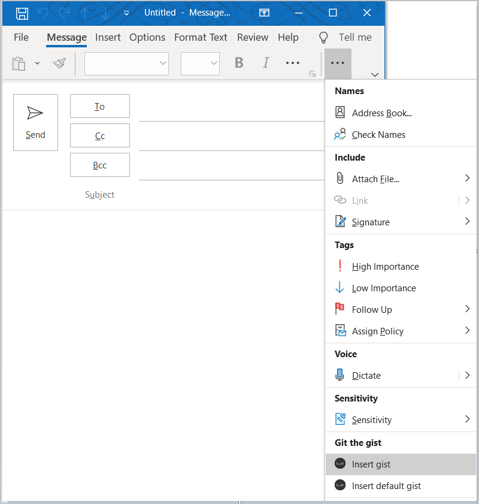

# <a name="tutorial-build-a-message-compose-outlook-add-in"></a><span data-ttu-id="796b6-103">Руководство. Сборка надстройки Outlook для создания сообщения</span><span class="sxs-lookup"><span data-stu-id="796b6-103">Tutorial: Build a message compose Outlook add-in</span></span>

<span data-ttu-id="796b6-104">В этом руководстве разъясняется, как выполнить сборку надстройки Outlook, которую можно использовать в режиме создания сообщения для вставки содержимого в его текст.</span><span class="sxs-lookup"><span data-stu-id="796b6-104">This tutorial teaches you how to build an Outlook add-in that can be used in message compose mode to insert content into the body of a message.</span></span>

<span data-ttu-id="796b6-105">В этом руководстве описан порядок выполнения перечисленных ниже задач.</span><span class="sxs-lookup"><span data-stu-id="796b6-105">In this tutorial, you will:</span></span>

> [!div class="checklist"]
> * <span data-ttu-id="796b6-106">Создание проекта надстройки Outlook</span><span class="sxs-lookup"><span data-stu-id="796b6-106">Create an Outlook add-in project</span></span>
> * <span data-ttu-id="796b6-107">Определение кнопок, отображаемых в окне создания сообщения</span><span class="sxs-lookup"><span data-stu-id="796b6-107">Define buttons that will render in the compose message window</span></span>
> * <span data-ttu-id="796b6-108">Реализация интерфейса первого запуска, который собирает сведения от пользователя и получает данные из внешней службы</span><span class="sxs-lookup"><span data-stu-id="796b6-108">Implement a first-run experience that collects information from the user and fetches data from an external service</span></span>
> * <span data-ttu-id="796b6-109">Реализация кнопки без пользовательского интерфейса, вызывающей функцию</span><span class="sxs-lookup"><span data-stu-id="796b6-109">Implement a UI-less button that invokes a function</span></span>
> * <span data-ttu-id="796b6-110">Реализация области задач, вставляющей содержимое в текст сообщения</span><span class="sxs-lookup"><span data-stu-id="796b6-110">Implement a task pane that inserts content into the body of a message</span></span>

## <a name="prerequisites"></a><span data-ttu-id="796b6-111">Необходимые компоненты</span><span class="sxs-lookup"><span data-stu-id="796b6-111">Prerequisites</span></span>

- <span data-ttu-id="796b6-112">[Node.js](https://nodejs.org/) (последняя версия [LTS](https://nodejs.org/about/releases))</span><span class="sxs-lookup"><span data-stu-id="796b6-112">[Node.js](https://nodejs.org/) (the latest [LTS](https://nodejs.org/about/releases) version)</span></span>

- <span data-ttu-id="796b6-113">Последняя версия [Yeoman](https://github.com/yeoman/yo) и [генератора Yeoman для надстроек Office](https://github.com/OfficeDev/generator-office). Выполните в командной строке указанную ниже команду, чтобы установить эти инструменты глобально.</span><span class="sxs-lookup"><span data-stu-id="796b6-113">The latest version of [Yeoman](https://github.com/yeoman/yo) and the [Yeoman generator for Office Add-ins](https://github.com/OfficeDev/generator-office). To install these tools globally, run the following command via the command prompt:</span></span>

    ```command&nbsp;line
    npm install -g yo generator-office
    ```

    > [!NOTE]
    > <span data-ttu-id="796b6-114">Даже если вы уже установили генератор Yeoman, рекомендуем обновить пакет до последней версии из npm.</span><span class="sxs-lookup"><span data-stu-id="796b6-114">Even if you've previously installed the Yeoman generator, we recommend you update your package to the latest version from npm.</span></span>

- <span data-ttu-id="796b6-115">Outlook 2016 или более поздней версии для Windows (подключенный к учетной записи Microsoft 365) или Outlook в Интернете</span><span class="sxs-lookup"><span data-stu-id="796b6-115">Outlook 2016 or later on Windows (connected to a Microsoft 365 account) or Outlook on the web</span></span>

- <span data-ttu-id="796b6-116">Учетная запись [GitHub](https://www.github.com)</span><span class="sxs-lookup"><span data-stu-id="796b6-116">A [GitHub](https://www.github.com) account</span></span>

## <a name="setup"></a><span data-ttu-id="796b6-117">Настройка</span><span class="sxs-lookup"><span data-stu-id="796b6-117">Setup</span></span>

<span data-ttu-id="796b6-118">Надстройка, создаваемая с помощью этого руководства, считывает элементы [gist](https://gist.github.com) из учетной записи GitHub пользователя и добавляет выбранные элементы gist в текст сообщения.</span><span class="sxs-lookup"><span data-stu-id="796b6-118">The add-in that you'll create in this tutorial will read [gists](https://gist.github.com) from the user's GitHub account and add the selected gist to the body of a message.</span></span> <span data-ttu-id="796b6-119">Выполните указанные ниже действия для создания двух новых элементов gist, с помощью которых можно проверить создаваемую надстройку.</span><span class="sxs-lookup"><span data-stu-id="796b6-119">Complete the following steps to create two new gists that you can use to test the add-in you're going to build.</span></span>

1. <span data-ttu-id="796b6-120">[Выполните вход в GitHub](https://github.com/login).</span><span class="sxs-lookup"><span data-stu-id="796b6-120">[Login to GitHub](https://github.com/login).</span></span>

1. <span data-ttu-id="796b6-121">[Создайте новый элемент gist](https://gist.github.com).</span><span class="sxs-lookup"><span data-stu-id="796b6-121">[Create a new gist](https://gist.github.com).</span></span>

    - <span data-ttu-id="796b6-122">В поле **Gist description...** (Описание gist) введите **Hello World Markdown**.</span><span class="sxs-lookup"><span data-stu-id="796b6-122">In the **Gist description...** field, enter **Hello World Markdown**.</span></span>

    - <span data-ttu-id="796b6-123">В поле \*\*Filename including extension... \*\* (Имя файла с расширением) введите **test.md**.</span><span class="sxs-lookup"><span data-stu-id="796b6-123">In the **Filename including extension...** field, enter **test.md**.</span></span>

    - <span data-ttu-id="796b6-124">Добавьте в многострочное текстовое поле указанную ниже разметку.</span><span class="sxs-lookup"><span data-stu-id="796b6-124">Add the following markdown to the multiline textbox:</span></span>

        ```markdown
        # Hello World

        This is content converted from Markdown!

        Here's a JSON sample:

          ```json
          {
            "foo": "bar"
          }
          ```
        ```

    - <span data-ttu-id="796b6-125">Нажмите кнопку **Create public gist** (Создать общедоступный элемент gist).</span><span class="sxs-lookup"><span data-stu-id="796b6-125">Select the **Create public gist** button.</span></span>

1. <span data-ttu-id="796b6-126">[Создайте другой элемент gist](https://gist.github.com).</span><span class="sxs-lookup"><span data-stu-id="796b6-126">[Create another new gist](https://gist.github.com).</span></span>

    - <span data-ttu-id="796b6-127">В поле **Gist description...** (Описание gist) введите **Hello World Html**.</span><span class="sxs-lookup"><span data-stu-id="796b6-127">In the **Gist description...** field, enter **Hello World Html**.</span></span>

    - <span data-ttu-id="796b6-128">В поле \*\*Filename including extension... \*\* (Имя файла с расширением) введите **test.html**.</span><span class="sxs-lookup"><span data-stu-id="796b6-128">In the **Filename including extension...** field, enter **test.html**.</span></span>

    - <span data-ttu-id="796b6-129">Добавьте в многострочное текстовое поле указанную ниже разметку.</span><span class="sxs-lookup"><span data-stu-id="796b6-129">Add the following markdown to the multiline textbox:</span></span>

        ```HTML
        <html>
          <head>
            <style>
            h1 {
              font-family: Calibri;
            }
            </style>
          </head>
          <body>
            <h1>Hello World!</h1>
            <p>This is a test</p>
          </body>
        </html>
        ```

    - <span data-ttu-id="796b6-130">Нажмите кнопку **Create public gist** (Создать общедоступный элемент gist).</span><span class="sxs-lookup"><span data-stu-id="796b6-130">Select the **Create public gist** button.</span></span>

## <a name="create-an-outlook-add-in-project"></a><span data-ttu-id="796b6-131">Создание проекта надстройки Outlook</span><span class="sxs-lookup"><span data-stu-id="796b6-131">Create an Outlook add-in project</span></span>

1. [!include[Yeoman generator create project guidance](../includes/yo-office-command-guidance.md)]

    - <span data-ttu-id="796b6-132">**Выберите тип проекта** - `Office Add-in Task Pane project`</span><span class="sxs-lookup"><span data-stu-id="796b6-132">**Choose a project type** - `Office Add-in Task Pane project`</span></span>

    - <span data-ttu-id="796b6-133">**Выберите тип сценария** - `JavaScript`</span><span class="sxs-lookup"><span data-stu-id="796b6-133">**Choose a script type** - `JavaScript`</span></span>

    - <span data-ttu-id="796b6-134">**Как вы хотите назвать надстройку?**</span><span class="sxs-lookup"><span data-stu-id="796b6-134">**What do you want to name your add-in?**</span></span> - `Git the gist`

    - <span data-ttu-id="796b6-135">**Какое клиентское приложение Office должно поддерживаться?**</span><span class="sxs-lookup"><span data-stu-id="796b6-135">**Which Office client application would you like to support?**</span></span> - `Outlook`

    
    
    <span data-ttu-id="796b6-137">После завершения работы мастера генератор создаст проект и установит вспомогательные компоненты Node.</span><span class="sxs-lookup"><span data-stu-id="796b6-137">After you complete the wizard, the generator will create the project and install supporting Node components.</span></span>

    [!include[Yeoman generator next steps](../includes/yo-office-next-steps.md)]

1. <span data-ttu-id="796b6-138">Перейдите к корневому каталогу проекта.</span><span class="sxs-lookup"><span data-stu-id="796b6-138">Navigate to the root directory of the project.</span></span>

    ```command&nbsp;line
    cd "Git the gist"
    ```

1. <span data-ttu-id="796b6-139">Эта надстройка будет использовать следующие библиотеки:</span><span class="sxs-lookup"><span data-stu-id="796b6-139">This add-in will use the following libraries:</span></span>

    - <span data-ttu-id="796b6-140">Библиотека [Showdown](https://github.com/showdownjs/showdown) для преобразования Markdown в HTML</span><span class="sxs-lookup"><span data-stu-id="796b6-140">[Showdown](https://github.com/showdownjs/showdown) library to convert Markdown to HTML</span></span>
    - <span data-ttu-id="796b6-141">Библиотека [URI.js](https://github.com/medialize/URI.js) для создания относительных URL-адресов.</span><span class="sxs-lookup"><span data-stu-id="796b6-141">[URI.js](https://github.com/medialize/URI.js) library to build relative URLs.</span></span>
    - <span data-ttu-id="796b6-142">Библиотеки [jquery](https://jquery.com/) для упрощения взаимодействий DOM.</span><span class="sxs-lookup"><span data-stu-id="796b6-142">[jquery](https://jquery.com/) library to simplify DOM interactions.</span></span>

     <span data-ttu-id="796b6-143">Чтобы установить эти инструменты для своего проекта, выполните в корневом каталоге проекта указанную ниже команду.</span><span class="sxs-lookup"><span data-stu-id="796b6-143">To install these tools for your project, run the following command in the root directory of the project:</span></span>

    ```command&nbsp;line
    npm install showdown urijs jquery --save
    ```

### <a name="update-the-manifest"></a><span data-ttu-id="796b6-144">Обновление манифеста</span><span class="sxs-lookup"><span data-stu-id="796b6-144">Update the manifest</span></span>

<span data-ttu-id="796b6-145">Манифест надстройки управляет ее отображением в Outlook.</span><span class="sxs-lookup"><span data-stu-id="796b6-145">The manifest for an add-in controls how it appears in Outlook.</span></span> <span data-ttu-id="796b6-146">Он определяет, как надстройка отображается в списке, а также задает кнопки на ленте и URL-адреса файлов HTML и JavaScript, используемых надстройкой.</span><span class="sxs-lookup"><span data-stu-id="796b6-146">It defines the way the add-in appears in the add-in list and the buttons that appear on the ribbon, and it sets the URLs for the HTML and JavaScript files used by the add-in.</span></span>

#### <a name="specify-basic-information"></a><span data-ttu-id="796b6-147">Указание основных сведений</span><span class="sxs-lookup"><span data-stu-id="796b6-147">Specify basic information</span></span>

<span data-ttu-id="796b6-148">Внесите следующие изменения в файле **manifest.xml**, чтобы указать некоторые основные сведения о надстройке.</span><span class="sxs-lookup"><span data-stu-id="796b6-148">Make the following updates in the **manifest.xml** file to specify some basic information about the add-in:</span></span>

1. <span data-ttu-id="796b6-149">Найдите элемент `ProviderName` и замените значение по умолчанию на название вашей компании.</span><span class="sxs-lookup"><span data-stu-id="796b6-149">Locate the `ProviderName` element and replace the default value with your company name.</span></span>

    ```xml
    <ProviderName>Contoso</ProviderName>
    ```
1. <span data-ttu-id="796b6-150">Найдите элемент `Description`, замените значение по умолчанию на описание надстройки и сохраните файл.</span><span class="sxs-lookup"><span data-stu-id="796b6-150">Locate the `Description` element, replace the default value with a description of the add-in, and save the file.</span></span>

    ```xml
    <Description DefaultValue="Allows users to access their GitHub gists."/>
    ```

#### <a name="test-the-generated-add-in"></a><span data-ttu-id="796b6-151">Тестирование созданной надстройки</span><span class="sxs-lookup"><span data-stu-id="796b6-151">Test the generated add-in</span></span>

<span data-ttu-id="796b6-152">Прежде чем продолжить, протестируйте базовую надстройку, созданную генератором, чтобы подтвердить правильную настройку проекта.</span><span class="sxs-lookup"><span data-stu-id="796b6-152">Before going any further, let's test the basic add-in that the generator created to confirm that the project is set up correctly.</span></span>

> [!NOTE]
> <span data-ttu-id="796b6-153">Надстройки Office должны использовать HTTPS, а не HTTP, даже в случае разработки.</span><span class="sxs-lookup"><span data-stu-id="796b6-153">Office Add-ins should use HTTPS, not HTTP, even when you are developing.</span></span> <span data-ttu-id="796b6-154">Если вам будет предложено установить сертификат после того, как вы запустите указанную ниже команду, примите предложение установить сертификат, предоставленный генератором Yeoman.</span><span class="sxs-lookup"><span data-stu-id="796b6-154">If you are prompted to install a certificate after you run the following command, accept the prompt to install the certificate that the Yeoman generator provides.</span></span> <span data-ttu-id="796b6-155">Кроме того, вам может потребоваться запустить командную строку или терминал с правами администратора, чтобы внести изменения.</span><span class="sxs-lookup"><span data-stu-id="796b6-155">You may also have to run your command prompt or terminal as an administrator for the changes to be made.</span></span>

1. <span data-ttu-id="796b6-156">Выполните следующую команду в корневом каталоге своего проекта.</span><span class="sxs-lookup"><span data-stu-id="796b6-156">Run the following command in the root directory of your project.</span></span> <span data-ttu-id="796b6-157">После выполнения этой команды запустится локальный веб-сервер (если он еще не запущен).</span><span class="sxs-lookup"><span data-stu-id="796b6-157">When you run this command, the local web server will start (if it's not already running).</span></span>

    ```command&nbsp;line
    npm run dev-server
    ```

1. <span data-ttu-id="796b6-158">Выполните инструкции, приведенные в статье [Загрузка неопубликованных надстроек Outlook для тестирования](../outlook/sideload-outlook-add-ins-for-testing.md), чтобы загрузить неопубликованный файл **manifest.xml**, находящийся в корневом каталоге проекта.</span><span class="sxs-lookup"><span data-stu-id="796b6-158">Follow the instructions in [Sideload Outlook add-ins for testing](../outlook/sideload-outlook-add-ins-for-testing.md) to sideload the **manifest.xml** file that's located in the root directory of the project.</span></span>

1. <span data-ttu-id="796b6-159">Откройте в Outlook существующее сообщение и нажмите кнопку **Показать область задач**.</span><span class="sxs-lookup"><span data-stu-id="796b6-159">In Outlook, open an existing message and select the **Show Taskpane** button.</span></span> <span data-ttu-id="796b6-160">Если настройка выполнена правильно, откроется область задач и отобразится страница приветствия надстройки.</span><span class="sxs-lookup"><span data-stu-id="796b6-160">If everything's been set up correctly, the task pane will open and render the add-in's welcome page.</span></span>

    

## <a name="define-buttons"></a><span data-ttu-id="796b6-162">Определение кнопок</span><span class="sxs-lookup"><span data-stu-id="796b6-162">Define buttons</span></span>

<span data-ttu-id="796b6-163">После проверки работы базовой надстройки можно ее настроить для добавления функций.</span><span class="sxs-lookup"><span data-stu-id="796b6-163">Now that you've verified the base add-in works, you can customize it to add more functionality.</span></span> <span data-ttu-id="796b6-164">По умолчанию манифест определяет только кнопки для окна чтения сообщения.</span><span class="sxs-lookup"><span data-stu-id="796b6-164">By default, the manifest only defines buttons for the read message window.</span></span> <span data-ttu-id="796b6-165">Можно обновить манифест, чтобы удалить кнопки из окна чтения сообщения и определить две новые кнопки для окна создания сообщения:</span><span class="sxs-lookup"><span data-stu-id="796b6-165">Let's update the manifest to remove the buttons from the read message window and define two new buttons for the compose message window:</span></span>

- <span data-ttu-id="796b6-166">**Insert gist** (Вставить gist): кнопка, открывающая область задач</span><span class="sxs-lookup"><span data-stu-id="796b6-166">**Insert gist**: a button that opens a task pane</span></span>

- <span data-ttu-id="796b6-167">**Insert default gist** (Вставить gist по умолчанию): кнопка, вызывающая функцию</span><span class="sxs-lookup"><span data-stu-id="796b6-167">**Insert default gist**: a button that invokes a function</span></span>

### <a name="remove-the-messagereadcommandsurface-extension-point"></a><span data-ttu-id="796b6-168">Удаление точки расширения MessageReadCommandSurface</span><span class="sxs-lookup"><span data-stu-id="796b6-168">Remove the MessageReadCommandSurface extension point</span></span>

<span data-ttu-id="796b6-169">Откройте файл **manifest.xml** и найдите элемент `ExtensionPoint` с типом `MessageReadCommandSurface`.</span><span class="sxs-lookup"><span data-stu-id="796b6-169">Open the **manifest.xml** file and locate the `ExtensionPoint` element with type `MessageReadCommandSurface`.</span></span> <span data-ttu-id="796b6-170">Удалите этот элемент `ExtensionPoint` (включая его закрывающий тег), чтобы удалить кнопки из окна чтения сообщения.</span><span class="sxs-lookup"><span data-stu-id="796b6-170">Delete this `ExtensionPoint` element (including its closing tag) to remove the buttons from the read message window.</span></span>

### <a name="add-the-messagecomposecommandsurface-extension-point"></a><span data-ttu-id="796b6-171">Добавление точки расширения MessageComposeCommandSurface</span><span class="sxs-lookup"><span data-stu-id="796b6-171">Add the MessageComposeCommandSurface extension point</span></span>

<span data-ttu-id="796b6-172">Найдите в манифесте строку `</DesktopFormFactor>`.</span><span class="sxs-lookup"><span data-stu-id="796b6-172">Locate the line in the manifest that reads `</DesktopFormFactor>`.</span></span> <span data-ttu-id="796b6-173">Непосредственно перед ней вставьте приведенную ниже разметку XML.</span><span class="sxs-lookup"><span data-stu-id="796b6-173">Immediately before this line, insert the following XML markup.</span></span> <span data-ttu-id="796b6-174">Обратите внимание на указанные ниже особенности этой разметки.</span><span class="sxs-lookup"><span data-stu-id="796b6-174">Note the following about this markup:</span></span>

- <span data-ttu-id="796b6-175">`ExtensionPoint` с `xsi:type="MessageComposeCommandSurface"` означает, что вы определяете кнопки для добавления окна составления сообщений.</span><span class="sxs-lookup"><span data-stu-id="796b6-175">The `ExtensionPoint` with `xsi:type="MessageComposeCommandSurface"` indicates that you're defining buttons to add to the compose message window.</span></span>

- <span data-ttu-id="796b6-176">С помощью элемента `OfficeTab` с параметром `id="TabDefault"` вы указываете, что нужно добавить кнопки на вкладку ленты по умолчанию.</span><span class="sxs-lookup"><span data-stu-id="796b6-176">By using an `OfficeTab` element with `id="TabDefault"`, you're indicating you want to add the buttons to the default tab on the ribbon.</span></span>

- <span data-ttu-id="796b6-177">Элемент `Group` определяет группу новых кнопок, а ресурс `groupLabel` задает подпись группы.</span><span class="sxs-lookup"><span data-stu-id="796b6-177">The `Group` element defines the grouping for the new buttons, with a label set by the `groupLabel` resource.</span></span>

- <span data-ttu-id="796b6-178">Первый элемент `Control` содержит элемент `Action` с параметром `xsi:type="ShowTaskPane"`, поэтому эта кнопка открывает область задач.</span><span class="sxs-lookup"><span data-stu-id="796b6-178">The first `Control` element contains an `Action` element with `xsi:type="ShowTaskPane"`, so this button opens a task pane.</span></span>

- <span data-ttu-id="796b6-179">Второй элемент `Control` содержит элемент `Action` с параметром `xsi:type="ExecuteFunction"`, поэтому кнопка вызывает функцию JavaScript, содержащуюся в файле функций.</span><span class="sxs-lookup"><span data-stu-id="796b6-179">The second `Control` element contains an `Action` element with `xsi:type="ExecuteFunction"`, so this button invokes a JavaScript function contained in the function file.</span></span>

```xml
<!-- Message Compose -->
<ExtensionPoint xsi:type="MessageComposeCommandSurface">
  <OfficeTab id="TabDefault">
    <Group id="msgComposeCmdGroup">
      <Label resid="GroupLabel"/>
      <Control xsi:type="Button" id="msgComposeInsertGist">
        <Label resid="TaskpaneButton.Label"/>
        <Supertip>
          <Title resid="TaskpaneButton.Title"/>
          <Description resid="TaskpaneButton.Tooltip"/>
        </Supertip>
        <Icon>
          <bt:Image size="16" resid="Icon.16x16"/>
          <bt:Image size="32" resid="Icon.32x32"/>
          <bt:Image size="80" resid="Icon.80x80"/>
        </Icon>
        <Action xsi:type="ShowTaskpane">
          <SourceLocation resid="Taskpane.Url"/>
        </Action>
      </Control>
      <Control xsi:type="Button" id="msgComposeInsertDefaultGist">
        <Label resid="FunctionButton.Label"/>
        <Supertip>
          <Title resid="FunctionButton.Title"/>
          <Description resid="FunctionButton.Tooltip"/>
        </Supertip>
        <Icon>
          <bt:Image size="16" resid="Icon.16x16"/>
          <bt:Image size="32" resid="Icon.32x32"/>
          <bt:Image size="80" resid="Icon.80x80"/>
        </Icon>
        <Action xsi:type="ExecuteFunction">
          <FunctionName>insertDefaultGist</FunctionName>
        </Action>
      </Control>
    </Group>
  </OfficeTab>
</ExtensionPoint>
```

### <a name="update-resources-in-the-manifest"></a><span data-ttu-id="796b6-180">Обновление ресурсов в манифесте</span><span class="sxs-lookup"><span data-stu-id="796b6-180">Update resources in the manifest</span></span>

<span data-ttu-id="796b6-181">Приведенный выше код ссылается на подписи, подсказки и URL-адреса, которые необходимо определить, чтобы манифест был действительным.</span><span class="sxs-lookup"><span data-stu-id="796b6-181">The previous code references labels, tooltips, and URLs that you need to define before the manifest will be valid.</span></span> <span data-ttu-id="796b6-182">Вам нужно указать эту информацию в разделе `Resources` манифеста.</span><span class="sxs-lookup"><span data-stu-id="796b6-182">You'll specify this information in the `Resources` section of the manifest.</span></span>

1. <span data-ttu-id="796b6-183">Найдите элемент `Resources` в файле манифеста и удалите весь элемент (включая его закрывающий тег).</span><span class="sxs-lookup"><span data-stu-id="796b6-183">Locate the `Resources` element in the manifest file and delete the entire element (including its closing tag).</span></span>

1. <span data-ttu-id="796b6-184">Добавьте в том же местоположении следующую разметку, чтобы заменить только что удаленный элемент `Resources`:</span><span class="sxs-lookup"><span data-stu-id="796b6-184">In that same location, add the following markup to replace the `Resources` element you just removed:</span></span>

    ```xml
    <Resources>
      <bt:Images>
        <bt:Image id="Icon.16x16" DefaultValue="https://localhost:3000/assets/icon-16.png"/>
        <bt:Image id="Icon.32x32" DefaultValue="https://localhost:3000/assets/icon-32.png"/>
        <bt:Image id="Icon.80x80" DefaultValue="https://localhost:3000/assets/icon-80.png"/>
      </bt:Images>
      <bt:Urls>
        <bt:Url id="Commands.Url" DefaultValue="https://localhost:3000/commands.html"/>
        <bt:Url id="Taskpane.Url" DefaultValue="https://localhost:3000/taskpane.html"/>
      </bt:Urls>
      <bt:ShortStrings>
        <bt:String id="GroupLabel" DefaultValue="Git the gist"/>
        <bt:String id="TaskpaneButton.Label" DefaultValue="Insert gist"/>
        <bt:String id="TaskpaneButton.Title" DefaultValue="Insert gist"/>
        <bt:String id="FunctionButton.Label" DefaultValue="Insert default gist"/>
        <bt:String id="FunctionButton.Title" DefaultValue="Insert default gist"/>
      </bt:ShortStrings>
      <bt:LongStrings>
        <bt:String id="TaskpaneButton.Tooltip" DefaultValue="Displays a list of your gists and allows you to insert their contents into the current message."/>
        <bt:String id="FunctionButton.Tooltip" DefaultValue="Inserts the content of the gist you mark as default into the current message."/>
      </bt:LongStrings>
    </Resources>
    ```

1. <span data-ttu-id="796b6-185">Сохраните изменения манифеста.</span><span class="sxs-lookup"><span data-stu-id="796b6-185">Save your changes to the manifest.</span></span>

### <a name="reinstall-the-add-in"></a><span data-ttu-id="796b6-186">Переустановка надстройки</span><span class="sxs-lookup"><span data-stu-id="796b6-186">Reinstall the add-in</span></span>

<span data-ttu-id="796b6-187">Так как вы ранее установили надстройку из файла, необходимо переустановить ее, чтобы изменения манифеста вступили в силу.</span><span class="sxs-lookup"><span data-stu-id="796b6-187">Since you previously installed the add-in from a file, you must reinstall it in order for the manifest changes to take effect.</span></span>

1. <span data-ttu-id="796b6-188">Следуйте инструкциям в статье [Загрузка неопубликованных надстроек Outlook для тестирования](../outlook/sideload-outlook-add-ins-for-testing.md), чтобы найти раздел **Пользовательские надстройки** в нижней части диалогового окна **Мои надстройки**.</span><span class="sxs-lookup"><span data-stu-id="796b6-188">Follow the instructions in [Sideload Outlook add-ins for testing](../outlook/sideload-outlook-add-ins-for-testing.md) to locate the **Custom add-ins** section at the bottom of the **My add-ins** dialog box.</span></span>

1. <span data-ttu-id="796b6-189">Нажмите кнопку **...** рядом с пунктом **Git the gist**, а затем выберите **Удалить**.</span><span class="sxs-lookup"><span data-stu-id="796b6-189">Select the **...** button next to the **Git the gist** entry and then choose **Remove**.</span></span>

1. <span data-ttu-id="796b6-190">Закройте окно **Мои надстройки**.</span><span class="sxs-lookup"><span data-stu-id="796b6-190">Close the **My add-ins** window.</span></span>

1. <span data-ttu-id="796b6-191">Пользовательская кнопка должна моментально исчезнуть с ленты.</span><span class="sxs-lookup"><span data-stu-id="796b6-191">The custom button should disappear from the ribbon momentarily.</span></span>

1. <span data-ttu-id="796b6-192">Следуйте инструкциям в статье [Загрузка неопубликованных надстроек Outlook для тестирования](../outlook/sideload-outlook-add-ins-for-testing.md), чтобы переустановить надстройку с помощью обновленного файла **manifest.xml**.</span><span class="sxs-lookup"><span data-stu-id="796b6-192">Follow the instructions in [Sideload Outlook add-ins for testing](../outlook/sideload-outlook-add-ins-for-testing.md) to reinstall the add-in using the updated **manifest.xml** file.</span></span>

<span data-ttu-id="796b6-193">После повторной установки надстройки можно убедиться, что она установлена успешно, проверив команды **Insert gist** и **Insert default gist** в окне составления сообщений.</span><span class="sxs-lookup"><span data-stu-id="796b6-193">After you've reinstalled the add-in, you can verify that it installed successfully by checking for the commands **Insert gist** and **Insert default gist** in a compose message window.</span></span> <span data-ttu-id="796b6-194">Обратите внимание, что при выборе этих двух элементов ничего не происходит, так как вы еще не закончили создание этой надстройки.</span><span class="sxs-lookup"><span data-stu-id="796b6-194">Note that nothing will happen if you select either of these items, because you haven't yet finished building this add-in.</span></span>

- <span data-ttu-id="796b6-195">При запуске этой надстройки в Outlook 2016 или более поздней версии для Windows отобразятся две новые кнопки на ленте окна составления сообщений: **Insert gist** и **Insert default gist**.</span><span class="sxs-lookup"><span data-stu-id="796b6-195">If you're running this add-in in Outlook 2016 or later on Windows, you should see two new buttons in the ribbon of the compose message window: **Insert gist** and **Insert default gist**.</span></span>

    

- <span data-ttu-id="796b6-197">При запуске этой надстройки в Outlook в Интернете отобразится новая кнопка внизу окна составления сообщений.</span><span class="sxs-lookup"><span data-stu-id="796b6-197">If you're running this add-in in Outlook on the web, you should see a new button at the bottom of the compose message window.</span></span> <span data-ttu-id="796b6-198">Нажмите эту кнопку, чтобы просмотреть варианты **Insert gist** (Вставить gist) и **Insert default gist** (Вставить gist по умолчанию).</span><span class="sxs-lookup"><span data-stu-id="796b6-198">Select that button to see the options **Insert gist** and **Insert default gist**.</span></span>

    

## <a name="implement-a-first-run-experience"></a><span data-ttu-id="796b6-200">Реализация интерфейса первого запуска</span><span class="sxs-lookup"><span data-stu-id="796b6-200">Implement a first-run experience</span></span>

<span data-ttu-id="796b6-201">Эта надстройка должна иметь возможность считывать элементы gist из учетной записи GitHub пользователя и определять, какой из них пользователь выбрал в качестве используемого по умолчанию.</span><span class="sxs-lookup"><span data-stu-id="796b6-201">This add-in needs to be able to read gists from the user's GitHub account and identify which one the user has chosen as the default gist.</span></span> <span data-ttu-id="796b6-202">Для выполнения этих целей надстройка должна предложить пользователю указать его имя пользователя GitHub и выбрать элемент gist в качестве используемого по умолчанию из его коллекции существующих элементов gist.</span><span class="sxs-lookup"><span data-stu-id="796b6-202">In order to achieve these goals, the add-in must prompt the user to provide their GitHub username and choose a default gist from their collection of existing gists.</span></span> <span data-ttu-id="796b6-203">Выполните действия, описанные в этом разделе, чтобы реализовать интерфейс первого запуска, отображающий диалоговое окно для получения этих сведений от пользователя.</span><span class="sxs-lookup"><span data-stu-id="796b6-203">Complete the steps in this section to implement a first-run experience that will display a dialog to collect this information from the user.</span></span>

### <a name="collect-data-from-the-user"></a><span data-ttu-id="796b6-204">Получение данных от пользователя</span><span class="sxs-lookup"><span data-stu-id="796b6-204">Collect data from the user</span></span>

<span data-ttu-id="796b6-205">Начнем с создания пользовательского интерфейса для самого диалогового окна.</span><span class="sxs-lookup"><span data-stu-id="796b6-205">Let's start by creating the UI for the dialog itself.</span></span> <span data-ttu-id="796b6-206">Создайте в папке **./src** новую подпапку с именем **settings**.</span><span class="sxs-lookup"><span data-stu-id="796b6-206">Within the **./src** folder, create a new subfolder named **settings**.</span></span> <span data-ttu-id="796b6-207">Создайте в папке **./src/settings** файл с именем **dialog.html** и добавьте следующую разметку, чтобы определить базовую форму с вводом текста для имени пользователя GitHub, а также пустой список элементов gist, который будет заполнен с помощью JavaScript.</span><span class="sxs-lookup"><span data-stu-id="796b6-207">In the **./src/settings** folder, create a file named **dialog.html**, and add the following markup to define a very basic form with a text input for a GitHub username and an empty list for gists that'll be populated via JavaScript.</span></span>

```html
<!DOCTYPE html>
<html>

<head>
  <meta charset="UTF-8" />
  <meta http-equiv="X-UA-Compatible" content="IE=Edge" />
  <title>Settings</title>

  <!-- Office JavaScript API -->
  <script type="text/javascript" src="https://appsforoffice.microsoft.com/lib/1.1/hosted/office.js"></script>

  <!-- For more information on Office UI Fabric, visit https://developer.microsoft.com/fabric. -->
  <link rel="stylesheet" href="https://static2.sharepointonline.com/files/fabric/office-ui-fabric-core/9.6.1/css/fabric.min.css"/>

  <!-- Template styles -->
  <link href="dialog.css" rel="stylesheet" type="text/css" />
</head>

<body class="ms-font-l">
  <main>
    <section class="ms-font-m ms-fontColor-neutralPrimary">
      <div class="not-configured-warning ms-MessageBar ms-MessageBar--warning">
        <div class="ms-MessageBar-content">
          <div class="ms-MessageBar-icon">
            <i class="ms-Icon ms-Icon--Info"></i>
          </div>
          <div class="ms-MessageBar-text">
            Oops! It looks like you haven't configured <strong>Git the gist</strong> yet.
            <br/>
            Please configure your GitHub username and select a default gist, then try that action again!
          </div>
        </div>
      </div>
      <div class="ms-font-xxl">Settings</div>
      <div class="ms-Grid">
        <div class="ms-Grid-row">
          <div class="ms-TextField">
            <label class="ms-Label">GitHub Username</label>
            <input class="ms-TextField-field" id="github-user" type="text" value="" placeholder="Please enter your GitHub username">
          </div>
        </div>
        <div class="error-display ms-Grid-row">
          <div class="ms-font-l ms-fontWeight-semibold">An error occurred:</div>
          <pre><code id="error-text"></code></pre>
        </div>
        <div class="gist-list-container ms-Grid-row">
          <div class="list-title ms-font-xl ms-fontWeight-regular">Choose Default Gist</div>
          <form>
            <div id="gist-list">
            </div>
          </form>
        </div>
      </div>
      <div class="ms-Dialog-actions">
        <div class="ms-Dialog-actionsRight">
          <button class="ms-Dialog-action ms-Button ms-Button--primary" id="settings-done" disabled>
            <span class="ms-Button-label">Done</span>
          </button>
        </div>
      </div>
    </section>
  </main>
  <script type="text/javascript" src="../../node_modules/core-js/client/core.js"></script>
  <script type="text/javascript" src="../../node_modules/jquery/dist/jquery.js"></script>
  <script type="text/javascript" src="../helpers/gist-api.js"></script>
  <script type="text/javascript" src="dialog.js"></script>
</body>

</html>
```

<span data-ttu-id="796b6-208">Затем создайте в папке **./src/settings** файл с именем **dialog.css** и добавьте приведенный ниже код, чтобы указать стили, используемые файлом **dialog.html**.</span><span class="sxs-lookup"><span data-stu-id="796b6-208">Next, create a file in the **./src/settings** folder named **dialog.css**, and add the following code to specify the styles that are used by **dialog.html**.</span></span>

```CSS
section {
  margin: 10px 20px;
}

.not-configured-warning {
  display: none;
}

.error-display {
  display: none;
}

.gist-list-container {
  margin: 10px -8px;
  display: none;
}

.list-title {
  border-bottom: 1px solid #a6a6a6;
  padding-bottom: 5px;
}

ul {
  margin-top: 10px;
}

.ms-ListItem-secondaryText,
.ms-ListItem-tertiaryText {
  padding-left: 15px;
}
```

<span data-ttu-id="796b6-209">Теперь, после определения пользовательского интерфейса диалогового окна, можно написать код для выполнения в нем действий.</span><span class="sxs-lookup"><span data-stu-id="796b6-209">Now that you've defined the dialog UI, you can write the code that makes it actually do something.</span></span> <span data-ttu-id="796b6-210">Создайте в папке **./src/settings** файл с именем **dialog.js** и добавьте приведенный ниже код.</span><span class="sxs-lookup"><span data-stu-id="796b6-210">Create a file in the **./src/settings** folder named **dialog.js** and add the following code.</span></span> <span data-ttu-id="796b6-211">Обратите внимание, что в этом коде используется jQuery для регистрации событий, а также функция `messageParent` для возвращения выбранных пользователем параметров вызывающей стороне.</span><span class="sxs-lookup"><span data-stu-id="796b6-211">Note that this code uses jQuery to register events and uses the `messageParent` function to send the user's choices back to the caller.</span></span>

```js
(function(){
  'use strict';

  // The Office initialize function must be run each time a new page is loaded.
  Office.initialize = function(reason){
    jQuery(document).ready(function(){
      if (window.location.search) {
        // Check if warning should be displayed.
        var warn = getParameterByName('warn');
        if (warn) {
          $('.not-configured-warning').show();
        } else {
          // See if the config values were passed.
          // If so, pre-populate the values.
          var user = getParameterByName('gitHubUserName');
          var gistId = getParameterByName('defaultGistId');

          $('#github-user').val(user);
          loadGists(user, function(success){
            if (success) {
              $('.ms-ListItem').removeClass('is-selected');
              $('input').filter(function() {
                return this.value === gistId;
              }).addClass('is-selected').attr('checked', 'checked');
              $('#settings-done').removeAttr('disabled');
            }
          });
        }
      }

      // When the GitHub username changes,
      // try to load gists.
      $('#github-user').on('change', function(){
        $('#gist-list').empty();
        var ghUser = $('#github-user').val();
        if (ghUser.length > 0) {
          loadGists(ghUser);
        }
      });

      // When the Done button is selected, send the
      // values back to the caller as a serialized
      // object.
      $('#settings-done').on('click', function() {
        var settings = {};

        settings.gitHubUserName = $('#github-user').val();

        var selectedGist = $('.ms-ListItem.is-selected');
        if (selectedGist) {
          settings.defaultGistId = selectedGist.val();

          sendMessage(JSON.stringify(settings));
        }
      });
    });
  };

  // Load gists for the user using the GitHub API
  // and build the list.
  function loadGists(user, callback) {
    getUserGists(user, function(gists, error){
      if (error) {
        $('.gist-list-container').hide();
        $('#error-text').text(JSON.stringify(error, null, 2));
        $('.error-display').show();
        if (callback) callback(false);
      } else {
        $('.error-display').hide();
        buildGistList($('#gist-list'), gists, onGistSelected);
        $('.gist-list-container').show();
        if (callback) callback(true);
      }
    });
  }

  function onGistSelected() {
    $('.ms-ListItem').removeClass('is-selected').removeAttr('checked');
    $(this).children('.ms-ListItem').addClass('is-selected').attr('checked', 'checked');
    $('.not-configured-warning').hide();
    $('#settings-done').removeAttr('disabled');
  }

  function sendMessage(message) {
    Office.context.ui.messageParent(message);
  }

  function getParameterByName(name, url) {
    if (!url) {
      url = window.location.href;
    }
    name = name.replace(/[\[\]]/g, "\\$&");
    var regex = new RegExp("[?&]" + name + "(=([^&#]*)|&|#|$)"),
      results = regex.exec(url);
    if (!results) return null;
    if (!results[2]) return '';
    return decodeURIComponent(results[2].replace(/\+/g, " "));
  }
})();
```

#### <a name="update-webpack-config-settings"></a><span data-ttu-id="796b6-212">Обновление настроек конфигурации webpack</span><span class="sxs-lookup"><span data-stu-id="796b6-212">Update webpack config settings</span></span>

<span data-ttu-id="796b6-213">Наконец, откройте файл **webpack.config.js** в корневом каталоге проекта и выполните описанные ниже шаги.</span><span class="sxs-lookup"><span data-stu-id="796b6-213">Finally, open the file **webpack.config.js** file in the root directory of the project and complete the following steps.</span></span>

1. <span data-ttu-id="796b6-214">Найдите объект `entry` в объекте `config` и добавьте новую запись для `dialog`.</span><span class="sxs-lookup"><span data-stu-id="796b6-214">Locate the `entry` object within the `config` object and add a new entry for `dialog`.</span></span>

    ```js
    dialog: "./src/settings/dialog.js"
    ```

    <span data-ttu-id="796b6-215">После этого новый объект `entry` будет выглядеть следующим образом:</span><span class="sxs-lookup"><span data-stu-id="796b6-215">After you've done this, the new `entry` object will look like this:</span></span>

    ```js
    entry: {
      polyfill: "@babel/polyfill",
      taskpane: "./src/taskpane/taskpane.js",
      commands: "./src/commands/commands.js",
      dialog: "./src/settings/dialog.js"
    },
    ```

1. <span data-ttu-id="796b6-216">Найдите массив `plugins` в объекте `config`.</span><span class="sxs-lookup"><span data-stu-id="796b6-216">Locate the `plugins` array within the `config` object.</span></span> <span data-ttu-id="796b6-217">В массиве `patterns` объекта `new CopyWebpackPlugin` добавьте новую запись после записи `taskpane.css`.</span><span class="sxs-lookup"><span data-stu-id="796b6-217">In the `patterns` array of the `new CopyWebpackPlugin` object, add a new entry after the `taskpane.css` entry.</span></span>

    ```js
    {
      to: "dialog.css",
      from: "./src/settings/dialog.css"
    },
    ```

    <span data-ttu-id="796b6-218">После этого объект `new CopyWebpackPlugin` будет выглядеть следующим образом:</span><span class="sxs-lookup"><span data-stu-id="796b6-218">After you've done this, the `new CopyWebpackPlugin` object will look like this:</span></span>

    ```js
      new CopyWebpackPlugin({
        patterns: [
        {
          to: "taskpane.css",
          from: "./src/taskpane/taskpane.css"
        },
        {
          to: "dialog.css",
          from: "./src/settings/dialog.css"
        },
        {
          to: "[name]." + buildType + ".[ext]",
          from: "manifest*.xml",
          transform(content) {
            if (dev) {
              return content;
            } else {
              return content.toString().replace(new RegExp(urlDev, "g"), urlProd);
            }
          }
        }
      ]}),
    ```

1. <span data-ttu-id="796b6-219">Найдите массив `plugins` в объекте `config` и добавьте новый объект в конец массива.</span><span class="sxs-lookup"><span data-stu-id="796b6-219">Locate the `plugins` array within the `config` object and add this new object to the end of that array.</span></span>

    ```js
    new HtmlWebpackPlugin({
      filename: "dialog.html",
      template: "./src/settings/dialog.html",
      chunks: ["polyfill", "dialog"]
    })
    ```

    <span data-ttu-id="796b6-220">После этого новый массив `plugins` будет выглядеть следующим образом:</span><span class="sxs-lookup"><span data-stu-id="796b6-220">After you've done this, the new `plugins` array will look like this:</span></span>

    ```js
    plugins: [
      new CleanWebpackPlugin(),
      new HtmlWebpackPlugin({
        filename: "taskpane.html",
        template: "./src/taskpane/taskpane.html",
        chunks: ["polyfill", "taskpane"]
      }),
      new CopyWebpackPlugin({
        patterns: [
        {
          to: "taskpane.css",
          from: "./src/taskpane/taskpane.css"
        },
        {
          to: "dialog.css",
          from: "./src/settings/dialog.css"
        },
        {
          to: "[name]." + buildType + ".[ext]",
          from: "manifest*.xml",
          transform(content) {
            if (dev) {
              return content;
            } else {
              return content.toString().replace(new RegExp(urlDev, "g"), urlProd);
            }
          }
        }
      ]}),
      new HtmlWebpackPlugin({
        filename: "commands.html",
        template: "./src/commands/commands.html",
        chunks: ["polyfill", "commands"]
      }),
      new HtmlWebpackPlugin({
        filename: "dialog.html",
        template: "./src/settings/dialog.html",
        chunks: ["polyfill", "dialog"]
      })
    ],
    ```

1. <span data-ttu-id="796b6-221">Если веб-сервер работает, закройте окно команды узла.</span><span class="sxs-lookup"><span data-stu-id="796b6-221">If the web server is running, close the node command window.</span></span>

1. <span data-ttu-id="796b6-222">Выполните указанную ниже команду, чтобы повторно собрать проект.</span><span class="sxs-lookup"><span data-stu-id="796b6-222">Run the following command to rebuild the project.</span></span>

    ```command&nbsp;line
    npm run build
    ```

1. <span data-ttu-id="796b6-223">Выполните указанную ниже команду, чтобы запустить веб-сервер.</span><span class="sxs-lookup"><span data-stu-id="796b6-223">Run the following command to start the web server.</span></span>

    ```command&nbsp;line
    npm run dev-server
    ```

### <a name="fetch-data-from-github"></a><span data-ttu-id="796b6-224">Получение данных из GitHub</span><span class="sxs-lookup"><span data-stu-id="796b6-224">Fetch data from GitHub</span></span>

<span data-ttu-id="796b6-225">Только что созданный файл **Dialog.js** определяет, что надстройка должна загружать элементы gist, если возникает событие `change` для поля имени пользователя GitHub.</span><span class="sxs-lookup"><span data-stu-id="796b6-225">The **dialog.js** file you just created specifies that the add-in should load gists when the `change` event fires for the GitHub username field.</span></span> <span data-ttu-id="796b6-226">Для получения элементов gist пользователя из GitHub используется [API элементов gist GitHub](https://developer.github.com/v3/gists/).</span><span class="sxs-lookup"><span data-stu-id="796b6-226">To retrieve the user's gists from GitHub, you'll use the [GitHub Gists API](https://developer.github.com/v3/gists/).</span></span>

<span data-ttu-id="796b6-227">Создайте в папке **./src** новую подпапку с именем **helpers**.</span><span class="sxs-lookup"><span data-stu-id="796b6-227">Within the **./src** folder, create a new subfolder named **helpers**.</span></span> <span data-ttu-id="796b6-228">Создайте в папке **./src/helpers** файл с именем **gist-api.js** и добавьте следующий код, чтобы получить элементы gist пользователя из GitHub и составить список элементов gist.</span><span class="sxs-lookup"><span data-stu-id="796b6-228">In the **./src/helpers** folder, create a file named **gist-api.js**, and add the following code to retrieve the user's gists from GitHub and build the list of gists.</span></span>

```js
function getUserGists(user, callback) {
  var requestUrl = 'https://api.github.com/users/' + user + '/gists';

  $.ajax({
    url: requestUrl,
    dataType: 'json'
  }).done(function(gists){
    callback(gists);
  }).fail(function(error){
    callback(null, error);
  });
}

function buildGistList(parent, gists, clickFunc) {
  gists.forEach(function(gist) {

    var listItem = $('<div/>')
      .appendTo(parent);

    var radioItem = $('<input>')
      .addClass('ms-ListItem')
      .addClass('is-selectable')
      .attr('type', 'radio')
      .attr('name', 'gists')
      .attr('tabindex', 0)
      .val(gist.id)
      .appendTo(listItem);

    var desc = $('<span/>')
      .addClass('ms-ListItem-primaryText')
      .text(gist.description)
      .appendTo(listItem);

    var desc = $('<span/>')
      .addClass('ms-ListItem-secondaryText')
      .text(' - ' + buildFileList(gist.files))
      .appendTo(listItem);

    var updated = new Date(gist.updated_at);

    var desc = $('<span/>')
      .addClass('ms-ListItem-tertiaryText')
      .text(' - Last updated ' + updated.toLocaleString())
      .appendTo(listItem);

    listItem.on('click', clickFunc);
  });  
}

function buildFileList(files) {

  var fileList = '';

  for (var file in files) {
    if (files.hasOwnProperty(file)) {
      if (fileList.length > 0) {
        fileList = fileList + ', ';
      }

      fileList = fileList + files[file].filename + ' (' + files[file].language + ')';
    }
  }

  return fileList;
}
```

> [!NOTE]
> <span data-ttu-id="796b6-229">Вы могли заметить, что отсутствует кнопка для вызова диалогового окна параметров.</span><span class="sxs-lookup"><span data-stu-id="796b6-229">You may have noticed that there's no button to invoke the settings dialog.</span></span> <span data-ttu-id="796b6-230">Вместо этого надстройка будет проверять наличие конфигурации при нажатии пользователем кнопки **Insert gist** (Вставить gist) или **Insert default gist** (Вставить gist по умолчанию).</span><span class="sxs-lookup"><span data-stu-id="796b6-230">Instead, the add-in will check whether it has been configured when the user selects either the **Insert default gist** button or the **Insert gist** button.</span></span> <span data-ttu-id="796b6-231">Если конфигурация надстройки еще не выполнена, диалоговое окно параметров предложит пользователю выполнить настройку, прежде чем продолжить.</span><span class="sxs-lookup"><span data-stu-id="796b6-231">If the add-in has not yet been configured, the settings dialog will prompt the user to configure before proceeding.</span></span>

## <a name="implement-a-ui-less-button"></a><span data-ttu-id="796b6-232">Реализация кнопки без пользовательского интерфейса</span><span class="sxs-lookup"><span data-stu-id="796b6-232">Implement a UI-less button</span></span>

<span data-ttu-id="796b6-233">Эта кнопка надстройки **Insert default gist** (Вставить gist по умолчанию) является кнопкой без пользовательского интерфейса, вызывающей функцию JavaScript вместо открытия области задач, выполняемого многими кнопками надстройки.</span><span class="sxs-lookup"><span data-stu-id="796b6-233">This add-in's **Insert default gist** button is a UI-less button that will invoke a JavaScript function, rather than open a task pane like many add-in buttons do.</span></span> <span data-ttu-id="796b6-234">Если пользователь нажимает кнопку **Insert gist** (Вставить gist), соответствующая функция JavaScript проверяет наличие конфигурации надстройки.</span><span class="sxs-lookup"><span data-stu-id="796b6-234">When the user selects the **Insert default gist** button, the corresponding JavaScript function will check whether the add-in has been configured.</span></span>

- <span data-ttu-id="796b6-235">Если конфигурация надстройки уже выполнена, функция загружает содержимое элемента gist, выбранного пользователем в качестве используемого по умолчанию, и вставляет его в текст сообщения.</span><span class="sxs-lookup"><span data-stu-id="796b6-235">If the add-in has already been configured, the function will load the content of the gist that the user has selected as the default and insert it into the body of the message.</span></span>

- <span data-ttu-id="796b6-236">Если конфигурация надстройки еще не выполнена, диалоговое окно параметров предложит пользователю предоставить нужные сведения.</span><span class="sxs-lookup"><span data-stu-id="796b6-236">If the add-in hasn't yet been configured, then the settings dialog will prompt the user to provide the required information.</span></span>

### <a name="update-the-function-file-html"></a><span data-ttu-id="796b6-237">Обновление файла функции (HTML)</span><span class="sxs-lookup"><span data-stu-id="796b6-237">Update the function file (HTML)</span></span>

<span data-ttu-id="796b6-238">Функция, вызываемая кнопкой без пользовательского интерфейса, должна быть определена в файле, указанном в элементе `FunctionFile` манифеста для соответствующего форм-фактора.</span><span class="sxs-lookup"><span data-stu-id="796b6-238">A function that's invoked by a UI-less button must be defined in the file that's specified by the `FunctionFile` element in the manifest for the corresponding form factor.</span></span> <span data-ttu-id="796b6-239">Этот манифест надстройки указывает `https://localhost:3000/commands.html` в качестве файла функции.</span><span class="sxs-lookup"><span data-stu-id="796b6-239">This add-in's manifest specifies `https://localhost:3000/commands.html` as the function file.</span></span>

<span data-ttu-id="796b6-240">Откройте файл **./src/commands/commands.html** и замените все содержимое приведенной ниже разметкой.</span><span class="sxs-lookup"><span data-stu-id="796b6-240">Open the file **./src/commands/commands.html** and replace the entire contents with the following markup.</span></span>

```html
<!DOCTYPE html>
<html>

<head>
    <meta charset="UTF-8" />
    <meta http-equiv="X-UA-Compatible" content="IE=Edge" />

    <!-- Office JavaScript API -->
    <script type="text/javascript" src="https://appsforoffice.microsoft.com/lib/1.1/hosted/office.js"></script>

    <script type="text/javascript" src="../node_modules/jquery/dist/jquery.js"></script>
    <script type="text/javascript" src="../node_modules/showdown/dist/showdown.min.js"></script>
    <script type="text/javascript" src="../node_modules/urijs/src/URI.min.js"></script>
    <script type="text/javascript" src="../src/helpers/addin-config.js"></script>
    <script type="text/javascript" src="../src/helpers/gist-api.js"></script>
</head>

<body>
  <!-- NOTE: The body is empty on purpose. Since functions in commands.js are
       invoked via a button, there is no UI to render. -->
</body>

</html>
```

### <a name="update-the-function-file-javascript"></a><span data-ttu-id="796b6-241">Обновление файла функции (JavaScript)</span><span class="sxs-lookup"><span data-stu-id="796b6-241">Update the function file (JavaScript)</span></span>

<span data-ttu-id="796b6-242">Откройте файл **./src/commands/commands.js** и замените все содержимое приведенным ниже кодом.</span><span class="sxs-lookup"><span data-stu-id="796b6-242">Open the file **./src/commands/commands.js** and replace the entire contents with the following code.</span></span> <span data-ttu-id="796b6-243">Обратите внимание, если функция `insertDefaultGist` определяет, что конфигурация надстройки не выполнена, добавляется параметр `?warn=1` к URL-адресу диалогового окна.</span><span class="sxs-lookup"><span data-stu-id="796b6-243">Note that if the `insertDefaultGist` function determines the add-in has not yet been configured, it adds the `?warn=1` parameter to the dialog URL.</span></span> <span data-ttu-id="796b6-244">Благодаря этому в диалоговом окне параметров отображается панель сообщений, определенная в файле **./settings/dialog.html**, которая сообщает пользователю причину появления диалогового окна.</span><span class="sxs-lookup"><span data-stu-id="796b6-244">Doing so makes the settings dialog render the message bar that's defined in **./settings/dialog.html**, to tell the user why they're seeing the dialog.</span></span>

```js
var config;
var btnEvent;

// The initialize function must be run each time a new page is loaded.
Office.initialize = function (reason) {
};

// Add any UI-less function here.
function showError(error) {
  Office.context.mailbox.item.notificationMessages.replaceAsync('github-error', {
    type: 'errorMessage',
    message: error
  }, function(result){
  });
}

var settingsDialog;

function insertDefaultGist(event) {

  config = getConfig();

  // Check if the add-in has been configured.
  if (config && config.defaultGistId) {
    // Get the default gist content and insert.
    try {
      getGist(config.defaultGistId, function(gist, error) {
        if (gist) {
          buildBodyContent(gist, function (content, error) {
            if (content) {
              Office.context.mailbox.item.body.setSelectedDataAsync(content,
                {coercionType: Office.CoercionType.Html}, function(result) {
                  event.completed();
              });
            } else {
              showError(error);
              event.completed();
            }
          });
        } else {
          showError(error);
          event.completed();
        }
      });
    } catch (err) {
      showError(err);
      event.completed();
    }

  } else {
    // Save the event object so we can finish up later.
    btnEvent = event;
    // Not configured yet, display settings dialog with
    // warn=1 to display warning.
    var url = new URI('../src/settings/dialog.html?warn=1').absoluteTo(window.location).toString();
    var dialogOptions = { width: 20, height: 40, displayInIframe: true };

    Office.context.ui.displayDialogAsync(url, dialogOptions, function(result) {
      settingsDialog = result.value;
      settingsDialog.addEventHandler(Microsoft.Office.WebExtension.EventType.DialogMessageReceived, receiveMessage);
      settingsDialog.addEventHandler(Microsoft.Office.WebExtension.EventType.DialogEventReceived, dialogClosed);
    });
  }
}

function receiveMessage(message) {
  config = JSON.parse(message.message);
  setConfig(config, function(result) {
    settingsDialog.close();
    settingsDialog = null;
    btnEvent.completed();
    btnEvent = null;
  });
}

function dialogClosed(message) {
  settingsDialog = null;
  btnEvent.completed();
  btnEvent = null;
}

function getGlobal() {
  return (typeof self !== "undefined") ? self :
    (typeof window !== "undefined") ? window :
    (typeof global !== "undefined") ? global :
    undefined;
}

var g = getGlobal();

// The add-in command functions need to be available in global scope.
g.insertDefaultGist = insertDefaultGist;
```

### <a name="create-a-file-to-manage-configuration-settings"></a><span data-ttu-id="796b6-245">Создание файла для управления параметрами конфигурации</span><span class="sxs-lookup"><span data-stu-id="796b6-245">Create a file to manage configuration settings</span></span>

<span data-ttu-id="796b6-246">HTML-файл функции ссылается на файл под названием **addin-config.js**, которого еще не существует.</span><span class="sxs-lookup"><span data-stu-id="796b6-246">The HTML function file references a file named **addin-config.js**, which doesn't yet exist.</span></span> <span data-ttu-id="796b6-247">Создайте файл с именем **addin-config.js** в папке **./src/helpers** и добавьте указанный ниже код.</span><span class="sxs-lookup"><span data-stu-id="796b6-247">Create a file named **addin-config.js** in the **./src/helpers** folder and add the following code.</span></span> <span data-ttu-id="796b6-248">В этом коде используется [объект RoamingSettings](/javascript/api/outlook/office.RoamingSettings), позволяющий получать и задавать значения конфигурации.</span><span class="sxs-lookup"><span data-stu-id="796b6-248">This code uses the [RoamingSettings object](/javascript/api/outlook/office.RoamingSettings) to get and set configuration values.</span></span>

```js
function getConfig() {
  var config = {};

  config.gitHubUserName = Office.context.roamingSettings.get('gitHubUserName');
  config.defaultGistId = Office.context.roamingSettings.get('defaultGistId');

  return config;
}

function setConfig(config, callback) {
  Office.context.roamingSettings.set('gitHubUserName', config.gitHubUserName);
  Office.context.roamingSettings.set('defaultGistId', config.defaultGistId);

  Office.context.roamingSettings.saveAsync(callback);
}
```

### <a name="create-new-functions-to-process-gists"></a><span data-ttu-id="796b6-249">Создание новых функций для обработки элементов gist</span><span class="sxs-lookup"><span data-stu-id="796b6-249">Create new functions to process gists</span></span>

<span data-ttu-id="796b6-250">Затем откройте файл **./src/helpers/gist-api.js** и добавьте указанные ниже функции.</span><span class="sxs-lookup"><span data-stu-id="796b6-250">Next, open the **./src/helpers/gist-api.js** file and add the following functions.</span></span> <span data-ttu-id="796b6-251">Обратите внимание на следующее:</span><span class="sxs-lookup"><span data-stu-id="796b6-251">Note the following:</span></span>

- <span data-ttu-id="796b6-252">Если элемент gist содержит код HTML, надстройка вставит HTML-код в текст сообщения без изменений.</span><span class="sxs-lookup"><span data-stu-id="796b6-252">If the gist contains HTML, the add-in will insert the HTML as-is into the body of the message.</span></span>

- <span data-ttu-id="796b6-253">Если элемент gist содержит код Markdown, надстройка воспользуется библиотекой [Showdown](https://github.com/showdownjs/showdown), чтобы преобразовать формат Markdown в HTML, и вставит получившийся HTML-код в текст сообщения.</span><span class="sxs-lookup"><span data-stu-id="796b6-253">If the gist contains Markdown, the add-in will use the [Showdown](https://github.com/showdownjs/showdown) library to convert the Markdown to HTML, and will then insert the resulting HTML into the body of the message.</span></span>

- <span data-ttu-id="796b6-254">Если элемент gist содержит любой код, отличный от HTML или Markdown, надстройка вставит его в текст сообщения как фрагмент кода.</span><span class="sxs-lookup"><span data-stu-id="796b6-254">If the gist contains anything other than HTML or Markdown, the add-in will insert it into the body of the message as a code snippet.</span></span>

```js
function getGist(gistId, callback) {
  var requestUrl = 'https://api.github.com/gists/' + gistId;

  $.ajax({
    url: requestUrl,
    dataType: 'json'
  }).done(function(gist){
    callback(gist);
  }).fail(function(error){
    callback(null, error);
  });
}

function buildBodyContent(gist, callback) {
  // Find the first non-truncated file in the gist
  // and use it.
  for (var filename in gist.files) {
    if (gist.files.hasOwnProperty(filename)) {
      var file = gist.files[filename];
      if (!file.truncated) {
        // We have a winner.
        switch (file.language) {
          case 'HTML':
            // Insert as-is.
            callback(file.content);
            break;
          case 'Markdown':
            // Convert Markdown to HTML.
            var converter = new showdown.Converter();
            var html = converter.makeHtml(file.content);
            callback(html);
            break;
          default:
            // Insert contents as a <code> block.
            var codeBlock = '<pre><code>';
            codeBlock = codeBlock + file.content;
            codeBlock = codeBlock + '</code></pre>';
            callback(codeBlock);
        }
        return;
      }
    }
  }
  callback(null, 'No suitable file found in the gist');
}
```

### <a name="test-the-button"></a><span data-ttu-id="796b6-255">Тестирование кнопки</span><span class="sxs-lookup"><span data-stu-id="796b6-255">Test the button</span></span>

<span data-ttu-id="796b6-256">Сохраните все изменения и выполните в командной строке команду `npm run dev-server`, если сервер еще не запущен.</span><span class="sxs-lookup"><span data-stu-id="796b6-256">Save all of your changes and run `npm run dev-server` from the command prompt, if the server isn't already running.</span></span> <span data-ttu-id="796b6-257">Затем выполните указанные ниже действия, чтобы протестировать кнопку **Insert default gist** (Вставить gist по умолчанию).</span><span class="sxs-lookup"><span data-stu-id="796b6-257">Then complete the following steps to test the **Insert default gist** button.</span></span>

1. <span data-ttu-id="796b6-258">Откройте Outlook и создайте новое сообщение.</span><span class="sxs-lookup"><span data-stu-id="796b6-258">Open Outlook and compose a new message.</span></span>

1. <span data-ttu-id="796b6-259">В окне создания сообщения нажмите кнопку **Insert default gist** (Вставить gist по умолчанию).</span><span class="sxs-lookup"><span data-stu-id="796b6-259">In the compose message window, select the **Insert default gist** button.</span></span> <span data-ttu-id="796b6-260">Должно появиться предложение по выполнению конфигурации надстройки.</span><span class="sxs-lookup"><span data-stu-id="796b6-260">You should be prompted to configure the add-in.</span></span>

    

1. <span data-ttu-id="796b6-262">В диалоговом окне параметров введите имя пользователя GitHub, а затем нажмите кнопку **TAB** или щелкните в другом месте диалогового окна, чтобы вызвать событие `change`, которое должно загрузить ваш список элементов gist.</span><span class="sxs-lookup"><span data-stu-id="796b6-262">In the settings dialog, enter your GitHub username and then either **Tab** or click elsewhere in the dialog to invoke the `change` event, which should load your list of gists.</span></span> <span data-ttu-id="796b6-263">Выберите элемент gist в качестве используемого по умолчанию и нажмите кнопку **Done** (Готово).</span><span class="sxs-lookup"><span data-stu-id="796b6-263">Select a gist to be the default, and select **Done**.</span></span>

    

1. <span data-ttu-id="796b6-265">Снова нажмите кнопку **Insert default gist** (Вставить gist по умолчанию).</span><span class="sxs-lookup"><span data-stu-id="796b6-265">Select the **Insert default gist** button again.</span></span> <span data-ttu-id="796b6-266">На этот раз содержимое элемента gist должно быть вставлено в текст сообщения.</span><span class="sxs-lookup"><span data-stu-id="796b6-266">This time, you should see the contents of the gist inserted into the body of the email.</span></span>

   > [!NOTE]
   > <span data-ttu-id="796b6-267">Outlook для Windows: чтобы применить последние параметры, может потребоваться закрытие и повторное открытие окна создания сообщения.</span><span class="sxs-lookup"><span data-stu-id="796b6-267">Outlook on Windows: To pick up the latest settings, you may need to close and reopen the compose message window.</span></span>

## <a name="implement-a-task-pane"></a><span data-ttu-id="796b6-268">Реализация области задач</span><span class="sxs-lookup"><span data-stu-id="796b6-268">Implement a task pane</span></span>

<span data-ttu-id="796b6-269">Эта кнопка **Insert gist** (Вставить gist) надстройки открывает область задач и отображает элементы gist пользователя.</span><span class="sxs-lookup"><span data-stu-id="796b6-269">This add-in's **Insert gist** button will open a task pane and display the user's gists.</span></span> <span data-ttu-id="796b6-270">После этого пользователь сможет выбрать один из элементов gist для вставки в текст сообщения.</span><span class="sxs-lookup"><span data-stu-id="796b6-270">The user can then select one of the gists to insert into the body of the message.</span></span> <span data-ttu-id="796b6-271">Если пользователь еще не выполнил конфигурацию надстройки, ему будет предложено сделать это.</span><span class="sxs-lookup"><span data-stu-id="796b6-271">If the user has not yet configured the add-in, they will be prompted to do so.</span></span>

### <a name="specify-the-html-for-the-task-pane"></a><span data-ttu-id="796b6-272">Указание HTML для области задач</span><span class="sxs-lookup"><span data-stu-id="796b6-272">Specify the HTML for the task pane</span></span>

<span data-ttu-id="796b6-273">В созданном вами проекте HTML области задач указан в файле **./src/taskpane/taskpane.html**.</span><span class="sxs-lookup"><span data-stu-id="796b6-273">In the project that you've created, the task pane HTML is specified in the file **./src/taskpane/taskpane.html**.</span></span> <span data-ttu-id="796b6-274">Откройте этот файл и замените все содержимое приведенной ниже разметкой.</span><span class="sxs-lookup"><span data-stu-id="796b6-274">Open that file and replace the entire contents with the following markup.</span></span>

```html
<!DOCTYPE html>
<html>

<head>
    <meta charset="UTF-8" />
    <meta http-equiv="X-UA-Compatible" content="IE=Edge" />
    <meta name="viewport" content="width=device-width, initial-scale=1">
    <title>Contoso Task Pane Add-in</title>

    <!-- Office JavaScript API -->
    <script type="text/javascript" src="https://appsforoffice.microsoft.com/lib/1.1/hosted/office.js"></script>

    <!-- For more information on Office UI Fabric, visit https://developer.microsoft.com/fabric. -->
    <link rel="stylesheet" href="https://static2.sharepointonline.com/files/fabric/office-ui-fabric-core/9.6.1/css/fabric.min.css"/>

    <!-- Template styles -->
    <link href="taskpane.css" rel="stylesheet" type="text/css" />
</head>

<body class="ms-font-l ms-landing-page">
  <main class="ms-landing-page__main">
    <section class="ms-landing-page__content ms-font-m ms-fontColor-neutralPrimary">
      <div id="not-configured" style="display: none;">
        <div class="centered ms-font-xxl ms-u-textAlignCenter">Welcome!</div>
        <div class="ms-font-xl" id="settings-prompt">Please choose the <strong>Settings</strong> icon at the bottom of this window to configure this add-in.</div>
      </div>
      <div id="gist-list-container" style="display: none;">
        <form>
          <div id="gist-list">
          </div>
        </form>
      </div>
      <div id="error-display" style="display: none;" class="ms-u-borderBase ms-fontColor-error ms-font-m ms-bgColor-error ms-borderColor-error">
      </div>
    </section>
    <button class="ms-Button ms-Button--primary" id="insert-button" tabindex=0 disabled>
      <span class="ms-Button-label">Insert</span>
    </button>
  </main>
  <footer class="ms-landing-page__footer ms-bgColor-themePrimary">
    <div class="ms-landing-page__footer--left">
      
      <h1 class="ms-font-xl ms-fontWeight-semilight ms-fontColor-white">Git the gist</h1>
    </div>
    <div id="settings-icon" class="ms-landing-page__footer--right" aria-label="Settings" tabindex=0>
      <i class="ms-Icon enlarge ms-Icon--Settings ms-fontColor-white"></i>
    </div>
  </footer>
  <script type="text/javascript" src="../node_modules/jquery/dist/jquery.js"></script>
  <script type="text/javascript" src="../node_modules/showdown/dist/showdown.min.js"></script>
  <script type="text/javascript" src="../node_modules/urijs/src/URI.min.js"></script>
  <script type="text/javascript" src="../src/helpers/addin-config.js"></script>
  <script type="text/javascript" src="../src/helpers/gist-api.js"></script>
  <script type="text/javascript" src="taskpane.js"></script>
</body>

</html>
```

### <a name="specify-the-css-for-the-task-pane"></a><span data-ttu-id="796b6-275">Указание CSS для области задач</span><span class="sxs-lookup"><span data-stu-id="796b6-275">Specify the CSS for the task pane</span></span>

<span data-ttu-id="796b6-276">В созданном вами проекте CSS области задач указан в файле **./src/taskpane/taskpane.css**.</span><span class="sxs-lookup"><span data-stu-id="796b6-276">In the project that you've created, the task pane CSS is specified in the file **./src/taskpane/taskpane.css**.</span></span> <span data-ttu-id="796b6-277">Откройте этот файл и замените все содержимое приведенным ниже кодом.</span><span class="sxs-lookup"><span data-stu-id="796b6-277">Open that file and replace the entire contents with the following code.</span></span>

```css
/* Copyright (c) Microsoft. All rights reserved. Licensed under the MIT license. See full license in root of repo. */
html, body {
  width: 100%;
  height: 100%;
  margin: 0;
  padding: 0;
  overflow: auto; }

body {
  position: relative;
  font-size: 16px; }

main {
  height: 100%;
  overflow-y: auto; }

footer {
  width: 100%;
  position: relative;
  bottom: 0;
  margin-top: 10px;}

p, h1, h2, h3, h4, h5, h6 {
  margin: 0;
  padding: 0; }

ul {
  padding: 0; }

#settings-prompt {
  margin: 10px 0;
}

#error-display {
  padding: 10px;
}

#insert-button {
  margin: 0 10px;
}

.clearfix {
  display: block;
  clear: both;
  height: 0; }

.pointerCursor {
  cursor: pointer; }

.invisible {
  visibility: hidden; }

.undisplayed {
  display: none; }

.ms-Icon.enlarge {
  position: relative;
  font-size: 20px;
  top: 4px; }

.ms-ListItem-secondaryText,
.ms-ListItem-tertiaryText {
  padding-left: 15px;
}

.ms-landing-page {
  display: -webkit-flex;
  display: flex;
  -webkit-flex-direction: column;
          flex-direction: column;
  -webkit-flex-wrap: nowrap;
          flex-wrap: nowrap;
  height: 100%; }
  .ms-landing-page__main {
    display: -webkit-flex;
    display: flex;
    -webkit-flex-direction: column;
            flex-direction: column;
    -webkit-flex-wrap: nowrap;
            flex-wrap: nowrap;
    -webkit-flex: 1 1 0;
            flex: 1 1 0;
    height: 100%; }

  .ms-landing-page__content {
    display: -webkit-flex;
    display: flex;
    -webkit-flex-direction: column;
            flex-direction: column;
    -webkit-flex-wrap: nowrap;
            flex-wrap: nowrap;
    height: 100%;
    -webkit-flex: 1 1 0;
            flex: 1 1 0;
    padding: 20px; }
    .ms-landing-page__content h2 {
      margin-bottom: 20px; }
  .ms-landing-page__footer {
    display: -webkit-inline-flex;
    display: inline-flex;
    -webkit-justify-content: center;
            justify-content: center;
    -webkit-align-items: center;
            align-items: center; }
    .ms-landing-page__footer--left {
      transition: background ease 0.1s, color ease 0.1s;
      display: -webkit-inline-flex;
      display: inline-flex;
      -webkit-justify-content: flex-start;
              justify-content: flex-start;
      -webkit-align-items: center;
              align-items: center;
      -webkit-flex: 1 0 0px;
              flex: 1 0 0px;
      padding: 20px; }
      .ms-landing-page__footer--left:active, .ms-landing-page__footer--left:hover {
        background: #005ca4;
        cursor: pointer; }
      .ms-landing-page__footer--left:active {
        background: #005ca4; }
      .ms-landing-page__footer--left--disabled {
        opacity: 0.6;
        pointer-events: none;
        cursor: not-allowed; }
        .ms-landing-page__footer--left--disabled:active, .ms-landing-page__footer--left--disabled:hover {
          background: transparent; }
      .ms-landing-page__footer--left img {
        width: 40px;
        height: 40px; }
      .ms-landing-page__footer--left h1 {
        -webkit-flex: 1 0 0px;
                flex: 1 0 0px;
        margin-left: 15px;
        text-align: left;
        width: auto;
        max-width: auto;
        overflow: hidden;
        white-space: nowrap;
        text-overflow: ellipsis; }
    .ms-landing-page__footer--right {
      transition: background ease 0.1s, color ease 0.1s;
      padding: 29px 20px; }
      .ms-landing-page__footer--right:active, .ms-landing-page__footer--right:hover {
        background: #005ca4;
        cursor: pointer; }
      .ms-landing-page__footer--right:active {
        background: #005ca4; }
      .ms-landing-page__footer--right--disabled {
        opacity: 0.6;
        pointer-events: none;
        cursor: not-allowed; }
        .ms-landing-page__footer--right--disabled:active, .ms-landing-page__footer--right--disabled:hover {
          background: transparent; }
```

### <a name="specify-the-javascript-for-the-task-pane"></a><span data-ttu-id="796b6-278">Указание JavaScript для области задач</span><span class="sxs-lookup"><span data-stu-id="796b6-278">Specify the JavaScript for the task pane</span></span>

<span data-ttu-id="796b6-279">В созданном вами проекте область задач JavaScript указана в файле **./src/taskpane/taskpane.js**.</span><span class="sxs-lookup"><span data-stu-id="796b6-279">In the project that you've created, the task pane JavaScript is specified in the file **./src/taskpane/taskpane.js**.</span></span> <span data-ttu-id="796b6-280">Откройте этот файл и замените все содержимое приведенным ниже кодом.</span><span class="sxs-lookup"><span data-stu-id="796b6-280">Open that file and replace the entire contents with the following code.</span></span>

```js
(function(){
  'use strict';

  var config;
  var settingsDialog;

  Office.initialize = function(reason){

    jQuery(document).ready(function(){

      config = getConfig();

      // Check if add-in is configured.
      if (config && config.gitHubUserName) {
        // If configured, load the gist list.
        loadGists(config.gitHubUserName);
      } else {
        // Not configured yet.
        $('#not-configured').show();
      }

      // When insert button is selected, build the content
      // and insert into the body.
      $('#insert-button').on('click', function(){
        var gistId = $('.ms-ListItem.is-selected').val();
        getGist(gistId, function(gist, error) {
          if (gist) {
            buildBodyContent(gist, function (content, error) {
              if (content) {
                Office.context.mailbox.item.body.setSelectedDataAsync(content,
                  {coercionType: Office.CoercionType.Html}, function(result) {
                    if (result.status === Office.AsyncResultStatus.Failed) {
                      showError('Could not insert gist: ' + result.error.message);
                    }
                });
              } else {
                showError('Could not create insertable content: ' + error);
              }
            });
          } else {
            showError('Could not retrieve gist: ' + error);
          }
        });
      });

      // When the settings icon is selected, open the settings dialog.
      $('#settings-icon').on('click', function(){
        // Display settings dialog.
        var url = new URI('../src/settings/dialog.html').absoluteTo(window.location).toString();
        if (config) {
          // If the add-in has already been configured, pass the existing values
          // to the dialog.
          url = url + '?gitHubUserName=' + config.gitHubUserName + '&defaultGistId=' + config.defaultGistId;
        }

        var dialogOptions = { width: 20, height: 40, displayInIframe: true };

        Office.context.ui.displayDialogAsync(url, dialogOptions, function(result) {
          settingsDialog = result.value;
          settingsDialog.addEventHandler(Microsoft.Office.WebExtension.EventType.DialogMessageReceived, receiveMessage);
          settingsDialog.addEventHandler(Microsoft.Office.WebExtension.EventType.DialogEventReceived, dialogClosed);
        });
      })
    });
  };

  function loadGists(user) {
    $('#error-display').hide();
    $('#not-configured').hide();
    $('#gist-list-container').show();

    getUserGists(user, function(gists, error) {
      if (error) {

      } else {
        $('#gist-list').empty();
        buildGistList($('#gist-list'), gists, onGistSelected);
      }
    });
  }

  function onGistSelected() {
    $('.ms-ListItem').removeClass('is-selected').removeAttr('checked');
    $(this).children('.ms-ListItem').addClass('is-selected').attr('checked', 'checked');
    $('#insert-button').removeAttr('disabled');
  }

  function showError(error) {
    $('#not-configured').hide();
    $('#gist-list-container').hide();
    $('#error-display').text(error);
    $('#error-display').show();
  }

  function receiveMessage(message) {
    config = JSON.parse(message.message);
    setConfig(config, function(result) {
      settingsDialog.close();
      settingsDialog = null;
      loadGists(config.gitHubUserName);
    });
  }

  function dialogClosed(message) {
    settingsDialog = null;
  }
})();
```

### <a name="test-the-button"></a><span data-ttu-id="796b6-281">Тестирование кнопки</span><span class="sxs-lookup"><span data-stu-id="796b6-281">Test the button</span></span>

<span data-ttu-id="796b6-282">Сохраните все изменения и выполните в командной строке команду `npm run dev-server`, если сервер еще не запущен.</span><span class="sxs-lookup"><span data-stu-id="796b6-282">Save all of your changes and run `npm run dev-server` from the command prompt, if the server isn't already running.</span></span> <span data-ttu-id="796b6-283">Затем выполните указанные ниже действия, чтобы протестировать кнопку **Insert gist** (Вставить gist).</span><span class="sxs-lookup"><span data-stu-id="796b6-283">Then complete the following steps to test the **Insert gist** button.</span></span>

1. <span data-ttu-id="796b6-284">Откройте Outlook и создайте новое сообщение.</span><span class="sxs-lookup"><span data-stu-id="796b6-284">Open Outlook and compose a new message.</span></span>

1. <span data-ttu-id="796b6-285">В окне создания сообщения нажмите кнопку **Insert gist** (Вставить gist).</span><span class="sxs-lookup"><span data-stu-id="796b6-285">In the compose message window, select the **Insert gist** button.</span></span> <span data-ttu-id="796b6-286">Справа от формы создания сообщения должна открыться область задач.</span><span class="sxs-lookup"><span data-stu-id="796b6-286">You should see a task pane open to the right of the compose form.</span></span>

1. <span data-ttu-id="796b6-287">В области задач выберите элемент gist **Hello World Html** и нажмите кнопку **Insert** (Вставить) для вставки этого элемента gist в текст сообщения.</span><span class="sxs-lookup"><span data-stu-id="796b6-287">In the task pane, select the **Hello World Html** gist and select **Insert** to insert that gist into the body of the message.</span></span>


## <a name="next-steps"></a><span data-ttu-id="796b6-289">Дальнейшие действия</span><span class="sxs-lookup"><span data-stu-id="796b6-289">Next steps</span></span>

<span data-ttu-id="796b6-290">С помощью этого руководства вы выполнили сборку надстройки Outlook, которую можно использовать в режиме создания сообщения для вставки содержимого в его текст.</span><span class="sxs-lookup"><span data-stu-id="796b6-290">In this tutorial, you've created an Outlook add-in that can be used in message compose mode to insert content into the body of a message.</span></span> <span data-ttu-id="796b6-291">Чтобы узнать больше о разработке надстроек Outlook, перейдите к следующей статье:</span><span class="sxs-lookup"><span data-stu-id="796b6-291">To learn more about developing Outlook add-ins, continue to the following article:</span></span>

> [!div class="nextstepaction"]
> [<span data-ttu-id="796b6-292">API надстроек Outlook</span><span class="sxs-lookup"><span data-stu-id="796b6-292">Outlook add-in APIs</span></span>](../outlook/apis.md)
