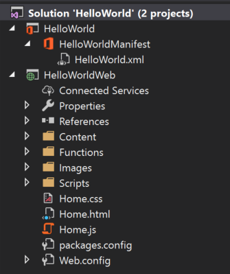

# <a name="tutorial-create-a-powerpoint-task-pane-add-in"></a>Учебник: Создание надстройки области задач PowerPoint

В этом учебнике вы будете использовать Visual Studio для создания надстройки области задачи PowerPoint, которая:

> [!div class="checklist"]
> * Добавляет фотографию дня из [Bing](https://www.bing.com) на слайд
> * Добавляет текст на слайд
> * Получает метаданные слайды
> * Выполняет переходы между слайдами

## <a name="prerequisites"></a>Необходимые компоненты

[!include[Quick Start prerequisites](../includes/quickstart-vs-prerequisites.md)]

## <a name="create-your-add-in-project"></a>Создание проекта надстройки

Выполните указанные ниже действия, чтобы создать проект надстройки PowerPoint с помощью Visual Studio.

1. Выберите **Создание нового проекта**.

2. Используя поле поиска, введите **надстройка**. Выберите вариант **Веб-надстройка PowerPoint** и нажмите кнопку **Далее**.

3. Назовите проект `HelloWorld`и нажмите кнопку **создать**.

4. В диалоговом окне **Создание надстройки Office** выберите **Добавить новые функции в PowerPoint**, а затем нажмите кнопку **Готово**, чтобы создать проект.

5. Visual Studio создаст решение, и в **обозревателе решений** появятся два соответствующих проекта. В Visual Studio откроется файл **Home.html**.

     

### <a name="explore-the-visual-studio-solution"></a>Обзор решения Visual Studio

[!include[Description of Visual Studio projects](../includes/quickstart-vs-solution.md)]

### <a name="update-code"></a>Обновление кода 

Измените код надстройки, как указано ниже, чтобы создать платформу для реализации функций надстройки, следуя инструкциям в следующих разделах этого руководства.

1. Файл **Home.html** содержит HTML-контент, который будет отображаться в области задач надстройки. В файле **Home.html** найдите раздел **div** с `id="content-main"`, замените весь этот раздел приведенным ниже кодом и сохраните файл.

    ```html
    <!-- TODO2: Create the content-header div. -->
    <div id="content-main">
        <div class="padding">
            <!-- TODO1: Create the insert-image button. -->
            <!-- TODO3: Create the insert-text button. -->
            <!-- TODO4: Create the get-slide-metadata button. -->
            <!-- TODO5: Create the go-to-slide buttons. -->
        </div>
    </div>
    ```

2. Откройте файл **Home.js** в корневой папке проекта веб-приложения. Этот файл содержит скрипт надстройки. Замените все его содержимое указанным ниже кодом и сохраните файл.

    ```js
    (function () {
        "use strict";

        var messageBanner;

        Office.onReady(function () {
            $(document).ready(function () {
                // Initialize the FabricUI notification mechanism and hide it
                var element = document.querySelector('.MessageBanner');
                messageBanner = new components.MessageBanner(element);
                messageBanner.hideBanner();

                // TODO1: Assign event handler for insert-image button.
                // TODO4: Assign event handler for insert-text button.
                // TODO6: Assign event handler for get-slide-metadata button.
                // TODO8: Assign event handlers for the four navigation buttons.
            });
        });

        // TODO2: Define the insertImage function. 

        // TODO3: Define the insertImageFromBase64String function.

        // TODO5: Define the insertText function.

        // TODO7: Define the getSlideMetadata function.

        // TODO9: Define the navigation functions.

        // Helper function for displaying notifications
        function showNotification(header, content) {
            $("#notification-header").text(header);
            $("#notification-body").text(content);
            messageBanner.showBanner();
            messageBanner.toggleExpansion();
        }
    })();
    ```

## <a name="insert-an-image"></a>Вставка изображения

Выполните указанные ниже действия, чтобы добавить код, который извлекает фотографию дня в [Bing](https://www.bing.com) и вставляет данное изображение на слайд.

1. Используя обозреватель решений, добавьте новую папку **Controllers** в проект **HelloWorldWeb**.

    

2. Щелкните правой кнопкой мыши папку **Controllers** и выберите **Добавить > Создать шаблонный элемент**.

3. В диалоговом окне **Добавление шаблона** выберите **Контроллер Web API 2 — пустой** и нажмите кнопку **Добавить**. 

4. В диалоговом окне **Добавление контроллера** введите имя **PhotoController** и нажмите кнопку **Добавить**. Visual Studio создаст и откроет файл **PhotoController.cs**.

5. Замените все содержимое файла **PhotoController.cs** приведенным ниже кодом, который вызывает службу Bing для получения фотографии дня в виде строки в кодировке Base64. Когда для вставки изображения в документ используется API JavaScript для Office, данные изображения должны быть закодированы в формате Base64.

    ```csharp
    using System;
    using System.IO;
    using System.Net;
    using System.Text;
    using System.Web.Http;
    using System.Xml;

    namespace HelloWorldWeb.Controllers
    {
        public class PhotoController : ApiController
        {
            public string Get()
            {
                string url = "http://www.bing.com/HPImageArchive.aspx?format=xml&idx=0&n=1";

                // Create the request.
                HttpWebRequest request = (HttpWebRequest)WebRequest.Create(url);
                WebResponse response = request.GetResponse();

                using (Stream responseStream = response.GetResponseStream())
                {
                    // Process the result.
                    StreamReader reader = new StreamReader(responseStream, Encoding.UTF8);
                    string result = reader.ReadToEnd();

                    // Parse the xml response and to get the URL.
                    XmlDocument doc = new XmlDocument();
                    doc.LoadXml(result);
                    string photoURL = "http://bing.com" + doc.SelectSingleNode("/images/image/url").InnerText;

                    // Fetch the photo and return it as a Base64 encoded string.
                    return getPhotoFromURL(photoURL);
                }
            }

            private string getPhotoFromURL(string imageURL)
            {
                var webClient = new WebClient();
                byte[] imageBytes = webClient.DownloadData(imageURL);
                return Convert.ToBase64String(imageBytes);
            }
        }
    }
    ```

6. В файле **Home.html** замените `TODO1` приведенным ниже кодом. Этот код определяет кнопку **Insert Image** (Вставить изображение), которая появится в области задач надстройки.

    ```html
    <button class="Button Button--primary" id="insert-image">
        <span class="Button-icon"><i class="ms-Icon ms-Icon--plus"></i></span>
        <span class="Button-label">Insert Image</span>
        <span class="Button-description">Gets the photo of the day that shows on the Bing home page and adds it to the slide.</span>
    </button>
    ```

7. В файле **Home.js** замените `TODO1` приведенным ниже кодом, чтобы назначить обработчик событий для кнопки **Insert Image** (Вставить изображение).

    ```js
    $('#insert-image').click(insertImage);
    ```

8. В файле **Home.js** замените `TODO2` приведенным ниже кодом, чтобы определить функцию **insertImage**. Эта функция извлекает изображение из веб-службы Bing, а затем вызывает функцию `insertImageFromBase64String`, чтобы вставить его в документ.

    ```js
    function insertImage() {
        // Get image from from web service (as a Base64 encoded string).
        $.ajax({
            url: "/api/Photo/", success: function (result) {
                insertImageFromBase64String(result);
            }, error: function (xhr, status, error) {
                showNotification("Error", "Oops, something went wrong.");
            }
        });
    }
    ```

9. В файле **Home.js** замените `TODO3` приведенным ниже кодом, чтобы определить функцию `insertImageFromBase64String`. Эта функция использует API JavaScript для Office, чтобы вставить изображение в документ. Примечание. 

    - `coercionType`, второй параметр запроса `setSelectedDataAsyc`, определяет тип вставляемых данных. 

    - Объект `asyncResult` инкапсулирует результат запроса `setSelectedDataAsync`, включая сведения о состоянии и ошибке, если запрос завершился ошибкой.

    ```js
    function insertImageFromBase64String(image) {
        // Call Office.js to insert the image into the document.
        Office.context.document.setSelectedDataAsync(image, {
            coercionType: Office.CoercionType.Image
        },
            function (asyncResult) {
                if (asyncResult.status === Office.AsyncResultStatus.Failed) {
                    showNotification("Error", asyncResult.error.message);
                }
            });
    }
    ```

### <a name="test-the-add-in"></a>Тестирование надстройки

1. Протестируйте новую надстройку PowerPoint с помощью Visual Studio, нажав клавишу **F5** или кнопку **Запустить**, чтобы запустить PowerPoint с кнопкой надстройки **Показать область задач** на ленте. Надстройка будет размещена на локальном сервере IIS.

    

2. В PowerPoint нажмите кнопку **Show Taskpane** (Показать область задач) на ленте, чтобы открыть надстройку области задач.

    

3. В области задач нажмите кнопку **Insert Image** (Вставить изображение), чтобы добавить фотографию дня Bing на текущий слайд.

    

4. В Visual Studio остановите работу надстройки, нажав клавиши **Shift + F5** или кнопку **Остановить**. PowerPoint автоматически закроется при остановке надстройки.

    

## <a name="customize-user-interface-ui-elements"></a>Настройка элементов пользовательского интерфейса

Выполните указанные ниже действия, чтобы добавить разметку, которая будет изменять область задач пользовательского интерфейса.

1. В файле **Home.html** замените `TODO2` приведенным ниже кодом, чтобы добавить раздел верхнего колонтитула и заголовок в область задач. Примечание.

    - Стили, которые начинаются с `ms-`, относятся к стилям [Office UI Fabric](../design/office-ui-fabric.md), интерфейсной платформы JavaScript для создания функциональных возможностей Office и Office 365. Файл **Home.html** включает ссылку на таблицу стилей Fabric.

    ```html
    <div id="content-header">
        <div class="ms-Grid ms-bgColor-neutralPrimary">
            <div class="ms-Grid-row">
                <div class="padding ms-Grid-col ms-u-sm12 ms-u-md12 ms-u-lg12"> <div class="ms-font-xl ms-fontColor-white ms-fontWeight-semibold">My PowerPoint add-in</div></div>
            </div>
        </div>
    </div>
    ```

2. В файле **Home.html** найдите раздел **div** с `class="footer"` и удалите весь раздел **div**, чтобы удалить раздел нижнего колонтитула из области задач.

### <a name="test-the-add-in"></a>Тестирование надстройки

1. Испытайте надстройку PowerPoint с помощью Visual Studio, нажав клавишу **F5** или кнопку **Запустить**, чтобы запустить PowerPoint с кнопкой надстройки **Показать область задач** на ленте. Надстройка будет размещена на локальном сервере IIS.

    

2. В PowerPoint нажмите кнопку **Show Taskpane** (Показать область задач) на ленте, чтобы открыть надстройку области задач.

    

3. Обратите внимание на то, что область задач теперь содержит раздел верхнего колонтитула и заголовок и больше не содержит раздел нижнего колонтитула.

    

4. В Visual Studio остановите работу надстройки, нажав клавиши **Shift + F5** или кнопку **Остановить**. PowerPoint автоматически закроется при остановке надстройки.

    

## <a name="insert-text"></a>Вставка текста

Выполните указанные ниже действия, чтобы добавить код, который вставляет текст в слайд, который содержит фотографию дня из [Bing](https://www.bing.com).

1. В файле **Home.html** замените `TODO3` приведенным ниже кодом. Этот код определяет кнопку **Insert Text** (Вставить текст), которая появится в области задач надстройки.

    ```html
        <br /><br />
        <button class="Button Button--primary" id="insert-text">
            <span class="Button-icon"><i class="ms-Icon ms-Icon--plus"></i></span>
            <span class="Button-label">Insert Text</span>
            <span class="Button-description">Inserts text into the slide.</span>
        </button>
    ```

2. В файле **Home.js** замените `TODO4` приведенным ниже кодом, чтобы назначить обработчик событий для кнопки **Insert Text** (Вставить текст).

    ```js
    $('#insert-text').click(insertText);
    ```

3. В файле **Home.js** замените `TODO5` приведенным ниже кодом, чтобы определить функцию **insertText**. Эта функция вставляет текст в текущий слайд.

    ```js
    function insertText() {
        Office.context.document.setSelectedDataAsync('Hello World!',
            function (asyncResult) {
                if (asyncResult.status === Office.AsyncResultStatus.Failed) {
                    showNotification("Error", asyncResult.error.message);
                }
            });
    }
    ```

### <a name="test-the-add-in"></a>Тестирование надстройки

1. Испытайте надстройку с помощью Visual Studio, нажав клавишу **F5** или кнопку **Запустить**, чтобы запустить PowerPoint с кнопкой надстройки **Показать область задач** на ленте. Надстройка будет размещена на локальном сервере IIS.

    

2. В PowerPoint нажмите кнопку **Show Taskpane** (Показать область задач) на ленте, чтобы открыть надстройку области задач.

    

3. В области задач нажмите кнопку **Insert Image** (Вставить изображение), чтобы добавить фотографию дня Bing на текущий слайд, и выберите макет слайда с текстовым полем для заголовка.

    

4. Установите курсор в текстовом поле на заглавном слайде и нажмите кнопку **Insert Text** (Вставить текст) в области задач, чтобы добавить текст.

    


5. В Visual Studio остановите работу надстройки, нажав клавиши **Shift + F5** или кнопку **Остановить**. PowerPoint автоматически закроется при остановке надстройки.

    

## <a name="get-slide-metadata"></a>Получение метаданных слайда

Выполните указанные ниже действия, чтобы добавить код, который извлекает метаданные для выбранного слайда.

1. В файле **Home.html** замените `TODO4` приведенным ниже кодом. Этот код определяет кнопку **Get Slide Metadata** (Получить метаданные слайда), которая появится в области задач надстройки.

    ```html
    <br /><br />
    <button class="Button Button--primary" id="get-slide-metadata">
        <span class="Button-icon"><i class="ms-Icon ms-Icon--plus"></i></span>
        <span class="Button-label">Get Slide Metadata</span>
        <span class="Button-description">Gets metadata for the selected slide(s).</span>
    </button>
    ```

2. В файле **Home.js** замените `TODO6` приведенным ниже кодом, чтобы назначить обработчик событий для кнопки **Get Slide Metadata** (Получить метаданные слайда).

    ```js
    $('#get-slide-metadata').click(getSlideMetadata);
    ```

3. В файле **Home.js** замените `TODO7` приведенным ниже кодом, чтобы определить функцию **getSlideMetadata**. Эта функция извлекает метаданные выбранных слайдов и записывает их во всплывающее диалоговое окно в области задач надстройки.

    ```js
    function getSlideMetadata() {
        Office.context.document.getSelectedDataAsync(Office.CoercionType.SlideRange,
            function (asyncResult) {
                if (asyncResult.status === Office.AsyncResultStatus.Failed) {
                    showNotification("Error", asyncResult.error.message);
                } else {
                    showNotification("Metadata for selected slide(s):", JSON.stringify(asyncResult.value), null, 2);
                }
            }
        );
    }
    ```

### <a name="test-the-add-in"></a>Тестирование надстройки

1. Испытайте надстройку с помощью Visual Studio, нажав клавишу **F5** или кнопку **Запустить**, чтобы запустить PowerPoint с кнопкой надстройки **Показать область задач** на ленте. Надстройка будет размещена на локальном сервере IIS.

    

2. В PowerPoint нажмите кнопку **Show Taskpane** (Показать область задач) на ленте, чтобы открыть надстройку области задач.

    

3. В области задач нажмите кнопку **Get Slide Metadata** (Получить метаданные слайда), чтобы получить метаданные выбранного слайда. Метаданные слайда записываются во всплывающее диалоговое окно в нижней части области задач. В этом случае массив `slides` в метаданных JSON содержит один объект, в котором указаны свойства `id`, `title` и `index` выбранного слайда. Если при извлечении метаданных будет выбрано несколько слайдов, массив `slides` в метаданных JSON будет содержать один объект для каждого выбранного слайда.

    

4. В Visual Studio остановите работу надстройки, нажав клавиши **Shift + F5** или кнопку **Остановить**. PowerPoint автоматически закроется при остановке надстройки.

    

## <a name="navigate-between-slides"></a>Переход между слайдами

Выполните указанные ниже действия, чтобы добавить код, который выполняет переход между слайдами документа.

1. В файле **Home.html** замените `TODO5` приведенным ниже кодом. Этот код определяет четыре кнопки навигации, которые появятся в области задач надстройки.

    ```html
    <br /><br />
    <button class="Button Button--primary" id="go-to-first-slide">
        <span class="Button-icon"><i class="ms-Icon ms-Icon--plus"></i></span>
        <span class="Button-label">Go to First Slide</span>
        <span class="Button-description">Go to the first slide.</span>
    </button>
    <br /><br />
    <button class="Button Button--primary" id="go-to-next-slide">
        <span class="Button-icon"><i class="ms-Icon ms-Icon--plus"></i></span>
        <span class="Button-label">Go to Next Slide</span>
        <span class="Button-description">Go to the next slide.</span>
    </button>
    <br /><br />
    <button class="Button Button--primary" id="go-to-previous-slide">
        <span class="Button-icon"><i class="ms-Icon ms-Icon--plus"></i></span>
        <span class="Button-label">Go to Previous Slide</span>
        <span class="Button-description">Go to the previous slide.</span>
    </button>
    <br /><br />
    <button class="Button Button--primary" id="go-to-last-slide">
        <span class="Button-icon"><i class="ms-Icon ms-Icon--plus"></i></span>
        <span class="Button-label">Go to Last Slide</span>
        <span class="Button-description">Go to the last slide.</span>
    </button>
    ```

2. В файле **Home.js** замените `TODO8` приведенным ниже кодом, чтобы назначить обработчик событий для четырех кнопок навигации.

    ```js
    $('#go-to-first-slide').click(goToFirstSlide);
    $('#go-to-next-slide').click(goToNextSlide);
    $('#go-to-previous-slide').click(goToPreviousSlide);
    $('#go-to-last-slide').click(goToLastSlide);
    ```

3. В файле **Home.js** замените `TODO9` приведенным ниже кодом, чтобы определить функции навигации. Каждая из этих функций использует функцию `goToByIdAsync` для выбора слайда с учетом его позиции в документе (первый, последний, предыдущий, следующий).

    ```js
    function goToFirstSlide() {
        Office.context.document.goToByIdAsync(Office.Index.First, Office.GoToType.Index,
            function (asyncResult) {
                if (asyncResult.status == "failed") {
                    showNotification("Error", asyncResult.error.message);
                }
            });
    }

    function goToLastSlide() {
        Office.context.document.goToByIdAsync(Office.Index.Last, Office.GoToType.Index,
            function (asyncResult) {
                if (asyncResult.status == "failed") {
                    showNotification("Error", asyncResult.error.message);
                }
            });
    }

    function goToPreviousSlide() {
        Office.context.document.goToByIdAsync(Office.Index.Previous, Office.GoToType.Index,
            function (asyncResult) {
                if (asyncResult.status == "failed") {
                    showNotification("Error", asyncResult.error.message);
                }
            });
    }

    function goToNextSlide() {
        Office.context.document.goToByIdAsync(Office.Index.Next, Office.GoToType.Index,
            function (asyncResult) {
                if (asyncResult.status == "failed") {
                    showNotification("Error", asyncResult.error.message);
                }
            });
    }
    ```

### <a name="test-the-add-in"></a>Тестирование надстройки

1. Испытайте надстройку с помощью Visual Studio, нажав клавишу **F5** или кнопку **Запустить**, чтобы запустить PowerPoint с кнопкой надстройки **Показать область задач** на ленте. Надстройка будет размещена на локальном сервере IIS.

    

2. В PowerPoint нажмите кнопку **Show Taskpane** (Показать область задач) на ленте, чтобы открыть надстройку области задач.

    


3. Нажмите кнопку **Создать слайд** на ленте вкладки **Главная**, чтобы добавить в документ два новых слайда. 

4. В области задач нажмите кнопку **Go to First Slide** (Перейти к первому слайду). Будет выбран и показан первый слайд в документе.

    

5. В области задач нажмите кнопку **Go to Next Slide** (Перейти к следующему слайду). Будет выбран и показан следующий слайд в документе.

    

6. В области задач нажмите кнопку **Go to Previous Slide** (Перейти к предыдущему слайду). Будет выбран и показан предыдущий слайд в документе.

    

7. В области задач нажмите кнопку **Go to Last Slide** (Перейти к последнему слайду). Будет выбран и показан последний слайд в документе.

    

8. В Visual Studio остановите работу надстройки, нажав клавиши **Shift + F5** или кнопку **Остановить**. PowerPoint автоматически закроется при остановке надстройки.

    

## <a name="next-steps"></a>Дальнейшие действия

Из этого руководства вы узнали, как создать надстройку PowerPoint, которая вставляет изображение и текст, получает метаданные слайда и выполняет переход между слайдами. Чтобы узнать больше о создании надстроек PowerPoint, перейдите к следующей статье:

> [!div class="nextstepaction"]
> [Общие сведения о надстройках PowerPoint](../powerpoint/powerpoint-add-ins.md)

## <a name="see-also"></a>См. также

* [Обзор платформы надстроек Office](../overview/office-add-ins.md)
* [Создание надстроек Office](../overview/office-add-ins-fundamentals.md)
* [Разработка надстроек Office](../develop/develop-overview.md)