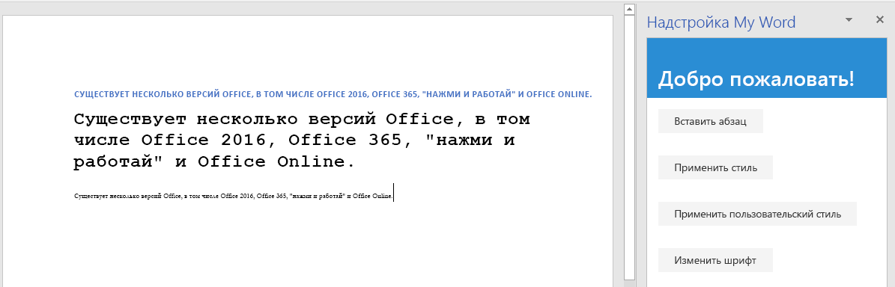

# <a name="tutorial-create-a-word-task-pane-add-in"></a><span data-ttu-id="50966-104">Учебник: Создание надстройки области задач Word</span><span class="sxs-lookup"><span data-stu-id="50966-104">Tutorial: Create a Word task pane add-in</span></span>

<span data-ttu-id="50966-105">С помощью данного учебника вы сможете создать надстройку области задач Word, которая выполняет следующие действия:</span><span class="sxs-lookup"><span data-stu-id="50966-105">In this tutorial, you'll create a Word task pane add-in that:</span></span>

> [!div class="checklist"]
> * <span data-ttu-id="50966-106">Вставляет диапазон текста</span><span class="sxs-lookup"><span data-stu-id="50966-106">Inserts a range of text</span></span>
> * <span data-ttu-id="50966-107">Форматирует текст</span><span class="sxs-lookup"><span data-stu-id="50966-107">Formats text</span></span>
> * <span data-ttu-id="50966-108">Заменяет и вставляет текст в различных расположениях</span><span class="sxs-lookup"><span data-stu-id="50966-108">Replaces text and inserts text in various locations</span></span>
> * <span data-ttu-id="50966-109">Вставляет изображения, HTML-код и таблицы</span><span class="sxs-lookup"><span data-stu-id="50966-109">Inserts images, HTML, and tables</span></span>
> * <span data-ttu-id="50966-110">Создает и обновляет элементы управления содержимым</span><span class="sxs-lookup"><span data-stu-id="50966-110">Creates and updates content controls</span></span> 

## <a name="prerequisites"></a><span data-ttu-id="50966-111">Необходимые компоненты</span><span class="sxs-lookup"><span data-stu-id="50966-111">Prerequisites</span></span>

<span data-ttu-id="50966-112">Для работы с этим руководством необходимо установить указанные ниже компоненты.</span><span class="sxs-lookup"><span data-stu-id="50966-112">To use this tutorial, you need to have the following installed.</span></span> 

- <span data-ttu-id="50966-p102">Word 2016, версия 1711 (сборка 8730.1000 "нажми и работай") или более поздняя. Чтобы установить эту версию, необходимо быть участником программы предварительной оценки Office. [Дополнительные сведения](https://products.office.com/office-insider?tab=tab-1)</span><span class="sxs-lookup"><span data-stu-id="50966-p102">Word 2016, version 1711 (Build 8730.1000 Click-to-Run) or later. You might need to be an Office Insider to get this version. For more information, see [Be an Office Insider](https://products.office.com/office-insider?tab=tab-1).</span></span>

- [<span data-ttu-id="50966-116">Node</span><span class="sxs-lookup"><span data-stu-id="50966-116">Node</span></span>](https://nodejs.org/en/) 

- <span data-ttu-id="50966-117">[Git Bash](https://git-scm.com/downloads) (или другой клиент Git)</span><span class="sxs-lookup"><span data-stu-id="50966-117">[Git Bash](https://git-scm.com/downloads) (or another Git client)</span></span>

## <a name="create-your-add-in-project"></a><span data-ttu-id="50966-118">Создание проекта надстройки</span><span class="sxs-lookup"><span data-stu-id="50966-118">Create your add-in project</span></span>

<span data-ttu-id="50966-119">Выполните указанные ниже действия для создания проекта надстройки Word, который будет использоваться в качестве основы для этого учебника.</span><span class="sxs-lookup"><span data-stu-id="50966-119">Complete the following steps to create the Word add-in project that you'll use as the basis for this tutorial.</span></span>

1. <span data-ttu-id="50966-120">Клонируйте репозиторий GitHub [Word-Add-in-Tutorial](https://github.com/OfficeDev/Word-Add-in-Tutorial).</span><span class="sxs-lookup"><span data-stu-id="50966-120">Clone the GitHub repository [Word add-in tutorial](https://github.com/OfficeDev/Word-Add-in-Tutorial).</span></span>

2. <span data-ttu-id="50966-121">Откройте окно Git Bash или системную командную строку с поддержкой Node.JS и перейдите к папке **Start** проекта.</span><span class="sxs-lookup"><span data-stu-id="50966-121">Open a Git bash window, or Node.JS-enabled system prompt, and navigate to the **Start** folder of the project.</span></span>

3. <span data-ttu-id="50966-122">Выполните команду `npm install`, чтобы установить инструменты и библиотеки, указанные в файле package.json.</span><span class="sxs-lookup"><span data-stu-id="50966-122">Run the command `npm install` to install the tools and libraries listed in the package.json file.</span></span> 

4. <span data-ttu-id="50966-123">Сделайте так, чтобы операционная система компьютера разработки доверяла сертификату. Для этого выполните действия, описанные в [этой статье](https://github.com/OfficeDev/generator-office/blob/master/src/docs/ssl.md).</span><span class="sxs-lookup"><span data-stu-id="50966-123">Carry out the steps in [Adding Self-Signed Certificates as Trusted Root Certificate](https://github.com/OfficeDev/generator-office/blob/master/src/docs/ssl.md) to trust the certificate for your development computer's operating system.</span></span>

## <a name="insert-a-range-of-text"></a><span data-ttu-id="50966-124">Вставка диапазона текста</span><span class="sxs-lookup"><span data-stu-id="50966-124">Insert a range of text</span></span>

<span data-ttu-id="50966-125">На этом этапе руководства мы программным способом проверим, поддерживает ли надстройка текущую версию Word, установленную у пользователя, а затем вставим абзац в документ.</span><span class="sxs-lookup"><span data-stu-id="50966-125">In this step of the tutorial, you'll programmatically test that your add-in supports the user's current version of Word, and then insert a paragraph into the document.</span></span>

### <a name="code-the-add-in"></a><span data-ttu-id="50966-126">Написание кода надстройки</span><span class="sxs-lookup"><span data-stu-id="50966-126">Code the add-in</span></span>

1. <span data-ttu-id="50966-127">Откройте проект в редакторе кода.</span><span class="sxs-lookup"><span data-stu-id="50966-127">Open the project in your code editor.</span></span>

2. <span data-ttu-id="50966-128">Откройте файл index.html.</span><span class="sxs-lookup"><span data-stu-id="50966-128">Open the file index.html.</span></span>

3. <span data-ttu-id="50966-129">Замените `TODO1` на следующую разметку:</span><span class="sxs-lookup"><span data-stu-id="50966-129">Replace the `TODO1` with the following markup:</span></span>

    ```html
    <button class="ms-Button" id="insert-paragraph">Insert Paragraph</button>
    ```

4. <span data-ttu-id="50966-130">Откройте файл app.js.</span><span class="sxs-lookup"><span data-stu-id="50966-130">Open the app.js file.</span></span>

5. <span data-ttu-id="50966-p103">Замените `TODO1` на приведенный ниже код. Этот код определяет, поддерживает ли установленная у пользователя версия Word ту версию файла Word.js, которая включает все API, используемые на всех этапах данного руководства. В рабочей надстройке можно использовать текст условного блока, чтобы скрыть или отключить пользовательский интерфейс, где вызываются неподдерживаемые API. При этом пользователь по-прежнему сможет использовать те части надстройки, которые поддерживаются в его версии Word.</span><span class="sxs-lookup"><span data-stu-id="50966-p103">Replace the `TODO1` with the following code. This code determines whether the user's version of Word supports a version of Word.js that includes all the APIs that are used in all the stages of this tutorial. In a production add-in, use the body of the conditional block to hide or disable the UI that would call unsupported APIs. This will enable the user to still use the parts of the add-in that are supported by their version of Word.</span></span>

    ```js
    if (!Office.context.requirements.isSetSupported('WordApi', 1.3)) {
        console.log('Sorry. The tutorial add-in uses Word.js APIs that are not available in your version of Office.');
    }
    ```

6. <span data-ttu-id="50966-135">Замените `TODO2` на следующий код:</span><span class="sxs-lookup"><span data-stu-id="50966-135">Replace the `TODO2` with the following code:</span></span>

    ```js
    $('#insert-paragraph').click(insertParagraph);
    ```

7. <span data-ttu-id="50966-136">Замените `TODO3` приведенным ниже кодом.</span><span class="sxs-lookup"><span data-stu-id="50966-136">Replace the `TODO3` with the following code.</span></span> <span data-ttu-id="50966-137">Примечание.</span><span class="sxs-lookup"><span data-stu-id="50966-137">Note:</span></span>

   - <span data-ttu-id="50966-p105">Бизнес-логика Word.js будет добавлена в функцию, передаваемую методу `Word.run`. Эта логика выполняется не сразу. Вместо этого она добавляется в очередь ожидания команд.</span><span class="sxs-lookup"><span data-stu-id="50966-p105">Your Word.js business logic will be added to the function that is passed to `Word.run`. This logic does not execute immediately. Instead, it is added to a queue of pending commands.</span></span>

   - <span data-ttu-id="50966-141">Метод `context.sync` отправляет все команды из очереди в Word для выполнения.</span><span class="sxs-lookup"><span data-stu-id="50966-141">The `context.sync` method sends all queued commands to Word for execution.</span></span>

   - <span data-ttu-id="50966-p106">За методом `Word.run` следует блок `catch`. Рекомендуется всегда следовать этой методике.</span><span class="sxs-lookup"><span data-stu-id="50966-p106">The `Word.run` is followed by a `catch` block. This is a best practice that you should always follow.</span></span> 

    ```js
    function insertParagraph() {
        Word.run(function (context) {

            // TODO4: Queue commands to insert a paragraph into the document.

            return context.sync();
        })
        .catch(function (error) {
            console.log("Error: " + error);
            if (error instanceof OfficeExtension.Error) {
                console.log("Debug info: " + JSON.stringify(error.debugInfo));
            }
        });
    }
    ```

8. <span data-ttu-id="50966-p107">Замените `TODO4` на приведенный ниже код. Примечание:</span><span class="sxs-lookup"><span data-stu-id="50966-p107">Replace `TODO4` with the following code. Note:</span></span>

   - <span data-ttu-id="50966-146">Первый параметр метода `insertParagraph`— это текст нового абзаца.</span><span class="sxs-lookup"><span data-stu-id="50966-146">The first parameter to the `insertParagraph` method is the text for the new paragraph.</span></span>

   - <span data-ttu-id="50966-p108">Второй параметр — расположение в основном тексте, где будет вставлен абзац. Другие варианты вставки абзаца, родительским объектом которого является основной текст, — End и Replace.</span><span class="sxs-lookup"><span data-stu-id="50966-p108">The second parameter is the location within the body where the paragraph will be inserted. Other options for insert paragraph, when the parent object is the body, are "End" and "Replace".</span></span>

    ```js
    var docBody = context.document.body;
    docBody.insertParagraph("Office has several versions, including Office 2016, Office 365 Click-to-Run, and Office Online.",
                            "Start");
    ```

### <a name="test-the-add-in"></a><span data-ttu-id="50966-149">Тестирование надстройки</span><span class="sxs-lookup"><span data-stu-id="50966-149">Test the add-in</span></span>

1. <span data-ttu-id="50966-150">Откройте окно Git Bash или системную командную строку с поддержкой Node.JS и перейдите к папке **Start** проекта.</span><span class="sxs-lookup"><span data-stu-id="50966-150">Open a Git bash window, or Node.JS-enabled system prompt, and navigate to the **Start** folder of the project.</span></span>

2. <span data-ttu-id="50966-151">Выполните команду `npm run build`, чтобы преобразовать исходный код ES6 в более раннюю версию JavaScript, поддерживаемую всеми ведущими приложениями, в которых могут работать надстройки Office.</span><span class="sxs-lookup"><span data-stu-id="50966-151">Run the command `npm run build` to transpile your ES6 source code to an earlier version of JavaScript that is supported by all the hosts where Office Add-ins can run.</span></span>

3. <span data-ttu-id="50966-152">Выполните команду `npm start`, чтобы запустить веб-сервер, работающий на localhost.</span><span class="sxs-lookup"><span data-stu-id="50966-152">Run the command `npm start` to start a web server running on localhost.</span></span>

4. <span data-ttu-id="50966-153">Загрузите неопубликованную надстройку одним из следующих способов:</span><span class="sxs-lookup"><span data-stu-id="50966-153">Sideload the add-in by using one of the following methods:</span></span>

    - <span data-ttu-id="50966-154">[Windows](../testing/create-a-network-shared-folder-catalog-for-task-pane-and-content-add-ins.md)</span><span class="sxs-lookup"><span data-stu-id="50966-154">Windows: [Sideload Office Add-ins on Windows](../testing/create-a-network-shared-folder-catalog-for-task-pane-and-content-add-ins.md)</span></span>

    - <span data-ttu-id="50966-155">[Office Online](../testing/sideload-office-add-ins-for-testing.md#sideload-an-office-add-in-in-office-online)</span><span class="sxs-lookup"><span data-stu-id="50966-155">Word Online: [Sideload Office Add-ins in Office Online](../testing/sideload-office-add-ins-for-testing.md#sideload-an-office-add-in-in-office-online)</span></span>

    - <span data-ttu-id="50966-156">[iPad и Mac](../testing/sideload-an-office-add-in-on-ipad-and-mac.md)</span><span class="sxs-lookup"><span data-stu-id="50966-156">iPad and Mac: [Sideload Office Add-ins on iPad and Mac](../testing/sideload-an-office-add-in-on-ipad-and-mac.md)</span></span>

5. <span data-ttu-id="50966-157">В меню **Главная** в Word выберите пункт **Показать область задач**.</span><span class="sxs-lookup"><span data-stu-id="50966-157">On the **Home** menu of Word, select **Show Taskpane**.</span></span>

6. <span data-ttu-id="50966-158">В области задач нажмите кнопку **Insert Paragraph** (Вставить абзац).</span><span class="sxs-lookup"><span data-stu-id="50966-158">In the task pane, choose **Insert Paragraph**.</span></span>

7. <span data-ttu-id="50966-159">Внесите изменение в абзац.</span><span class="sxs-lookup"><span data-stu-id="50966-159">Make a change in the paragraph.</span></span>

8. <span data-ttu-id="50966-160">Снова нажмите кнопку **Insert Paragraph**.</span><span class="sxs-lookup"><span data-stu-id="50966-160">Choose **Insert Paragraph** again.</span></span> <span data-ttu-id="50966-161">Обратите внимание, что новый абзац находится над предыдущим, так как метод `insertParagraph` вставляет текст в начале основного текста документа.</span><span class="sxs-lookup"><span data-stu-id="50966-161">Note that the new paragraph is above the previous one because the `insertParagraph` method is inserting at the start of the document's body.</span></span>

    

## <a name="format-text"></a><span data-ttu-id="50966-163">Форматирование текста</span><span class="sxs-lookup"><span data-stu-id="50966-163">Format text</span></span>

<span data-ttu-id="50966-164">На этом этапе учебника вы сможете применить встроенный стиль к тексту, использовать пользовательский стиль для текста и изменить шрифт текста.</span><span class="sxs-lookup"><span data-stu-id="50966-164">In this step of the tutorial, you'll apply a built-in style to text, apply a custom style to text, and change the font of text.</span></span>

### <a name="apply-a-built-in-style-to-text"></a><span data-ttu-id="50966-165">Применение встроенного стиля к тексту</span><span class="sxs-lookup"><span data-stu-id="50966-165">Apply a built-in style to text</span></span>

1. <span data-ttu-id="50966-166">Откройте проект в редакторе кода.</span><span class="sxs-lookup"><span data-stu-id="50966-166">Open the project in your code editor.</span></span> 

2. <span data-ttu-id="50966-167">Откройте файл index.html.</span><span class="sxs-lookup"><span data-stu-id="50966-167">Open the file index.html.</span></span>

3. <span data-ttu-id="50966-168">Под элементом `div`, содержащим кнопку `insert-paragraph`, добавьте следующую разметку:</span><span class="sxs-lookup"><span data-stu-id="50966-168">Just below the `div` that contains the `insert-paragraph` button, add the following markup:</span></span>

    ```html
    <div class="padding">            
        <button class="ms-Button" id="apply-style">Apply Style</button>            
    </div>
    ```

4. <span data-ttu-id="50966-169">Откройте файл app.js.</span><span class="sxs-lookup"><span data-stu-id="50966-169">Open the app.js file.</span></span>

5. <span data-ttu-id="50966-170">Под строкой, назначающей обработчик нажатия кнопки `insert-paragraph`, добавьте следующий код:</span><span class="sxs-lookup"><span data-stu-id="50966-170">Just below the line that assigns a click handler to the `insert-paragraph` button, add the following code:</span></span>

    ```js
    $('#apply-style').click(applyStyle);
    ```

6. <span data-ttu-id="50966-171">Под функцией `insertParagraph` добавьте следующую функцию:</span><span class="sxs-lookup"><span data-stu-id="50966-171">Just below the `insertParagraph` function, add the following function:</span></span>

    ```js
    function applyStyle() {
        Word.run(function (context) {
            
            // TODO1: Queue commands to style text.

            return context.sync();
        })
        .catch(function (error) {
            console.log("Error: " + error);
            if (error instanceof OfficeExtension.Error) {
                console.log("Debug info: " + JSON.stringify(error.debugInfo));
            }
        });
    }
    ``` 

7. <span data-ttu-id="50966-p110">Замените `TODO1` на приведенный ниже код. Обратите внимание, что этот код применяет стиль к абзацу, но стили также можно применять к диапазонам текста.</span><span class="sxs-lookup"><span data-stu-id="50966-p110">Replace `TODO1` with the following code. Note that the code applies a style to a paragraph, but styles can also be applied to ranges of text.</span></span>

    ```js
    var firstParagraph = context.document.body.paragraphs.getFirst();
    firstParagraph.styleBuiltIn = Word.Style.intenseReference;
    ``` 

### <a name="apply-a-custom-style-to-text"></a><span data-ttu-id="50966-174">Применение пользовательского стиля к тексту</span><span class="sxs-lookup"><span data-stu-id="50966-174">Apply a custom style to text</span></span>

1. <span data-ttu-id="50966-175">Откройте файл index.html.</span><span class="sxs-lookup"><span data-stu-id="50966-175">Open the file index.html.</span></span>

2. <span data-ttu-id="50966-176">Под элементом `div`, содержащим кнопку `apply-style`, добавьте следующую разметку:</span><span class="sxs-lookup"><span data-stu-id="50966-176">Below the `div` that contains the `apply-style` button, add the following markup:</span></span>

    ```html
    <div class="padding">            
        <button class="ms-Button" id="apply-custom-style">Apply Custom Style</button>            
    </div>
    ```

3. <span data-ttu-id="50966-177">Откройте файл app.js.</span><span class="sxs-lookup"><span data-stu-id="50966-177">Open the app.js file.</span></span>

4. <span data-ttu-id="50966-178">Под строкой, назначающей обработчик нажатия кнопки `apply-style`, добавьте следующий код:</span><span class="sxs-lookup"><span data-stu-id="50966-178">Below the line that assigns a click handler to the `apply-style` button, add the following code:</span></span>

    ```js
    $('#apply-custom-style').click(applyCustomStyle);
    ```

5. <span data-ttu-id="50966-179">Добавьте приведенную ниже функцию под функцией `applyStyle`.</span><span class="sxs-lookup"><span data-stu-id="50966-179">Below the `applyStyle` function, add the following function:</span></span>

    ```js
    function applyCustomStyle() {
        Word.run(function (context) {
            
            // TODO1: Queue commands to apply the custom style.

            return context.sync();
        })
        .catch(function (error) {
            console.log("Error: " + error);
            if (error instanceof OfficeExtension.Error) {
                console.log("Debug info: " + JSON.stringify(error.debugInfo));
            }
        });
    }
    ``` 

6. <span data-ttu-id="50966-p111">Замените `TODO1` на приведенный ниже код. Обратите внимание, что этот код применяет пользовательский стиль, который еще не существует. Мы создадим стиль с именем **MyCustomStyle** во время [тестирования настройки](#test-the-add-in).</span><span class="sxs-lookup"><span data-stu-id="50966-p111">Replace `TODO1` with the following code. Note that the code applies a custom style that does not exist yet. You'll create a style with the name **MyCustomStyle** in the [Test the add-in](#test-the-add-in) step.</span></span>

    ```js
    var lastParagraph = context.document.body.paragraphs.getLast();
    lastParagraph.style = "MyCustomStyle";
    ``` 

### <a name="change-the-font-of-text"></a><span data-ttu-id="50966-183">Изменение шрифта для текста</span><span class="sxs-lookup"><span data-stu-id="50966-183">Change the font of text</span></span>

1. <span data-ttu-id="50966-184">Откройте файл index.html.</span><span class="sxs-lookup"><span data-stu-id="50966-184">Open the file index.html.</span></span>

2. <span data-ttu-id="50966-185">Под элементом `div`, содержащим кнопку `apply-custom-style`, добавьте следующую разметку:</span><span class="sxs-lookup"><span data-stu-id="50966-185">Below the `div` that contains the `apply-custom-style` button, add the following markup:</span></span>

    ```html
    <div class="padding">            
        <button class="ms-Button" id="change-font">Change Font</button>            
    </div>
    ```

3. <span data-ttu-id="50966-186">Откройте файл app.js.</span><span class="sxs-lookup"><span data-stu-id="50966-186">Open the app.js file.</span></span>

4. <span data-ttu-id="50966-187">Под строкой, назначающей обработчик нажатия кнопки `apply-custom-style`, добавьте следующий код:</span><span class="sxs-lookup"><span data-stu-id="50966-187">Below the line that assigns a click handler to the `apply-custom-style` button, add the following code:</span></span>

    ```js
    $('#change-font').click(changeFont);
    ```

5. <span data-ttu-id="50966-188">Добавьте приведенную ниже функцию под функцией `applyCustomStyle`.</span><span class="sxs-lookup"><span data-stu-id="50966-188">Below the `applyCustomStyle` function, add the following function:</span></span>

    ```js
    function changeFont() {
        Word.run(function (context) {
            
            // TODO1: Queue commands to apply a different font.

            return context.sync();
        })
        .catch(function (error) {
            console.log("Error: " + error);
            if (error instanceof OfficeExtension.Error) {
                console.log("Debug info: " + JSON.stringify(error.debugInfo));
            }
        });
    }
    ``` 

6. <span data-ttu-id="50966-p112">Замените `TODO1` на приведенный ниже код. Обратите внимание, что этот код получает ссылку на второй абзац с помощью метода `ParagraphCollection.getFirst`, привязанного к методу `Paragraph.getNext`.</span><span class="sxs-lookup"><span data-stu-id="50966-p112">Replace `TODO1` with the following code. Note that the code gets a reference to the second paragraph by using the `ParagraphCollection.getFirst` method chained to the `Paragraph.getNext` method.</span></span>

    ```js
    var secondParagraph = context.document.body.paragraphs.getFirst().getNext();
    secondParagraph.font.set({
            name: "Courier New",
            bold: true,
            size: 18
        });
    ``` 

### <a name="test-the-add-in"></a><span data-ttu-id="50966-191">Тестирование надстройки</span><span class="sxs-lookup"><span data-stu-id="50966-191">Test the add-in</span></span>

1. <span data-ttu-id="50966-192">Если окно Git Bash или системная командная строка с поддержкой Node.JS, открытые на предыдущем этапе руководства, все еще открыты, дважды нажмите клавиши Ctrl+C, чтобы остановить работу веб-сервера.</span><span class="sxs-lookup"><span data-stu-id="50966-192">In the Git bash window, or Node.JS-enabled system prompt, from the previous stage tutorial is still open, enter Ctrl+C twice to stop the running web server.</span></span> <span data-ttu-id="50966-193">Если они закрыты, откройте окно Git Bash или системную командную строку с поддержкой Node.JS и перейдите к папке **Start** проекта.</span><span class="sxs-lookup"><span data-stu-id="50966-193">Otherwise, open a Git bash window, or Node.JS-enabled system prompt, and navigate to the **Start** folder of the project.</span></span>

     > [!NOTE]
     > <span data-ttu-id="50966-p114">Хотя сервер синхронизации браузера будет повторно загружать надстройку в области задач при каждом изменении любого файла (в том числе app.js), он не передает повторно код JavaScript, поэтому нужно будет снова выполнить команду сборки, чтобы изменения, внесенные в файл app.js, вступили в силу. Для этого необходимо завершить процесс сервера, чтобы появился запрос и вы могли ввести команду сборки. После сборки необходимо перезапустить сервер. Для этого выполните указанные ниже действия.</span><span class="sxs-lookup"><span data-stu-id="50966-p114">Although the browser-sync server reloads your add-in in the task pane every time you make a change to any file, including the app.js file, it does not retranspile the JavaScript, so you must repeat the build command in order for your changes to app.js to take effect. In order to do this, you need to kill the server process so that the prompt appears and you can enter the build command. After the build, you restart the server. The next few steps carry out this process.</span></span>

2. <span data-ttu-id="50966-198">Выполните команду `npm run build`, чтобы преобразовать исходный код ES6 в более раннюю версию JavaScript, поддерживаемую всеми ведущими приложениями, в которых могут работать надстройки Office.</span><span class="sxs-lookup"><span data-stu-id="50966-198">Run the command `npm run build` to transpile your ES6 source code to an earlier version of JavaScript that is supported by all the hosts where Office Add-ins can run.</span></span>

3. <span data-ttu-id="50966-199">Выполните команду `npm start`, чтобы запустить веб-сервер, работающий на localhost.</span><span class="sxs-lookup"><span data-stu-id="50966-199">Run the command `npm start` to start a web server running on localhost.</span></span>   

4. <span data-ttu-id="50966-200">Перезагрузите область задач. Для этого закройте ее, а затем выберите в меню **Главная** пункт **Показать область задач**, чтобы заново открыть надстройку.</span><span class="sxs-lookup"><span data-stu-id="50966-200">Reload the task pane by closing it, and then on the **Home** menu select **Show Taskpane** to reopen the add-in.</span></span>

5. <span data-ttu-id="50966-p115">Убедитесь, что в тексте есть по крайней мере три абзаца. Вы можете три раза нажать кнопку **Insert Paragraph** (Вставить абзац). *Внимательно проверьте, нет ли в конце документа пустого абзаца. Если он есть, удалите его.*</span><span class="sxs-lookup"><span data-stu-id="50966-p115">Be sure there are at least three paragraphs in the document. You can choose **Insert Paragraph** three times. *Check carefully that there's no blank paragraph at the end of the document. If there is, delete it.*</span></span>

6. <span data-ttu-id="50966-p116">В Word создайте пользовательский стиль с именем "MyCustomStyle". Его форматирование может быть любым.</span><span class="sxs-lookup"><span data-stu-id="50966-p116">In Word, create a custom style named "MyCustomStyle". It can have any formatting that you want.</span></span>

7. <span data-ttu-id="50966-p117">Нажмите кнопку **Apply Style** (Применить стиль). К первому абзацу будет применен встроенный стиль **Сильная ссылка**.</span><span class="sxs-lookup"><span data-stu-id="50966-p117">Choose the **Apply Style** button. The first paragraph will be styled with the built-in style **Intense Reference**.</span></span>

8. <span data-ttu-id="50966-p118">Нажмите кнопку **Apply Custom Style** (Применить пользовательский стиль). К последнему абзацу будет применен созданный вами стиль. Если ничего не происходит, возможно, последний абзац пуст. Если это так, добавьте в него какой-нибудь текст.</span><span class="sxs-lookup"><span data-stu-id="50966-p118">Choose the **Apply Custom Style** button. The last paragraph will be styled with your custom style. (If nothing seems to happen, the last paragraph might be blank. If so, add some text to it.)</span></span>

9. <span data-ttu-id="50966-p119">Нажмите кнопку **Change Font** (Изменить шрифт). Шрифт второго абзаца изменится на полужирный Courier New с размером 18.</span><span class="sxs-lookup"><span data-stu-id="50966-p119">Choose the **Change Font** button. The font of the second paragraph changes to 18 pt., bold, Courier New.</span></span>

    

## <a name="replace-text-and-insert-text"></a><span data-ttu-id="50966-215">Замена текста и добавление текста</span><span class="sxs-lookup"><span data-stu-id="50966-215">Replace text and insert text</span></span>

<span data-ttu-id="50966-216">На этом этапе руководства мы добавим текст в выбранные диапазоны текста и за их пределами, а также заменим текст выбранного диапазона.</span><span class="sxs-lookup"><span data-stu-id="50966-216">In this step of the tutorial, you'll add text inside and outside of selected ranges of text, and replace the text of a selected range.</span></span>

### <a name="add-text-inside-a-range"></a><span data-ttu-id="50966-217">Добавление текста в диапазон</span><span class="sxs-lookup"><span data-stu-id="50966-217">Add text inside a range</span></span>

1. <span data-ttu-id="50966-218">Откройте проект в редакторе кода.</span><span class="sxs-lookup"><span data-stu-id="50966-218">Open the project in your code editor.</span></span>

2. <span data-ttu-id="50966-219">Откройте файл index.html.</span><span class="sxs-lookup"><span data-stu-id="50966-219">Open the file index.html.</span></span>

3. <span data-ttu-id="50966-220">Под элементом `div`, содержащим кнопку `change-font`, добавьте следующую разметку:</span><span class="sxs-lookup"><span data-stu-id="50966-220">Below the `div` that contains the `change-font` button, add the following markup:</span></span>

    ```html
    <div class="padding">
        <button class="ms-Button" id="insert-text-into-range">Insert Abbreviation</button>
    </div>
    ```

4. <span data-ttu-id="50966-221">Откройте файл app.js.</span><span class="sxs-lookup"><span data-stu-id="50966-221">Open the app.js file.</span></span>

5. <span data-ttu-id="50966-222">Под строкой, назначающей обработчик нажатия кнопки `change-font`, добавьте следующий код:</span><span class="sxs-lookup"><span data-stu-id="50966-222">Below the line that assigns a click handler to the `change-font` button, add the following code:</span></span>

    ```js
    $('#insert-text-into-range').click(insertTextIntoRange);
    ```

6. <span data-ttu-id="50966-223">Добавьте приведенную ниже функцию под функцией `changeFont`.</span><span class="sxs-lookup"><span data-stu-id="50966-223">Below the `changeFont` function, add the following function:</span></span>

    ```js
    function insertTextIntoRange() {
        Word.run(function (context) {

            // TODO1: Queue commands to insert text into a selected range.

            // TODO2: Load the text of the range and sync so that the
            //        current range text can be read.

            // TODO3: Queue commands to repeat the text of the original
            //        range at the end of the document.

            return context.sync();
        })
        .catch(function (error) {
            console.log("Error: " + error);
            if (error instanceof OfficeExtension.Error) {
                console.log("Debug info: " + JSON.stringify(error.debugInfo));
            }
        });
    }
    ``` 

7. <span data-ttu-id="50966-p120">Замените `TODO1` приведенным ниже кодом. Обратите внимание:</span><span class="sxs-lookup"><span data-stu-id="50966-p120">Replace `TODO1` with the following code. Note:</span></span>

   - <span data-ttu-id="50966-p121">Этот метод призван вставить аббревиатуру ["(C2R)"] в конце диапазона с текстом "Click-to-Run". Для простоты предполагается, что такая строка существует и пользователь выделил ее.</span><span class="sxs-lookup"><span data-stu-id="50966-p121">The method is intended to insert the abbreviation ["(C2R)"] into the end of the Range whose text is "Click-to-Run". It makes a simplifying assumption that the string is present and the user has selected it.</span></span>

   - <span data-ttu-id="50966-228">Первый параметр метода `Range.insertText`— это строка, вставляемая в объект `Range`.</span><span class="sxs-lookup"><span data-stu-id="50966-228">The first parameter of the `Range.insertText` method is the string to insert into the `Range` object.</span></span>

   - <span data-ttu-id="50966-p122">Второй параметр указывает, в каком месте диапазона требуется вставить дополнительный текст. Помимо значения End, можно использовать значения Start, Before, After и Replace.</span><span class="sxs-lookup"><span data-stu-id="50966-p122">The second parameter specifies where in the range the additional text should be inserted. Besides "End", the other possible options are "Start", "Before", "After", and "Replace".</span></span> 

   - <span data-ttu-id="50966-p123">Разница между значениями End и After состоит в том, что End вставляет новый текст в конце имеющегося диапазона, а After создает новый диапазон со строкой и вставляет его после имеющегося. Аналогично, Start вставляет текст в начале имеющегося диапазона, а Before вставляет новый диапазон. Replace заменяет текст существующего диапазона на строку из первого параметра.</span><span class="sxs-lookup"><span data-stu-id="50966-p123">The difference between "End" and "After" is that "End" inserts the new text inside the end of the existing range, but "After" creates a new range with the string and inserts the new range after the existing range. Similarly, "Start" inserts text inside the beginning of the existing range and "Before" inserts a new range. "Replace" replaces the text of the existing range with the string in the first parameter.</span></span>

   - <span data-ttu-id="50966-p124">На одном из предыдущих этапов руководства вы могли заметить, что в методах insert\* объекта body нет параметров Before и After. Это связано с тем, что содержимое невозможно добавлять за пределами основного текста документа.</span><span class="sxs-lookup"><span data-stu-id="50966-p124">You saw in an earlier stage of the tutorial that the insert\* methods of the body object do not have the "Before" and "After" options. This is because you can't put content outside of the document's body.</span></span>

    ```js
    var doc = context.document;
    var originalRange = doc.getSelection();
    originalRange.insertText(" (C2R)", "End");
    ```

8. <span data-ttu-id="50966-p125">Пропустим заполнитель `TODO2` до следующего этапа. Замените `TODO3` на приведенный ниже код. Он похож на код, созданный на первом этапе руководства, но теперь мы вставляем новый абзац в конце, а не в начале документа. Новый абзац покажет, что новый текст теперь входит в исходный диапазон.</span><span class="sxs-lookup"><span data-stu-id="50966-p125">We'll skip over `TODO2` until the next section. Replace `TODO3` with the following code. This code is similar to the code you created in the first stage of the tutorial, except that now you are inserting a new paragraph at the end of the document instead of at the start. This new paragraph will demonstrate that the new text is now part of the original range.</span></span>

    ```js
    doc.body.insertParagraph("Original range: " + originalRange.text, "End");
    ```

### <a name="add-code-to-fetch-document-properties-into-the-task-panes-script-objects"></a><span data-ttu-id="50966-240">Добавление кода для получения свойств документа в объекты скриптов области задач</span><span class="sxs-lookup"><span data-stu-id="50966-240">Add code to fetch document properties into the task pane's script objects</span></span>

<span data-ttu-id="50966-p126">В случае всех предыдущих функций из этой серии руководств вы ставили в очередь команды для *записи* данных в документ Office. Каждая функция заканчивалась вызовом метода `context.sync()`, который отправляет поставленные в очередь команды документу для выполнения. Но код, который вы добавили на последнем этапе, вызывает свойство `originalRange.text`, и в этом заключается существенное отличие от ранее написанных функций, так как `originalRange` является лишь объектом прокси, существующим в скрипте вашей области задач. В нем нет сведений о фактическом тексте диапазона в документе, поэтому его свойство `text` может не содержать настоящего значения. Необходимо сначала получить из документа текстовое значение диапазона, а затем задать с его помощью значение для свойства `originalRange.text`. Только после этого можно будет вызвать метод `originalRange.text` без исключения. Процесс получения делится на три этапа:</span><span class="sxs-lookup"><span data-stu-id="50966-p126">In all the previous functions in this series of tutorials, you queued commands to *write* to the Office document. Each function ended with a call to the `context.sync()` method which sends the queued commands to the document to be executed. But the code you added in the last step calls the `originalRange.text` property, and this is a significant difference from the earlier functions you wrote, because the `originalRange` object is only a proxy object that exists in your task pane's script. It doesn't know what the actual text of the range in the document is, so its `text` property can't have a real value. It is necessary to first fetch the text value of the range from the document and use it to set the value of `originalRange.text`. Only then can `originalRange.text` be called without causing an exception to be thrown. This fetching process has three steps:</span></span>

   1. <span data-ttu-id="50966-248">Добавление в очередь команды для загрузки (т. е. получения) свойств, которые должен прочесть ваш код.</span><span class="sxs-lookup"><span data-stu-id="50966-248">Queue a command to load (that is; fetch) the properties that your code needs to read.</span></span>

   2. <span data-ttu-id="50966-249">Вызов метода `sync` объекта контекста, чтобы можно было отправить документу находящуюся в очереди команду для выполнения, а также для возврата запрошенных данных.</span><span class="sxs-lookup"><span data-stu-id="50966-249">Call the context object's `sync` method to send the queued command to the document for execution and return the requested information.</span></span>

   3. <span data-ttu-id="50966-250">Метод `sync` асинхронный, поэтому его выполнение должно быть завершено до того, как код вызовет полученные свойства.</span><span class="sxs-lookup"><span data-stu-id="50966-250">Because the `sync` method is asynchronous, ensure that it has completed before your code calls the properties that were fetched.</span></span>

<span data-ttu-id="50966-251">Эти три действия должны выполняться каждый раз, когда коду нужно *считывать* данные из документа Office.</span><span class="sxs-lookup"><span data-stu-id="50966-251">These steps must be completed whenever your code needs to *read* information from the Office document.</span></span>

1. <span data-ttu-id="50966-252">Замените `TODO2` приведенным ниже кодом.</span><span class="sxs-lookup"><span data-stu-id="50966-252">Replace `TODO2` with the following code.</span></span>
  
    ```js
    originalRange.load("text");
    return context.sync()
        .then(function() {

                // TODO4: Move the doc.body.insertParagraph line here.

            }
        )
            // TODO5: Move the final call of context.sync here and ensure
            //        that it does not run until the insertParagraph has
            //        been queued.
    ```

2. <span data-ttu-id="50966-p127">Для двух операторов `return` не может использоваться один путь кода, который не разветвляется, поэтому удалите последнюю строку `return context.sync();` в конце метода `Word.run`. Последний метод `context.sync` будет добавлен позже в этом руководстве.</span><span class="sxs-lookup"><span data-stu-id="50966-p127">You can't have two `return` statements in the same unbranching code path, so delete the final line `return context.sync();` at the end of the `Word.run`. You'll add a new final `context.sync` later in this tutorial.</span></span>

3. <span data-ttu-id="50966-255">Вырежьте строку `doc.body.insertParagraph` и вставьте ее вместо заполнителя `TODO4`.</span><span class="sxs-lookup"><span data-stu-id="50966-255">Cut the `doc.body.insertParagraph` line and paste in place of `TODO4`.</span></span>

4. <span data-ttu-id="50966-p128">Замените `TODO5` на приведенный ниже код. Обратите внимание:</span><span class="sxs-lookup"><span data-stu-id="50966-p128">Replace `TODO5` with the following code. Note:</span></span>

   - <span data-ttu-id="50966-258">Передача метода `sync` в функцию `then` гарантирует, что он не будет выполняться, пока логика `insertParagraph` не будет поставлена в очередь.</span><span class="sxs-lookup"><span data-stu-id="50966-258">Passing the `sync` method to a `then` function ensures that it does not run until the `insertParagraph` logic has been queued.</span></span>

   - <span data-ttu-id="50966-259">Метод `then` вызывает любую функцию, которая ему передана. Не нужно вызывать `sync` дважды, поэтому уберите "()" в конце вызова context.sync.</span><span class="sxs-lookup"><span data-stu-id="50966-259">The `then` method invokes whatever function is passed to it, and you don't want `sync` to be invoked twice, so leave off the "()" from the end of context.sync.</span></span>

    ```js
    .then(context.sync);
    ```

<span data-ttu-id="50966-260">Когда все будет готово, функция должна будет выглядеть так:</span><span class="sxs-lookup"><span data-stu-id="50966-260">When you're done, the entire function should look like the following:</span></span>

```js
function insertTextIntoRange() {
    Word.run(function (context) {

        var doc = context.document;
        var originalRange = doc.getSelection();
        originalRange.insertText(" (C2R)", "End");

        originalRange.load("text");
        return context.sync()
            .then(function() {
                        doc.body.insertParagraph("Current text of original range: " + originalRange.text,
                                                "End");
                }
            )
            .then(context.sync);
    })
    .catch(function (error) {
        console.log("Error: " + error);
        if (error instanceof OfficeExtension.Error) {
            console.log("Debug info: " + JSON.stringify(error.debugInfo));
        }
    });
}
```

### <a name="add-text-between-ranges"></a><span data-ttu-id="50966-261">Добавление текста между диапазонами</span><span class="sxs-lookup"><span data-stu-id="50966-261">Add text between ranges</span></span>

1. <span data-ttu-id="50966-262">Откройте файл index.html.</span><span class="sxs-lookup"><span data-stu-id="50966-262">Open the file index.html.</span></span>

2. <span data-ttu-id="50966-263">Под элементом `div`, содержащим кнопку `insert-text-into-range`, добавьте следующую разметку:</span><span class="sxs-lookup"><span data-stu-id="50966-263">Below the `div` that contains the `insert-text-into-range` button, add the following markup:</span></span>

    ```html
    <div class="padding">
        <button class="ms-Button" id="insert-text-outside-range">Add Version Info</button>
    </div>
    ```

3. <span data-ttu-id="50966-264">Откройте файл app.js.</span><span class="sxs-lookup"><span data-stu-id="50966-264">Open the app.js file.</span></span>

4. <span data-ttu-id="50966-265">Под строкой, назначающей обработчик нажатия кнопки `insert-text-into-range`, добавьте следующий код:</span><span class="sxs-lookup"><span data-stu-id="50966-265">Below the line that assigns a click handler to the `insert-text-into-range` button, add the following code:</span></span>

    ```js
    $('#insert-text-outside-range').click(insertTextBeforeRange);
    ```

5. <span data-ttu-id="50966-266">Добавьте приведенную ниже функцию под функцией `insertTextIntoRange`.</span><span class="sxs-lookup"><span data-stu-id="50966-266">Below the `insertTextIntoRange` function, add the following function:</span></span>

    ```js
    function insertTextBeforeRange() {
        Word.run(function (context) {

            // TODO1: Queue commands to insert a new range before the
            //        selected range.

            // TODO2: Load the text of the original range and sync so that the
            //        range text can be read and inserted.

        })
        .catch(function (error) {
            console.log("Error: " + error);
            if (error instanceof OfficeExtension.Error) {
                console.log("Debug info: " + JSON.stringify(error.debugInfo));
            }
        });
    }
    ```

6. <span data-ttu-id="50966-p129">Замените `TODO1` на приведенный ниже код. Обратите внимание:</span><span class="sxs-lookup"><span data-stu-id="50966-p129">Replace `TODO1` with the following code. Note:</span></span>

   - <span data-ttu-id="50966-p130">Этот метод предназначен для добавления диапазона с текстом "Office 2019, " перед диапазоном с текстом "Office 365". Для простоты предполагается, что такая строка существует и пользователь выделил ее.</span><span class="sxs-lookup"><span data-stu-id="50966-p130">The method is intended to add a range whose text is "Office 2019, " before the range with text "Office 365". It makes a simplifying assumption that the string is present and the user has selected it.</span></span>

   - <span data-ttu-id="50966-271">Первый параметр метода `Range.insertText`— это добавляемая строка.</span><span class="sxs-lookup"><span data-stu-id="50966-271">The first parameter of the `Range.insertText` method is the string to add.</span></span>

   - <span data-ttu-id="50966-p131">Второй параметр указывает, в каком месте диапазона требуется вставить дополнительный текст. Дополнительные сведения о вариантах расположения см. выше в описании функции `insertTextIntoRange`.</span><span class="sxs-lookup"><span data-stu-id="50966-p131">The second parameter specifies where in the range the additional text should be inserted. For more details about the location options, see the previous discussion of the `insertTextIntoRange` function.</span></span>

    ```js
    var doc = context.document;
    var originalRange = doc.getSelection();
    originalRange.insertText("Office 2019, ", "Before");
    ```

7. <span data-ttu-id="50966-274">Замените `TODO2` на приведенный ниже код.</span><span class="sxs-lookup"><span data-stu-id="50966-274">Replace `TODO2` with the following code.</span></span>

     ```js
    originalRange.load("text");
    return context.sync()
        .then(function() {

                // TODO3: Queue commands to insert the original range as a
                //        paragraph at the end of the document.

                }
            )

            // TODO4: Make a final call of context.sync here and ensure
            //        that it does not run until the insertParagraph has
            //        been queued.
    ```

8. <span data-ttu-id="50966-p132">Замените `TODO3` на приведенный ниже код. Этот абзац покажет, что новый текст ***не*** входит в исходный выделенный диапазон. Исходный диапазон по-прежнему содержит такой же текст, как и когда он был выделен.</span><span class="sxs-lookup"><span data-stu-id="50966-p132">Replace `TODO3` with the following code. This new paragraph will demonstrate the fact that the new text is ***not*** part of the original selected range. The original range still has only the text it had when it was selected.</span></span>

    ```js
    doc.body.insertParagraph("Current text of original range: " + originalRange.text,
                             "End");
    ```

9. <span data-ttu-id="50966-278">Замените `TODO4` на приведенный ниже код.</span><span class="sxs-lookup"><span data-stu-id="50966-278">Replace `TODO4` with the following code:</span></span>

    ```js
    .then(context.sync);
    ```

### <a name="replace-the-text-of-a-range"></a><span data-ttu-id="50966-279">Замена текста диапазона</span><span class="sxs-lookup"><span data-stu-id="50966-279">Replace the text of a range</span></span>

1. <span data-ttu-id="50966-280">Откройте файл index.html.</span><span class="sxs-lookup"><span data-stu-id="50966-280">Open the file index.html.</span></span>

2. <span data-ttu-id="50966-281">Под элементом `div`, содержащим кнопку `insert-text-outside-range`, добавьте следующую разметку:</span><span class="sxs-lookup"><span data-stu-id="50966-281">Below the `div` that contains the `insert-text-outside-range` button, add the following markup:</span></span>

    ```html
    <div class="padding">
        <button class="ms-Button" id="replace-text">Change Quantity Term</button>
    </div>
    ```

3. <span data-ttu-id="50966-282">Откройте файл app.js.</span><span class="sxs-lookup"><span data-stu-id="50966-282">Open the app.js file.</span></span>

4. <span data-ttu-id="50966-283">Под строкой, назначающей обработчик нажатия кнопки `insert-text-outside-range`, добавьте следующий код:</span><span class="sxs-lookup"><span data-stu-id="50966-283">Below the line that assigns a click handler to the `insert-text-outside-range` button, add the following code:</span></span>

    ```js
    $('#replace-text').click(replaceText);
    ```

5. <span data-ttu-id="50966-284">Добавьте приведенную ниже функцию под функцией `insertTextBeforeRange`.</span><span class="sxs-lookup"><span data-stu-id="50966-284">Below the `insertTextBeforeRange` function, add the following function:</span></span>

    ```js
    function replaceText() {
        Word.run(function (context) {

            // TODO1: Queue commands to replace the text.

            return context.sync();
        })
        .catch(function (error) {
            console.log("Error: " + error);
            if (error instanceof OfficeExtension.Error) {
                console.log("Debug info: " + JSON.stringify(error.debugInfo));
            }
        });
    }
    ```

6. <span data-ttu-id="50966-p133">Замените `TODO1` на приведенный ниже код. Обратите внимание, что этот метод предназначен для замены строки "several" на строку "many". Для простоты предполагается, что такая строка существует и пользователь выделил ее.</span><span class="sxs-lookup"><span data-stu-id="50966-p133">Replace `TODO1` with the following code. Note that the method is intended to replace the string "several" with the string "many". It makes a simplifying assumption that the string is present and the user has selected it.</span></span>

    ```js
    var doc = context.document;
    var originalRange = doc.getSelection();
    originalRange.insertText("many", "Replace");
    ```

### <a name="test-the-add-in"></a><span data-ttu-id="50966-288">Тестирование надстройки</span><span class="sxs-lookup"><span data-stu-id="50966-288">Test the add-in</span></span>

1. <span data-ttu-id="50966-p134">Если окно Git Bash или системная командная строка с поддержкой Node.JS, открытые на предыдущем этапе руководства, все еще открыты, дважды нажмите клавиши CTRL+C, чтобы остановить работу веб-сервера. Если они закрыты, откройте окно Git Bash или системную командную строку с поддержкой Node.JS и перейдите к папке **Start** проекта.</span><span class="sxs-lookup"><span data-stu-id="50966-p134">If the Git bash window, or Node.JS-enabled system prompt, from the previous stage tutorial is still open, enter Ctrl-C twice to stop the running web server. Otherwise, open a Git bash window, or Node.JS-enabled system prompt, and navigate to the **Start** folder of the project.</span></span>

     > [!NOTE]
     > <span data-ttu-id="50966-p135">Хотя сервер синхронизации браузера будет повторно загружать надстройку в области задач при каждом изменении любого файла (в том числе app.js), он не передает повторно код JavaScript, поэтому нужно будет снова выполнить команду сборки, чтобы изменения, внесенные в файл app.js, вступили в силу. Для этого необходимо завершить процесс сервера, чтобы появился запрос и вы могли ввести команду сборки. После сборки перезапустите сервер. Для этого выполните указанные ниже действия.</span><span class="sxs-lookup"><span data-stu-id="50966-p135">Although the browser-sync server reloads your add-in in the task pane every time you make a change to any file, including the app.js file, it does not retranspile the JavaScript, so you must repeat the build command in order for your changes to app.js to take effect. In order to do this, you need to kill the server process so that the prompt appears and you can enter the build command. After the build, restart the server. The next few steps carry out this process.</span></span>

2. <span data-ttu-id="50966-295">Выполните команду `npm run build`, чтобы преобразовать исходный код ES6 в более раннюю версию JavaScript, поддерживаемую всеми ведущими приложениями, в которых могут работать надстройки Office.</span><span class="sxs-lookup"><span data-stu-id="50966-295">Run the command `npm run build` to transpile your ES6 source code to an earlier version of JavaScript that is supported by all the hosts where Office Add-ins can run.</span></span>

3. <span data-ttu-id="50966-296">Выполните команду `npm start`, чтобы запустить веб-сервер, работающий на localhost.</span><span class="sxs-lookup"><span data-stu-id="50966-296">Run the command `npm start` to start a web server running on localhost.</span></span>

4. <span data-ttu-id="50966-297">Перезагрузите область задач. Для этого закройте ее, а затем выберите в меню **Главная** пункт **Показать область задач**, чтобы заново открыть надстройку.</span><span class="sxs-lookup"><span data-stu-id="50966-297">Reload the task pane by closing it, and then on the **Home** menu, select **Show Taskpane** to reopen the add-in.</span></span>

5. <span data-ttu-id="50966-298">В области задач нажмите кнопку **Insert Paragraph** (Вставить абзац), чтобы убедиться, что в начале документа есть абзац.</span><span class="sxs-lookup"><span data-stu-id="50966-298">In the task pane, choose **Insert Paragraph** to ensure that there is a paragraph at the start of the document.</span></span>

6. <span data-ttu-id="50966-p136">Выделите какой-нибудь текст. Лучше всего выбрать фразу "Click-to-Run". *Будьте осторожны, чтобы не выделить пробел в начале или конце фразы.*</span><span class="sxs-lookup"><span data-stu-id="50966-p136">Select some text. Selecting the phrase "Click-to-Run" will make the most sense. *Be careful not to include the preceding or following space in the selection.*</span></span>

7. <span data-ttu-id="50966-p137">Нажмите кнопку **Insert Abbreviation** (Вставить аббревиатуру). Обратите внимание на добавленную строку " (C2R)". Кроме того, обратите внимание, что в конце документа добавлен новый абзац со всем развернутым текстом, так как новая строка была добавлена к имеющемуся диапазону.</span><span class="sxs-lookup"><span data-stu-id="50966-p137">Choose the **Insert Abbreviation** button. Note that " (C2R)" is added. Note also that at the bottom of the document a new paragraph is added with the entire expanded text because the new string was added to the existing range.</span></span>

8. <span data-ttu-id="50966-p138">Выделите какой-нибудь текст. Лучше всего выбрать фразу "Office 365". *Будьте осторожны, чтобы не выделить пробел в начале или конце фразы.*</span><span class="sxs-lookup"><span data-stu-id="50966-p138">Select some text. Selecting the phrase "Office 365" will make the most sense. *Be careful not to include the preceding or following space in the selection.*</span></span>

9. <span data-ttu-id="50966-p139">Нажмите кнопку **Add Version Info** (Добавить сведения о версии). Обратите внимание, что между строками "Office 2016" и "Office 365" вставлена строка "Office 2019, ". Кроме того, обратите внимание, что в конце документа появился новый абзац, содержащий только изначально выделенный текст, так как новая строка стала новым диапазоном, а не была добавлена к существующему.</span><span class="sxs-lookup"><span data-stu-id="50966-p139">Choose the **Add Version Info** button. Note that "Office 2019, " is inserted between "Office 2016" and "Office 365". Note also that at the bottom of the document a new paragraph is added but it contains only the originally selected text because the new string became a new range rather than being added to the original range.</span></span>

10. <span data-ttu-id="50966-p140">Выделите какой-нибудь текст. Лучше всего выделить слово "several". *Будьте осторожны, чтобы не выделить пробел в начале или конце фразы.*</span><span class="sxs-lookup"><span data-stu-id="50966-p140">Select some text. Selecting the word "several" will make the most sense. *Be careful not to include the preceding or following space in the selection.*</span></span>

11. <span data-ttu-id="50966-p141">Нажмите кнопку **Change Quantity Term** (Изменить числительное). Обратите внимание, что слово "many" заменило выделенный текст.</span><span class="sxs-lookup"><span data-stu-id="50966-p141">Choose the **Change Quantity Term** button. Note that "many" replaces the selected text.</span></span>

    

## <a name="insert-images-html-and-tables"></a><span data-ttu-id="50966-317">Вставка изображений, HTML-кода и таблиц</span><span class="sxs-lookup"><span data-stu-id="50966-317">Insert images, HTML, and tables</span></span>

<span data-ttu-id="50966-318">На этом этапе руководства мы рассмотрим вставку изображений, HTML-кода и таблиц в документ.</span><span class="sxs-lookup"><span data-stu-id="50966-318">In this step of the tutorial, you'll learn how to insert images, HTML, and tables into the document.</span></span>

### <a name="insert-an-image"></a><span data-ttu-id="50966-319">Вставка изображения</span><span class="sxs-lookup"><span data-stu-id="50966-319">Insert an image</span></span>

1. <span data-ttu-id="50966-320">Откройте проект в редакторе кода.</span><span class="sxs-lookup"><span data-stu-id="50966-320">Open the project in your code editor.</span></span>

2. <span data-ttu-id="50966-321">Откройте файл index.html.</span><span class="sxs-lookup"><span data-stu-id="50966-321">Open the file index.html.</span></span>

3. <span data-ttu-id="50966-322">Под элементом `div`, содержащим кнопку `replace-text`, добавьте следующую разметку:</span><span class="sxs-lookup"><span data-stu-id="50966-322">Below the `div` that contains the `replace-text` button, add the following markup:</span></span>

    ```html
    <div class="padding">
        <button class="ms-Button" id="insert-image">Insert Image</button>
    </div>
    ```

4. <span data-ttu-id="50966-323">Откройте файл app.js.</span><span class="sxs-lookup"><span data-stu-id="50966-323">Open the app.js file.</span></span>

5. <span data-ttu-id="50966-p142">Добавьте приведенную ниже строку сразу под строкой use-strict в верхней части файла. Эта строка импортирует переменную из другого файла. Переменная представляет собой строку с кодировкой Base 64, кодирующую изображение. Чтобы просмотреть закодированную строку, откройте файл base64Image.js в корневой папке проекта.</span><span class="sxs-lookup"><span data-stu-id="50966-p142">Near the top of the file, just below the use-strict line, add the following line. This line imports a variable from another file. The variable is a base 64 string that encodes an image. To see the encoded string, open the base64Image.js file in the root of the project.</span></span>

    ```js
    import { base64Image } from "./base64Image";
    ```

6. <span data-ttu-id="50966-328">Под строкой, назначающей обработчик нажатия кнопки `replace-text`, добавьте следующий код:</span><span class="sxs-lookup"><span data-stu-id="50966-328">Below the line that assigns a click handler to the `replace-text` button, add the following code:</span></span>

    ```js
    $('#insert-image').click(insertImage);
    ```

7. <span data-ttu-id="50966-329">Добавьте приведенную ниже функцию под функцией `replaceText`.</span><span class="sxs-lookup"><span data-stu-id="50966-329">Below the `replaceText` function, add the following function:</span></span>

    ```js
    function insertImage() {
        Word.run(function (context) {

            // TODO1: Queue commands to insert an image.

            return context.sync();
        })
        .catch(function (error) {
            console.log("Error: " + error);
            if (error instanceof OfficeExtension.Error) {
                console.log("Debug info: " + JSON.stringify(error.debugInfo));
            }
        });
    }
    ```

8. <span data-ttu-id="50966-p143">Замените `TODO1` на приведенный ниже код. Обратите внимание, что эта строка вставляет изображение с кодировкой Base 64 в конце документа. У объекта `Paragraph` также есть метод `insertInlinePictureFromBase64` и другие методы `insert*`. Пример представлен в следующем разделе, посвященном вставке HTML.</span><span class="sxs-lookup"><span data-stu-id="50966-p143">Replace `TODO1` with the following code. Note that this line inserts the base 64 encoded image at the end of the document. (The `Paragraph` object also has an `insertInlinePictureFromBase64` method and other `insert*` methods. See the following insertHTML section for an example.)</span></span>

    ```js
    context.document.body.insertInlinePictureFromBase64(base64Image, "End");
    ```

### <a name="insert-html"></a><span data-ttu-id="50966-334">Вставка HTML</span><span class="sxs-lookup"><span data-stu-id="50966-334">Insert HTML</span></span>

1. <span data-ttu-id="50966-335">Откройте файл index.html.</span><span class="sxs-lookup"><span data-stu-id="50966-335">Open the file index.html.</span></span>

2. <span data-ttu-id="50966-336">Под элементом `div`, содержащим кнопку `insert-image`, добавьте следующую разметку:</span><span class="sxs-lookup"><span data-stu-id="50966-336">Below the `div` that contains the `insert-image` button, add the following markup:</span></span>

    ```html
    <div class="padding">
        <button class="ms-Button" id="insert-html">Insert HTML</button>
    </div>
    ```

3. <span data-ttu-id="50966-337">Откройте файл app.js.</span><span class="sxs-lookup"><span data-stu-id="50966-337">Open the app.js file.</span></span>

4. <span data-ttu-id="50966-338">Под строкой, назначающей обработчик нажатия кнопки `insert-image`, добавьте следующий код:</span><span class="sxs-lookup"><span data-stu-id="50966-338">Below the line that assigns a click handler to the `insert-image` button, add the following code:</span></span>

    ```js
    $('#insert-html').click(insertHTML);
    ```

5. <span data-ttu-id="50966-339">Добавьте приведенную ниже функцию под функцией `insertImage`.</span><span class="sxs-lookup"><span data-stu-id="50966-339">Below the `insertImage` function, add the following function:</span></span>

    ```js
    function insertHTML() {
        Word.run(function (context) {

            // TODO1: Queue commands to insert a string of HTML.

            return context.sync();
        })
        .catch(function (error) {
            console.log("Error: " + error);
            if (error instanceof OfficeExtension.Error) {
                console.log("Debug info: " + JSON.stringify(error.debugInfo));
            }
        });
    }
    ```

6. <span data-ttu-id="50966-p144">Замените `TODO1` приведенным ниже кодом. Обратите внимание:</span><span class="sxs-lookup"><span data-stu-id="50966-p144">Replace `TODO1` with the following code. Note:</span></span>

   - <span data-ttu-id="50966-342">Первая строка добавляет пустой абзац в конце документа.</span><span class="sxs-lookup"><span data-stu-id="50966-342">The first line adds a blank paragraph to the end of the document.</span></span> 

   - <span data-ttu-id="50966-p145">Вторая команда вставляет строку HTML-кода в конце абзаца. В частности, вставляются два абзаца, в одном из которых используется шрифт Verdana, а в другом — стандартный стиль документа Word. Как видно по вышеописанному методу `insertImage`, у объекта `context.document.body` также есть методы `insert*`.</span><span class="sxs-lookup"><span data-stu-id="50966-p145">The second line inserts a string of HTML at the end of the paragraph; specifically two paragraphs, one formatted with Verdana font, the other with the default styling of the Word document. (As you saw in the `insertImage` method earlier, the `context.document.body` object also has the `insert*` methods.)</span></span>

    ```js
    var blankParagraph = context.document.body.paragraphs.getLast().insertParagraph("", "After");
    blankParagraph.insertHtml('<p style="font-family: verdana;">Inserted HTML.</p><p>Another paragraph</p>', "End");
    ```

### <a name="insert-a-table"></a><span data-ttu-id="50966-345">Вставка таблицы</span><span class="sxs-lookup"><span data-stu-id="50966-345">Insert a table</span></span>

1. <span data-ttu-id="50966-346">Откройте файл index.html.</span><span class="sxs-lookup"><span data-stu-id="50966-346">Open the file index.html.</span></span>

2. <span data-ttu-id="50966-347">Под элементом `div`, содержащим кнопку `insert-html`, добавьте следующую разметку:</span><span class="sxs-lookup"><span data-stu-id="50966-347">Below the `div` that contains the `insert-html` button, add the following markup:</span></span>

    ```html
    <div class="padding">
        <button class="ms-Button" id="insert-table">Insert Table</button>
    </div>
    ```

3. <span data-ttu-id="50966-348">Откройте файл app.js.</span><span class="sxs-lookup"><span data-stu-id="50966-348">Open the app.js file.</span></span>

4. <span data-ttu-id="50966-349">Под строкой, назначающей обработчик нажатия кнопки `insert-html`, добавьте следующий код:</span><span class="sxs-lookup"><span data-stu-id="50966-349">Below the line that assigns a click handler to the `insert-html` button, add the following code:</span></span>

    ```js
    $('#insert-table').click(insertTable);
    ```

5. <span data-ttu-id="50966-350">Добавьте приведенную ниже функцию под функцией `insertHTML`.</span><span class="sxs-lookup"><span data-stu-id="50966-350">Below the `insertHTML` function, add the following function:</span></span>

    ```js
    function insertTable() {
        Word.run(function (context) {

            // TODO1: Queue commands to get a reference to the paragraph
            //        that will proceed the table.

            // TODO2: Queue commands to create a table and populate it with data.

            return context.sync();
        })
        .catch(function (error) {
            console.log("Error: " + error);
            if (error instanceof OfficeExtension.Error) {
                console.log("Debug info: " + JSON.stringify(error.debugInfo));
            }
        });
    }
    ```

6. <span data-ttu-id="50966-p146">Замените `TODO1` на приведенный ниже код. Обратите внимание, что в этой строке используется метод `ParagraphCollection.getFirst`, чтобы получить ссылку на первый абзац, а затем — метод `Paragraph.getNext`, чтобы получить ссылку на второй абзац.</span><span class="sxs-lookup"><span data-stu-id="50966-p146">Replace `TODO1` with the following code. Note that this line uses the `ParagraphCollection.getFirst` method to get a reference ot the first paragraph and then uses the `Paragraph.getNext` method to get a reference to the second paragraph.</span></span>

    ```js
    var secondParagraph = context.document.body.paragraphs.getFirst().getNext();
    ```

7. <span data-ttu-id="50966-353">Замените `TODO2` на приведенный ниже код.</span><span class="sxs-lookup"><span data-stu-id="50966-353">Replace `TODO2` with the following code.</span></span> <span data-ttu-id="50966-354">Обратите внимание:</span><span class="sxs-lookup"><span data-stu-id="50966-354">Note:</span></span>

   - <span data-ttu-id="50966-355">Первые два параметра метода `insertTable` задают количество строк и столбцов.</span><span class="sxs-lookup"><span data-stu-id="50966-355">The first two parameters of the `insertTable` method specify the number of rows and columns.</span></span>

   - <span data-ttu-id="50966-356">Третий параметр указывает, где вставить таблицу (в данном случае — после абзаца).</span><span class="sxs-lookup"><span data-stu-id="50966-356">The third parameter specifies where to insert the table, in this case after the paragraph.</span></span>

   - <span data-ttu-id="50966-357">Четвертый параметр представляет собой двумерный массив, задающий значения ячеек таблицы.</span><span class="sxs-lookup"><span data-stu-id="50966-357">The fourth parameter is a two-dimensional array that sets the values of the table cells.</span></span>

   - <span data-ttu-id="50966-358">К таблице применяется простой стиль по умолчанию, но метод `insertTable` возвращает объект `Table` со множеством элементов, некоторые из которых используются для настройки стиля таблицы.</span><span class="sxs-lookup"><span data-stu-id="50966-358">The table will have plain default styling, but the `insertTable` method returns a `Table` object with many members, some of which are used to style the table.</span></span>

    ```js
    var tableData = [
            ["Name", "ID", "Birth City"],
            ["Bob", "434", "Chicago"],
            ["Sue", "719", "Havana"],
        ];
    secondParagraph.insertTable(3, 3, "After", tableData);
    ```

### <a name="test-the-add-in"></a><span data-ttu-id="50966-359">Тестирование надстройки</span><span class="sxs-lookup"><span data-stu-id="50966-359">Test the add-in</span></span>

1. <span data-ttu-id="50966-p148">Если окно Git Bash или системная командная строка с поддержкой Node.JS, открытые на предыдущем этапе руководства, все еще открыты, дважды нажмите клавиши CTRL+C, чтобы остановить работу веб-сервера. Если они закрыты, откройте окно Git Bash или системную командную строку с поддержкой Node.JS и перейдите к папке **Start** проекта.</span><span class="sxs-lookup"><span data-stu-id="50966-p148">If the Git bash window, or Node.JS-enabled system prompt, from the previous stage tutorial is still open, enter Ctrl+C twice to stop the running web server. Otherwise, open a Git bash window, or Node.JS-enabled system prompt, and navigate to the **Start** folder of the project.</span></span>

     > [!NOTE]
     > <span data-ttu-id="50966-p149">Хотя сервер синхронизации браузера будет повторно загружать надстройку в области задач при каждом изменении любого файла (в том числе app.js), он не передает повторно код JavaScript, поэтому нужно будет снова выполнить команду сборки, чтобы изменения, внесенные в файл app.js, вступили в силу. Для этого необходимо завершить процесс сервера, чтобы появился запрос и вы могли ввести команду сборки. После сборки перезапустите сервер. Для этого выполните указанные ниже действия.</span><span class="sxs-lookup"><span data-stu-id="50966-p149">Although the browser-sync server reloads your add-in in the task pane every time you make a change to any file, including the app.js file, it does not retranspile the JavaScript, so you must repeat the build command in order for your changes to app.js to take effect. In order to do this, you need to kill the server process so that the prompt appears and you can enter the build command. After the build, restart the server. The next few steps carry out this process.</span></span>

2. <span data-ttu-id="50966-366">Выполните команду `npm run build`, чтобы преобразовать исходный код ES6 в более раннюю версию JavaScript, поддерживаемую всеми ведущими приложениями, в которых могут работать надстройки Office.</span><span class="sxs-lookup"><span data-stu-id="50966-366">Run the command `npm run build` to transpile your ES6 source code to an earlier version of JavaScript that is supported by all the hosts where Office Add-ins can run.</span></span>

3. <span data-ttu-id="50966-367">Выполните команду `npm start`, чтобы запустить веб-сервер, работающий на localhost.</span><span class="sxs-lookup"><span data-stu-id="50966-367">Run the command `npm start` to start a web server running on localhost.</span></span>

4. <span data-ttu-id="50966-368">Перезагрузите область задач. Для этого закройте ее, а затем выберите в меню **Главная** пункт **Показать область задач**, чтобы заново открыть надстройку.</span><span class="sxs-lookup"><span data-stu-id="50966-368">Reload the task pane by closing it, and then on the **Home** menu, select **Show Taskpane** to reopen the add-in.</span></span>

5. <span data-ttu-id="50966-369">В области задач нажмите кнопку **Insert Paragraph** (Вставить абзац) не менее трех раз, чтобы убедиться, что в документе есть несколько абзацев.</span><span class="sxs-lookup"><span data-stu-id="50966-369">In the task pane, choose **Insert Paragraph** at least three times to ensure that there are a few paragraphs in the document.</span></span>

6. <span data-ttu-id="50966-370">Нажмите кнопку **Insert Image** (Вставить изображение) и обратите внимание, что изображение вставляется в конце документа.</span><span class="sxs-lookup"><span data-stu-id="50966-370">Choose the **Insert Image** button and note that an image is inserted at the end of the document.</span></span>

7. <span data-ttu-id="50966-371">Нажмите кнопку **Insert HTML** (Вставить HTML) и обратите внимание, что в конце документа вставляются два абзаца, в первом из которых используется шрифт Verdana.</span><span class="sxs-lookup"><span data-stu-id="50966-371">Choose the **Insert HTML** button and note that two paragraphs are inserted at the end of the document, and that the first one has Verdana font.</span></span>

8. <span data-ttu-id="50966-372">Нажмите кнопку **Insert Table** (Вставить таблицу) и обратите внимание, что после второго абзаца вставляется таблица.</span><span class="sxs-lookup"><span data-stu-id="50966-372">Choose the **Insert Table** button and note that a table is inserted after the second paragraph.</span></span>

    

## <a name="create-and-update-content-controls"></a><span data-ttu-id="50966-374">Создание и обновление элементов управления содержимым</span><span class="sxs-lookup"><span data-stu-id="50966-374">Create and update content controls</span></span>

<span data-ttu-id="50966-375">На этом этапе руководства мы рассмотрим создание элементов управления форматированным текстом в документе, а также вставку и замену содержимого этих элементов.</span><span class="sxs-lookup"><span data-stu-id="50966-375">In this step of the tutorial, you'll learn how to create Rich Text content controls in the document, and then how to insert and replace content in the controls.</span></span>

> [!NOTE]
> <span data-ttu-id="50966-376">Существует несколько типов элементов управления содержимым, которые можно добавить в документ Word через пользовательский интерфейс. Однако в настоящее время Word.js поддерживает только элементы управления форматированным текстом.</span><span class="sxs-lookup"><span data-stu-id="50966-376">There are several types of content controls that can be added to a Word document through the UI; but currently only Rich Text content controls are supported by Word.js.</span></span>
>
> <span data-ttu-id="50966-p150">Прежде чем приступать к этому этапу руководства, рекомендуем создать элементы управления форматированным текстом и управлять ими через пользовательский интерфейс Word, чтобы получить представление об этих элементах и их свойствах. Дополнительные сведения см. в статье [Создание форм, предназначенных для заполнения или печати в приложении Word](https://support.office.com/article/create-forms-that-users-complete-or-print-in-word-040c5cc1-e309-445b-94ac-542f732c8c8b).</span><span class="sxs-lookup"><span data-stu-id="50966-p150">Before you start this step of the tutorial, we recommend that you create and manipulate Rich Text content controls through the Word UI, so you can be familiar with the controls and their properties. For details, see [Create forms that users complete or print in Word](https://support.office.com/article/create-forms-that-users-complete-or-print-in-word-040c5cc1-e309-445b-94ac-542f732c8c8b).</span></span>

### <a name="create-a-content-control"></a><span data-ttu-id="50966-379">Создание элемента управления содержимым</span><span class="sxs-lookup"><span data-stu-id="50966-379">Create a content control</span></span>

1. <span data-ttu-id="50966-380">Откройте проект в редакторе кода.</span><span class="sxs-lookup"><span data-stu-id="50966-380">Open the project in your code editor.</span></span>

2. <span data-ttu-id="50966-381">Откройте файл index.html.</span><span class="sxs-lookup"><span data-stu-id="50966-381">Open the file index.html.</span></span>

3. <span data-ttu-id="50966-382">Под элементом `div`, содержащим кнопку `replace-text`, добавьте следующую разметку:</span><span class="sxs-lookup"><span data-stu-id="50966-382">Below the `div` that contains the `replace-text` button, add the following markup:</span></span>

    ```html
    <div class="padding">
        <button class="ms-Button" id="create-content-control">Create Content Control</button>
    </div>
    ```

4. <span data-ttu-id="50966-383">Откройте файл app.js.</span><span class="sxs-lookup"><span data-stu-id="50966-383">Open the app.js file.</span></span>

5. <span data-ttu-id="50966-384">Под строкой, назначающей обработчик нажатия кнопки `insert-table`, добавьте следующий код:</span><span class="sxs-lookup"><span data-stu-id="50966-384">Below the line that assigns a click handler to the `insert-table` button, add the following code:</span></span>

    ```js
    $('#create-content-control').click(createContentControl);
    ```

6. <span data-ttu-id="50966-385">Добавьте приведенную ниже функцию под функцией `insertTable`.</span><span class="sxs-lookup"><span data-stu-id="50966-385">Below the `insertTable` function, add the following function:</span></span>

    ```js
    function createContentControl() {
        Word.run(function (context) {

            // TODO1: Queue commands to create a content control.

            return context.sync();
        })
        .catch(function (error) {
            console.log("Error: " + error);
            if (error instanceof OfficeExtension.Error) {
                console.log("Debug info: " + JSON.stringify(error.debugInfo));
            }
        });
    }
    ```

7. <span data-ttu-id="50966-p151">Замените `TODO1` приведенным ниже кодом. Обратите внимание:</span><span class="sxs-lookup"><span data-stu-id="50966-p151">Replace `TODO1` with the following code. Note:</span></span>

   - <span data-ttu-id="50966-p152">Этот код заключает фразу "Office 365" в элемент управления содержимым. Для простоты предполагается, что такая строка существует и пользователь выделил ее.</span><span class="sxs-lookup"><span data-stu-id="50966-p152">This code is intended to wrap the phrase "Office 365" in a content control. It makes a simplifying assumption that the string is present and the user has selected it.</span></span>

   - <span data-ttu-id="50966-390">Свойство `ContentControl.title` задает видимый заголовок элемента управления содержимым.</span><span class="sxs-lookup"><span data-stu-id="50966-390">The `ContentControl.title` property specifies the visible title of the content control.</span></span>

   - <span data-ttu-id="50966-391">Свойство `ContentControl.tag` задает тег, с помощью которого можно получить ссылку на элемент управления содержимым путем вызова метода `ContentControlCollection.getByTag`, который будет использоваться в последующей функции.</span><span class="sxs-lookup"><span data-stu-id="50966-391">The `ContentControl.tag` property specifies an tag that can be used to get a reference to a content control using the `ContentControlCollection.getByTag` method, which you'll use in a later function.</span></span>

   - <span data-ttu-id="50966-p153">Свойство `ContentControl.appearance` задает внешний вид элемента управления. Значение Tags указывает, что элемент управления будет заключен в открывающие и закрывающие теги, а открывающий тег будет содержать заголовок элемента управления содержимым. Другие возможные значения: BoundingBox и None.</span><span class="sxs-lookup"><span data-stu-id="50966-p153">The `ContentControl.appearance` property specifies the visual look of the control. Using the value "Tags" means that the control will be wrapped in opening and closing tags, and the opening tag will have the content control's title. Other possible values are "BoundingBox" and "None".</span></span>

   - <span data-ttu-id="50966-395">Свойство `ContentControl.color` задает цвет тегов или рамки ограничивающего прямоугольника.</span><span class="sxs-lookup"><span data-stu-id="50966-395">The `ContentControl.color` property specifies the color of the tags or the border of the bounding box.</span></span>

    ```js
    var serviceNameRange = context.document.getSelection();
    var serviceNameContentControl = serviceNameRange.insertContentControl();
    serviceNameContentControl.title = "Service Name";
    serviceNameContentControl.tag = "serviceName";
    serviceNameContentControl.appearance = "Tags";
    serviceNameContentControl.color = "blue";
    ```

### <a name="replace-the-content-of-the-content-control"></a><span data-ttu-id="50966-396">Замена содержимого элемента управления</span><span class="sxs-lookup"><span data-stu-id="50966-396">Replace the content of the content control</span></span>

1. <span data-ttu-id="50966-397">Откройте файл index.html.</span><span class="sxs-lookup"><span data-stu-id="50966-397">Open the file index.html.</span></span>

2. <span data-ttu-id="50966-398">Под элементом `div`, содержащим кнопку `create-content-control`, добавьте следующую разметку:</span><span class="sxs-lookup"><span data-stu-id="50966-398">Below the `div` that contains the `create-content-control` button, add the following markup:</span></span>

    ```html
    <div class="padding">
        <button class="ms-Button" id="replace-content-in-control">Rename Service</button>
    </div>
    ```

3. <span data-ttu-id="50966-399">Откройте файл app.js.</span><span class="sxs-lookup"><span data-stu-id="50966-399">Open the app.js file.</span></span>

4. <span data-ttu-id="50966-400">Под строкой, назначающей обработчик нажатия кнопки `create-content-control`, добавьте следующий код:</span><span class="sxs-lookup"><span data-stu-id="50966-400">Below the line that assigns a click handler to the `create-content-control` button, add the following code:</span></span>

    ```js
    $('#replace-content-in-control').click(replaceContentInControl);
    ```

5. <span data-ttu-id="50966-401">Добавьте приведенную ниже функцию под функцией `createContentControl`.</span><span class="sxs-lookup"><span data-stu-id="50966-401">Below the `createContentControl` function, add the following function:</span></span>

    ```js
    function replaceContentInControl() {
        Word.run(function (context) {

            // TODO1: Queue commands to replace the text in the Service Name
            //        content control.

            return context.sync();
        })
        .catch(function (error) {
            console.log("Error: " + error);
            if (error instanceof OfficeExtension.Error) {
                console.log("Debug info: " + JSON.stringify(error.debugInfo));
            }
        });
    }
    ```

6. <span data-ttu-id="50966-p154">Замените `TODO1` приведенным ниже кодом. Обратите внимание:</span><span class="sxs-lookup"><span data-stu-id="50966-p154">Replace `TODO1` with the following code. Note:</span></span>

    - <span data-ttu-id="50966-404">Метод `ContentControlCollection.getByTag` возвращает значение `ContentControlCollection` для всех элементов управления контентом указанного тега.</span><span class="sxs-lookup"><span data-stu-id="50966-404">The `ContentControlCollection.getByTag` method returns a `ContentControlCollection` of all content controls of the specified tag.</span></span> <span data-ttu-id="50966-405">Чтобы получить ссылку на нужный элемент управления, используйте `getFirst`.</span><span class="sxs-lookup"><span data-stu-id="50966-405">We use `getFirst` to get a reference to the desired control.</span></span>

    ```js
    var serviceNameContentControl = context.document.contentControls.getByTag("serviceName").getFirst();
    serviceNameContentControl.insertText("Fabrikam Online Productivity Suite", "Replace");
    ```

### <a name="test-the-add-in"></a><span data-ttu-id="50966-406">Тестирование надстройки</span><span class="sxs-lookup"><span data-stu-id="50966-406">Test the add-in</span></span>

1. <span data-ttu-id="50966-p156">Если окно Git Bash или системная командная строка с поддержкой Node.JS, открытые на предыдущем этапе руководства, все еще открыты, дважды нажмите клавиши CTRL+C, чтобы остановить работу веб-сервера. Если они закрыты, откройте окно Git Bash или системную командную строку с поддержкой Node.JS и перейдите к папке **Start** проекта.</span><span class="sxs-lookup"><span data-stu-id="50966-p156">If the Git bash window, or Node.JS-enabled system prompt, from the previous stage tutorial is still open, enter Ctrl+C twice to stop the running web server. Otherwise, open a Git bash window, or Node.JS-enabled system prompt, and navigate to the **Start** folder of the project.</span></span>

     > [!NOTE]
     > <span data-ttu-id="50966-p157">Хотя сервер синхронизации браузера будет повторно загружать надстройку в области задач при каждом изменении любого файла (в том числе app.js), он не передает повторно код JavaScript, поэтому нужно будет снова выполнить команду сборки, чтобы изменения, внесенные в файл app.js, вступили в силу. Для этого необходимо завершить процесс сервера, чтобы появился запрос и вы могли ввести команду сборки. После сборки перезапустите сервер. Для этого выполните указанные ниже действия.</span><span class="sxs-lookup"><span data-stu-id="50966-p157">Although the browser-sync server reloads your add-in in the task pane every time you make a change to any file, including the app.js file, it does not retranspile the JavaScript, so you must repeat the build command in order for your changes to app.js to take effect. In order to do this, you need to kill the server process so that the prompt appears and you can enter the build command. After the build, restart the server. The next few steps carry out this process.</span></span>

2. <span data-ttu-id="50966-413">Выполните команду `npm run build`, чтобы преобразовать исходный код ES6 в более раннюю версию JavaScript, поддерживаемую всеми ведущими приложениями, в которых могут работать надстройки Office.</span><span class="sxs-lookup"><span data-stu-id="50966-413">Run the command `npm run build` to transpile your ES6 source code to an earlier version of JavaScript that is supported by all the hosts where Office Add-ins can run.</span></span>

3. <span data-ttu-id="50966-414">Выполните команду `npm start`, чтобы запустить веб-сервер, работающий на localhost.</span><span class="sxs-lookup"><span data-stu-id="50966-414">Run the command `npm start` to start a web server running on localhost.</span></span>

4. <span data-ttu-id="50966-415">Перезагрузите область задач. Для этого закройте ее, а затем выберите в меню **Главная** пункт **Показать область задач**, чтобы заново открыть надстройку.</span><span class="sxs-lookup"><span data-stu-id="50966-415">Reload the task pane by closing it, and then on the **Home** menu, select **Show Taskpane** to reopen the add-in.</span></span>

5. <span data-ttu-id="50966-416">В области задач нажмите кнопку **Insert Paragraph** (Вставить абзац), чтобы убедиться, что в начале документа есть абзац с фразой "Office 365".</span><span class="sxs-lookup"><span data-stu-id="50966-416">In the task pane, choose **Insert Paragraph** to ensure that there is a paragraph with "Office 365" at the top of the document.</span></span>

6. <span data-ttu-id="50966-p158">Выделите фразу "Office 365" в добавленном абзаце, а затем нажмите кнопку **Create Content Control** (Создать элемент управления содержимым). Обратите внимание, что фраза заключена в теги с меткой Service Name.</span><span class="sxs-lookup"><span data-stu-id="50966-p158">Select the phrase "Office 365" in the paragraph you just added, and then choose the **Create Content Control** button. Note that the phrase is wrapped in tags labelled "Service Name".</span></span>

7. <span data-ttu-id="50966-419">Нажмите кнопку **Rename Service** (Переименовать службу) и обратите внимание, что текст элемента управления содержимым меняется на "Fabrikam Online Productivity Suite".</span><span class="sxs-lookup"><span data-stu-id="50966-419">Choose the **Rename Service** button and note that the text of the content control changes to "Fabrikam Online Productivity Suite".</span></span>

    

## <a name="next-steps"></a><span data-ttu-id="50966-421">Дальнейшие действия</span><span class="sxs-lookup"><span data-stu-id="50966-421">Next steps</span></span>

<span data-ttu-id="50966-422">В этом руководстве вы создали надстройку области задач Word, которая вставляет и заменяет текст, изображения и другое содержимое в документе Word.</span><span class="sxs-lookup"><span data-stu-id="50966-422">In this tutorial, you've created a Word task pane add-in that inserts and replaces text, images, and other content in a Word document.</span></span> <span data-ttu-id="50966-423">Чтобы узнать больше о создании надстроек Word, перейдите к следующей статье:</span><span class="sxs-lookup"><span data-stu-id="50966-423">To learn more about building Word add-ins, continue to the following article:</span></span>

> [!div class="nextstepaction"]
> [<span data-ttu-id="50966-424">Обзор надстроек Word</span><span class="sxs-lookup"><span data-stu-id="50966-424">Word add-ins overview</span></span>](../word/word-add-ins-programming-overview.md)
