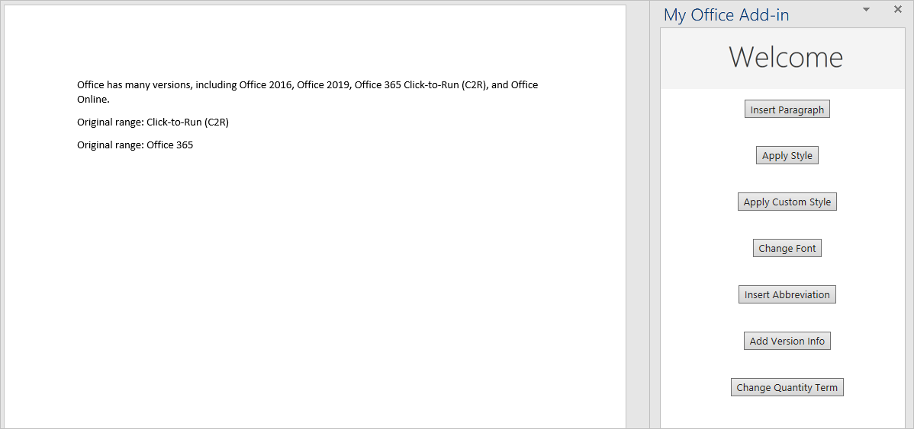
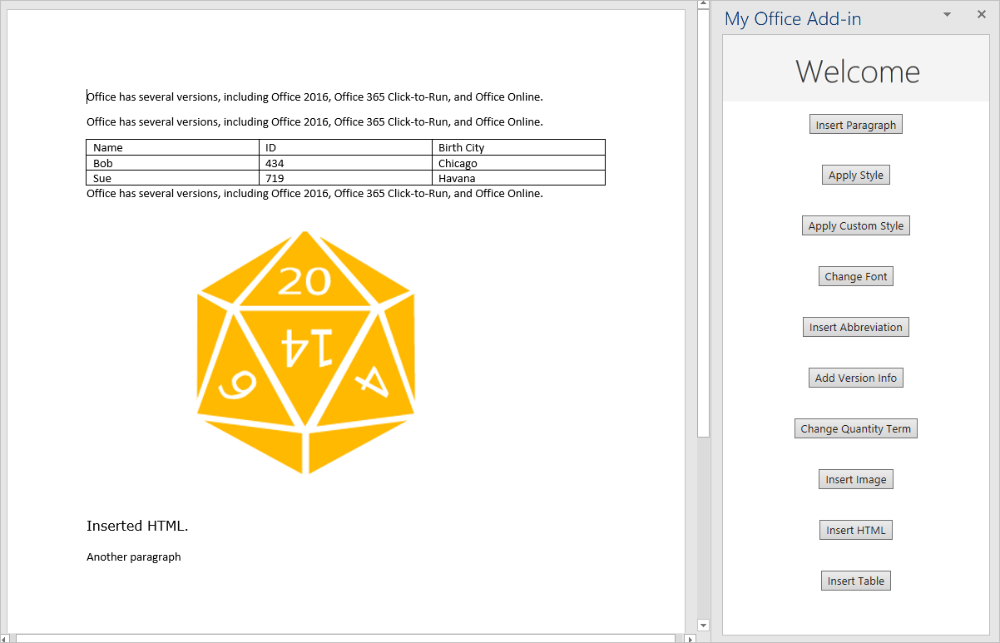

# <a name="tutorial-create-a-word-task-pane-add-in"></a>Учебник: Создание надстройки области задач Word

С помощью данного учебника вы сможете создать надстройку области задач Word, которая выполняет следующие действия:

> [!div class="checklist"]
> * Вставляет диапазон текста
> * Форматирует текст
> * Заменяет и вставляет текст в различных расположениях
> * Вставляет изображения, HTML-код и таблицы
> * Создает и обновляет элементы управления содержимым 

> [!TIP]
> Если вы уже выполнили [создать первую надстройку области задач Word](../quickstarts/word-quickstart.md) быстро начать и хотите использовать его в качестве отправной точки для этого учебника, перейдите к [вставьте диапазон текста](#insert-a-range-of-text) раздел, чтобы начать работу с этим учебником.

## <a name="prerequisites"></a>Предварительные требования

[!include[Yeoman generator prerequisites](../includes/quickstart-yo-prerequisites.md)]

## <a name="create-your-add-in-project"></a>Создание проекта надстройки

[!include[Yeoman generator create project guidance](../includes/yo-office-command-guidance.md)]

- **Выберите тип проекта:** `Office Add-in Task Pane project`
- **Выберите тип сценария:** `Javascript`
- **Как вы хотите назвать надстройку?** `My Office Add-in`
- **Какое клиентское приложение Office должно поддерживаться?** `Word`


После завершения работы мастера генератор создаст проект и установит вспомогательные компоненты Node.

[!include[Yeoman generator next steps](../includes/yo-office-next-steps.md)]

## <a name="insert-a-range-of-text"></a>Вставка диапазона текста

На этом этапе руководства мы программным способом проверим, поддерживает ли надстройка текущую версию Word, установленную у пользователя, а затем вставим абзац в документ.

### <a name="code-the-add-in"></a>Написание кода надстройки

1. Откройте проект в редакторе кода.

2. Откройте файл **./src/taskpane/taskpane.html**. Этот файл содержит HTML-разметку для панели задач.

3. Найдите элемент `<main>` и удалите все строки, которые появляются после открывающего тега `<main>` и перед закрывающим тегом `</main>`.

4. Добавляйте указанные ниже исправления сразу после открывающего тега `<main>`.

    ```html
    <button class="ms-Button" id="insert-paragraph">Insert Paragraph</button><br/><br/>
    ```

5. Откройте файл **./src/taskpane/taskpane.js**. Этот файл содержит код API JavaScript Office, который облегчает взаимодействие между областью задач и основным приложением Office.

6. Удалите все ссылки на кнопку`run` и функцию`run()`, выполнив следующие действия:

    - Найдите и удалите строку `document.getElementById("run").onclick = run;`.

    - Найдите и удалите всю функцию `run()`.

7. В вызове метода `Office.onReady` найдите строку `if (info.host === Office.HostType.Word) {` и добавьте следующий код непосредственно после этой строки. Примечание.

    - Первая часть этого кода определяет, поддерживает ли версия Word пользователя версию Word.js, которая включает в себя все API, которые используются на всех этапах этого руководства. В рабочей надстройке можно использовать текст условного блока, чтобы скрыть или отключить пользовательский интерфейс, где вызываются неподдерживаемые API. При этом пользователь по-прежнему сможет использовать те части надстройки, которые поддерживаются в его версии Word.
    - Вторая часть этого кода добавляет обработчик событий для кнопки `insert-paragraph`.

    ```js
    // Determine if the user's version of Office supports all the Office.js APIs that are used in the tutorial.
    if (!Office.context.requirements.isSetSupported('WordApi', '1.3')) {
        console.log('Sorry. The tutorial add-in uses Word.js APIs that are not available in your version of Office.');
    }

    // Assign event handlers and other initialization logic.
    document.getElementById("insert-paragraph").onclick = insertParagraph;
    ```

8. Добавьте следующую функцию в конец файла. Примечание.

   - Бизнес-логика Word.js будет добавлена в функцию, передаваемую методу `Word.run`. Эта логика выполняется не сразу. Вместо этого она добавляется в очередь ожидания команд.

   - Метод `context.sync` отправляет все команды из очереди в Word для выполнения.

   - За методом `Word.run` следует блок `catch`. Рекомендуется всегда следовать этой методике. 

    ```js
    function insertParagraph() {
        Word.run(function (context) {

            // TODO1: Queue commands to insert a paragraph into the document.

            return context.sync();
        })
        .catch(function (error) {
            console.log("Error: " + error);
            if (error instanceof OfficeExtension.Error) {
                console.log("Debug info: " + JSON.stringify(error.debugInfo));
            }
        });
    }
    ```

9. В функции `insertParagraph()` замените `TODO1` следующим кодом: Примечание.

   - Первый параметр метода `insertParagraph` — это текст нового абзаца.

   - Второй параметр — расположение в основном тексте, где будет вставлен абзац. Другие варианты вставки абзаца, родительским объектом которого является основной текст, — End и Replace.

    ```js
    var docBody = context.document.body;
    docBody.insertParagraph("Office has several versions, including Office 2016, Office 365 Click-to-Run, and Office on the web.",
                            "Start");
    ```

10. Убедитесь, что вы сохранили все изменения, внесенные в проект.

### <a name="test-the-add-in"></a>Тестирование надстройки

1. Выполните указанные ниже действия, чтобы запустить локальный веб-сервер и загрузить неопубликованную надстройку.

    > [!NOTE]
    > Надстройки Office должны использовать HTTPS, а не HTTP, даже в случае разработки. Если вам будет предложено установить сертификат после того, как вы запустите одну из указанных ниже команд, примите предложение установить сертификат, предоставленный генератором Yeoman.

    > [!TIP]
    > Если вы тестируете свою надстройку на Mac, перед продолжением выполните следующую команду в корневом каталоге вашего проекта. После выполнения этой команды запустится локальный веб-сервер.
    >
    > ```command&nbsp;line
    > npm run dev-server
    > ```

    - Чтобы проверить надстройку в Word, выполните приведенную ниже команду в корневом каталоге своего проекта. При этом запускается локальный веб-сервер (если он еще не запущен) и открывается приложение Word с загруженной надстройкой.

        ```command&nbsp;line
        npm start
        ```

    - Чтобы проверить надстройку в Word в Интернете, выполните следующую команду в корневом каталоге вашего проекта. После выполнения этой команды запустится локальный веб-сервер (если он еще не запущен).

        ```command&nbsp;line
        npm run start:web
        ```

        Чтобы использовать надстройку, откройте новый документ в Word в Интернете, а затем загрузите неопубликованную надстройку, следуя инструкциям из статьи [Загрузка неопубликованных надстроек Office в Office в Интернете](../testing/sideload-office-add-ins-for-testing.md#sideload-an-office-add-in-in-office-on-the-web).

2. В Word выберите вкладку **Главная** и нажмите кнопку **Показать область задач** на ленте, чтобы открыть область задач надстройки.

    

3. В панели задач нажмите кнопку **Вставка абзаца**.

4. Внесите изменение в абзац.

5. Снова нажмите кнопку **Вставка абзаца**. Обратите внимание, что новый абзац появляется над предыдущим, потому что метод `insertParagraph` вставляется в начало тела документа.

    

## <a name="format-text"></a>Форматирование текста

На этом этапе учебника вы сможете применить встроенный стиль к тексту, использовать пользовательский стиль для текста и изменить шрифт текста.

### <a name="apply-a-built-in-style-to-text"></a>Применение встроенного стиля к тексту

1. Откройте файл **./src/taskpane/taskpane.html**.

2. Найдите элемент `<button>` для кнопки `insert-paragraph` и после нее добавьте следующий текст:

    ```html
    <button class="ms-Button" id="apply-style">Apply Style</button><br/><br/>
    ```

3. Откройте файл **./src/taskpane/taskpane.js**.

4. В вызове метода `Office.onReady` найдите строку, которая назначает обработчик щелчка для кнопки `insert-paragraph`, и добавьте следующий код после этой строки:

    ```js
    document.getElementById("apply-style").onclick = applyStyle;
    ```

5. Добавьте следующую функцию в конец файла:

    ```js
    function applyStyle() {
        Word.run(function (context) {
            
            // TODO1: Queue commands to style text.

            return context.sync();
        })
        .catch(function (error) {
            console.log("Error: " + error);
            if (error instanceof OfficeExtension.Error) {
                console.log("Debug info: " + JSON.stringify(error.debugInfo));
            }
        });
    }
    ``` 

6. В функции `applyStyle()` замените `TODO1` следующим кодом: Обратите внимание, что этот код применяет стиль к абзацу, но стили также можно применять к диапазонам текста.

    ```js
    var firstParagraph = context.document.body.paragraphs.getFirst();
    firstParagraph.styleBuiltIn = Word.Style.intenseReference;
    ``` 

### <a name="apply-a-custom-style-to-text"></a>Применение пользовательского стиля к тексту

1. Откройте файл **./src/taskpane/taskpane.html**.

2. Найдите элемент `<button>` для кнопки `apply-style` и после нее добавьте следующий текст: 

    ```html
    <button class="ms-Button" id="apply-custom-style">Apply Custom Style</button><br/><br/>
    ```

3. Откройте файл **./src/taskpane/taskpane.js**.

4. В вызове метода `Office.onReady` найдите строку, которая назначает обработчик щелчка для кнопки `apply-style`, и добавьте следующий код после этой строки:

    ```js
    document.getElementById("apply-custom-style").onclick = applyCustomStyle;
    ```

5. Добавьте следующую функцию в конец файла:

    ```js
    function applyCustomStyle() {
        Word.run(function (context) {
            
            // TODO1: Queue commands to apply the custom style.

            return context.sync();
        })
        .catch(function (error) {
            console.log("Error: " + error);
            if (error instanceof OfficeExtension.Error) {
                console.log("Debug info: " + JSON.stringify(error.debugInfo));
            }
        });
    }
    ``` 

6. В функции `applyCustomStyle()` замените `TODO1` следующим кодом: Обратите внимание, что этот код применяет пользовательский стиль, который еще не существует. Мы создадим стиль с именем **MyCustomStyle** во время [тестирования настройки](#test-the-add-in-1).

    ```js
    var lastParagraph = context.document.body.paragraphs.getLast();
    lastParagraph.style = "MyCustomStyle";
    ``` 

7. Убедитесь, что вы сохранили все изменения, внесенные в проект.

### <a name="change-the-font-of-text"></a>Изменение шрифта для текста

1. Откройте файл **./src/taskpane/taskpane.html**.

2. Найдите элемент `<button>` для кнопки `apply-custom-style` и после нее добавьте следующий текст: 

    ```html
    <button class="ms-Button" id="change-font">Change Font</button><br/><br/>
    ```

3. Откройте файл **./src/taskpane/taskpane.js**.

4. В вызове метода `Office.onReady` найдите строку, которая назначает обработчик щелчка для кнопки `apply-custom-style`, и добавьте следующий код после этой строки:

    ```js
    document.getElementById("change-font").onclick = changeFont;
    ```

5. Добавьте следующую функцию в конец файла:

    ```js
    function changeFont() {
        Word.run(function (context) {
            
            // TODO1: Queue commands to apply a different font.

            return context.sync();
        })
        .catch(function (error) {
            console.log("Error: " + error);
            if (error instanceof OfficeExtension.Error) {
                console.log("Debug info: " + JSON.stringify(error.debugInfo));
            }
        });
    }
    ``` 

6. В функции `changeFont()` замените `TODO1` следующим кодом: Обратите внимание, что этот код получает ссылку на второй абзац с помощью метода `ParagraphCollection.getFirst`, привязанного к методу `Paragraph.getNext`.

    ```js
    var secondParagraph = context.document.body.paragraphs.getFirst().getNext();
    secondParagraph.font.set({
            name: "Courier New",
            bold: true,
            size: 18
        });
    ``` 

7. Убедитесь, что вы сохранили все изменения, внесенные в проект.

### <a name="test-the-add-in"></a>Тестирование надстройки

1. [!include[Start server and sideload add-in instructions](../includes/tutorial-word-start-server.md)]

2. Если область задач надстройки еще не открыта в Word, перейдите на вкладку **Главная** и нажмите кнопку **показывать панель задач** на ленте, чтобы открыть ее.

3. Убедитесь, что в тексте есть по крайней мере три абзаца. Вы можете нажать кнопку **Вставить абзац** три раза. *Внимательно проверьте, нет ли в конце документа пустого абзаца. Если он есть, удалите его.*

4. В Word создайте [настраиваемый стиль](https://support.office.com/article/Customize-or-create-new-styles-d38d6e47-f6fc-48eb-a607-1eb120dec563) с именем "MyCustomStyle". Его форматирование может быть любым.

5. Нажмите кнопку **Apply Style** (Применить стиль). К первому абзацу будет применен встроенный стиль **Сильная ссылка**.

6. Нажмите кнопку **Apply Custom Style** (Применить пользовательский стиль). К последнему абзацу будет применен созданный вами стиль. Если ничего не происходит, возможно, последний абзац пуст. Если это так, добавьте в него какой-нибудь текст.

7. Нажмите кнопку **Change Font** (Изменить шрифт). Шрифт второго абзаца изменится на полужирный Courier New с размером 18.

    

## <a name="replace-text-and-insert-text"></a>Замена текста и добавление текста

На этом этапе руководства мы добавим текст в выбранные диапазоны текста и за их пределами, а также заменим текст выбранного диапазона.

### <a name="add-text-inside-a-range"></a>Добавление текста в диапазон

1. Откройте файл **./src/taskpane/taskpane.html**.

2. Найдите элемент `<button>` для кнопки `change-font` и после нее добавьте следующий текст: 

    ```html
    <button class="ms-Button" id="insert-text-into-range">Insert Abbreviation</button><br/><br/>
    ```

3. Откройте файл **./src/taskpane/taskpane.js**.

4. В вызове метода `Office.onReady` найдите строку, которая назначает обработчик щелчка для кнопки `change-font`, и добавьте следующий код после этой строки:

    ```js
    document.getElementById("insert-text-into-range").onclick = insertTextIntoRange;
    ```
5. Добавьте следующую функцию в конец файла:

    ```js
    function insertTextIntoRange() {
        Word.run(function (context) {

            // TODO1: Queue commands to insert text into a selected range.

            // TODO2: Load the text of the range and sync so that the
            //        current range text can be read.

            // TODO3: Queue commands to repeat the text of the original
            //        range at the end of the document.

            return context.sync();
        })
        .catch(function (error) {
            console.log("Error: " + error);
            if (error instanceof OfficeExtension.Error) {
                console.log("Debug info: " + JSON.stringify(error.debugInfo));
            }
        });
    }
    ``` 

6. В функции `insertTextIntoRange()` замените `TODO1` следующим кодом: Примечание.

   - Этот метод призван вставить аббревиатуру ["(C2R)"] в конце диапазона с текстом "Click-to-Run". Для простоты предполагается, что такая строка существует и пользователь выделил ее.

   - Первый параметр метода `Range.insertText` — это строка, вставляемая в объект `Range`.

   - Второй параметр указывает, в каком месте диапазона требуется вставить дополнительный текст. Помимо значения End, можно использовать значения Start, Before, After и Replace. 

   - Разница между значениями End и After состоит в том, что End вставляет новый текст в конце имеющегося диапазона, а After создает новый диапазон со строкой и вставляет его после имеющегося. Аналогично, Start вставляет текст в начале имеющегося диапазона, а Before вставляет новый диапазон. Replace заменяет текст существующего диапазона на строку из первого параметра.

   - На одном из предыдущих этапов руководства вы могли заметить, что в методах insert* объекта body нет параметров Before и After. Это связано с тем, что содержимое невозможно добавлять за пределами основного текста документа.

    ```js
    var doc = context.document;
    var originalRange = doc.getSelection();
    originalRange.insertText(" (C2R)", "End");
    ```

7. Пропустим заполнитель `TODO2` до следующего этапа. В функции `insertTextIntoRange()` замените `TODO3` следующим кодом: Он похож на код, созданный на первом этапе руководства, но теперь мы вставляем новый абзац в конце, а не в начале документа. Новый абзац покажет, что новый текст теперь входит в исходный диапазон.

    ```js
    doc.body.insertParagraph("Original range: " + originalRange.text, "End");
    ```

### <a name="add-code-to-fetch-document-properties-into-the-task-panes-script-objects"></a>Добавление кода для получения свойств документа в объекты скрипта области задач

Во всех предыдущих функциях этой серии руководств вы ставили команды в очередь для *записи* в документ Office. Каждая функция заканчивалась вызовом метода `context.sync()`, который отправляет выставленные в очередь команды документу для выполнения. Но код, который вы добавили на последнем этапе, вызывает свойство `originalRange.text`, и в этом заключается существенное отличие от ранее написанных функций, так как `originalRange` является лишь объектом прокси, существующим в скрипте вашей области задач. В нем нет сведений о фактическом тексте диапазона в документе, поэтому его свойство `text` может не содержать настоящего значения. Необходимо сначала получить из документа текстовое значение диапазона, а затем задать с его помощью значение для свойства `originalRange.text`. Только после этого можно будет вызвать метод `originalRange.text` без исключения. Процесс получения делится на три этапа:

   1. Добавление в очередь команды для загрузки (т. е. получения) свойств, которые должен прочесть ваш код.

   2. Вызов метода `sync` объекта контекста, чтобы можно было отправить документу находящуюся в очереди команду для выполнения, а также для возврата запрошенных данных.

   3. Метод `sync` асинхронный, поэтому его выполнение должно быть завершено до того, как код вызовет полученные свойства.

Эти три действия должны выполняться каждый раз, когда коду нужно *прочесть* данные из документа Office.

1. В функции `insertTextIntoRange()` замените `TODO2` следующим кодом:
  
    ```js
    originalRange.load("text");
    return context.sync()
        .then(function() {
            // TODO4: Move the doc.body.insertParagraph line here.
        })
        // TODO5: Move the final call of context.sync here and ensure
        //        that it does not run until the insertParagraph has
        //        been queued.
    ```

2. Для двух операторов `return` не может использоваться один путь кода, который не разветвляется, поэтому удалите последнюю строку `return context.sync();` в конце метода `Word.run`. Последний метод `context.sync` будет добавлен позже в этом руководстве.

3. Вырежьте строку `doc.body.insertParagraph` и вставьте ее вместо заполнителя `TODO4`.

4. Замените `TODO5` на приведенный ниже код. Обратите внимание:

   - Передача метода `sync` в функцию `then` гарантирует, что он не будет выполняться, пока логика `insertParagraph` не будет поставлена в очередь.

   - Метод `then` вызывает функцию, которая передается ей, и вы не хотите, чтобы `sync` выводились дважды, таким образом, "()" следует опустить после context.sync.

    ```js
    .then(context.sync);
    ```

Когда все будет готово, функция должна будет выглядеть так:

```js
function insertTextIntoRange() {
    Word.run(function (context) {

        var doc = context.document;
        var originalRange = doc.getSelection();
        originalRange.insertText(" (C2R)", "End");

        originalRange.load("text");
        return context.sync()
            .then(function() {
                doc.body.insertParagraph("Current text of original range: " + originalRange.text, "End");
            })
            .then(context.sync);
    })
    .catch(function (error) {
        console.log("Error: " + error);
        if (error instanceof OfficeExtension.Error) {
            console.log("Debug info: " + JSON.stringify(error.debugInfo));
        }
    });
}
```

### <a name="add-text-between-ranges"></a>Добавление текста между диапазонами

1. Откройте файл **./src/taskpane/taskpane.html**.

2. Найдите элемент `<button>` для кнопки `insert-text-into-range` и после нее добавьте следующий текст: 

    ```html
    <button class="ms-Button" id="insert-text-outside-range">Add Version Info</button><br/><br/>
    ```

3. Откройте файл **./src/taskpane/taskpane.js**.

4. В вызове метода `Office.onReady` найдите строку, которая назначает обработчик щелчка для кнопки `insert-text-into-range`, и добавьте следующий код после этой строки:

    ```js
    document.getElementById("insert-text-outside-range").onclick = insertTextBeforeRange;
    ```

5. Добавьте следующую функцию в конец файла:

    ```js
    function insertTextBeforeRange() {
        Word.run(function (context) {

            // TODO1: Queue commands to insert a new range before the
            //        selected range.

            // TODO2: Load the text of the original range and sync so that the
            //        range text can be read and inserted.

        })
        .catch(function (error) {
            console.log("Error: " + error);
            if (error instanceof OfficeExtension.Error) {
                console.log("Debug info: " + JSON.stringify(error.debugInfo));
            }
        });
    }
    ```

6. В функции `insertTextBeforeRange()` замените `TODO1` следующим кодом: Примечание.

   - Этот метод предназначен для добавления диапазона с текстом "Office 2019, " перед диапазоном с текстом "Office 365". Для простоты предполагается, что такая строка существует и пользователь выделил ее.

   - Первый параметр метода `Range.insertText` — это добавляемая строка.

   - Второй параметр указывает, в каком месте диапазона требуется вставить дополнительный текст. Дополнительные сведения о вариантах расположения см. выше в описании функции `insertTextIntoRange`.

    ```js
    var doc = context.document;
    var originalRange = doc.getSelection();
    originalRange.insertText("Office 2019, ", "Before");
    ```

7. В функции `insertTextBeforeRange()` замените `TODO2` следующим кодом:

     ```js
    originalRange.load("text");
    return context.sync()
        .then(function() {
            // TODO3: Queue commands to insert the original range as a
            //        paragraph at the end of the document.
        })
        // TODO4: Make a final call of context.sync here and ensure
        //        that it does not run until the insertParagraph has
        //        been queued.
    ```

8. Замените `TODO3` на приведенный ниже код. Этот абзац покажет, что новый текст ***не*** входит в исходный выделенный диапазон. Исходный диапазон по-прежнему содержит такой же текст, как и когда он был выделен.

    ```js
    doc.body.insertParagraph("Current text of original range: " + originalRange.text, "End");
    ```

9. Замените `TODO4` на приведенный ниже код.

    ```js
    .then(context.sync);
    ```

### <a name="replace-the-text-of-a-range"></a>Замена текста диапазона

1. Откройте файл **./src/taskpane/taskpane.html**.

2. Найдите элемент `<button>` для кнопки `insert-text-outside-range` и после нее добавьте следующий текст: 

    ```html
    <button class="ms-Button" id="replace-text">Change Quantity Term</button><br/><br/>
    ```

3. Откройте файл **./src/taskpane/taskpane.js**.

4. В вызове метода `Office.onReady` найдите строку, которая назначает обработчик щелчка для кнопки `insert-text-outside-range`, и добавьте следующий код после этой строки:

    ```js
    document.getElementById("replace-text").onclick = replaceText;
    ```

5. Добавьте следующую функцию в конец файла:

    ```js
    function replaceText() {
        Word.run(function (context) {

            // TODO1: Queue commands to replace the text.

            return context.sync();
        })
        .catch(function (error) {
            console.log("Error: " + error);
            if (error instanceof OfficeExtension.Error) {
                console.log("Debug info: " + JSON.stringify(error.debugInfo));
            }
        });
    }
    ```

6. В функции `replaceText()` замените `TODO1` следующим кодом: Обратите внимание, что этот метод предназначен для замены строки "several" на строку "many". Для простоты предполагается, что такая строка существует и пользователь выделил ее.

    ```js
    var doc = context.document;
    var originalRange = doc.getSelection();
    originalRange.insertText("many", "Replace");
    ```

7. Убедитесь, что вы сохранили все изменения, внесенные в проект.

### <a name="test-the-add-in"></a>Тестирование надстройки

1. [!include[Start server and sideload add-in instructions](../includes/tutorial-word-start-server.md)]

2. Если область задач надстройки еще не открыта в Word, перейдите на вкладку **Главная** и нажмите кнопку **показывать панель задач** на ленте, чтобы открыть ее.

3. В области задач выберите **Вставить абзац**, чтобы убедиться в том, что в начале документа есть абзац.

4. В документе выберите фразу "Click-to-Run". *Будьте осторожны, чтобы не включать пробелы или запятые в выделенном фрагменте.*

5. Нажмите кнопку **Insert Abbreviation** (Вставить аббревиатуру). Обратите внимание на добавленную строку " (C2R)". Кроме того, обратите внимание, что в конце документа добавлен новый абзац со всем развернутым текстом, так как новая строка была добавлена к имеющемуся диапазону.

6. В документе выберите фразу "Office 365". *Будьте осторожны, чтобы не выделить пробел в начале или конце фразы.*

7. Нажмите кнопку **Add Version Info** (Добавить сведения о версии). Обратите внимание, что между строками "Office 2016" и "Office 365" вставлена строка "Office 2019, ". Кроме того, обратите внимание, что в конце документа появился новый абзац, содержащий только изначально выделенный текст, так как новая строка стала новым диапазоном, а не была добавлена к существующему.

8. В документе выделите слово "несколько". *Будьте осторожны, чтобы не выделить пробел в начале или конце фразы.*

9. Нажмите кнопку **Change Quantity Term** (Изменить числительное). Обратите внимание, что слово "many" заменило выделенный текст.

    

## <a name="insert-images-html-and-tables"></a>Вставка изображений, HTML-кода и таблиц

На этом этапе руководства мы рассмотрим вставку изображений, HTML-кода и таблиц в документ.

### <a name="define-an-image"></a>Определение изображения

Выполните следующие шаги, чтобы определить изображение, которое вы вставите в документ в следующей части этого руководства. 

1. В корневом каталоге проекта создайте новый файл с именем **base64Image. js**.

2. Откройте файл **base64Image.js** и добавьте следующий код, чтобы указать строку в кодировке Base64, представляющую изображение.

    ```js
    export const base64Image =
        "iVBORw0KGgoAAAANSUhEUgAAAZAAAAEFCAIAAABCdiZrAAAACXBIWXMAAAsSAAALEgHS3X78AAAgAElEQVR42u2dzW9bV3rGn0w5wLBTRpSACAUDmDRowGoj1DdAtBA6suksZmtmV3Qj+i8w3XUB00X3pv8CX68Gswq96aKLhI5bCKiM+gpVphIa1qQBcQbyQB/hTJlpOHUXlyEvD885vLxfvCSfH7KIJVuUrnif+z7nPOd933v37h0IIWQe+BEvASGEgkUIIRQsQggFixBCKFiEEELBIoRQsAghhIJFCCEULEIIBYsQQihYhBBCwSKEULAIIYSCRQghFCxCCAWLEEIoWIQQQsEihCwQCV4CEgDdJvYM9C77f9x8gkyJV4UEznvs6U780rvAfgGdg5EPbr9CyuC1IbSEJGa8KopqBWC/gI7Fa0MoWCROHJZw/lxWdl3isITeBa8QoWCRyOk2JR9sVdF+qvwnnQPsF+SaRSEjFCwSCr0LNCo4rYkfb5s4vj/h33YOcFSWy59VlIsgIRQs4pHTGvYMdJvIjupOx5Ir0Tjtp5K/mTKwXsSLq2hUWG0R93CXkKg9oL0+ldnFpil+yhlicIM06NA2cXgXySyuV7Fe5CUnFCziyQO2qmg8BIDUDWzVkUiPfHY8xOCGT77EWkH84FEZbx4DwOotbJpI5nj5CQWLTOMBj8votuRqBWDP8KJWABIr2KpLwlmHpeHKff4BsmXxFQmhYBGlBxzoy7YlljxOcfFAMottS6JH+4Xh69IhEgoWcesBNdVQozLyd7whrdrGbSYdIqFgkQkecMD4epO9QB4I46v4tmbtGeK3QYdIKFhE7gEHjO/odSzsfRzkS1+5h42q+MGOhf2CuPlIh0goWPSAogcccP2RJHI1riP+kQYdVK9Fh0goWPSAk82a5xCDG4zPJaWTxnvSIVKwKFj0gEq1go8QgxtUQQeNZtEhUrB4FZbaA9pIN+98hhhcatbNpqRoGgRKpdAhUrDIMnpAjVrpJSNApK/uRi7pEClYZIk84KDGGQ+IBhhicMP6HRg1ycedgVI6RELBWl4POFCr8VWkszpe3o76G1aFs9ws+dMhUrDIInvAAeMB0ZBCDG6QBh2kgVI6RAoWWRYPqBEI9+oQEtKgg3sNpUOkYJGF8oADxgOioUauXKIKOkxV99EhUrDIgnhAG+mCUQQhBpeaNb4JgOn3AegQKVhkvj2gjXRLLrIQgxtUQYdpNYsOkYJF5tUDarQg4hCDS1u3VZd83IOw0iFSsMiceUCNWp3WYH0Wx59R6ls9W1c6RAoWmQ8PaCNdz55hiMEN4zsDNhMDpXSIFCwylx5Qo1a9C3yVi69a2ajCWZ43NOkQKVgkph5wwHi+KQ4hBs9SC9+RMTpEChaJlwfUFylWEafP5uMKqIIOPv0sHSIFi8TFAzpLiXxF/KCbdetEGutFUSa6TXQsdKypv42UgZQhfrWOhbO6q8nPqqCD/zU4OkQKFpm9B7SRbrTpQwzJHNaL/VHyiRVF0dfC2xpOzMnKlUgjW0amhGRW/ZM+w5sqzuqTNWtb9nKBZDLoEClYZGYe0EYaENWHGDaquHJv5CPnz/H9BToWkjmsFkTdOX0GS22p1ovYNEdUr9vCeR3dJlIG1gojn2o8RKPiRX+D0iw6RAoWmYEH1HioiQZqq47VW32dalUlfi1fQf7ByEdUQpMpYfOJ46UPcFweKaMSaWyaWL8z/Mibxzgqe3G4CC6pT4dIwSLReUCNWrkJMdjh8sMSuk1d3bReRGb3hy97iS/SEl+5bQ0LqM4B9gvytaptC6kbwz++vD3ZG0r3EBDoWUg6RAoWCd0D9isXReTKTYghZbhdUB/UYlKV2TSHitZtYc9QrqynDGy/GnGg+4XJr779ShJ0gNdAKR3i/PAjXoIZe8BGBS+uhqtWAF4VXUWu3G//ORVqdVRiEumhWgFoVHT7gB1LnFAvVaJxYZJ+qx/XRuo1X0+RFqzPsF/QFZuEgrVcHnDPCGbFylnajN/wAZZvqgpR8IzO275tTvjnwl/4sORC6C9xWJLoYCKNrbpuR3Jazp/jxdUJmksoWIvvAfcLsD4LuLfn5hOJhWlVQ+lyNZDFcUl636GY5/Wpyzo3FRZ+WBeT1JhpGDVlIMMbjYfYM3Ba4zuXgkUPGBD5B5Kl6LaJ4/uh/CCDTvDjW4ROxZm4gj7+dwZLY24067AkF9OtesCaRYdIwaIHDIzMrmSzv2NNTgl4fLlSXw6kjs8pWN+FfHu3n8p/xpSBjWrwL0eHSMGiB/TL+h1JnNJ+xTA6MawXh1ogTWA5S5tvLS8vMVUM6s1j+TKZEASjQ6RgkVl6wH4pcUM+zs8qBq9WyRyMGozP+5J0/nzygrrLSkS4ONPmNg/vyr1npiQG9+kQKVhkBh5woFbSI8EuQwxTkS1j2xoG0zsHeBVcRsl/RNMqyoMOG9WRjAUd4pzD4GhoHjDsMIEqchX48JuUgU1zJN+kSa4D+LnjHfXiqqsa5Oejb8J/fs9TAZjFtiXXvgADpaqXZsqUFRY94NRq1agErFbrRWzVR9Tq9JlOrWy75NncCf982n+o+sYCDJTSIVKw6AGnRhoQbZsBv3S+MlyxAtC7xPF9WMUJDsi5M+gmVCWImpvolorOgXzTMPBAKR0iBWvuPWB4+4CiWj2Rz3MPcFSXHb90NmawbWDLRVZAc2pHZTkF2fWDKugQRqBUCvcQKVj0gI6qRxYQtfvGBIUdvHQ2fmk/VR7fk5Q5jr+2fmfygrpTfM+fu8qa6lEFHcIIlGocolWkQwwcLrr79oBB9YRxg7SDXbDjJISue71LHJWnrno+vRh+BX2Xq2QOO6+Hf3TTXsYl43M3BhVcZFNjEyvIluUNvAgrrIX1gINqRdpvM0C1EhatbBvowaM5neOVe/L2VX176/jip88CUysAhyV5SRheoFRSfV+i8RAvckH+XKyweBW8qNWeEelEP1XkKqgQw3j/T3sxyNv6cSKNm02xA3KrOvLV1gq4Xh1u3vUusWcE7KESK7jZlHvSoDqU+q/4CAUrItomWtUoRvup1KpRCWxb0KiNqFXvcoreWCem/ETh+ILRYJnvJzlxz+7wrt/l9qkuHUIIrMk9bxaZEjIltl2mYMWDjoVWFae1sAouVeQq2LUYZwfRaVG1dR9PnKp802EpxG016TCOgZsOb6tk9RayZVZVFKwZ8cff4b/+Htcq8sd17wInJt5UA17SUqnVWR0vbwf5Qn5KgPO6bo0mU0K2LJetbgtvqjgxQw8uqcbthDH+OrHS/5FV19MuJDXreoSCFQC9C3yxisQK8hVk1dteZ3W8qQY2VFm68OF/emj0JNJ430DKQCKN3gU6FrrNSHf9VaMrfI68F+ynXVKpkhxndRyX0TlQzv4hFKyABWuwMPGROWxiJ6kdmmibaJu+7gTpPRbgDbZsqJa9/T8AMrvIlnWx/m4Tx+XhY4yC5RXGGjzRbeHlbd3ZsWQO+Qp2mth84nFtSBoQtS0M1cobqqCD50BpMovrj/Dpufyk1OBXZueKgyq6KVjEI/bZMf3ef6aErTp2XiOzO8UtIe0gCuCoHMWm5MLWyJfK09HTdihdvwPjc+w0J4wvbJv4KhfF2VIKFnHLm8f4KjfhkF0yh00TN5vYfDJ510wVED0qR7ENv7Sa5SZQmlhB/gF2XsOoTdj+O6tjz8Dh3Tlbaow9XMNy/153rGGpDIJ+Ycv5bm6bcvVR5YaiPFCy8Kze6s+4lj4VpIHS1Vv4sORqa09YrlL5fa5hUbBmLFiDd/am6Soi0LtAqzqyMK9Sq8BDDEQVdMBooDSxgvXihAV14RfqxgBSsChYcREsmyv3lImtcU5raJs4q8sjV/MYYpgLrj9SxlP2C/iuiXxFl1EYL4GPym5/TRQsCla8BKu/3qFNbLl80a9yVKuwUIWzpmKQrnIPBcsrXHQPT+AucXzf70l91lahclT2FV7tNmEV8fI2t24jI8FLEC52Ysv9wpbAtsVLGNNy2+VyFWGFNX+4SWyReYHpKgrWUuAmsUXiDNNVFKwlsxJBLGyRGVh7LlfFAq5hzeTd38LL27oo0ABpnykSIG766pzWYH3GS0XBWvJr7yLg8/1F1J18l4pk1lXuhM1CaQkJPixN/jvXKlGMpVpa8u7CvSkj9CGshIIV92e7tOvxeBXGhGFIrN6Sp0ZPa5Jw1gfsdEzBWmbGb4BuE4d3JbdKtszHe1jllZTjsqTBvJtymFCwFpbxpRM77nAouzE+MnnBAiazK++rYZ9Flw4B4mODgrWkpG5I1nHf1gDFrPa1gveRNmQc+5jnOL2L/pDqzoGkN2mArpChFgrWXD3eS5J38KDJjDTKsMG4aaDlrXTjr1UdJkJPTLpCChYBAEmzSqcHOX8utySZXV65AFBFGezjgULBS1dIwaIflDzehVVeVZHFiIN/VFEGoZtVtyUxbtwrpGDNDb3fheUH26Z4Nq3bkhw5TKT9dtciqihDtynpWN2mK6RgzS/vemH5QemU9kZF0tohX6Er8VteSTmWPQlOZa5w4gwRQsFaZD/Yu5APLOhdyvs6XOfqu+faVhFlOKsrfwXjRRZHzFOwlumeKbkqr2xaVUmOdL3IiEPA5ZXmhPn4b2edy1gUrOVh/O2uaY/Vu2TEITi1eiCPMrRNnD9XC9Yz0Zgnc3SFFKxl9YPd5oT+Su2nkgQjIw7TklhR7ldMbOBzQldIwVpOxu+Z8SWScY7K8iKLEQf3bFTlUYZWdZjXVT4zTLrCGD16eAlm6QfdCJZ9WEdYLbYjDmG3FU/mRqoJD90EV3+Ga//o5aUPS77m2QiFrbQm6l24+ok6B+g2R0pj2xWy9SgFa6HV6o74kO9Ykx/vNsdlyficfGVkanRIgpV/4Euw3v/E4xZBMheYYKn2VZ0HcfS0quK6YaaE4/t8U9MSLlN55X4aRedAXouxVZab54Q0ytBtTnH933KvkIJFwdIEGsaRVjeZEiMOHsurRmWKyTfdlrj1wb1CCtZy+cHT2nSjorotuWbFvMj6w6/xhxN81xL/G/zsvY7ks384wfdBDHBURRmkB3EmukIBHpOaBVzDmlF55Wa5ffyeyZZF4VsrILM79e0XGb/5JX7zS8nHt+r92rDz79gvhPPWVkcZpF0S9cgTpHf51maFtQSCpTqOo0d1WCfPQRUyVFGGs7ouKaq5+IJmJdJYv8PLTMFaDj/ojcZDyd5ZMkd7IqKKMsDHqEcGsihYS+oHT0zvX016v3FQhYBqrV1/EGeCKxw7pkPBomAtGokV8W3dbXq/Z6A4rMNpYE5Wb8mjDPA9SZuucOb3Ey9B6OVVUH5wwFEZW3Xxg5kSTkxfUmjj/MrCdz7+ovpvclxYo2HTVKqVz5xtqyo6zfWil+VIQsGaGz/4xnevBelhHQD5Cl7eDqA88fCpcX6cns0Fv3JPHmUQWrZ7Y/yYDvcKaQkX2Q+6P46j5+uS5IN2xCEO9C7xrTWbC36toiyOpgq+KS25SVfICmtpyqsTM5ivbA/7HN8Iy1emjqQKOGu0lIHrj+SfEhD+5mFJ0t85AlQDJrrNwA6Kt01xuZCukIK1sILlIS+qolGRLJDZEQc/N6dmxqfmU85dufbTANbpPKCa3wXfa+3Co6JjIWX4coWzWt2jJSRT+EGftc/4nSNdlMmWo86R5ivDg3XdlryBVwR8ZCrVIdiTACdjrnBaJx7g24CCRcIqrwKvO1pVifNKpCPtoZwyRlrQfD0jM6iJMgQuoEyQUrAWX7B6F8ELVu8S38jMTqYUXS8BZ4ag8VBnGyP7NgQb6z/qMX7ZhV/lepGnoyhYMeP/vouRHxzw5rG80V0008CcZrBzEORS0VSoogxQDBz0D6fpULAWSrAi8IPDukYmE2uF0LfbBTPooQVCIGiiDG0zrEbG7ac8pkPBWiCEwEG3GeLOd/up3IiFXWQ5Xdjx/ZntfKmiDEC4FR9dIQVrQUhmxQXgsLf5pXem0JE9PDN4/jyAELnnS62JMoTa8P7EpCukYC0EH4QZv5JiH9YZJ6SIg9MM9i5nZgY1VWQgB3EmXnNh9ZCCRcGaSz4cvYE7VhQjoaSHdUKKODjNYIDzuKZl9ZZSI76pRJF1oiukYC2CH3TGoBHccRw99mGdcQKPODjN4Omz2YTabVRa3G3izeMovoHxc+wssihYc+8H30Z1Szcq8tBmgKvv8TGDmV3xweC8DtEwPk2HgkXBmm8/eFoLd+lXuH+kCzcBRhycZtAqzibUDiCxoiyvzuqRjuQQyuf1Ilu/UrDm2Q9G7Jikh3WCKrKcZvDN41BC7X/+NzBq+Nk3yurJZnx6UPTllap8/oBFFgVrfv1gxILVu5QfnUvmcOWe3y8+CBB0DuRHgvyI1F//Cp9+i7/6Bdbv4E/zuv5/yayyH3QYB3EmVrXCr/jDEu8DCtZ8+sG2OYNz+e2n8m27a76ngQ3+eYDtrlZv9UXqp3+BRMrVP9FUi1/PQiwEwUoZdIUULPrBaZAeoAtqUEXj4SzbOWmiDG0zuuVC4bcsyDddIQVrDhCO43iblhrMLfRMmSP1+fCP4ITz//4WHUuZ7dpQJ0VndfR6vHkDXSEFa/4E68Sc5Tejuns/Mn3dmVY4tUOvg9//J379C/zbTdQ/wN7HcsHSRBla1dmUV3SFFKy5JHVD7HAS9nEcPefP5YZ0rTDd8BtBBIMKtf/oJwDwP/+N869w/Hf44n3861/iP/4WFy+U/0QTZfB/EGe9qOyo5bKkFa4MXWE4sKd7OOVVtxnFcRw9x2X5cs+miRdXXX2Fb62RwRMB5hga/4Df/2o6+dNEGfwfxLle7ddEnqOwp7WRY9gfliJK27PCIh4f0YJDmTmqwzruIw69C5zVh/8FyG//aTq10nRl8H8QJ1/pq1VmVzKIyCXCpaYrpGDNkx98W4vFN3ZUlucPrlXm7JhueE2vEukRKfS8kdo5EDdPPWsfoWBF6gfP6gEvAKcM5Cv9/zIl5a0rKZEu5bVeUBGHaFi9pbz5/R/E2aiOaHcy611oTkwKVti89+7dO14Fd49QC3sfyz+183qkwjosBXacba2AfEVcJrdlSHUKR9SmFdxsyjXuRW6WO2vu+eRL5USc/YKvaHvKwPYriZV+kfPy1ZJZ7Iz63D1DuZT5c953rLBi4gcDyYsmc9g08cmXkk29xAryD3CzqbyNBXVTzbnyE3GIrnrdVf6YpzW/B3Gc247dVl++PRdZ3Za40qf5OrM6N07Boh8U7yKfO1a2VO28njCeM7GCT750dWupDuv4iThEQ2JFZ119TsRZL478+F+Xhsthnv2ysPSu6TbzLYc/U7BmgvCm9Bm/ShnYtiRS1TlA4yEaD3H+fEQQN5+46imq2q3fqMb62mbLyvld/g/iOM8k2mcDBl/Tc5ElFNfJXHQDIilYxIVa3Rm5o3wex0kZ2KqL+3ftp3hxFXsGGhU0Ktgv4Is0Xt4eytaVe5MrAlXT95Qx9Zj1yNBEGXoXk+c5pwydZR5EGWzXPCjWfBZZvUvxicWldwrWbHjXm1xe+Vy92jRH1KpzgL2P5U3Tz+ojp2TyD5SVyADV9r+wTRYfNFGGVnWC706kYdTwyZfYqktkS4gytKrDKzxw9EEVWexBSsGaDb3fTRYsP3lRofl65wD7BV1fBGFH302RJbWrwt0bEzRRBjcHca79UECt3pLIllOju60RKXd+cW9F1umzkQV1ukIKVoz8oLME8Hkcx6l9vUvsFyZvJDnv29XC5JdQFVlOfxSf8krFUXlCeZXMiWLnlC3BBY+30BqUb56LrBO6QgpWHAUr0OV2Z49NVUJdoGMNb103iqNq+o7wx0RPV2yqowzd5uSMW7eJPUOymDiQLWc1NL6057/Icr9XSChY8ypYmnUQvWYNcBPLUk3WEfb4Z0ggUYZuE1YR1meSWmxgBp1r7SrF8VZkdQ5Glh2TubjHRyhYS+cHO5bfXXan9LhPFTrvBDfHiVWHdRCbiIMmynBWn24T9rSGr3LKo9HfXygX9Z11nLciS7jIbOlHwYpXeeW/PcP3DpHSz4xRlVQu+x84N8WcxCHikFjR7QB4OOdsByBe3pYsLyaz2H6FTVOuj4PX8lZkveVeIQUrzoI10cQl0hNaxDkrLDfbdon0yMKT+0Mqvcv4Rhw2qsqqx89BnLM69gx5CZzZxc5ryev6LLKEGauJdGCjISlYxK8fnHgcZ72Im01dh1+MtsfL7E7OVW1UR/bLT8wpvn/VYZ3ZRhxSN3S1jM+DOGuF4b6EcFoAwJV7uNkUk1+DqtlbkSUU3SyyKFhzU14Zn/crF826eO9iZP9r09S1kcmWR+zb6bOpl/xVh3VmGHHQ7FT6b9k+qJJ6l3hVxJ4h7jYOjpQPtKljDWs6D0UWE6QUrFiQWBl53gpCI7d7Pyyg6B/UDUer39Vb2KpLNCuRxkYV1x+NfHEPjX1Vh3Uwo4jD+h2lmvufiOM85m235ek2cVjCy9uizUysYPMJdn6QLT8rWcI0HbpCCtZ8lFdOd5C6oSuy7LvIaZGcD/y1AjIlbFsjDY57l97HmqpM1kwiDvryymcDDLuNcrclbpKe1bFfwOFd8esns9h80k9s+SmyGMgKGjbwc81ZvT+Rwfh85J3npodcIo2bzb4rPH+O/cIEQRQOFWqe4frjOxPZfCIvHAY/bDTkHyjlwE6BBjVAO5nTLd7lH8i+gdbQIx/endp6f3o+LJN7F/hitf//mq6EhBVWkH7QqVbdpqutK2d4WjO7eFCyfZVD4+GEgz7+1QrqoMBaIbqIw8QoQ1BqBXXyw3adL65KfpvOFT2fK1l0hRSsOfCD475m05zwdLXvnz0DL66i8VByx3YOsGcEMDJeOPo7UvVENahCE2VwcxAnQLpN7Bfw8rZygd/DShb3CilYMRKsN67Xp3sXw/Upu1mopn2KfXzXqGHnNfIPROGwTWVQM01VveGTuSgiDvoog+cpgT69/4scju8HU9kJx3TWi3M2ryhmcA1rmvexVcSnjntbM5ZCxaY5YrXsjaSOhY6FRBopA8kcUoauIUnjod8tM0kxpVhC6l0o85ZBoVnKiXgdTeJV09iojvy+vM2nEC6vPaOEa1gUrNAFq22OpNWPyl5GeAqa5Z7z52hUAh5oOkAY/DOgbeLwbmjl6h0Yak/tcyJOYDWggY1qf9vUw6I7xqbpnNZgfUbBoiWM3A96a89wWJrabpw+w8vb2C+EpVZQr75nSiFGHDRRhrYZC7Wy6+j9AqzPvKRzB3WZc7WRrpAVVhRc/AvSPxOfk37sxnoRawUkc0ikJR6w28J5HWd1nNYiGgm1/Up+cigka3blnq4/xLzMTPT2wx6WkCmxwqJghcnvj/DTDXElItgVk/cNAPjWms3QOjtbr6oKA/5h1eNdAbSqOL6/UG+exMrI6udpDYk0BYuCFSZ//B3+5M/6/9+7wFe5IPNBMUG1sBJsehPA9Ue6iTgLeW2FvHHHcttEiDjgGpZrBmqFIKalxhPVYZ1gIw6a+V0I4iBOPBEie1QrCtbM3nwLQ+dAua6cLQfWxeEjU/mpbhONh4t5bdtPOZ6egjULuk1f01JjjqrpeyLtfYC7k9VburWbwCNmfM5RsFheLbQcqyfrCJMTvaFpu9qxIj2IEz0nJu8eClb0tf2iv+1Uh3Xgu1XWlXu6TqpH5QW/sOfPAztQRcEiruhYvqalzgW9S3yjsGZrBe/9BhIruKZ2fGf1uCRFWZ5TsFjVzxlvHitrAc9FluawN3y3bGd5TsEiEt4uzRNStf6dzMkb3enRRxna5uLXrf0K/SCApkAULOK2nl+k8yITaoGnyqOL2fLUp+E+Mr2II4t0QsHyJVhLhUpH7L4r7pkYZViex8BSFekULApWpGgm60wVcdCom7N59JLQbXHp3TMJXgK3vOvBqKF3gY6FbhPdJr5rLn5p8HVppJeTk+tVV10c9ONjF/UgzshNtoKUgR+nkTKGbRqJJ3j42f8Ds4luEx2rr2XfX6BjLdRNqJqsA8AqTgj967sydJt4cXWh3gypG8M2DKsFAGzJQMGaE2wzdV7v/3/vYl43wpJZbFty0ZmoOJr5XQiha02U1+QnOSRz/ZbWdmsgTWiDULDmkt5Fv93VfPlKje40KsrjykJr4HFBn23Lds9ujoaOgkVfGWtfqXF2mvZVQgcogZi0bKebo2CRBfSVmo7G0gahmv6lsy2v6OYoWMuL7ewiftPPyleqJutA1oJd1SFe9fcXz83ZD5vvmlPPXiUUrBBpm8Pooz1gZmAr7LtlYXylZiqXUDFldnVtZAIfHTZbN6e67IkVZMvIllm+UbDiR6uKRkWuDs5HfTI39CPz6Cs10/QGa1L6KIOf4ayzdXNTFbaZXWxUKVUUrBhjh7bdJyHt289pW+LvKzUrU4OIgz7KoNlVjJub8ybxmV3kK9xJpGDNj2wdlX3Fi2LuKzV7f0dlvK3pogzjW4rxdHOef3H5CvcWKVhzSLeJ43KQrd/j4yuTOeUqsl21ae7YjoXT2tyUk1N51Y9MShUFa845q6NRCTdtNFtfGc9rjgiDIMks8hXuA1KwFojTGo7LUcfZZ+srI3Nz3/3g6aKP2nITkIK1yLRNHJVnHF6fua/06eZsVYrDYaYr93CtQqmiYC00024jRkZMfKUtSQM3B8RxLAU3ASlYSydb31Tw5vEcfKsh+cqZuznPV2OjyhHzFKylpNtEozKXzVXc+8p4ujkPpG7gepWbgBSspSeCbcRoGA+LzkX3GDdmmZuAsXpc8hLMkrUC1uo4q+Pr0nINYpiLQjJb1kX2ySzgEIp4yNZOE5tPkMzyYsSlYLzZpFpRsIiaTAnbFvIPph75R4L8Lexi5/WEIdWEgkUAIJFGvoKbTS+jlYlPVm9h5zU2TUYWKFhketnaeY3MLi9GRFL1yZfYqlOqKFjEK8kcNk1sv+qHoUgoFzmLzSfYqjOyQMEiQZAysFXHJ19OMWaZuCpjV3D9EXbYv5iCRQJnrYBti9uIgUmVvYzBIcUAAAIqSURBVAmYLfNiULBIaGRK2GlyG9HfNdzFtsVNQAoWiYrBNiJlayq4CUjBIjMyNWnkK9i2uI3oVqq4CUjBIjPG3kbcec1tRPUlysL4nJuAFCwSJ9mytxEpWyNF6Ao2n2CnqZyXQShYZGasFbBV5zZiX6rsTUDmFShYJNbY24jXHy3venxmt39omZuAFCwyH2TLy7iNuH6nvwlIqaJgkXmzRcu0jWhvAho1bgJSsMg8M9hGXL+zoD9gtp9X4CYgBYssjmwZtUXbRrQPLe80KVUULLKI2NuIxudzv41obwJuW9wEpGCRRWe92O/FPKfr8VfucROQgkWWjExp/rYR7c7FG1VKFQWLLB+DXszx30a0NwF5aJlQsChb/W3EeMpW6gY3AQkFi4xipx9itY1obwJuW5QqIj5keQkIEJuRrhxfSlhhkSlka4YjXTm+lFCwyNREP9KV40sJBYv4sGY/bCNeuRfuC63ewvYrbgISChYJQrY2qmFtIw46F6cMXmlCwSIBEfhIV44vJRQsEi6BjHTl+FJCwSLR4XmkK8eXEgoWmQ3TjnTl+FJCwSIzZjDSVQPHl5JAee/du3e8CsQX3Sa6Y730pB8khIJFCKElJIQQChYhhFCwCCEULEIIoWARQggFixBCwSKEEAoWIYRQsAghFCxCCKFgEUIIBYsQQsEihBAKFiGEULAIIRQsQgihYBFCCAWLEELBIoQQChYhhILFS0AIoWARQkjA/D87uqZQTj7xTgAAAABJRU5ErkJggg==";
    ```

### <a name="insert-an-image"></a>Вставка изображения

1. Откройте файл **./src/taskpane/taskpane.html**.

2. Найдите элемент `<button>` для кнопки `replace-text` и после нее добавьте следующий текст: 

    ```html
    <button class="ms-Button" id="insert-image">Insert Image</button><br/><br/>
    ```

3. Откройте файл **./src/taskpane/taskpane.js**.

4. Найдите вызов метода `Office.onReady` в верхней части файла и добавьте следующий код непосредственно перед этой строкой. В этом коде импортируется переменная, определенная ранее в файле **./base64Image.js**.

    ```js
    import { base64Image } from "../../base64Image";
    ```

5. В вызове метода `Office.onReady` найдите строку, которая назначает обработчик щелчка для кнопки `replace-text`, и добавьте следующий код после этой строки:

    ```js
    document.getElementById("insert-image").onclick = insertImage;
    ```

6. Добавьте следующую функцию в конец файла:

    ```js
    function insertImage() {
        Word.run(function (context) {

            // TODO1: Queue commands to insert an image.

            return context.sync();
        })
        .catch(function (error) {
            console.log("Error: " + error);
            if (error instanceof OfficeExtension.Error) {
                console.log("Debug info: " + JSON.stringify(error.debugInfo));
            }
        });
    }
    ```

7. В функции `insertImage()` замените `TODO1` следующим кодом: Обратите внимание, что эта строка вставляет изображение с кодировкой Base 64 в конце документа. У объекта `Paragraph` также есть метод `insertInlinePictureFromBase64` и другие методы `insert*`. Пример представлен в следующем разделе, посвященном вставке HTML.

    ```js
    context.document.body.insertInlinePictureFromBase64(base64Image, "End");
    ```

### <a name="insert-html"></a>Вставка HTML

1. Откройте файл **./src/taskpane/taskpane.html**.

2. Найдите элемент `<button>` для кнопки `insert-image` и после нее добавьте следующий текст: 

    ```html
    <button class="ms-Button" id="insert-html">Insert HTML</button><br/><br/>
    ```

3. Откройте файл **./src/taskpane/taskpane.js**.

4. В вызове метода `Office.onReady` найдите строку, которая назначает обработчик щелчка для кнопки `insert-image`, и добавьте следующий код после этой строки:

    ```js
    document.getElementById("insert-html").onclick = insertHTML;
    ```
5. Добавьте следующую функцию в конец файла:

    ```js
    function insertHTML() {
        Word.run(function (context) {

            // TODO1: Queue commands to insert a string of HTML.

            return context.sync();
        })
        .catch(function (error) {
            console.log("Error: " + error);
            if (error instanceof OfficeExtension.Error) {
                console.log("Debug info: " + JSON.stringify(error.debugInfo));
            }
        });
    }
    ```

6. В функции `insertHTML()` замените `TODO1` следующим кодом: Примечание.

   - Первая строка добавляет пустой абзац в конце документа. 

   - Вторая команда вставляет строку HTML-кода в конце абзаца. В частности, вставляются два абзаца, в одном из которых используется шрифт Verdana, а в другом — стандартный стиль документа Word. Как видно по вышеописанному методу `insertImage`, у объекта `context.document.body` также есть методы `insert*`.

    ```js
    var blankParagraph = context.document.body.paragraphs.getLast().insertParagraph("", "After");
    blankParagraph.insertHtml('<p style="font-family: verdana;">Inserted HTML.</p><p>Another paragraph</p>', "End");
    ```

### <a name="insert-a-table"></a>Вставка таблицы

1. Откройте файл **./src/taskpane/taskpane.html**.

2. Найдите элемент `<button>` для кнопки `insert-html` и после нее добавьте следующий текст: 

    ```html
    <button class="ms-Button" id="insert-table">Insert Table</button><br/><br/>
    ```

3. Откройте файл **./src/taskpane/taskpane.js**.

4. В вызове метода `Office.onReady` найдите строку, которая назначает обработчик щелчка для кнопки `insert-html`, и добавьте следующий код после этой строки:

    ```js
    document.getElementById("insert-table").onclick = insertTable;
    ```

5. Добавьте следующую функцию в конец файла:

    ```js
    function insertTable() {
        Word.run(function (context) {

            // TODO1: Queue commands to get a reference to the paragraph
            //        that will proceed the table.

            // TODO2: Queue commands to create a table and populate it with data.

            return context.sync();
        })
        .catch(function (error) {
            console.log("Error: " + error);
            if (error instanceof OfficeExtension.Error) {
                console.log("Debug info: " + JSON.stringify(error.debugInfo));
            }
        });
    }
    ```

6. В функции `insertTable()` замените `TODO1` следующим кодом: Обратите внимание, что в этой строке используется метод `ParagraphCollection.getFirst`, чтобы получить ссылку на первый абзац, а затем — метод `Paragraph.getNext`, чтобы получить ссылку на второй абзац.

    ```js
    var secondParagraph = context.document.body.paragraphs.getFirst().getNext();
    ```

7. В функции `insertTable()` замените `TODO2` следующим кодом: Примечание.

   - Первые два параметра метода `insertTable` задают количество строк и столбцов.

   - Третий параметр указывает, где вставить таблицу (в данном случае — после абзаца).

   - Четвертый параметр представляет собой двумерный массив, задающий значения ячеек таблицы.

   - К таблице применяется простой стиль по умолчанию, но метод `insertTable` возвращает объект `Table` со множеством элементов, некоторые из которых используются для настройки стиля таблицы.

    ```js
    var tableData = [
            ["Name", "ID", "Birth City"],
            ["Bob", "434", "Chicago"],
            ["Sue", "719", "Havana"],
        ];
    secondParagraph.insertTable(3, 3, "After", tableData);
    ```

8. Убедитесь, что вы сохранили все изменения, внесенные в проект.

### <a name="test-the-add-in"></a>Тестирование надстройки

1. [!include[Start server and sideload add-in instructions](../includes/tutorial-word-start-server.md)]

2. Если область задач надстройки еще не открыта в Word, перейдите на вкладку **Главная** и нажмите кнопку **показывать панель задач** на ленте, чтобы открыть ее.

3. В области задач нажмите кнопку **Вставить абзац**, как минимум три раза, чтобы убедиться в том, что в документе есть несколько абзацев.

4. Нажмите кнопку **Insert Image** (Вставить изображение) и обратите внимание, что изображение вставляется в конце документа.

5. Нажмите кнопку **Insert HTML** (Вставить HTML) и обратите внимание, что в конце документа вставляются два абзаца, в первом из которых используется шрифт Verdana.

6. Нажмите кнопку **Insert Table** (Вставить таблицу) и обратите внимание, что после второго абзаца вставляется таблица.

    

## <a name="create-and-update-content-controls"></a>Создание и обновление элементов управления содержимым

На этом этапе руководства мы рассмотрим создание элементов управления форматированным текстом в документе, а также вставку и замену содержимого этих элементов.

> [!NOTE]
> Существует несколько типов элементов управления содержимым, которые можно добавить в документ Word через пользовательский интерфейс, но в настоящее время Word.js. поддерживает только элементы управления содержимым Rich Text.
>
> Прежде чем приступать к этому этапу руководства, рекомендуем создать элементы управления форматированным текстом и управлять ими через пользовательский интерфейс Word, чтобы получить представление об этих элементах и их свойствах. Дополнительные сведения см. в статье [Создание форм, предназначенных для заполнения или печати в приложении Word](https://support.office.com/article/create-forms-that-users-complete-or-print-in-word-040c5cc1-e309-445b-94ac-542f732c8c8b).

### <a name="create-a-content-control"></a>Создание элемента управления содержимым

1. Откройте файл **./src/taskpane/taskpane.html**.

2. Найдите элемент `<button>` для кнопки `insert-table` и после нее добавьте следующий текст: 

    ```html
    <button class="ms-Button" id="create-content-control">Create Content Control</button><br/><br/>
    ```

3. Откройте файл **./src/taskpane/taskpane.js**.

4. В вызове метода `Office.onReady` найдите строку, которая назначает обработчик щелчка для кнопки `insert-table`, и добавьте следующий код после этой строки:

    ```js
    document.getElementById("create-content-control").onclick = createContentControl;
    ```
5. Добавьте следующую функцию в конец файла:

    ```js
    function createContentControl() {
        Word.run(function (context) {

            // TODO1: Queue commands to create a content control.

            return context.sync();
        })
        .catch(function (error) {
            console.log("Error: " + error);
            if (error instanceof OfficeExtension.Error) {
                console.log("Debug info: " + JSON.stringify(error.debugInfo));
            }
        });
    }
    ```

6. В функции `createContentControl()` замените `TODO1` следующим кодом: Примечание.

   - Этот код заключает фразу "Office 365" в элемент управления содержимым. Для простоты предполагается, что такая строка существует и пользователь выделил ее.

   - Свойство `ContentControl.title` задает видимый заголовок элемента управления содержимым.

   - Свойство `ContentControl.tag` задает тег, с помощью которого можно получить ссылку на элемент управления содержимым путем вызова метода `ContentControlCollection.getByTag`, который будет использоваться в последующей функции.

   - Свойство `ContentControl.appearance` задает внешний вид элемента управления. Значение Tags указывает, что элемент управления будет заключен в открывающие и закрывающие теги, а открывающий тег будет содержать заголовок элемента управления содержимым. Другие возможные значения: BoundingBox и None.

   - Свойство `ContentControl.color` задает цвет тегов или рамки ограничивающего прямоугольника.

    ```js
    var serviceNameRange = context.document.getSelection();
    var serviceNameContentControl = serviceNameRange.insertContentControl();
    serviceNameContentControl.title = "Service Name";
    serviceNameContentControl.tag = "serviceName";
    serviceNameContentControl.appearance = "Tags";
    serviceNameContentControl.color = "blue";
    ```

### <a name="replace-the-content-of-the-content-control"></a>Замена содержимого элемента управления

1. Откройте файл **./src/taskpane/taskpane.html**.

2. Найдите элемент `<button>` для кнопки `create-content-control` и после нее добавьте следующий текст: 

    ```html
    <button class="ms-Button" id="replace-content-in-control">Rename Service</button><br/><br/>
    ```

3. Откройте файл **./src/taskpane/taskpane.js**.

4. В вызове метода `Office.onReady` найдите строку, которая назначает обработчик щелчка для кнопки `create-content-control`, и добавьте следующий код после этой строки:

    ```js
    document.getElementById("replace-content-in-control").onclick = replaceContentInControl;
    ```

5. Добавьте следующую функцию в конец файла:

    ```js
    function replaceContentInControl() {
        Word.run(function (context) {

            // TODO1: Queue commands to replace the text in the Service Name
            //        content control.

            return context.sync();
        })
        .catch(function (error) {
            console.log("Error: " + error);
            if (error instanceof OfficeExtension.Error) {
                console.log("Debug info: " + JSON.stringify(error.debugInfo));
            }
        });
    }
    ```

6. В функции `replaceContentInControl()` замените `TODO1` следующим кодом: Примечание.

    - Метод `ContentControlCollection.getByTag` возвращает значение `ContentControlCollection` для всех элементов управления контентом указанного тега. Чтобы получить ссылку на нужный элемент управления, используйте `getFirst`.

    ```js
    var serviceNameContentControl = context.document.contentControls.getByTag("serviceName").getFirst();
    serviceNameContentControl.insertText("Fabrikam Online Productivity Suite", "Replace");
    ```

7. Убедитесь, что вы сохранили все изменения, внесенные в проект.

### <a name="test-the-add-in"></a>Тестирование надстройки

1. [!include[Start server and sideload add-in instructions](../includes/tutorial-word-start-server.md)]

2. Если область задач надстройки еще не открыта в Word, перейдите на вкладку **Главная** и нажмите кнопку **показывать панель задач** на ленте, чтобы открыть ее.

3. В панели задач нажмите кнопку **Вставить абзац**, чтобы убедиться в том, что в верхней части документа есть абзац с "Office 365".

4. В документе выделите текст "Office 365" и нажмите кнопку **Создать элемент управления содержимым**. Обратите внимание, что фраза заключена в теги с меткой Service Name.

7. Нажмите кнопку **Rename Service** (Переименовать службу) и обратите внимание, что текст элемента управления содержимым меняется на "Fabrikam Online Productivity Suite".

    

## <a name="next-steps"></a>Дальнейшие действия

В этом руководстве вы создали надстройку области задач Word, которая вставляет и заменяет текст, изображения и другое содержимое в документе Word. Чтобы узнать больше о создании надстроек Word, перейдите к следующей статье:

> [!div class="nextstepaction"]
> [Обзор надстроек Word](../word/word-add-ins-programming-overview.md)

## <a name="see-also"></a>См. также

* [Обзор платформы надстроек Office](../overview/office-add-ins.md)
* [Создание надстроек Office](../overview/office-add-ins-fundamentals.md)
* [Разработка надстроек Office](../develop/develop-overview.md)
