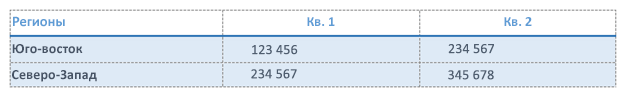
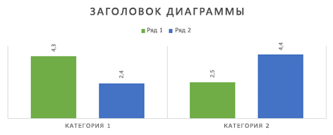
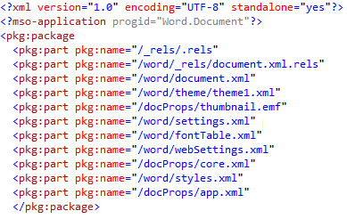
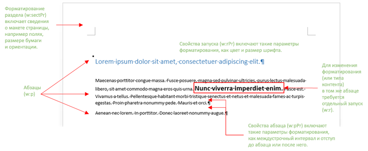
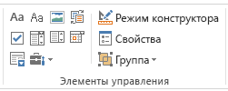

# <a name="create-better-add-ins-for-word-with-office-open-xml"></a><span data-ttu-id="b11de-103">Создание надстроек Word с помощью Office Open XML</span><span class="sxs-lookup"><span data-stu-id="b11de-103">Create better add-ins for Word with Office Open XML</span></span>

<span data-ttu-id="b11de-104">**Источник:** Стефани Кригер, корпорация Майкрософт | Хуан Балмори Лабра, корпорация Майкрософт</span><span class="sxs-lookup"><span data-stu-id="b11de-104">**Provided by:** Stephanie Krieger, Microsoft Corporation | Juan Balmori Labra, Microsoft Corporation</span></span>

<span data-ttu-id="b11de-105">Если вы создаете надстройки Office для запуска в Word, возможно, вы уже знаете, что API JavaScript для Office (Office. js) предлагает несколько форматов для чтения и записи контента документа.</span><span class="sxs-lookup"><span data-stu-id="b11de-105">If you're building Office Add-ins to run in Word, you might already know that the Office JavaScript API (Office.js) offers several formats for reading and writing document content.</span></span> <span data-ttu-id="b11de-106">Они называются типами приведения, и к ним относятся обычный текст, таблицы, HTML и Office Open XML.</span><span class="sxs-lookup"><span data-stu-id="b11de-106">These are called coercion types, and they include plain text, tables, HTML, and Office Open XML.</span></span>

<span data-ttu-id="b11de-p102">Итак, что вы можете сделать, если вам нужно добавить в документ форматированный контент, например изображения, форматированные таблицы, диаграммы или просто форматированный текст? Вы можете использовать код HTML для вставки форматированного содержимого некоторых типов, например изображений. В некоторых случаях вам может быть недостаточно возможностей форматирования и размещения содержимого, предоставляемых HTML. Так как Office Open XML — это язык документов Word (например, DOCX и DOTX), вы можете вставить практически любое содержимое, которое пользователь может добавить в документ Word, с практически любым форматированием. Определить необходимую разметку Office Open XML проще, чем кажется.</span><span class="sxs-lookup"><span data-stu-id="b11de-p102">So what are your options when you need to add rich content to a document, such as images, formatted tables, charts, or even just formatted text? You can use HTML for inserting some types of rich content, such as pictures. Depending on your scenario, there can be drawbacks to HTML coercion, such as limitations in the formatting and positioning options available to your content. Because Office Open XML is the language in which Word documents (such as .docx and .dotx) are written, you can insert virtually any type of content that a user can add to a Word document, with virtually any type of formatting the user can apply. Determining the Office Open XML markup you need to get it done is easier than you might think.</span></span>

> [!NOTE]
> <span data-ttu-id="b11de-p103">Office Open XML — это также язык документов PowerPoint и Excel (а начиная с Office 2013 — и документов Visio). Однако сейчас приводить содержимое в формат Office Open XML можно только в надстройках Office, созданных для Word. Дополнительные сведения об Office Open XML, в том числе полную справочную документацию о языке, см. в разделе [Дополнительные ресурсы](#see-also).</span><span class="sxs-lookup"><span data-stu-id="b11de-p103">Office Open XML is also the language behind PowerPoint and Excel (and, as of Office 2013, Visio) documents. However, currently, you can coerce content as Office Open XML only in Office Add-ins created for Word. For more information about Office Open XML, including the complete language reference documentation, see [Additional resources](#see-also).</span></span>

<span data-ttu-id="b11de-p104">Для начала ознакомьтесь с некоторыми типами содержимого, которые можно вставить с помощью приведения Office Open XML. Скачайте пример кода [Word-Add-in-Load-and-write-Open-XML](https://github.com/OfficeDev/Word-Add-in-Load-and-write-Open-XML), который содержит разметку Office Open XML и код Office.js, необходимые для вставки любого из приведенных ниже примеров в Word.</span><span class="sxs-lookup"><span data-stu-id="b11de-p104">To begin, take a look at some of the content types you can insert using Office Open XML coercion. Download the code sample [Word-Add-in-Load-and-write-Open-XML](https://github.com/OfficeDev/Word-Add-in-Load-and-write-Open-XML), which contains the Office Open XML markup and Office.js code required for inserting any of the following examples into Word.</span></span>

> [!NOTE]
> <span data-ttu-id="b11de-117">В этой статье термины **типы контента** и **форматированный контент** относятся к типам форматированного контента, которые можно вставить в документ Word.</span><span class="sxs-lookup"><span data-stu-id="b11de-117">Throughout this article, the terms **content types** and **rich content** refer to the types of rich content you can insert into a Word document.</span></span>


<span data-ttu-id="b11de-118">*Рис. 1. Текст с прямым форматированием*</span><span class="sxs-lookup"><span data-stu-id="b11de-118">*Figure 1. Text with direct formatting*</span></span>


<span data-ttu-id="b11de-120">С помощью прямого форматирования вы можете определить, как будет выглядеть текст, независимо от существующего форматирования в документе пользователя.</span><span class="sxs-lookup"><span data-stu-id="b11de-120">You can use direct formatting to specify exactly what the text will look like regardless of existing formatting in the user's document.</span></span>

<span data-ttu-id="b11de-121">*Рис. 2. Текст, отформатированный с помощью стиля*</span><span class="sxs-lookup"><span data-stu-id="b11de-121">*Figure 2. Text formatted using a style*</span></span>


<span data-ttu-id="b11de-123">Вы можете использовать стиль, чтобы автоматически настраивать внешний вид текста, вставляемого в документ пользователя.</span><span class="sxs-lookup"><span data-stu-id="b11de-123">You can use a style to automatically coordinate the look of text you insert with the user's document.</span></span>

<span data-ttu-id="b11de-124">*Рис. 3. Пример изображения.*</span><span class="sxs-lookup"><span data-stu-id="b11de-124">*Figure 3. A simple image*</span></span>


<span data-ttu-id="b11de-126">Тот же метод можно использовать для вставки изображений в любом формате, поддерживаемом приложениями Office.</span><span class="sxs-lookup"><span data-stu-id="b11de-126">You can use the same method for inserting any Office-supported image format.</span></span>

<span data-ttu-id="b11de-127">*Рис. 4. Изображение, форматированное с помощью стилей и эффектов изображений*</span><span class="sxs-lookup"><span data-stu-id="b11de-127">*Figure 4. An image formatted using picture styles and effects*</span></span>


<span data-ttu-id="b11de-129">Для добавления высококачественного форматирования и эффектов к изображениям требуется намного меньше разметки, чем можно было бы ожидать.</span><span class="sxs-lookup"><span data-stu-id="b11de-129">Adding high quality formatting and effects to your images requires much less markup than you might expect.</span></span>

<span data-ttu-id="b11de-130">*Рис. 5. Элемент управления содержимым*</span><span class="sxs-lookup"><span data-stu-id="b11de-130">*Figure 5. A content control*</span></span>


<span data-ttu-id="b11de-132">С помощью элементов управления содержимым в надстройке содержимое можно добавлять в указанное, а не выделенное расположение.</span><span class="sxs-lookup"><span data-stu-id="b11de-132">You can use content controls with your add-in to add content at a specified (bound) location rather than at the selection.</span></span>

<span data-ttu-id="b11de-133">*Рис. 6. Текстовое поле с форматированием WordArt*</span><span class="sxs-lookup"><span data-stu-id="b11de-133">*Figure 6. A text box with WordArt formatting*</span></span>


<span data-ttu-id="b11de-135">В Word доступны эффекты для текста в текстовых полях (как показано здесь) и обычного текста документа.</span><span class="sxs-lookup"><span data-stu-id="b11de-135">Text effects are available in Word for text inside a text box (as shown here) or for regular body text.</span></span>

<span data-ttu-id="b11de-136">*Рис. 7. Фигура*</span><span class="sxs-lookup"><span data-stu-id="b11de-136">*Figure 7. A shape*</span></span>


<span data-ttu-id="b11de-138">Вы можете вставлять встроенные или собственные фигуры, применяя к ним текстовые эффекты и форматирование.</span><span class="sxs-lookup"><span data-stu-id="b11de-138">You can insert built-in or custom drawing shapes, with or without text and formatting effects.</span></span>

<span data-ttu-id="b11de-139">*Рис. 8. Таблица с прямым форматированием*</span><span class="sxs-lookup"><span data-stu-id="b11de-139">*Figure 8. A table with direct formatting*</span></span>




<span data-ttu-id="b11de-141">К любой таблице можно применить форматирование текста, границы, тени, а также заданные размеры ячеек.</span><span class="sxs-lookup"><span data-stu-id="b11de-141">You can include text formatting, borders, shading, cell sizing, or any table formatting you need.</span></span>

<span data-ttu-id="b11de-142">*Рис. 9. Таблица, отформатированная с помощью стиля таблицы*</span><span class="sxs-lookup"><span data-stu-id="b11de-142">*Figure 9. A table formatted using a table style*</span></span>


<span data-ttu-id="b11de-144">Вы можете использовать встроенные или настраиваемые стили таблиц так же легко, как стили абзаца для текста.</span><span class="sxs-lookup"><span data-stu-id="b11de-144">You can use built-in or custom table styles just as easily as using a paragraph style for text.</span></span>

<span data-ttu-id="b11de-145">*Рис. 10. Диаграмма SmartArt*</span><span class="sxs-lookup"><span data-stu-id="b11de-145">*Figure 10. A SmartArt diagram*</span></span>


<span data-ttu-id="b11de-147">Microsoft Office предоставляет большой выбор макетов диаграмм SmartArt (а с помощью Office Open XML вы можете создать собственный макет).</span><span class="sxs-lookup"><span data-stu-id="b11de-147">Microsoft Office offers a wide array of SmartArt diagram layouts (and you can use Office Open XML to create your own).</span></span>

<span data-ttu-id="b11de-148">*Рис. 11. Диаграмма*</span><span class="sxs-lookup"><span data-stu-id="b11de-148">*Figure 11. A chart*</span></span>




<span data-ttu-id="b11de-p105">Вы можете вставлять диаграммы Excel в документы Word как динамические диаграммы. Это также означает, что их можно использовать в надстройке для Word. Как видно из предыдущих примеров, с помощью приведения Office Open XML можно вставлять содержимое практически любого типа, доступного пользователям для вставки в документы. Получить нужную разметку Office Open XML можно двумя простыми способами. Добавьте форматированное содержимое в пустой документ Word и сохраните файл в формате XML-документа Word или используйте тестовую надстройку с методом [getSelectedDataAsync](/javascript/api/office/office.document#getselecteddataasync-coerciontype--options--callback-), чтобы захватить разметку. Оба способа, по сути, обеспечивают одинаковый результат.</span><span class="sxs-lookup"><span data-stu-id="b11de-p105">You can insert Excel charts as live charts in Word documents, which also means you can use them in your add-in for Word. As you can see by the preceding examples, you can use Office Open XML coercion to insert essentially any type of content that a user can insert into their own document. There are two simple ways to get theOffice Open XML markup you need. Either add your rich content to an otherwise blank Word document and then save the file in Word XML Document format or use a test add-in with the [getSelectedDataAsync](/javascript/api/office/office.document#getselecteddataasync-coerciontype--options--callback-) method to grab the markup. Both approaches provide essentially the same result.</span></span>


> [!NOTE]
> <span data-ttu-id="b11de-155">Документ Office Open XML фактически является сжатым пакетом файлов, представляющим содержимое документа.</span><span class="sxs-lookup"><span data-stu-id="b11de-155">An Office Open XML document is actually a compressed package of files that represent the document contents.</span></span> <span data-ttu-id="b11de-156">Сохранение файла в формате XML-документа Word позволяет Ентиреоффице пакет Open XML в один XML-файл, который также используется `getSelectedDataAsync` для получения разметки Office Open XML.</span><span class="sxs-lookup"><span data-stu-id="b11de-156">Saving the file in the Word XML Document format gives you the entireOffice Open XML package flattened into one XML file, which is also what you get when using `getSelectedDataAsync` to retrieve the Office Open XML markup.</span></span>

<span data-ttu-id="b11de-157">При сохранении файла в формате XML в приложении Word в списке "Тип файла" в диалоговом окне "Сохранить как" будет доступно два параметра для XML-файлов.</span><span class="sxs-lookup"><span data-stu-id="b11de-157">If you save the file to an XML format from Word, note that there are two options under the Save as Type list in the Save As dialog box for .xml format files.</span></span> <span data-ttu-id="b11de-158">Выберите **XML-документ Word**, а не формат Word 2003.</span><span class="sxs-lookup"><span data-stu-id="b11de-158">Be sure to choose **Word XML Document** and not the Word 2003 option.</span></span>
<span data-ttu-id="b11de-159">Скачайте пример кода под названием [Word-Add-in-Get-Set-EditOpen-XML](https://github.com/OfficeDev/Word-Add-in-Get-Set-EditOpen-XML), с помощью которого можно получить и проверить разметку.</span><span class="sxs-lookup"><span data-stu-id="b11de-159">Download the code sample named [Word-Add-in-Get-Set-EditOpen-XML](https://github.com/OfficeDev/Word-Add-in-Get-Set-EditOpen-XML), which you can use as a tool to retrieve and test your markup.</span></span>
<span data-ttu-id="b11de-160">Итак, это все?</span><span class="sxs-lookup"><span data-stu-id="b11de-160">So is that all there is to it?</span></span> <span data-ttu-id="b11de-161">Не совсем.</span><span class="sxs-lookup"><span data-stu-id="b11de-161">Well, not quite.</span></span> <span data-ttu-id="b11de-162">Да, в большинстве случаев можно успешно использовать полный плоский результат Office Open XML, обеспечиваемый любым из вышеописанных способов.</span><span class="sxs-lookup"><span data-stu-id="b11de-162">Yes, for many scenarios, you could use the full, flattened Office Open XML result you see with either of the preceding methods and it would work.</span></span> <span data-ttu-id="b11de-163">Скорее всего, вам не понадобится большая часть этой разметки.</span><span class="sxs-lookup"><span data-stu-id="b11de-163">The good news is that you probably don't need most of that markup.</span></span>
<span data-ttu-id="b11de-164">На первый взгляд объем разметки Office Open XML даже для простого содержимого может показаться огромным, но не стоит переживать.</span><span class="sxs-lookup"><span data-stu-id="b11de-164">If you're one of the many add-in developers seeing Office Open XML markup for the first time, trying to make sense of the massive amount of markup you get for the simplest piece of content might seem overwhelming, but it doesn't have to be.</span></span>
<span data-ttu-id="b11de-165">В этой статье мы покажем, как упростить работу с Office Open XML, используя некоторые стандартные сценарии, предоставленные сообществом разработчиков надстроек Office.</span><span class="sxs-lookup"><span data-stu-id="b11de-165">In this topic, we'll use some common scenarios we've been hearing from the Office Add-ins developer community to show you techniques for simplifying Office Open XML for use in your add-in.</span></span> <span data-ttu-id="b11de-166">Мы рассмотрим разметку для некоторых типов содержимого, показанных выше, а также сведения, необходимые для минимизации полезных данных Office Open XML.</span><span class="sxs-lookup"><span data-stu-id="b11de-166">We'll explore the markup for some types of content shown earlier along with the information you need for minimizing the Office Open XML payload.</span></span> <span data-ttu-id="b11de-167">Мы также рассмотрим код, необходимый для вставки мультимедиа в документ в выделенном месте, и использование Office Open XML с объектом bindings для добавления или замены содержимого в указанных местах.</span><span class="sxs-lookup"><span data-stu-id="b11de-167">We'll also look at the code you need for inserting rich content into a document at the active selection and how to use Office Open XML with the bindings object to add or replace content at specified locations.</span></span>

## <a name="exploring-the-office-open-xml-document-package"></a><span data-ttu-id="b11de-168">Изучение пакета документа Office Open XML</span><span class="sxs-lookup"><span data-stu-id="b11de-168">Exploring the Office Open XML document package</span></span>


<span data-ttu-id="b11de-p108">Когда вы используете метод [getSelectedDataAsync](/javascript/api/office/office.document#getselecteddataasync-coerciontype--options--callback-) для получения разметки Office Open XML для выделенного содержимого (или сохраняете документ в формате XML-документа Word), вы получаете не только разметку, описывающую выделенное содержимое, а весь документ со множеством параметров и настроек, которые вам в большинстве случаев не пригодятся. Если вы используете этот метод из документа, содержащего надстройку области задач, полученная разметка будет включать даже область задач.</span><span class="sxs-lookup"><span data-stu-id="b11de-p108">When you use [getSelectedDataAsync](/javascript/api/office/office.document#getselecteddataasync-coerciontype--options--callback-) to retrieve the Office Open XML for a selection of content (or when you save the document in Word XML Document format), what you're getting is not just the markup that describes your selected content; it's an entire document with many options and settings that you almost certainly don't need. In fact, if you use that method from a document that contains a task pane add-in, the markup you get even includes your task pane.</span></span>

<span data-ttu-id="b11de-171">Даже простой пакет документа Word, помимо основного содержимого, включает свойства, стили, тему (параметры форматирования), веб-параметры, шрифты документа и другие части.</span><span class="sxs-lookup"><span data-stu-id="b11de-171">Even a simple Word document package includes parts for document properties, styles, theme (formatting settings), web settings, fonts, and then some, in addition to parts for the actual content.</span></span>

<span data-ttu-id="b11de-172">Предположим, вам нужно вставить всего лишь абзац текста с прямым форматированием, как показано на рисунке 1.</span><span class="sxs-lookup"><span data-stu-id="b11de-172">For example, say that you want to insert just a paragraph of text with direct formatting, as shown earlier in Figure 1.</span></span> <span data-ttu-id="b11de-173">Когда вы захватите Office Open XML для форматированного текста с помощью `getSelectedDataAsync` , вы увидите большой объем разметки.</span><span class="sxs-lookup"><span data-stu-id="b11de-173">When you grab the Office Open XML for the formatted text using  `getSelectedDataAsync`, you see a large amount of markup.</span></span> <span data-ttu-id="b11de-174">Она включает элемент package, который представляет весь документ и содержит несколько частей (обычно называемые частями документа или, в Office Open XML, частями пакета), как показано на рисунке 13.</span><span class="sxs-lookup"><span data-stu-id="b11de-174">That markup includes a package element that represents an entire document, which contains several parts (commonly referred to as document parts or, in the Office Open XML, as package parts), as you see listed in Figure 13.</span></span> <span data-ttu-id="b11de-175">Каждая часть представляет отдельный файл в пакете.</span><span class="sxs-lookup"><span data-stu-id="b11de-175">Each part represents a separate file within the package.</span></span>

> [!TIP]
> <span data-ttu-id="b11de-176">Разметку Office Open XML можно редактировать в текстовом редакторе, например в блокноте.</span><span class="sxs-lookup"><span data-stu-id="b11de-176">You can edit Office Open XML markup in a text editor like Notepad.</span></span> <span data-ttu-id="b11de-177">Если открыть его в Visual Studio, вы можете использовать меню **правка >расширенный >ный документ** (Ctrl + K, Ctrl + D), чтобы отформатировать пакет для упрощения редактирования.</span><span class="sxs-lookup"><span data-stu-id="b11de-177">If you open it in Visual Studio, you can use **Edit >Advanced > Format Document** (Ctrl+K, Ctrl+D) to format the package for easier editing.</span></span> <span data-ttu-id="b11de-178">Then you can collapse or expand document parts or sections of them, as shown in Figure 12, to more easily review and edit the content of the Office Open XML package.</span><span class="sxs-lookup"><span data-stu-id="b11de-178">Then you can collapse or expand document parts or sections of them, as shown in Figure 12, to more easily review and edit the content of the Office Open XML package.</span></span> <span data-ttu-id="b11de-179">Each document part begins with a **pkg:part** tag.</span><span class="sxs-lookup"><span data-stu-id="b11de-179">Each document part begins with a **pkg:part** tag.</span></span>


<span data-ttu-id="b11de-180">*Рис. 12. Свертывание и развертывание частей пакета для редактирования в Visual Studio*</span><span class="sxs-lookup"><span data-stu-id="b11de-180">*Figure 12. Collapse and expand package parts for easier editing in Visual Studio*</span></span>


<span data-ttu-id="b11de-182">*Рис. 13. Части в базовом пакете документа Word Office Open XML*</span><span class="sxs-lookup"><span data-stu-id="b11de-182">*Figure 13. The parts included in a basic Word Office Open XML document package*</span></span>



<span data-ttu-id="b11de-184">Вы удивитесь, но единственные элементы, которые необходимо вставить для добавления примера форматированного текста, во всей этой разметке — это элементы RELS-частей и document.xml.</span><span class="sxs-lookup"><span data-stu-id="b11de-184">With all that markup, you might be surprised to discover that the only elements you actually need to insert the formatted text example are pieces of the .rels part and the document.xml part.</span></span>


> [!NOTE]
> <span data-ttu-id="b11de-p111">Две строки разметки над тегом пакета (объявления XML для версии и кода программы Office) применяются автоматически при использовании приведения Open XML, поэтому их не нужно добавлять. Оставьте их, если хотите открыть измененную разметку как документ Word для тестирования.</span><span class="sxs-lookup"><span data-stu-id="b11de-p111">The two lines of markup above the package tag (the XML declarations for version and Office program ID) are assumed when you use the Office Open XML coercion type, so you don't need to include them. Keep them if you want to open your edited markup as a Word document to test it.</span></span>

<span data-ttu-id="b11de-p112">Для некоторых других типов содержимого, показанных в начале этой статьи, требуются дополнительные части (помимо показанных на рисунке 13), мы рассмотрим их далее в этой статье. Сейчас же, так как вы увидите большинство частей, показанных на рисунке 13, в разметке любого пакета документа Word, кратко рассмотрим каждую часть и ее функции:</span><span class="sxs-lookup"><span data-stu-id="b11de-p112">Several of the other types of content shown at the start of this topic require additional parts as well (beyond those shown in Figure 13), and we'll address those later in this topic. Meanwhile, since you'll see most of the parts shown in Figure 13 in the markup for any Word document package, here's a quick summary of what each of these parts is for and when you need it:</span></span>


- <span data-ttu-id="b11de-p113">В теге пакета первой частью является RELS-файл, в котором определяются связи между частями верхнего уровня пакета (обычно это свойства документа, эскиз (если он существует) и тело документа). Определенное содержимое этой части всегда должно быть в разметке, так как необходимо определить связь основной части документа (где хранится контент) с пакетом документа.</span><span class="sxs-lookup"><span data-stu-id="b11de-p113">Inside the package tag, the first part is the .rels file, which defines relationships between the top-level parts of the package (these are typically the document properties, thumbnail (if any), and main document body). Some of the content in this part is always required in your markup because you need to define the relationship of the main document part (where your content resides) to the document package.</span></span>

- <span data-ttu-id="b11de-191">Часть document.xml.rels определяет связи с дополнительными частями, необходимыми части document.xml (основной текст документа), если такие имеются.</span><span class="sxs-lookup"><span data-stu-id="b11de-191">The document.xml.rels part defines relationships for additional parts required by the document.xml (main body) part, if any.</span></span>


   > [!IMPORTANT]
   > <span data-ttu-id="b11de-p114">RELS-файлы в пакете (такие как RELS-файлы верхнего уровня, document.xml.rels и другие файлы, которые можно увидеть для различных типов контента) — это очень важный инструмент, который можно использовать для быстрого редактирования пакета Office Open XML. Дополнительные сведения об этом см. в разделе [Рекомендации по созданию собственной разметки](#creating-your-own-markup-best-practices) далее в этой статье.</span><span class="sxs-lookup"><span data-stu-id="b11de-p114">The .rels files in your package (such as the top-level .rels, document.xml.rels, and others you may see for specific types of content) are an extremely important tool that you can use as a guide for helping you quickly edit down your Office Open XML package. To learn more about how to do this, see [Creating your own markup: best practices](#creating-your-own-markup-best-practices) later in this topic.</span></span>


- <span data-ttu-id="b11de-p115">Часть document.xml — это содержимое в теле документа. Элементы этой части, конечно, необходимы, так как здесь представлены все данные документа. Но все содержимое этой части вам не нужно, о чем мы подробно поговорим позднее.</span><span class="sxs-lookup"><span data-stu-id="b11de-p115">The document.xml part is the content in the main body of the document. You need elements of this part, of course, since that's where your content appears. But, you don't need everything you see in this part. We'll look at that in more detail later.</span></span>

- <span data-ttu-id="b11de-p116">Многие части автоматически игнорируются методами Set при вставке содержимого в документ с помощью приведения Office Open XML, поэтому их можно удалить. К ним относятся файл theme1.xml (тема форматирования документа), части свойств документа (core, add-in и thumbnail) и файлы параметров (в том числе settings, webSettings и fontTable).</span><span class="sxs-lookup"><span data-stu-id="b11de-p116">Many parts are automatically ignored by the Set methods when inserting content into a document using Office Open XML coercion, so you might as well remove them. These include the theme1.xml file (the document's formatting theme), the document properties parts (core, add-in, and thumbnail), and setting files (including settings, webSettings, and fontTable).</span></span>

- <span data-ttu-id="b11de-p117">В примере на рис. 1 форматирование применяется напрямую к тексту (т. е. каждый параметр форматирования шрифтов и абзацев применяется отдельно). Но если вы используете стиль (например, чтобы к тексту автоматически применялся стиль "Заголовок 1" в целевом документе), как показано ранее на рис. 2, то вам потребуется часть styles.xml, а также определение связей для нее. Дополнительные сведения см. в разделе [Добавление объектов, использующих дополнительные части Office Open XML](#adding-objects-that-use-additional-office-open-xml-parts).</span><span class="sxs-lookup"><span data-stu-id="b11de-p117">In the Figure 1 example, text formatting is directly applied (that is, each font and paragraph formatting setting applied individually). But, if you use a style (such as if you want your text to automatically take on the formatting of the Heading 1 style in the destination document) as shown earlier in Figure 2, then you would need part of the styles.xml part as well as a relationship definition for it. For more information, see the topic section [Adding objects that use additional Office Open XML parts](#adding-objects-that-use-additional-office-open-xml-parts).</span></span>


## <a name="inserting-document-content-at-the-selection"></a><span data-ttu-id="b11de-203">Вставка контента документа в выделение</span><span class="sxs-lookup"><span data-stu-id="b11de-203">Inserting document content at the selection</span></span>


<span data-ttu-id="b11de-204">Рассмотрим минимальную разметку Office Open XML, необходимую для примера форматированного текста на рисунке 1, и код JavaScript, необходимый для вставки разметки в выделенном месте в документе.</span><span class="sxs-lookup"><span data-stu-id="b11de-204">Let's take a look at the minimal Office Open XML markup required for the formatted text example shown in Figure 1 and the JavaScript required for inserting it at the active selection in the document.</span></span>


### <a name="simplified-office-open-xml-markup"></a><span data-ttu-id="b11de-205">Упрощенная разметка Office Open XML</span><span class="sxs-lookup"><span data-stu-id="b11de-205">Simplified Office Open XML markup</span></span>

<span data-ttu-id="b11de-p118">Мы изменили пример Office Open XML, показанный здесь, как описано в предыдущем разделе, оставив только требуемые части документа и необходимые элементы в каждой части. Мы рассмотрим, как изменить разметку самостоятельно (и подробно опишем части, оставшиеся здесь) в следующем разделе.</span><span class="sxs-lookup"><span data-stu-id="b11de-p118">We've edited the Office Open XML example shown here, as described in the preceding section, to leave just required document parts and only required elements within each of those parts. We'll walk through how to edit the markup yourself (and explain a bit more about the pieces that remain here) in the next section of the topic.</span></span>


```XML
<pkg:package xmlns:pkg="http://schemas.microsoft.com/office/2006/xmlPackage">
  <pkg:part pkg:name="/_rels/.rels" pkg:contentType="application/vnd.openxmlformats-package.relationships+xml" pkg:padding="512">
    <pkg:xmlData>
      <Relationships xmlns="http://schemas.openxmlformats.org/package/2006/relationships">
        <Relationship Id="rId1" Type="http://schemas.openxmlformats.org/officeDocument/2006/relationships/officeDocument" Target="word/document.xml"/>
      </Relationships>
    </pkg:xmlData>
  </pkg:part>
  <pkg:part pkg:name="/word/document.xml" pkg:contentType="application/vnd.openxmlformats-officedocument.wordprocessingml.document.main+xml">
    <pkg:xmlData>
      <w:document xmlns:w="http://schemas.openxmlformats.org/wordprocessingml/2006/main" >
        <w:body>
          <w:p>
            <w:pPr>
              <w:spacing w:before="360" w:after="0" w:line="480" w:lineRule="auto"/>
              <w:rPr>
                <w:color w:val="70AD47" w:themeColor="accent6"/>
                <w:sz w:val="28"/>
              </w:rPr>
            </w:pPr>
            <w:r>
              <w:rPr>
                <w:color w:val="70AD47" w:themeColor="accent6"/>
                <w:sz w:val="28"/>
              </w:rPr>
              <w:t>This text has formatting directly applied to achieve its font size, color, line spacing, and paragraph spacing.</w:t>
            </w:r>
          </w:p>
        </w:body>
      </w:document>
    </pkg:xmlData>
  </pkg:part>
</pkg:package>
```


> [!NOTE]
> <span data-ttu-id="b11de-208">Если вы добавите приведенную здесь разметку в XML-файл вместе с тегами объявления XML для Version и MSO-Application в начале файла (показан на рисунке 13), вы можете открыть его в Word как документ Word.</span><span class="sxs-lookup"><span data-stu-id="b11de-208">If you add the markup shown here to an XML file along with the XML declaration tags for version and mso-application at the top of the file (shown in Figure 13), you can open it in Word as a Word document.</span></span> <span data-ttu-id="b11de-209">Кроме того, без этих тегов можно открыть файл с помощью **> открыть** в Word.</span><span class="sxs-lookup"><span data-stu-id="b11de-209">Or, without those tags, you can still open it using **File> Open** in Word.</span></span> <span data-ttu-id="b11de-210">**Режим совместимости** отображается в строке заголовка в Word, так как вы удалили параметры, которые определяют Word как документ Word.</span><span class="sxs-lookup"><span data-stu-id="b11de-210">You'll see **Compatibility Mode** on the title bar in Word, because you removed the settings that tell Word this is a Word document.</span></span> <span data-ttu-id="b11de-211">Так как вы добавляете эту разметку в существующий документ Word, это не повлияет на содержимое.</span><span class="sxs-lookup"><span data-stu-id="b11de-211">Since you're adding this markup to an existing Word document, that won't affect your content at all.</span></span>


### <a name="javascript-for-using-setselecteddataasync"></a><span data-ttu-id="b11de-212">Код JavaScript для использования метода setSelectedDataAsync</span><span class="sxs-lookup"><span data-stu-id="b11de-212">JavaScript for using setSelectedDataAsync</span></span>


<span data-ttu-id="b11de-213">После сохранения предыдущей разметки Office Open XML в XML-файле, доступном из вашего решения, вы можете использовать следующую функцию, чтобы задать форматированный текст в документе с помощью приведения Office Open XML.</span><span class="sxs-lookup"><span data-stu-id="b11de-213">Once you save the preceding Office Open XML as an XML file that's accessible from your solution, you can use the following function to set the formatted text content in the document using Office Open XML coercion.</span></span> 

<span data-ttu-id="b11de-214">В этой функции все строки, кроме последней, используются для получения сохраненной разметки и ее использования в методе [setSelectedDataAsync](/javascript/api/office/office.document#setselecteddataasync-data--options--callback-) в конце функции.</span><span class="sxs-lookup"><span data-stu-id="b11de-214">In this function, notice that all but the last line are used to get your saved markup for use in the [setSelectedDataAsync](/javascript/api/office/office.document#setselecteddataasync-data--options--callback-) method call at the end of the function.</span></span> <span data-ttu-id="b11de-215">`setSelectedDataASync`требуется только указать, что нужно вставить содержимое, и тип приведения.</span><span class="sxs-lookup"><span data-stu-id="b11de-215">`setSelectedDataASync` requires only that you specify the content to be inserted and the coercion type.</span></span>


> [!NOTE]
> <span data-ttu-id="b11de-p121">Замените _yourXMLfilename_ на имя XML-файла, сохраненного в решении, и путь к нему. Примеры добавления XML-файлов в решение и указания их в коде, а также рабочий пример разметки и кода JavaScript, показанных здесь, см. в примере кода [Word-Add-in-Load-and-write-Open-XML](https://github.com/OfficeDev/Word-Add-in-Load-and-write-Open-XML).</span><span class="sxs-lookup"><span data-stu-id="b11de-p121">Replace  _yourXMLfilename_ with the name and path of the XML file as you've saved it in your solution. If you're not sure where to include XML files in your solution or how to reference them in your code, see the [Word-Add-in-Load-and-write-Open-XML](https://github.com/OfficeDev/Word-Add-in-Load-and-write-Open-XML) code sample for examples of that and a working example of the markup and JavaScript shown here.</span></span>


```js
function writeContent() {
    var myOOXMLRequest = new XMLHttpRequest();
    var myXML;
    myOOXMLRequest.open('GET', 'yourXMLfilename', false);
    myOOXMLRequest.send();
    if (myOOXMLRequest.status === 200) {
        myXML = myOOXMLRequest.responseText;
    }
    Office.context.document.setSelectedDataAsync(myXML, { coercionType: 'ooxml' });
}
```


## <a name="creating-your-own-markup-best-practices"></a><span data-ttu-id="b11de-218">Рекомендации по созданию собственной разметки</span><span class="sxs-lookup"><span data-stu-id="b11de-218">Creating your own markup: best practices</span></span>


<span data-ttu-id="b11de-219">Рассмотрим разметку, необходимую для вставки предыдущего примера форматированного текста, более подробно.</span><span class="sxs-lookup"><span data-stu-id="b11de-219">Let's take a closer look at the markup you need to insert the preceding formatted text example.</span></span>

<span data-ttu-id="b11de-p122">Для начала просто удалим из пакета все части документа, кроме RELS-файла и document.xml. Затем мы изменим эти две части, чтобы сделать все еще проще.</span><span class="sxs-lookup"><span data-stu-id="b11de-p122">For this example, start by simply deleting all document parts from the package other than .rels and document.xml. Then, we'll edit those two required parts to simplify things further.</span></span>


> [!IMPORTANT]
> <span data-ttu-id="b11de-p123">Используйте RELS-части как карту, чтобы быстро понять, что входит в пакет, и определить, какие части можно полностью удалить (все части, не связанные с контентом и не указанные в нем). Помните, что для каждой части документа в пакете должны существовать связи, которые указываются в RELS-файлах. Все эти связи можно увидеть в RELS-файле, файле document.xml.rels или RELS-файле, связанном с контентом.</span><span class="sxs-lookup"><span data-stu-id="b11de-p123">Use the .rels parts as a map to quickly gauge what's included in the package and determine what parts you can delete completely (that is, any parts not related to or referenced by your content). Remember that every document part must have a relationship defined in the package and those relationships appear in the .rels files. So you should see all of them listed in either .rels, document.xml.rels, or a content-specific .rels file.</span></span>

<span data-ttu-id="b11de-p124">В следующей разметке показана необходимая RELS-часть перед редактированием. Так как мы удаляем части add-in и core со свойствами документа, а также часть thumbnail, нам нужно удалить соответствующие связи из RELS-файла. Обратите внимание, что после этого останется только связь для document.xml (с кодом rID1 в следующем примере).</span><span class="sxs-lookup"><span data-stu-id="b11de-p124">The following markup shows the required .rels part before editing. Since we're deleting the add-in and core document property parts, and the thumbnail part, we need to delete those relationships from .rels as well. Notice that this will leave only the relationship (with the relationship ID "rID1" in the following example) for document.xml.</span></span>


```XML
<pkg:part pkg:name="/_rels/.rels" pkg:contentType="application/vnd.openxmlformats-package.relationships+xml" pkg:padding="512">
  <pkg:xmlData>
    <Relationships xmlns="http://schemas.openxmlformats.org/package/2006/relationships">
      <Relationship Id="rId3" Type="http://schemas.openxmlformats.org/package/2006/relationships/metadata/core-properties" Target="docProps/core.xml"/>
      <Relationship Id="rId2" Type="http://schemas.openxmlformats.org/package/2006/relationships/metadata/thumbnail" Target="docProps/thumbnail.emf"/>
      <Relationship Id="rId1" Type="http://schemas.openxmlformats.org/officeDocument/2006/relationships/officeDocument" Target="word/document.xml"/>
      <Relationship Id="rId4" Type="http://schemas.openxmlformats.org/officeDocument/2006/relationships/extended-properties" Target="docProps/app.xml"/>
    </Relationships>
  </pkg:xmlData>
</pkg:part>
```


> [!IMPORTANT]
> <span data-ttu-id="b11de-p125">Удалите связи (т. е. тег **Relationship**) для всех частей, которые вы удалили из пакета. Если добавить часть без соответствующей связи или удалить часть, оставив ее связь в пакете, возникнет ошибка.</span><span class="sxs-lookup"><span data-stu-id="b11de-p125">Remove the relationships (that is, the **Relationship** tag) for any parts that you completely remove from the package. Including a part without a corresponding relationship, or excluding a part and leaving its relationship in the package, will result in an error.</span></span>

<span data-ttu-id="b11de-230">В следующей разметке показана часть document.xml, содержащая пример форматированного текста, перед редактированием.</span><span class="sxs-lookup"><span data-stu-id="b11de-230">The following markup shows the document.xml part, which includes our sample formatted text content before editing.</span></span>

```XML
<pkg:part pkg:name="/word/document.xml" pkg:contentType="application/vnd.openxmlformats-officedocument.wordprocessingml.document.main+xml">
    <pkg:xmlData>
      <w:document mc:Ignorable="w14 w15 wp14" xmlns:wpc="http://schemas.microsoft.com/office/word/2010/wordprocessingCanvas" xmlns:mc="http://schemas.openxmlformats.org/markup-compatibility/2006" xmlns:o="urn:schemas-microsoft-com:office:office" xmlns:r="http://schemas.openxmlformats.org/officeDocument/2006/relationships" xmlns:m="http://schemas.openxmlformats.org/officeDocument/2006/math" xmlns:v="urn:schemas-microsoft-com:vml" xmlns:wp14="http://schemas.microsoft.com/office/word/2010/wordprocessingDrawing" xmlns:wp="http://schemas.openxmlformats.org/drawingml/2006/wordprocessingDrawing" xmlns:w10="urn:schemas-microsoft-com:office:word" xmlns:w="http://schemas.openxmlformats.org/wordprocessingml/2006/main" xmlns:w14="http://schemas.microsoft.com/office/word/2010/wordml" xmlns:w15="http://schemas.microsoft.com/office/word/2012/wordml" xmlns:wpg="http://schemas.microsoft.com/office/word/2010/wordprocessingGroup" xmlns:wpi="http://schemas.microsoft.com/office/word/2010/wordprocessingInk" xmlns:wne="http://schemas.microsoft.com/office/word/2006/wordml" xmlns:wps="http://schemas.microsoft.com/office/word/2010/wordprocessingShape">
        <w:body>
          <w:p>
            <w:pPr>
              <w:spacing w:before="360" w:after="0" w:line="480" w:lineRule="auto"/>
              <w:rPr>
                <w:color w:val="70AD47" w:themeColor="accent6"/>
                <w:sz w:val="28"/>
              </w:rPr>
            </w:pPr>
            <w:r>
              <w:rPr>
                <w:color w:val="70AD47" w:themeColor="accent6"/>
                <w:sz w:val="28"/>
              </w:rPr>
              <w:t>This text has formatting directly applied to achieve its font size, color, line spacing, and paragraph spacing.</w:t>
            </w:r>
            <w:bookmarkStart w:id="0" w:name="_GoBack"/>
            <w:bookmarkEnd w:id="0"/>
          </w:p>
          <w:p/>
          <w:sectPr>
            <w:pgSz w:w="12240" w:h="15840"/>
            <w:pgMar w:top="1440" w:right="1440" w:bottom="1440" w:left="1440" w:header="720" w:footer="720" w:gutter="0"/>
            <w:cols w:space="720"/>
          </w:sectPr>
        </w:body>
      </w:document>
    </pkg:xmlData>
</pkg:part>
```

<span data-ttu-id="b11de-p126">Так как document.xml — это основная часть документа, в которой размещается содержимое, быстро рассмотрим ее. (На рисунке 14, который идет после этого списка, показано, как некоторые базовые теги содержимого и теги форматирования связаны с тем, что вы видите в документе Word.)</span><span class="sxs-lookup"><span data-stu-id="b11de-p126">Since document.xml is the primary document part where you place your content, let's take a quick walk through that part. (Figure 14, which follows this list, provides a visual reference to show how some of the core content and formatting tags explained here relate to what you see in a Word document.)</span></span>


- <span data-ttu-id="b11de-p127">Открывающий тег **w:document** включает несколько пространств имен (**xmlns**). Многие из них связаны с определенными типами содержимого и необходимы, только если относятся к вашему содержимому.</span><span class="sxs-lookup"><span data-stu-id="b11de-p127">The opening **w:document** tag includes several namespace ( **xmlns** ) listings. Many of those namespaces refer to specific types of content and you only need them if they're relevant to your content.</span></span>

    <span data-ttu-id="b11de-235">Обратите внимание, что префикс для тегов в части документа относится к пространствам имен.</span><span class="sxs-lookup"><span data-stu-id="b11de-235">Notice that the prefix for the tags throughout a document part refers back to the namespaces.</span></span> <span data-ttu-id="b11de-236">В этом примере единственным префиксом, используемым в тегах в части Document. XML, является **w:**, поэтому единственное пространство имен, которое нужно оставить в открывающем теге **в:документ** , — **xmlns: w**.</span><span class="sxs-lookup"><span data-stu-id="b11de-236">In this example, the only prefix used in the tags throughout the document.xml part is **w:**, so the only namespace that we need to leave in the opening **w:document** tag is **xmlns:w**.</span></span>


> [!TIP]
> <span data-ttu-id="b11de-p129">Если вы редактируете разметку в Visual Studio, после удаления пространств имен в любой части просмотрите все теги этой части. Если вы удалили пространство имен, необходимое для разметки, соответствующий префикс тегов будет подчеркнут красной волнистой линией. Кроме того, удаляя пространство имен **xmlns:mc**, также нужно удалить атрибут **mc:Ignorable**, предоставляющий список пространств имен.</span><span class="sxs-lookup"><span data-stu-id="b11de-p129">If you're editing your markup in Visual Studio, after you delete namespaces in any part, look through all tags of that part. If you've removed a namespace that's required for your markup, you'll see a red squiggly underline on the relevant prefix for affected tags. If you remove the **xmlns:mc** namespace, you must also remove the **mc:Ignorable** attribute that precedes the namespace listings.</span></span>


- <span data-ttu-id="b11de-240">В открывающем теге тела документа вы увидите тег абзаца (**w:p**), который включает содержимое для нашего примера.</span><span class="sxs-lookup"><span data-stu-id="b11de-240">Inside the opening body tag, you see a paragraph tag ( **w:p** ), which includes our sample content for this example.</span></span>

- <span data-ttu-id="b11de-p130">Тег **w:pPr** включает свойства для прямого форматирования абзаца, например интервал до и после абзаца, выравнивание абзаца и отступы. (Прямое форматирование относится к атрибутам, которые применяются к содержимому отдельно, а не как часть стиля.) Этот тег также включает прямое форматирование, применяемое ко всему абзацу, во вложенном теге **w:rPr** (свойства прогона). В нашем примере этот тег содержит цвет и размер шрифта.</span><span class="sxs-lookup"><span data-stu-id="b11de-p130">The **w:pPr** tag includes properties for directly-applied paragraph formatting, such as space before or after the paragraph, paragraph alignment, or indents. (Direct formatting refers to attributes that you apply individually to content rather than as part of a style.) This tag also includes direct font formatting that's applied to the entire paragraph, in a nested **w:rPr** (run properties) tag, which contains the font color and size set in our sample.</span></span>


   > [!NOTE]
   > <span data-ttu-id="b11de-p131">Вы можете заметить, что размеры шрифтов и некоторые другие параметры форматирования в разметке Word Office Open XML выглядят в два раза больше. Это вызвано тем, интервалы между абзацами и между строками, а также некоторые свойства форматирования разделов, показанные в предыдущей разметке, указаны в твипах (одна двадцатая точки). В зависимости от типов содержимого, с которыми вы работаете в Office Open XML, вы можете увидеть несколько дополнительных единиц измерения, в том числе английские метрические единицы (914 400 английских метрических единиц на дюйм), которые используются для некоторых значений Office Art (drawingML), и значение в 100 000 раз больше действительного, которое используется в разметке drawingML и PowerPoint. В PowerPoint некоторые значения также в 100 раз больше действительных, а в Excel обычно используются действительные значения.</span><span class="sxs-lookup"><span data-stu-id="b11de-p131">You might notice that font sizes and some other formatting settings in Word Office Open XML markup look like they're double the actual size. That's because paragraph and line spacing, as well some section formatting properties shown in the preceding markup, are specified in twips (one-twentieth of a point). Depending on the types of content you work with in Office Open XML, you may see several additional units of measure, including English Metric Units (914,400 EMUs to an inch), which are used for some Office Art (drawingML) values and 100,000 times actual value, which is used in both drawingML and PowerPoint markup. PowerPoint also expresses some values as 100 times actual and Excel commonly uses actual values.</span></span>


- <span data-ttu-id="b11de-p132">Любое содержимое со схожими свойствами в абзаце включается в прогон (**w:r**), как и пример текста. При каждом изменении форматирования или типа содержимого начинается новый прогон. (Например, если одно слово в примере текста было выделено полужирным шрифтом, оно будет выделено в собственный прогон.) В этом примере содержимое включает всего один прогон текста.</span><span class="sxs-lookup"><span data-stu-id="b11de-p132">Within a paragraph, any content with like properties is included in a run ( **w:r** ), such as is the case with the sample text. Each time there's a change in formatting or content type, a new run starts. (That is, if just one word in the sample text was bold, it would be separated into its own run.) In this example, the content includes just the one text run.</span></span>

    <span data-ttu-id="b11de-250">Обратите внимание, что в этом примере используется форматирование шрифта, которое можно применять только к одному символу. Поэтому такое форматирование также указано в свойствах для отдельного запуска.</span><span class="sxs-lookup"><span data-stu-id="b11de-250">Notice that, because the formatting included in this sample is font formatting (that is, formatting that can be applied to as little as one character), it also appears in the properties for the individual run.</span></span>

- <span data-ttu-id="b11de-p133">Также обратите внимание на теги скрытой закладки _GoBack (**w:bookmarkStart** и **w:bookmarkEnd**), которые по умолчанию отображаются в документах Word. Начальный и конечный теги закладки GoBack всегда можно удалить из разметки.</span><span class="sxs-lookup"><span data-stu-id="b11de-p133">Also notice the tags for the hidden "_GoBack" bookmark (**w:bookmarkStart** and **w:bookmarkEnd** ), which appear in Word documents by default. You can always delete the start and end tags for the GoBack bookmark from your markup.</span></span>

- <span data-ttu-id="b11de-p134">Последняя часть тела документа — это тег **w:sectPr** или свойства раздела. Этот тег включает такие параметры, как поля и ориентация страницы. Содержимое, вставляемое с помощью метода **setSelectedDataAsync**, по умолчанию будет использовать свойства активного раздела в целевом документе. Поэтому если в содержимом нет разрыва раздела (в противном случае тегов **w:sectPr** будет несколько), этот тег можно удалить.</span><span class="sxs-lookup"><span data-stu-id="b11de-p134">The last piece of the document body is the **w:sectPr** tag, or section properties. This tag includes settings such as margins and page orientation. The content you insert using **setSelectedDataAsync** will take on the active section properties in the destination document by default. So, unless your content includes a section break (in which case you'll see more than one **w:sectPr** tag), you can delete this tag.</span></span>


<span data-ttu-id="b11de-257">*Рис. 14. Связь общих тегов в document.xml с содержимым и структурой документа Word*</span><span class="sxs-lookup"><span data-stu-id="b11de-257">*Figure 14. How common tags in document.xml relate to the content and layout of a Word document*</span></span>



> [!TIP]
> <span data-ttu-id="b11de-p135">В нескольких тегах созданной разметки может встречаться другой атрибут, включающий символы **w:rsid**, которых нет в примерах из этой статьи. Это идентификаторы исправлений. Они используются в Word для функции объединения документов и включены по умолчанию. В разметке, вставляемой с помощью надстройки, они не нужны, и их отключение делает разметку намного яснее. Вы можете с легкостью удалить существующие теги RSID или отключить функцию (как описано в приведенной ниже процедуре), чтобы они не добавлялись в разметку для нового содержимого.</span><span class="sxs-lookup"><span data-stu-id="b11de-p135">In markup you create, you might see another attribute in several tags that includes the characters **w:rsid**, which you don't see in the examples used in this topic. These are revision identifiers. They're used in Word for the Combine Documents feature and they're on by default. You'll never need them in markup you're inserting with your add-in and turning them off makes for much cleaner markup. You can easily remove existing RSID tags or disable the feature (as described in the following procedure) so that they're not added to your markup for new content.</span></span>

<span data-ttu-id="b11de-264">Помните, что если вы используете возможности совместного редактирования документов в Word, следует опять включить функцию после создания разметки для вашей надстройки.</span><span class="sxs-lookup"><span data-stu-id="b11de-264">Be aware that if you use the co-authoring capabilities in Word (such as the ability to simultaneously edit documents with others), you should enable the feature again when finished generating the markup for your add-in.</span></span>

<span data-ttu-id="b11de-265">Чтобы отключить атрибуты RSID в Word для последующих создаваемых документов, выполните следующие действия:</span><span class="sxs-lookup"><span data-stu-id="b11de-265">To turn off RSID attributes in Word for documents you create going forward, do the following:</span></span> 

1. <span data-ttu-id="b11de-266">В Word откройте меню **Файл** и выберите пункт **Параметры**.</span><span class="sxs-lookup"><span data-stu-id="b11de-266">In Word, choose **File** and then choose **Options**.</span></span>
2. <span data-ttu-id="b11de-267">В диалоговом окне "Параметры Word" выберите пункт **Центр управления безопасностью** и нажмите кнопку **Параметры центра управления безопасностью**.</span><span class="sxs-lookup"><span data-stu-id="b11de-267">In the Word Options dialog box, choose **Trust Center** and then choose **Trust Center Settings**.</span></span>
3. <span data-ttu-id="b11de-268">В диалоговом окне "Центр управления безопасностью" выберите пункт **Параметры конфиденциальности** и снимите флажок **Сохранять случайное число для улучшения точности объединения**.</span><span class="sxs-lookup"><span data-stu-id="b11de-268">In the Trust Center dialog box, choose **Privacy Options** and then disable the setting **Store random numbers to improve Combine accuracy**.</span></span>

<span data-ttu-id="b11de-269">Чтобы удалить теги RSID из существующего документа, используйте указанные ниже сочетания клавиш, открыв документ в формате Office Open XML.</span><span class="sxs-lookup"><span data-stu-id="b11de-269">To remove RSID tags from an existing document, try the following shortcut with the document open in Office Open XML:</span></span>


1. <span data-ttu-id="b11de-270">Указав точку вставки в тексте документа, нажмите клавиши **CTRL+HOME**, чтобы перейти в начало документа.</span><span class="sxs-lookup"><span data-stu-id="b11de-270">With your insertion point in the main body of the document, press **Ctrl+Home** to go to the top of the document.</span></span>
2. <span data-ttu-id="b11de-p136">Нажмите клавиши **ПРОБЕЛ**, **DELETE**, **ПРОБЕЛ**. Затем сохраните документ.</span><span class="sxs-lookup"><span data-stu-id="b11de-p136">On the keyboard, press **Spacebar**, **Delete**, **Spacebar**. Then, save the document.</span></span>

<span data-ttu-id="b11de-273">Удалив основную часть разметки из этого пакета, мы получили минимальную разметку, которую нужно вставить для примера, как показано в предыдущем разделе.</span><span class="sxs-lookup"><span data-stu-id="b11de-273">After removing the majority of the markup from this package, we're left with the minimal markup that needs to be inserted for the sample, as shown in the preceding section.</span></span>


## <a name="using-the-same-office-open-xml-structure-for-different-content-types"></a><span data-ttu-id="b11de-274">Использование одной структуры Office Open XML для различных типов контента</span><span class="sxs-lookup"><span data-stu-id="b11de-274">Using the same Office Open XML structure for different content types</span></span>


<span data-ttu-id="b11de-p137">Для некоторых типов мультимедиа требуются только части RELS и document.xml, показанные в предыдущем примере, в том числе для элементов управления содержимым, фигур и текстовых полей Office, а также таблиц (если к ним не применяется стиль). Вы можете повторно использовать одни и те же измененные части пакета, меняя только содержимое **body** в файле document.xml для разметки содержимого.</span><span class="sxs-lookup"><span data-stu-id="b11de-p137">Several types of rich content require only the .rels and document.xml components shown in the preceding example, including content controls, Office drawing shapes and text boxes, and tables (unless a style is applied to the table). In fact, you can reuse the same edited package parts and swap out just the **body** content in document.xml for the markup of your content.</span></span>

<span data-ttu-id="b11de-277">Разметку Office Open XML для каждого из этих типов содержимого, показанных выше на рисунках 5–8, см. в примере кода [Word-Add-in-Load-and-write-Open-XML](https://github.com/OfficeDev/Word-Add-in-Load-and-write-Open-XML), упоминаемом в разделе с обзором.</span><span class="sxs-lookup"><span data-stu-id="b11de-277">To check out the Office Open XML markup for the examples of each of these content types shown earlier in Figures 5 through 8, explore the [Word-Add-in-Load-and-write-Open-XML](https://github.com/OfficeDev/Word-Add-in-Load-and-write-Open-XML) code sample referenced in the overview section.</span></span>

<span data-ttu-id="b11de-278">Прежде чем продолжить, рассмотрим отличия некоторых типов содержимого и способы замены нужных частей.</span><span class="sxs-lookup"><span data-stu-id="b11de-278">Before we move on, let's take a look at differences to note for a couple of these content types and how to swap out the pieces you need.</span></span>


### <a name="understanding-drawingml-markup-office-graphics-in-word-what-are-fallbacks"></a><span data-ttu-id="b11de-279">Сведения о разметке drawingML (графика Office) в Word: запасные варианты</span><span class="sxs-lookup"><span data-stu-id="b11de-279">Understanding drawingML markup (Office graphics) in Word: What are fallbacks?</span></span>

<span data-ttu-id="b11de-p138">Если разметка фигуры или текстового поля выглядит намного сложнее, чем вы ожидали, этому есть причина. После выхода Office 2007 появились форматы Office Open XML, а также новый графический модуль Office, который был полностью интегрирован в PowerPoint и Excel. В Word 2007 поддерживается только часть этого модуля, обновленный модуль диаграмм Excel, графические объекты SmartArt и расширенные средства работы с рисунками. Для фигур и текстовых полей Word 2007 продолжает использовать старые объекты рисунков (VML). Только в Word 2010 были реализованы дополнительные возможности для поддержки обновленных средств работы с фигурами и рисунками.</span><span class="sxs-lookup"><span data-stu-id="b11de-p138">If the markup for your shape or text box looks far more complex than you would expect, there is a reason for it. With the release of Office 2007, we saw the introduction of the Office Open XML Formats as well as the introduction of a new Office graphics engine that PowerPoint and Excel fully adopted. In the 2007 release, Word only incorporated part of that graphics engine, adopting the updated Excel charting engine, SmartArt graphics, and advanced picture tools. For shapes and text boxes, Word 2007 continued to use legacy drawing objects (VML). It was in the 2010 release that Word took the additional steps with the graphics engine to incorporate updated shapes and drawing tools.</span></span>

<span data-ttu-id="b11de-285">Поэтому для поддержки фигур и текстовых полей в документах Word в формате Office Open XML, открываемых в Word 2007, для фигур (в том числе и текстовых полей) требуется резервная разметка VML.</span><span class="sxs-lookup"><span data-stu-id="b11de-285">So, to support shapes and text boxes in Office Open XML Format Word documents when opened in Word 2007, shapes (including text boxes) require fallback VML markup.</span></span>

<span data-ttu-id="b11de-p139">Обычно, как видно для фигуры и текстового поля в примере кода [Word-Add-in-Load-and-write-Open-XML](https://github.com/OfficeDev/Word-Add-in-Load-and-write-Open-XML), резервную разметку можно удалить. Word автоматически добавляет отсутствующую резервную разметку в фигуры при сохранении документа. Но если вы хотите сохранить резервную разметку для поддержки всех пользовательских сценариев, никто не помешает вам это сделать.</span><span class="sxs-lookup"><span data-stu-id="b11de-p139">Typically, as you see for the shape and text box examples included in the [Word-Add-in-Load-and-write-Open-XML](https://github.com/OfficeDev/Word-Add-in-Load-and-write-Open-XML) code sample, the fallback markup can be removed. Word automatically adds missing fallback markup to shapes when a document is saved. However, if you prefer to keep the fallback markup to ensure that you're supporting all user scenarios, there's no harm in retaining it.</span></span>

<span data-ttu-id="b11de-p140">После группировки объектов-рисунков в содержимом вы увидите дополнительную разметку (очевидно, повторяющуюся), но ее нужно сохранить. Части разметки для отображения фигур дублируются, если объект добавляется в группу.</span><span class="sxs-lookup"><span data-stu-id="b11de-p140">If you have grouped drawing objects included in your content, you'll see additional (and apparently repetitive) markup, but this must be retained. Portions of the markup for drawing shapes are duplicated when the object is included in a group.</span></span>


> [!IMPORTANT]
> <span data-ttu-id="b11de-p141">При работе с текстовыми полями и фигурами тщательно проверяйте пространства имен перед их удалением из document.xml. Если вы используете разметку из другого типа объекта, добавьте все необходимые пространства имен, которые вы могли удалить из document.xml. Значительная часть пространств имен, по умолчанию включенных в document.xml, представлена для отображения объектов рисунков.</span><span class="sxs-lookup"><span data-stu-id="b11de-p141">When working with text boxes and drawing shapes, be sure to check namespaces carefully before removing them from document.xml. (Or, if you're reusing markup from another object type, be sure to add back any required namespaces you might have previously removed from document.xml.) A substantial portion of the namespaces included by default in document.xml are there for drawing object requirements.</span></span>


#### <a name="about-graphic-positioning"></a><span data-ttu-id="b11de-293">О размещении рисунков</span><span class="sxs-lookup"><span data-stu-id="b11de-293">About graphic positioning</span></span>

<span data-ttu-id="b11de-p142">В примерах кода [Word-Add-in-Load-and-write-Open-XML](https://github.com/OfficeDev/Word-Add-in-Load-and-write-Open-XML) и [Word-Add-in-Get-Set-EditOpen-XML](https://github.com/OfficeDev/Word-Add-in-Get-Set-EditOpen-XML) текстовое поле и фигура настроены с помощью различных параметров обтекания текстом и размещения. (Кроме того, помните, что для изображений в этих примерах кода используется форматирование "в тексте", которое размещает графический объект на опорной линии текста.)</span><span class="sxs-lookup"><span data-stu-id="b11de-p142">In the code samples [Word-Add-in-Load-and-write-Open-XML](https://github.com/OfficeDev/Word-Add-in-Load-and-write-Open-XML) and [Word-Add-in-Get-Set-EditOpen-XML](https://github.com/OfficeDev/Word-Add-in-Get-Set-EditOpen-XML), the text box and shape are setup using different types of text wrapping and positioning settings. (Also be aware that the image examples in those code samples are setup using in line with text formatting, which positions a graphic object on the text baseline.)</span></span>

<span data-ttu-id="b11de-p143">Фигура в этих примерах кода размещается относительно правого и нижнего полей страницы. Относительное расположение упрощает согласование с неизвестной конфигурацией пользователя, так как оно адаптируется к полям пользователя, а риск неудачно расположить содержимое из-за неизвестного размера, ориентации или полей страницы значительно уменьшается. Чтобы сохранить параметры относительного размещения при вставке графического объекта, необходимо сохранить знак абзаца (w:p), в котором хранятся данные о расположении (в приложении Word это называется привязкой). Если вставить содержимое в существующий знак абзаца, а не добавить собственный знак абзаца, вы сможете сохранить исходный внешний вид документа, но многие типы относительных ссылок, позволяющие автоматически адаптировать размещение содержимого в соответствии с пользовательской структурой, могут быть потеряны.</span><span class="sxs-lookup"><span data-stu-id="b11de-p143">The shape in those code samples is positioned relative to the right and bottom page margins. Relative positioning lets you more easily coordinate with a user's unknown document setup because it will adjust to the user's margins and run less risk of looking awkward because of paper size, orientation, or margin settings. To retain relative positioning settings when you insert a graphic object, you must retain the paragraph mark (w:p) in which the positioning (known in Word as an anchor) is stored. If you insert the content into an existing paragraph mark rather than including your own, you may be able to retain the same initial visual, but many types of relative references that enable the positioning to automatically adjust to the user's layout may be lost.</span></span>


### <a name="working-with-content-controls"></a><span data-ttu-id="b11de-300">Работа с элементами управления содержимым</span><span class="sxs-lookup"><span data-stu-id="b11de-300">Working with content controls</span></span>

<span data-ttu-id="b11de-301">Элементы управления содержимым — это полезный компонент Word, который может значительно расширить возможности надстройки для Word различными способами, в том числе позволить ей вставлять содержимое в указанном, а не только в выделенном месте.</span><span class="sxs-lookup"><span data-stu-id="b11de-301">Content controls are an important feature in Word that can greatly enhance the power of your add-in for Word in multiple ways, including giving you the ability to insert content at designated places in the document rather than only at the selection.</span></span>

<span data-ttu-id="b11de-302">В Word элементы управления содержимым можно найти на вкладке "Разработчик" на ленте, как показано на рисунке 15.</span><span class="sxs-lookup"><span data-stu-id="b11de-302">In Word, find content controls on the Developer tab of the ribbon, as shown here in Figure 15.</span></span>


<span data-ttu-id="b11de-303">*Рис. 15. Группа "Элементы управления" на вкладке "Разработчик" в Word*</span><span class="sxs-lookup"><span data-stu-id="b11de-303">*Figure 15. The Controls group on the Developer tab in Word*</span></span>



<span data-ttu-id="b11de-305">В Word доступны такие элементы управления содержимым, как форматированный текст, простой текст, изображение, коллекция стандартных блоков, флажок, раскрывающийся список, поле со списком, компонент выбора даты и повторяющийся раздел.</span><span class="sxs-lookup"><span data-stu-id="b11de-305">Types of content controls in Word include rich text, plain text, picture, building block gallery, check box, dropdown list, combo box, date picker, and repeating section.</span></span>


- <span data-ttu-id="b11de-306">Используйте команду **Свойства**, как показано на рис. 15, чтобы изменить заголовок элемента управления и задать настройки, например чтобы скрыть контейнер элемента управления.</span><span class="sxs-lookup"><span data-stu-id="b11de-306">Use the **Properties** command, shown in Figure 15, to edit the title of the control and to set preferences such as hiding the control container.</span></span>

- <span data-ttu-id="b11de-307">Включите **режим конструктора**, чтобы изменить содержимое заполнителя в элементе управления.</span><span class="sxs-lookup"><span data-stu-id="b11de-307">Enable **Design Mode** to edit placeholder content in the control.</span></span>

<span data-ttu-id="b11de-308">Если ваша надстройка работает с шаблоном Word, вы можете добавить элементы управления в этот шаблон, чтобы улучшить поведение содержимого.</span><span class="sxs-lookup"><span data-stu-id="b11de-308">If your add-in works with a Word template, you can include controls in that template to enhance the behavior of the content.</span></span> <span data-ttu-id="b11de-309">Вы также можете использовать привязку данных XML в документе Word, чтобы связать элементы управления содержимым с данными, например свойствами документа, и упростить заполнение форм и выполнение аналогичных задач.</span><span class="sxs-lookup"><span data-stu-id="b11de-309">You can also use XML data binding in a Word document to bind content controls to data, such as document properties, for easy form completion or similar tasks.</span></span> <span data-ttu-id="b11de-310">(Элементы управления, которые уже привязаны к встроенным свойствам документа в Word, можно найти на вкладке **Вставка** в разделе **Экспресс-блоки**.)</span><span class="sxs-lookup"><span data-stu-id="b11de-310">(Find controls that are already bound to built-in document properties in Word on the **Insert** tab, under **Quick Parts**.)</span></span>

<span data-ttu-id="b11de-p145">При использовании элементов управления содержимым в надстройке вы можете расширить ее возможности с помощью другого типа привязки. Вы можете создать привязку к элементу управления содержимым из надстройки, а затем записывать содержимое в привязку, а не выделенное место.</span><span class="sxs-lookup"><span data-stu-id="b11de-p145">When you use content controls with your add-in, you can also greatly expand the options for what your add-in can do using a different type of binding. You can bind to a content control from within the add-in and then write content to the binding rather than to the active selection.</span></span>


> [!NOTE]
> <span data-ttu-id="b11de-p146">Не путайте привязку к данным XML в Word с возможностью привязки к элементу управления через надстройку. Это совершенно разные функции. Однако вы можете добавить именованные элементы управления содержимым во вставляемое содержимое через надстройку, используя приведение OOXML, а затем с помощью кода в надстройке создать привязку к этим элементам управления.</span><span class="sxs-lookup"><span data-stu-id="b11de-p146">Don't confuse XML data binding in Word with the ability to bind to a control via your add-in. These are completely separate features. However, you can include named content controls in the content you insert via your add-in using OOXML coercion and then use code in the add-in to bind to those controls.</span></span>

<span data-ttu-id="b11de-p147">Помните, что привязки к данным XML и Office.js могут взаимодействовать с настраиваемыми частями XML в вашем приложении, поэтому вы можете интегрировать эти мощные инструменты. Сведения о работе с настраиваемыми частями XML в Office JavaScript API см. в разделе [Дополнительные ресурсы](#see-also) далее в этой статье.</span><span class="sxs-lookup"><span data-stu-id="b11de-p147">Also be aware that both XML data binding and Office.js can interact with custom XML parts in your app, so it is possible to integrate these powerful tools. To learn about working with custom XML parts in the Office JavaScript API, see the [Additional resources](#see-also) section of this topic.</span></span>

<span data-ttu-id="b11de-p148">Работа с привязками в надстройке Word описывается в следующем разделе. Сначала рассмотрим пример разметки Office Open XML, необходимой для вставки элемента управления форматированным текстом, к которому можно привязаться с помощью надстройки.</span><span class="sxs-lookup"><span data-stu-id="b11de-p148">Working with bindings in your Word add-in is covered in the next section of the topic. First, let's take a look at an example of the Office Open XML required for inserting a rich text content control that you can bind to using your add-in.</span></span>


> [!IMPORTANT]
> <span data-ttu-id="b11de-320">Элементы управления форматированным текстом — это единственный тип элементов управления содержимым, которые можно использовать для привязки к элементу управления содержимым в надстройке.</span><span class="sxs-lookup"><span data-stu-id="b11de-320">Rich text controls are the only type of content control you can use to bind to a content control from within your add-in.</span></span>


```XML
<pkg:package xmlns:pkg="http://schemas.microsoft.com/office/2006/xmlPackage">
  <pkg:part pkg:name="/_rels/.rels" pkg:contentType="application/vnd.openxmlformats-package.relationships+xml" pkg:padding="512">
    <pkg:xmlData>
      <Relationships xmlns="http://schemas.openxmlformats.org/package/2006/relationships">
        <Relationship Id="rId1" Type="http://schemas.openxmlformats.org/officeDocument/2006/relationships/officeDocument" Target="word/document.xml"/>
      </Relationships>
    </pkg:xmlData>
  </pkg:part>
  <pkg:part pkg:name="/word/document.xml" pkg:contentType="application/vnd.openxmlformats-officedocument.wordprocessingml.document.main+xml">
    <pkg:xmlData>
      <w:document xmlns:w="http://schemas.openxmlformats.org/wordprocessingml/2006/main" xmlns:w15="http://schemas.microsoft.com/office/word/2012/wordml" >
        <w:body>
          <w:p/>
          <w:sdt>
              <w:sdtPr>
                <w:alias w:val="MyContentControlTitle"/>
                <w:id w:val="1382295294"/>
                <w15:appearance w15:val="hidden"/>
                <w:showingPlcHdr/>
              </w:sdtPr>
              <w:sdtContent>
                <w:p>
                  <w:r>
                  <w:t>[This text is inside a content control that has its container hidden. You can bind to a content control to add or interact with content at a specified location in the document.]</w:t>
                </w:r>
                </w:p>
              </w:sdtContent>
            </w:sdt>
          </w:body>
      </w:document>
    </pkg:xmlData>
  </pkg:part>
 </pkg:package>
```

<span data-ttu-id="b11de-321">Как уже было сказано, элементам управления содержимым, как и форматированному тексту, не требуются дополнительные части документа, поэтому здесь указаны только измененные части, RELS и document.xml.</span><span class="sxs-lookup"><span data-stu-id="b11de-321">As already mentioned, content controls, like formatted text, don't require additional document parts, so only edited versions of the .rels and document.xml parts are included here.</span></span>

<span data-ttu-id="b11de-p149">Тег **w:sdt**, который вы видите в document.xml, представляет элемент управления содержимым. Если создать разметку Office Open XML для элемента управления содержимым, вы увидите, что несколько атрибутов удалены из этого примера, в том числе данный тег и свойства части документа. Сохранились только необходимые элементы (и пара рекомендуемых), включая следующие:</span><span class="sxs-lookup"><span data-stu-id="b11de-p149">The **w:sdt** tag that you see within the document.xml body represents the content control. If you generate the Office Open XML markup for a content control, you'll see that several attributes have been removed from this example, including the tag and document part properties. Only essential (and a couple of best practice) elements have been retained, including the following:</span></span>


- <span data-ttu-id="b11de-325">**Псевдоним** это свойство Title в диалоговом окне Свойства элемента управления контентом в Word.</span><span class="sxs-lookup"><span data-stu-id="b11de-325">The **alias** is the title property from the Content Control Properties dialog box in Word.</span></span> <span data-ttu-id="b11de-326">Данное свойство (представляющее имя элемента) является обязательным, если вы планируете привязать элемент управления в надстройке.</span><span class="sxs-lookup"><span data-stu-id="b11de-326">This is a required property (representing the name of the item) if you plan to bind to the control from within your add-in.</span></span>

- <span data-ttu-id="b11de-p151">**id** — это уникальное свойство. Если привязать элемент управления в надстройке, ID будет свойством, которое привязка использует, чтобы определить соответствующий именованный элемент управления.</span><span class="sxs-lookup"><span data-stu-id="b11de-p151">The unique **id** is a required property. If you bind to the control from within your add-in, the ID is the property the binding uses in the document to identify the applicable named content control.</span></span>

- <span data-ttu-id="b11de-329">Атрибут **Appearance** используется для скрытия контейнера элемента управления для более четкого внешнего вида.</span><span class="sxs-lookup"><span data-stu-id="b11de-329">The **appearance** attribute is used to hide the control container, for a cleaner look.</span></span> <span data-ttu-id="b11de-330">Эта функция появилась в Word 2013, как видно с помощью пространства имен W15.</span><span class="sxs-lookup"><span data-stu-id="b11de-330">This feature was introduced in Word 2013, as you see by the use of the w15 namespace.</span></span> <span data-ttu-id="b11de-331">Так как это свойство используется, пространство имен w15 сохраняется в начале части document.xml.</span><span class="sxs-lookup"><span data-stu-id="b11de-331">Because this property is used, the w15 namespace is retained at the start of the document.xml part.</span></span>

- <span data-ttu-id="b11de-332">Атрибут **шовингплчдр** — это необязательный параметр, который задает содержимое по умолчанию, которое включается в элемент управления (текст в этом примере) как содержимое заполнителя.</span><span class="sxs-lookup"><span data-stu-id="b11de-332">The **showingPlcHdr** attribute is an optional setting that sets the default content you include inside the control (text in this example) as placeholder content.</span></span> <span data-ttu-id="b11de-333">Поэтому если пользователь щелкнет область элемента управления, будет выбрано все содержимое, что отличается от редактируемого содержимого.</span><span class="sxs-lookup"><span data-stu-id="b11de-333">So, if the user clicks or taps in the control area, the entire content is selected rather than behaving like editable content in which the user can make changes.</span></span>

- <span data-ttu-id="b11de-p154">Хотя пустой знак абзаца (**w:p/**) перед тегом **sdt** не требуется для добавления элемента управления содержимым (и добавляет интервал по вертикали над элементом управления в документе Word), но он позволяет разместить элемент управления в нужном абзаце. Это может быть важно в зависимости от типа и форматирования содержимого, которое будет добавлено в элемент управления.</span><span class="sxs-lookup"><span data-stu-id="b11de-p154">Although the empty paragraph mark ( **w:p/** ) that precedes the **sdt** tag is not required for adding a content control (and will add vertical space above the control in the Word document), it ensures that the control is placed in its own paragraph. This may be important, depending upon the type and formatting of content that will be added in the control.</span></span>

- <span data-ttu-id="b11de-336">Для привязки к элементу управления содержимое по умолчанию (в теге **sdtContent**) должно включать по крайней мере один полный абзац (как в этом абзаце), чтобы ваша привязка принимала мультимедиа из нескольких абзацев.</span><span class="sxs-lookup"><span data-stu-id="b11de-336">If you intend to bind to the control, the default content for the control (what's inside the **sdtContent** tag) must include at least one complete paragraph (as in this example), in order for your binding to accept multi-paragraph rich content.</span></span>


> [!NOTE]
> <span data-ttu-id="b11de-p155">Атрибут части документа, удаленный из тега **w:sdt** этого примера, может быть указан в элементе управления содержимым для указания ссылки на отдельную часть в пакете, где может храниться содержимое заполнителя (части, расположенные в каталоге глоссария пакета Office Open XML). Хотя термин "часть документа" используется для обозначения частей XML (т. е. файлов) в пакете Office Open XML, "часть документа" с точки зрения свойства sdt означает тот же термин в Word, используемый для описания некоторых типов содержимого, в том числе стандартных блоков и экспресс-блоков свойства документа (например, встроенных элементов управления XML с привязкой к данным). Если в пакете Office Open XML в каталоге глоссария вы видите части, возможно, их потребуется сохранить, если вставляемое содержимое включает эти функции. Для типичного элемента управления, который вы собираетесь использовать для привязки в надстройке, они не требуются. Но помните, что если вы удалите части глоссария из пакета, также нужно удалить атрибут части документа из тега w:sdt.</span><span class="sxs-lookup"><span data-stu-id="b11de-p155">The document part attribute that was removed from this sample **w:sdt** tag may appear in a content control to reference a separate part in the package where placeholder content information can be stored (parts located in a glossary directory in the Office Open XML package). Although document part is the term used for XML parts (that is, files) within an Office Open XML package, the term document parts as used in the sdt property refers to the same term in Word that is used to describe some content types including building blocks and document property quick parts (for example, built-in XML data-bound controls). If you see parts under a glossary directory in your Office Open XML package, you may need to retain them if the content you're inserting includes these features. For a typical content control that you intend to use to bind to from your add-in, they're not required. Just remember that, if you do delete the glossary parts from the package, you must also remove the document part attribute from the w:sdt tag.</span></span>

<span data-ttu-id="b11de-342">В следующем разделе мы расскажем, как создавать и использовать привязки в надстройке Word.</span><span class="sxs-lookup"><span data-stu-id="b11de-342">The next section will discuss how to create and use bindings in your Word add-in.</span></span>


## <a name="inserting-content-at-a-designated-location"></a><span data-ttu-id="b11de-343">Вставка контента в указанное расположение</span><span class="sxs-lookup"><span data-stu-id="b11de-343">Inserting content at a designated location</span></span>


<span data-ttu-id="b11de-p156">Мы уже рассмотрели, как вставить содержимое в выделенное место в документе Word. Если создать привязку к именованному элементу управления содержимым в документе, вы сможете вставлять такие же типы содержимого в этот элемент управления.</span><span class="sxs-lookup"><span data-stu-id="b11de-p156">We've already looked at how to insert content at the active selection in a Word document. If you bind to a named content control that's in the document, you can insert any of the same content types into that control.</span></span> 

<span data-ttu-id="b11de-346">Итак, когда этот подход может потребоваться?</span><span class="sxs-lookup"><span data-stu-id="b11de-346">So when might you want to use this approach?</span></span>


- <span data-ttu-id="b11de-347">Если вам нужно добавить или заменить контент в указанном расположении в шаблоне, например заполнить части документа из базы данных</span><span class="sxs-lookup"><span data-stu-id="b11de-347">When you need to add or replace content at specified locations in a template, such as to populate portions of the document from a database</span></span>

- <span data-ttu-id="b11de-348">Если вы хотите, чтобы содержимое, вставляемое в выделенное место, можно было заменить, например чтобы пользователь мог выбрать элементы оформления</span><span class="sxs-lookup"><span data-stu-id="b11de-348">When you want the option to replace content that you're inserting at the active selection, such as to provide design element options to the user</span></span>

- <span data-ttu-id="b11de-349">Если вы хотите, чтобы пользователь мог добавить в документ данные, доступные в вашей надстройке, например для заполнения полей в области задач на основе информации, добавленной пользователем в документ</span><span class="sxs-lookup"><span data-stu-id="b11de-349">When you want the user to add data in the document that you can access for use with your add-in, such as to populate fields in the task pane based upon information the user adds in the document</span></span>

<span data-ttu-id="b11de-350">Скачайте пример кода [Word-Add-in-JavaScript-AddPopulateBindings](https://github.com/OfficeDev/Word-Add-in-JavaScript-AddPopulateBindings)— это рабочий пример вставки элемента управления содержимым и привязки к нему, а также заполнения привязки.</span><span class="sxs-lookup"><span data-stu-id="b11de-350">Download the code sample [Word-Add-in-JavaScript-AddPopulateBindings](https://github.com/OfficeDev/Word-Add-in-JavaScript-AddPopulateBindings), which provides a working example of how to insert and bind to a content control, and how to populate the binding.</span></span>


### <a name="add-and-bind-to-a-named-content-control"></a><span data-ttu-id="b11de-351">Добавление именованного элемента управления содержимым и привязка к нему</span><span class="sxs-lookup"><span data-stu-id="b11de-351">Add and bind to a named content control</span></span>


<span data-ttu-id="b11de-352">При изучении представленного ниже кода JavaScript учитывайте следующие требования:</span><span class="sxs-lookup"><span data-stu-id="b11de-352">As you examine the JavaScript that follows, consider these requirements:</span></span>


- <span data-ttu-id="b11de-353">Как отмечалось ранее, для привязки к элементу управления в надстройке Word необходимо использовать элемент управления форматированным текстом.</span><span class="sxs-lookup"><span data-stu-id="b11de-353">As previously mentioned, you must use a rich text content control in order to bind to the control from your Word add-in.</span></span>

- <span data-ttu-id="b11de-354">Элемент управления содержимым должен иметь имя (это поле " **название** " в диалоговом окне Свойства элемента управления содержимым, которое соответствует тегу **псевдонима** в разметке Office Open XML).</span><span class="sxs-lookup"><span data-stu-id="b11de-354">The content control must have a name (this is the **Title** field in the Content Control Properties dialog box, which corresponds to the **Alias** tag in the Office Open XML markup).</span></span> <span data-ttu-id="b11de-355">Так код определяет, где следует разместить привязку.</span><span class="sxs-lookup"><span data-stu-id="b11de-355">This is how the code identifies where to place the binding.</span></span>

- <span data-ttu-id="b11de-p158">Можно использовать и привязать несколько именованных элементов управления. Укажите уникальное имя элемента управления содержимым, уникальный код элемента управления и уникальный код привязки.</span><span class="sxs-lookup"><span data-stu-id="b11de-p158">You can have several named controls and bind to them as needed. Use a unique content control name, unique content control ID, and a unique binding ID.</span></span>


```js
function addAndBindControl() {
    Office.context.document.bindings.addFromNamedItemAsync("MyContentControlTitle", "text", { id: 'myBinding' }, function (result) {
        if (result.status == "failed") {
            if (result.error.message == "The named item does not exist.")
                var myOOXMLRequest = new XMLHttpRequest();
                var myXML;
                myOOXMLRequest.open('GET', '../../Snippets_BindAndPopulate/ContentControl.xml', false);
                myOOXMLRequest.send();
                if (myOOXMLRequest.status === 200) {
                    myXML = myOOXMLRequest.responseText;
                }
                Office.context.document.setSelectedDataAsync(myXML, { coercionType: 'ooxml' }, function (result) {
                    Office.context.document.bindings.addFromNamedItemAsync("MyContentControlTitle", "text", { id: 'myBinding' });
                });
        }
    });
}
```

<span data-ttu-id="b11de-358">Показанный код выполняет следующие действия:</span><span class="sxs-lookup"><span data-stu-id="b11de-358">The code shown here takes the following steps:</span></span>


- <span data-ttu-id="b11de-359">Пытается создать привязку к именованному элементу управления содержимым с помощью метода [addFromNamedItemAsync](/javascript/api/office/office.bindings#addfromnameditemasync-itemname--bindingtype--options--callback-).</span><span class="sxs-lookup"><span data-stu-id="b11de-359">Attempts to bind to the named content control, using [addFromNamedItemAsync](/javascript/api/office/office.bindings#addfromnameditemasync-itemname--bindingtype--options--callback-).</span></span>

  <span data-ttu-id="b11de-p159">Выполните этот шаг сначала, если есть вероятность того, что именованный элемент управления уже существует в документе при запуске кода надстройки. Например, вам понадобится выполнить это действие, если надстройка вставлена в шаблон с последующим сохранением, при этом шаблон создан для работы с надстройкой, содержащей предварительно размещенный элемент управления. Вам также понадобится выполнить это действие, если требуется связать элемент управления, размещенный надстройкой ранее.</span><span class="sxs-lookup"><span data-stu-id="b11de-p159">Take this step first if there is a possible scenario for your add-in where the named control could already exist in the document when the code executes. For example, you'll want to do this if the add-in was inserted into and saved with a template that's been designed to work with the add-in, where the control was placed in advance. You also need to do this if you need to bind to a control that was placed earlier by the add-in.</span></span>

- <span data-ttu-id="b11de-363">Функция обратного вызова при первом вызове `addFromNamedItemAsync` метода проверяет состояние результата, чтобы проверить, не завершилась ли привязка, так как именованный элемент не существует в документе (то есть, элемент управления содержимым с именем миконтентконтролтитле в этом примере).</span><span class="sxs-lookup"><span data-stu-id="b11de-363">The callback in the first call to the `addFromNamedItemAsync` method checks the status of the result to see if the binding failed because the named item doesn't exist in the document (that is, the content control named MyContentControlTitle in this example).</span></span> <span data-ttu-id="b11de-364">Если это так, код добавляет элемент управления в активную точку выделения (с помощью `setSelectedDataAsync` ), а затем применяет к нему привязывание.</span><span class="sxs-lookup"><span data-stu-id="b11de-364">If so, the code adds the control at the active selection point (using `setSelectedDataAsync`) and then binds to it.</span></span>


> [!NOTE]
> <span data-ttu-id="b11de-p161">Как было сказано ранее и показано в предыдущем примере кода, имя элемента управления содержимым используется для определения места, где будет создана привязка. Однако в разметке Office Open XML код добавляет привязку к документу, используя имя и атрибут ID элемента управления содержимым.</span><span class="sxs-lookup"><span data-stu-id="b11de-p161">As mentioned earlier and shown in the preceding code, the name of the content control is used to determine where to create the binding. However, in the Office Open XML markup, the code adds the binding to the document using both the name and the ID attribute of the content control.</span></span>

<span data-ttu-id="b11de-367">Если вы посмотрите на разметку документа, в котором надстройка создала привязки, после выполнения кода, то увидите две части для каждой привязки.</span><span class="sxs-lookup"><span data-stu-id="b11de-367">After code execution, if you examine the markup of the document in which your add-in created bindings, you'll see two parts to each binding.</span></span> <span data-ttu-id="b11de-368">В разметке для элемента управления содержимым, в котором была добавлена привязка (в Document. XML), вы увидите атрибут **W15: вебекстенсионлинкед/**.</span><span class="sxs-lookup"><span data-stu-id="b11de-368">In the markup for the content control where a binding was added (in document.xml), you'll see the attribute **w15:webExtensionLinked/**.</span></span>

<span data-ttu-id="b11de-p163">В части документа webExtensions1.xml вы увидите список созданных привязок. Каждая из них идентифицируется по коду привязки и атрибуту ИД соответствующего элемента управления, как в следующем примере, где атрибут **appref** — это код элемента управления содержимым: \*\* **we:binding id="myBinding" type="text" appref="1382295294"/**.</span><span class="sxs-lookup"><span data-stu-id="b11de-p163">In the document part named webExtensions1.xml, you'll see a list of the bindings you've created. Each is identified using the binding ID and the ID attribute of the applicable control, such as the following, where the **appref** attribute is the content control ID: \*\* **we:binding id="myBinding" type="text" appref="1382295294"/**.</span></span>


> [!IMPORTANT]
> <span data-ttu-id="b11de-p164">Привязку нужно добавить тогда, когда вы собираетесь использовать ее. Не добавляйте разметку привязки в разметку Office Open XML для вставки элемента управления, так как этот процесс приведет к удалению привязки.</span><span class="sxs-lookup"><span data-stu-id="b11de-p164">You must add the binding at the time you intend to act upon it. Don't include the markup for the binding in the Office Open XML for inserting the content control because the process of inserting that markup will strip the binding.</span></span>


### <a name="populate-a-binding"></a><span data-ttu-id="b11de-373">Заполнение привязки</span><span class="sxs-lookup"><span data-stu-id="b11de-373">Populate a binding</span></span>


<span data-ttu-id="b11de-374">Код для записи контента в привязку похож на код для записи контента в выделение.</span><span class="sxs-lookup"><span data-stu-id="b11de-374">The code for writing content to a binding is similar to that for writing content to a selection.</span></span>


```js
function populateBinding(filename) {
  var myOOXMLRequest = new XMLHttpRequest();
  var myXML;
  myOOXMLRequest.open('GET', filename, false);
  myOOXMLRequest.send();
  if (myOOXMLRequest.status === 200) {
      myXML = myOOXMLRequest.responseText;
  }
  Office.select("bindings#myBinding").setDataAsync(myXML, { coercionType: 'ooxml' });
}
```

<span data-ttu-id="b11de-375">Как и в `setSelectedDataAsync` , вы указываете содержимое, которое необходимо вставить, и тип приведения.</span><span class="sxs-lookup"><span data-stu-id="b11de-375">As with `setSelectedDataAsync`, you specify the content to be inserted and the coercion type.</span></span> <span data-ttu-id="b11de-376">Единственное дополнительное требование для записи в привязку — определение привязки по идентификатору.</span><span class="sxs-lookup"><span data-stu-id="b11de-376">The only additional requirement for writing to a binding is to identify the binding by ID.</span></span> <span data-ttu-id="b11de-377">Обратите внимание, что идентификатор привязки, используемый в этом примере (bindings#myBinding), соответствует идентификатору (myBinding), заданному при создании в предыдущей функции.</span><span class="sxs-lookup"><span data-stu-id="b11de-377">Notice how the binding ID used in this code (bindings#myBinding) corresponds to the binding ID established (myBinding) when the binding was created in the previous function.</span></span>


> [!NOTE]
> <span data-ttu-id="b11de-p166">Предыдущий пример кода — все, что вам нужно при первом заполнении или замене содержимого в привязке. При вставке в привязку новое содержимого автоматически заменяет существующее. Изучите пример [Word-Add-in-JavaScript-AddPopulateBindings](https://github.com/OfficeDev/Word-Add-in-JavaScript-AddPopulateBindings), где представлено два отдельных примера содержимого, которые можно использовать для заполнения одной привязки.</span><span class="sxs-lookup"><span data-stu-id="b11de-p166">The preceding code is all you need whether you are initially populating or replacing the content in a binding. When you insert a new piece of content at a bound location, the existing content in that binding is automatically replaced. Check out an example of this in the previously-referenced code sample [Word-Add-in-JavaScript-AddPopulateBindings](https://github.com/OfficeDev/Word-Add-in-JavaScript-AddPopulateBindings), which provides two separate content samples that you can use interchangeably to populate the same binding.</span></span>


## <a name="adding-objects-that-use-additional-office-open-xml-parts"></a><span data-ttu-id="b11de-381">Добавление объектов, использующих дополнительные части Office Open XML</span><span class="sxs-lookup"><span data-stu-id="b11de-381">Adding objects that use additional Office Open XML parts</span></span>


<span data-ttu-id="b11de-382">Для многих типов контента требуются дополнительные части документа пакета Office Open XML. Это значит, что они ссылаются на информацию в другой части или сам контент хранится в одной или нескольких частях и указывается в document.xml.</span><span class="sxs-lookup"><span data-stu-id="b11de-382">Many types of content require additional document parts in the Office Open XML package, meaning that they either reference information in another part or the content itself is stored in one or more additional parts and referenced in document.xml.</span></span>

<span data-ttu-id="b11de-383">Так, например, необходимо учитывать следующее:</span><span class="sxs-lookup"><span data-stu-id="b11de-383">For example, consider the following:</span></span>


- <span data-ttu-id="b11de-384">Для контента, использующего стили для форматирования (например, текст, показанный ранее на рис. 2, или таблица на рис. 9), требуется часть styles.xml.</span><span class="sxs-lookup"><span data-stu-id="b11de-384">Content that uses styles for formatting (such as the styled text shown earlier in Figure 2 or the styled table shown in Figure 9) requires the styles.xml part.</span></span>

- <span data-ttu-id="b11de-385">Изображения (например, на рис. 3 и 4) содержат двоичные данные изображений в одной, а иногда двух дополнительных частях.</span><span class="sxs-lookup"><span data-stu-id="b11de-385">Images (such as those shown in Figures 3 and 4) include the binary image data in one (and sometimes two) additional parts.</span></span>

- <span data-ttu-id="b11de-386">Для диаграмм SmartArt (например, на рис. 10) требуется несколько дополнительных частей для описания структуры и контента.</span><span class="sxs-lookup"><span data-stu-id="b11de-386">SmartArt diagrams (such as the one shown in Figure 10) require multiple additional parts to describe the layout and content.</span></span>

- <span data-ttu-id="b11de-387">Для диаграмм (как на рис. 11) требуется несколько дополнительных частей, в том числе собственная часть связей (RELS).</span><span class="sxs-lookup"><span data-stu-id="b11de-387">Charts (such as the one shown in Figure 11) require multiple additional parts, including their own relationship (.rels) part.</span></span>

<span data-ttu-id="b11de-p167">Вы также можете просмотреть измененные примеры разметки всех этих типов содержимого в ранее указанном примере кода [Word-Add-in-Load-and-write-Open-XML](https://github.com/OfficeDev/Word-Add-in-Load-and-write-Open-XML). Эти типы содержимого можно вставить, используя код JavaScript, показанный ранее (и представленный в примерах кода) для вставки содержимого в выделенное место и записи содержимого в указанное расположение с помощью привязок.</span><span class="sxs-lookup"><span data-stu-id="b11de-p167">You can see edited examples of the markup for all of these content types in the previously-referenced code sample [Word-Add-in-Load-and-write-Open-XML](https://github.com/OfficeDev/Word-Add-in-Load-and-write-Open-XML). You can insert all of these content types using the same JavaScript code shown earlier (and provided in the referenced code samples) for inserting content at the active selection and writing content to a specified location using bindings.</span></span>

<span data-ttu-id="b11de-390">Перед изучением примеров рассмотрим несколько советов по работе с каждым из этих типов содержимого.</span><span class="sxs-lookup"><span data-stu-id="b11de-390">Before you explore the samples, let's take a look at few tips for working with each of these content types.</span></span>


> [!IMPORTANT]
> <span data-ttu-id="b11de-391">Помните, что если вы сохраняете дополнительные части, указанные в document.xml, вам потребуется сохранить document.xml.rels и определения связей для сохраняемых частей, например styles.xml или файл изображения.</span><span class="sxs-lookup"><span data-stu-id="b11de-391">Remember, if you are retaining any additional parts referenced in document.xml, you will need to retain document.xml.rels and the relationship definitions for the applicable parts you're keeping, such as styles.xml or an image file.</span></span>


### <a name="working-with-styles"></a><span data-ttu-id="b11de-392">Работа со стилями</span><span class="sxs-lookup"><span data-stu-id="b11de-392">Working with styles</span></span>

<span data-ttu-id="b11de-p168">Подход к редактированию разметки, рассмотренный нами для предыдущего примера с текстом с прямым форматированием, применяется и при использовании стилей абзацев и таблиц для форматирования контента. Однако разметка для работы со стилями абзацев намного проще, как и пример, описанный далее.</span><span class="sxs-lookup"><span data-stu-id="b11de-p168">The same approach to editing the markup that we looked at for the preceding example with directly-formatted text applies when using paragraph styles or table styles to format your content. However, the markup for working with paragraph styles is considerably simpler, so that is the example described here.</span></span>


#### <a name="editing-the-markup-for-content-using-paragraph-styles"></a><span data-ttu-id="b11de-395">Редактирование разметки для контента с использованием стилей абзацев</span><span class="sxs-lookup"><span data-stu-id="b11de-395">Editing the markup for content using paragraph styles</span></span>

<span data-ttu-id="b11de-396">Приведенная ниже разметка представляет содержимое для примера текста со стилем, показанного на рис. 2.</span><span class="sxs-lookup"><span data-stu-id="b11de-396">The following markup represents the body content for the styled text example shown in Figure 2.</span></span>


```XML
<w:body>
  <w:p>
    <w:pPr>
      <w:pStyle w:val="Heading1"/>
    </w:pPr>
    <w:r>
      <w:t>This text is formatted using the Heading 1 paragraph style.</w:t>
    </w:r>
  </w:p>
</w:body>
```


> [!NOTE]
> <span data-ttu-id="b11de-p169">Как видите, разметка для форматированного текста в document.xml намного проще при использовании стиля, так как стиль содержит все параметры форматирования абзаца и шрифтов, которые в противном случае потребовалось бы указывать отдельно. Но, как упоминалось ранее, стили или прямое форматирование можно использовать для разных целей: прямое форматирование для определения внешнего вида независимо от форматирования в документе пользователя, а стиль абзаца (в частности, встроенный стиль абзаца, например "Заголовок 1", как показано здесь) для автоматического согласования форматирования текста с документом пользователя.</span><span class="sxs-lookup"><span data-stu-id="b11de-p169">As you see, the markup for formatted text in document.xml is considerably simpler when you use a style, because the style contains all of the paragraph and font formatting that you otherwise need to reference individually. However, as explained earlier, you might want to use styles or direct formatting for different purposes: use direct formatting to specify the appearance of your text regardless of the formatting in the user's document; use a paragraph style (particularly a built-in paragraph style name, such as Heading 1 shown here) to have the text formatting automatically coordinate with the user's document.</span></span>

<span data-ttu-id="b11de-p170">Использование стиля — хороший пример того, как важно прочитать и понять разметку вставляемого содержимого, так как не сразу становится очевидно, что здесь указывается другая часть документа. Если в разметку добавить определение стиля и не добавлять styles.xml, информация о стиле в document.xml будет игнорироваться независимо от того, используется ли этот стиль в документе пользователя.</span><span class="sxs-lookup"><span data-stu-id="b11de-p170">Use of a style is a good example of how important it is to read and understand the markup for the content you're inserting, because it's not explicit that another document part is referenced here. If you include the style definition in this markup and don't include the styles.xml part, the style information in document.xml will be ignored regardless of whether or not that style is in use in the user's document.</span></span>

<span data-ttu-id="b11de-401">Но если внимательно посмотреть на часть styles.xml, вы заметите, что только небольшая часть этой объемной разметки необходима при редактировании разметки, которая будет использоваться в надстройке:</span><span class="sxs-lookup"><span data-stu-id="b11de-401">However, if you take a look at the styles.xml part, you'll see that only a small portion of this long piece of markup is required when editing markup for use in your add-in:</span></span>


- <span data-ttu-id="b11de-p171">Часть styles.xml по умолчанию содержит несколько пространств имен. Если вы сохраняете только сведения о стиле, требуемые для вашего контента, в большинстве случаев вам понадобится сохранить только пространство имен **xmlns:w**.</span><span class="sxs-lookup"><span data-stu-id="b11de-p171">The styles.xml part includes several namespaces by default. If you are only retaining the required style information for your content, in most cases you only need to keep the **xmlns:w** namespace.</span></span>

- <span data-ttu-id="b11de-404">Содержимое тега **w:docDefaults** в начале части стилей будет игнорироваться, когда ваша разметка вставляется с помощью надстройки, и его можно удалить.</span><span class="sxs-lookup"><span data-stu-id="b11de-404">The **w:docDefaults** tag content that falls at the top of the styles part will be ignored when your markup is inserted via the add-in and can be removed.</span></span>

- <span data-ttu-id="b11de-p172">Наибольшая доля разметки в части styles.xml предназначена для тега **w:latentStyles**, который идет после части docDefaults, содержащего сведения для каждого доступного стиля (например, атрибуты внешнего вида области стилей и коллекция стилей). Эти сведения также игнорируются при вставке содержимого с помощью надстройки, и их можно удалить.</span><span class="sxs-lookup"><span data-stu-id="b11de-p172">The largest piece of markup in a styles.xml part is for the **w:latentStyles** tag that appears after docDefaults, which provides information (such as appearance attributes for the Styles pane and Styles gallery) for every available style. This information is also ignored when inserting content via your add-in and so it can be removed.</span></span>

- <span data-ttu-id="b11de-p173">После сведений о стилях можно увидеть определение каждого стиля, используемого документом, на основе которого была создана разметка. В эти данные входят некоторые стили по умолчанию, используемые при создании нового документа, и они могут не относиться к вашему документу. Вы можете удалить определения стилей, которые не используются содержимым.</span><span class="sxs-lookup"><span data-stu-id="b11de-p173">Following the latent styles information, you see a definition for each style in use in the document from which you're markup was generated. This includes some default styles that are in use when you create a new document and may not be relevant to your content. You can delete the definitions for any styles that aren't used by your content.</span></span>


   > [!NOTE]
   > <span data-ttu-id="b11de-p174">С каждым встроенным стилем заголовка связан стиль Char, версия стиля знака одного формата заголовков. Если вы не применили стиль заголовка как стиль знака, его можно удалить. Если стиль используется как стиль знака, он отображается в document.xml в теге свойств прогона (**w:rPr**), а не в теге свойств абзаца (**w:pPr**). Последнее происходит, только если вы применили стиль только к части абзаца, но также может произойти, если стиль был применен неправильно.</span><span class="sxs-lookup"><span data-stu-id="b11de-p174">Each built-in heading style has an associated Char style that is a character style version of the same heading format. Unless you've applied the heading style as a character style, you can remove it. If the style is used as a character style, it appears in document.xml in a run properties tag ( **w:rPr** ) rather than a paragraph properties ( **w:pPr** ) tag. This should only be the case if you've applied the style to just part of a paragraph, but it can occur inadvertently if the style was incorrectly applied.</span></span>


- <span data-ttu-id="b11de-p175">Если вы используете встроенный стиль для содержимого, добавлять полное определение не требуется. Необходимо только указать имя стиля, код стиля и по крайней мере один атрибут форматирования для приведенного Office Open XML, чтобы применить стиль к содержимому после вставки.</span><span class="sxs-lookup"><span data-stu-id="b11de-p175">If you're using a built-in style for your content, you don't have to include a full definition. You only must include the style name, style ID, and at least one formatting attribute in order for the coerced Office Open XML to apply the style to your content upon insertion.</span></span>

    <span data-ttu-id="b11de-p176">Но лучше включать полное определение стилей, даже если это предусмотрено по умолчанию для встроенных стилей. Если стиль уже используется в конечном документе, содержимое будет применять резидентное определение для стиля, независимо от того, что включено в styles.xml. Если стиль еще не используется в конечном документе, содержимое будет использовать определение стилей, предоставленное в разметке.</span><span class="sxs-lookup"><span data-stu-id="b11de-p176">However, it's a best practice to include a complete style definition (even if it's the default for built-in styles). If a style is already in use in the destination document, your content will take on the resident definition for the style, regardless of what you include in styles.xml. If the style isn't yet in use in the destination document, your content will use the style definition you provide in the markup.</span></span>

<span data-ttu-id="b11de-419">Итак, единственный контент, который нам нужно сохранить из части styles.xml для примера текста на рис. 2, форматируемого с помощью стиля "Заголовок 1", представлен далее.</span><span class="sxs-lookup"><span data-stu-id="b11de-419">So, for example, the only content we needed to retain from the styles.xml part for the sample text shown in Figure 2, which is formatted using Heading 1 style, is the following.</span></span>


> [!NOTE]
> <span data-ttu-id="b11de-420">В этом примере сохранено полное определение Word для стиля "Заголовок 1".</span><span class="sxs-lookup"><span data-stu-id="b11de-420">A complete Word definition for the Heading 1 style has been retained in this example.</span></span>


```XML
<pkg:part pkg:name="/word/styles.xml" pkg:contentType="application/vnd.openxmlformats-officedocument.wordprocessingml.styles+xml">
  <pkg:xmlData>
    <w:styles xmlns:w="http://schemas.openxmlformats.org/wordprocessingml/2006/main" >
      <w:style w:type="paragraph" w:styleId="Heading1">
        <w:name w:val="heading 1"/>
        <w:basedOn w:val="Normal"/>
        <w:next w:val="Normal"/>
        <w:link w:val="Heading1Char"/>
        <w:uiPriority w:val="9"/>
        <w:qFormat/>
        <w:pPr>
          <w:keepNext/>
          <w:keepLines/>
          <w:spacing w:before="240" w:after="0" w:line="259" w:lineRule="auto"/>
          <w:outlineLvl w:val="0"/>
        </w:pPr>
        <w:rPr>
          <w:rFonts w:asciiTheme="majorHAnsi" w:eastAsiaTheme="majorEastAsia" w:hAnsiTheme="majorHAnsi" w:cstheme="majorBidi"/>
          <w:color w:val="2E74B5" w:themeColor="accent1" w:themeShade="BF"/>
          <w:sz w:val="32"/>
          <w:szCs w:val="32"/>
        </w:rPr>
      </w:style>
    </w:styles>
  </pkg:xmlData>
</pkg:part>
```


#### <a name="editing-the-markup-for-content-using-table-styles"></a><span data-ttu-id="b11de-421">Редактирование разметки для контента с использованием стилей таблиц</span><span class="sxs-lookup"><span data-stu-id="b11de-421">Editing the markup for content using table styles</span></span>


<span data-ttu-id="b11de-p177">Если содержимое использует стиль таблицы, вам нужна та же относительная часть styles.xml, которая была описана в разделе, посвященном работе со стилями абзацев. Т. е. вам требуется сохранить только сведения для стиля, который используется в содержимом (при этом необходимо указать имя, код и по крайней мере один атрибут форматирования), но лучше всего включить полное определение стиля для поддержки всех возможных сценариев.</span><span class="sxs-lookup"><span data-stu-id="b11de-p177">When your content uses a table style, you need the same relative part of styles.xml as described for working with paragraph styles. That is, you only need to retain the information for the style you're using in your content, and you must include the name, ID, and at least one formatting attribute, but are better off including a complete style definition to address all potential user scenarios.</span></span>

<span data-ttu-id="b11de-424">Но если посмотреть на разметку для таблицы в document.xml и определения стиля таблицы в styles.xml, вы увидите намного больше разметки, чем при работе со стилями абзацев.</span><span class="sxs-lookup"><span data-stu-id="b11de-424">However, when you look at the markup both for your table in document.xml and for your table style definition in styles.xml, you see enormously more markup than when working with paragraph styles.</span></span>


- <span data-ttu-id="b11de-p178">В document.xml форматирование применяется ячейкой, даже если оно включено в стиль. Использование стиля таблицы не уменьшит размер разметки. Преимущество применения стилей таблиц для содержимого состоит в простоте обновления и согласования внешнего вида нескольких таблиц.</span><span class="sxs-lookup"><span data-stu-id="b11de-p178">In document.xml, formatting is applied by cell even if it's included in a style. Using a table style won't reduce the volume of markup. The benefit of using table styles for the content is for easy updating and easily coordinating the look of multiple tables.</span></span>

- <span data-ttu-id="b11de-428">В файле styles.xml вы также увидите разметку большого размера, так как стили таблиц включают несколько типов возможных атрибутов форматирования для всех областей таблицы, таких как вся таблица, строки заголовков, четные и нечетные строки и столбцы (отдельно), первый столбец и т. д.</span><span class="sxs-lookup"><span data-stu-id="b11de-428">In styles.xml, you'll see a substantial amount of markup for a single table style as well, because table styles include several types of possible formatting attributes for each of several table areas, such as the entire table, heading rows, odd and even banded rows and columns (separately), the first column, etc.</span></span>


### <a name="working-with-images"></a><span data-ttu-id="b11de-429">Работа с изображениями</span><span class="sxs-lookup"><span data-stu-id="b11de-429">Working with images</span></span>


<span data-ttu-id="b11de-p179">Разметка изображения включает ссылку по крайней мере на одну часть, которая содержит двоичные данные изображения. Для сложного изображения разметка может состоять из сотен страниц, при этом изменить ее нельзя. Так как двоичные части изменять не надо, вы можете просто свернуть ее, если вы используете структурированный редактор, такой как Visual Studio, чтобы упростить просмотр и редактирование остального пакета.</span><span class="sxs-lookup"><span data-stu-id="b11de-p179">The markup for an image includes a reference to at least one part that includes the binary data to describe your image. For a complex image, this can be hundreds of pages of markup and you can't edit it. Since you don't ever have to touch the binary part(s), you can simply collapse it if you're using a structured editor such as Visual Studio, so that you can still easily review and edit the rest of the package.</span></span>

<span data-ttu-id="b11de-p180">Если вы посмотрите на пример разметки для изображения, показанного на рисунке 3 ранее, из примера кода [Word-Add-in-Load-and-write-Open-XML](https://github.com/OfficeDev/Word-Add-in-Load-and-write-Open-XML), вы увидите, что разметка для изображения в document.xml включает сведения о размере и положении, а также ссылку на часть, которая содержит двоичные данные изображения. Эта ссылка входит в тег **a:blip** следующим образом:</span><span class="sxs-lookup"><span data-stu-id="b11de-p180">If you check out the example markup for the simple image shown earlier in Figure 3, available in the previously-referenced code sample [Word-Add-in-Load-and-write-Open-XML](https://github.com/OfficeDev/Word-Add-in-Load-and-write-Open-XML), you'll see that the markup for the image in document.xml includes size and position information as well as a relationship reference to the part that contains the binary image data. That reference is included in the **a:blip** tag, as follows:</span></span>


```XML
<a:blip r:embed="rId4" cstate="print">
```

<span data-ttu-id="b11de-p181">Обратите внимание, что ссылка на связь используется явно (**r:embed="rID4"**) и связанная часть необходима для отрисовки изображения, поэтому если не включить двоичные данные в пакет Office Open XML, возникнет ошибка. Файл styles.xml, описанный ранее, не вызовет ошибки, если его опустить, так как связь не указана явно и ссылается на часть, предоставляющую атрибуты содержимого (форматирование), а не входящую в само содержимое.</span><span class="sxs-lookup"><span data-stu-id="b11de-p181">Be aware that, because a relationship reference is explicitly used ( **r:embed="rID4"** ) and that related part is required in order to render the image, if you don't include the binary data in your Office Open XML package, you will get an error. This is different from styles.xml, explained previously, which won't throw an error if omitted since the relationship is not explicitly referenced and the relationship is to a part that provides attributes to the content (formatting) rather than being part of the content itself.</span></span>


> [!NOTE]
> <span data-ttu-id="b11de-437">При изучении разметки обратите внимание на дополнительные пространства имен, используемые в теге a:blip.</span><span class="sxs-lookup"><span data-stu-id="b11de-437">When you review the markup, notice the additional namespaces used in the a:blip tag.</span></span> <span data-ttu-id="b11de-438">Вы увидите в документе Document. XML, который **кслмнс:** пространство имен (основное пространство имен DrawingML) динамически размещается в начале использования ссылок DrawingML, а не в начале части Document. XML.</span><span class="sxs-lookup"><span data-stu-id="b11de-438">You'll see in document.xml that the **xlmns:a** namespace (the main drawingML namespace) is dynamically placed at the beginning of the use of drawingML references rather than at the top of the document.xml part.</span></span> <span data-ttu-id="b11de-439">Однако пространство имен связей (r) необходимо сохранить в начале части document.xml.</span><span class="sxs-lookup"><span data-stu-id="b11de-439">However, the relationships namespace (r) must be retained where it appears at the start of document.xml.</span></span> <span data-ttu-id="b11de-440">Проверьте разметку изображения на наличие дополнительных пространств имен.</span><span class="sxs-lookup"><span data-stu-id="b11de-440">Check your picture markup for additional namespace requirements.</span></span> <span data-ttu-id="b11de-441">Remember that you don't have to memorize which types of content require what namespaces, you can easily tell by reviewing the prefixes of the tags throughout document.xml.</span><span class="sxs-lookup"><span data-stu-id="b11de-441">Remember that you don't have to memorize which types of content require what namespaces, you can easily tell by reviewing the prefixes of the tags throughout document.xml.</span></span>


### <a name="understanding-additional-image-parts-and-formatting"></a><span data-ttu-id="b11de-442">Сведения о дополнительных частях и форматировании изображений</span><span class="sxs-lookup"><span data-stu-id="b11de-442">Understanding additional image parts and formatting</span></span>


<span data-ttu-id="b11de-p183">Если вы используете эффекты форматирования изображений Office, например как для изображения на рисунке 4, где применяются параметры яркости и контрастности (помимо стиля рисунка), может потребоваться вторая часть двоичных данных для копии изображения в формате высокой четкости. Это необходимо для форматирования с эффектом наложения, ссылка на эту копию содержится в document.xml и выглядит следующим образом:</span><span class="sxs-lookup"><span data-stu-id="b11de-p183">When you use some Office picture formatting effects on your image, such as for the image shown in Figure 4, which uses adjusted brightness and contrast settings (in addition to picture styling), a second binary data part for an HD format copy of the image data may be required. This additional HD format is required for formatting considered a layering effect, and the reference to it appears in document.xml similar to the following:</span></span>


```XML
<a14:imgLayer r:embed="rId5">
```

<span data-ttu-id="b11de-445">Разметку для отформатированного изображения, показанного на рисунке 4 (где, среди прочего, используются эффекты наслоения), см. в примере кода [Word-Add-in-Load-and-write-Open-XML](https://github.com/OfficeDev/Word-Add-in-Load-and-write-Open-XML).</span><span class="sxs-lookup"><span data-stu-id="b11de-445">See the required markup for the formatted image shown in Figure 4 (which uses layering effects among others) in the [Word-Add-in-Load-and-write-Open-XML](https://github.com/OfficeDev/Word-Add-in-Load-and-write-Open-XML) code sample.</span></span>


### <a name="working-with-smartart-diagrams"></a><span data-ttu-id="b11de-446">Работа с диаграммами SmartArt</span><span class="sxs-lookup"><span data-stu-id="b11de-446">Working with SmartArt diagrams</span></span>


<span data-ttu-id="b11de-p184">Со схемой SmartArt связано четыре части, но только две из них являются обязательными. Вы можете изучить пример разметки SmartArt в примере кода [Word-Add-in-Load-and-write-Open-XML](https://github.com/OfficeDev/Word-Add-in-Load-and-write-Open-XML). Для начала рассмотрим краткое описание каждой части и причины, по которой они являются обязательными или необязательными:</span><span class="sxs-lookup"><span data-stu-id="b11de-p184">A SmartArt diagram has four associated parts, but only two are always required. You can examine an example of SmartArt markup in the [Word-Add-in-Load-and-write-Open-XML](https://github.com/OfficeDev/Word-Add-in-Load-and-write-Open-XML) code sample. First, take a look at a brief description of each of the parts and why they are or are not required:</span></span>


> [!NOTE]
> <span data-ttu-id="b11de-450">Если в содержимом есть несколько диаграмм, они будут нумероваться последовательно (1 в именах файлах, показанных здесь, будет заменяться соответствующим номером).</span><span class="sxs-lookup"><span data-stu-id="b11de-450">If your content includes more than one diagram, they will be numbered consecutively, replacing the 1 in the file names listed here.</span></span>


- <span data-ttu-id="b11de-p185">layout1.xml: это обязательная часть. Она содержит определение разметки для внешнего вида и функциональности структуры.</span><span class="sxs-lookup"><span data-stu-id="b11de-p185">layout1.xml: This part is required. It includes the markup definition for the layout appearance and functionality.</span></span>

- <span data-ttu-id="b11de-p186">data1.xml: это обязательная часть. Она содержит данные, используемые вашим экземпляром диаграммы.</span><span class="sxs-lookup"><span data-stu-id="b11de-p186">data1.xml: This part is required. It includes the data in use in your instance of the diagram.</span></span>

- <span data-ttu-id="b11de-455">drawing1.xml: это часть не всегда требуется, но если применить настраиваемое форматирование к элементам вашего экземпляра диаграммы, например прямое форматирование отдельных фигур, возможно, ее придется сохранить.</span><span class="sxs-lookup"><span data-stu-id="b11de-455">drawing1.xml: This part is not always required but if you apply custom formatting to elements in your instance of a diagram, such as directly formatting individual shapes, you might need to retain it.</span></span>

- <span data-ttu-id="b11de-p187">colors1.xml: это необязательная часть. Она содержит сведения о цвете стиля, но цвета диаграммы по умолчанию будут соответствовать цветам активной темы форматирования в целевом документе в зависимости от стиля цвета SmartArt, применяемого на вкладке "Работа с рисунками SmartArt" в Word перед сохранением разметки Office Open XML.</span><span class="sxs-lookup"><span data-stu-id="b11de-p187">colors1.xml: This part is not required. It includes color style information, but the colors of your diagram will coordinate by default with the colors of the active formatting theme in the destination document, based on the SmartArt color style you apply from the SmartArt Tools design tab in Word before saving out your Office Open XML markup.</span></span>

- <span data-ttu-id="b11de-p188">quickStyles1.xml: это необязательная часть. Как и часть colors1.xml, ее можно удалить, так как ваша диаграмма будет использовать определение примененного стиля SmartArt, доступное в целевом документе (т. е. автоматически адаптирует тему форматирования в целевом документе).</span><span class="sxs-lookup"><span data-stu-id="b11de-p188">quickStyles1.xml: This part is not required. Similar to the colors part, you can remove this as your diagram will take on the definition of the applied SmartArt style that's available in the destination document (that is, it will automatically coordinate with the formatting theme in the destination document).</span></span>


> [!TIP]
> <span data-ttu-id="b11de-p189">Файл layout1.xml SmartArt — это хороший пример ресурса, где можно сократить разметку, но это не будет стоить потраченного времени (так как объем удаленной разметки будет очень мал по сравнению со всем пакетом). Если вы хотите избавиться от всей возможной разметки, можно удалить тег **dgm:sampData** и его содержимое. Следующий пример определяет, как эскиз диаграммы отображается в коллекциях стилей SmartArt. Но если его опустить, будут использоваться данные по умолчанию.</span><span class="sxs-lookup"><span data-stu-id="b11de-p189">The SmartArt layout1.xml file is a good example of places you may be able to further trim your markup but might not be worth the extra time to do so (because it removes such a small amount of markup relative to the entire package). If you would like to get rid of every last line you can of markup, you can delete the **dgm:sampData** tag and its contents. This sample data defines how the thumbnail preview for the diagram will appear in the SmartArt styles galleries. However, if it's omitted, default sample data is used.</span></span>

<span data-ttu-id="b11de-464">Помните, что разметка схемы SmartArt в файле document.xml содержит ссылки на коды связей с частями структуры, данных, цветов и экспресс-стилей.</span><span class="sxs-lookup"><span data-stu-id="b11de-464">Be aware that the markup for a SmartArt diagram in document.xml contains relationship ID references to the layout, data, colors, and quick styles parts.</span></span> <span data-ttu-id="b11de-465">Вы можете удалить ссылки на части цветов и стилей в файле document.xml, если вы удаляете данные части и определения их связей (и это совершенно точно рекомендуемый подход, так как вы удаляете эти связи), но если их сохранить, ошибки не будет, так как они не требуются для вставки диаграммы в документ.</span><span class="sxs-lookup"><span data-stu-id="b11de-465">You can delete the references in document.xml to the colors and styles parts when you delete those parts and their relationship definitions (and it's certainly a best practice to do so, since you're deleting those relationships), but you won't get an error if you leave them, since they aren't required for your diagram to be inserted into a document.</span></span> <span data-ttu-id="b11de-466">Эти ссылки можно найти в document.xml в теге **dgm:relIds**.</span><span class="sxs-lookup"><span data-stu-id="b11de-466">Find these references in document.xml in the **dgm:relIds** tag.</span></span> <span data-ttu-id="b11de-467">Независимо от того, выполняете ли вы это действие, сохраните ссылки на коды связи для обязательных частей структуры и данных.</span><span class="sxs-lookup"><span data-stu-id="b11de-467">Regardless of whether or not you take this step, retain the relationship ID references for the required layout and data parts.</span></span>


### <a name="working-with-charts"></a><span data-ttu-id="b11de-468">Работа с диаграммами</span><span class="sxs-lookup"><span data-stu-id="b11de-468">Working with charts</span></span>


<span data-ttu-id="b11de-p191">Как и диаграммы SmartArt, обычные диаграммы содержат несколько дополнительных частей. Но настройка для них немного отличается от SmartArt, так как у диаграммы есть собственный файл связей. Далее представлено описание обязательных и необязательных частей документа для диаграммы:</span><span class="sxs-lookup"><span data-stu-id="b11de-p191">Similar to SmartArt diagrams, charts contain several additional parts. However, the setup for charts is a bit different from SmartArt, in that a chart has its own relationship file. Following is a description of required and removable document parts for a chart:</span></span>


> [!NOTE]
> <span data-ttu-id="b11de-472">Как и для диаграмм SmartArt, если ваш контент содержит несколько диаграмм, они будут нумероваться последовательно (1 в именах файлах, показанных здесь, будет заменяться соответствующим номером).</span><span class="sxs-lookup"><span data-stu-id="b11de-472">As with SmartArt diagrams, if your content includes more than one chart, they will be numbered consecutively, replacing the 1 in the file names listed here.</span></span>


- <span data-ttu-id="b11de-473">В файле document.xml.rels вы увидите ссылку на обязательную часть, который содержат данные, описывающие диаграмму (chart1.xml).</span><span class="sxs-lookup"><span data-stu-id="b11de-473">In document.xml.rels, you'll see a reference to the required part that contains the data that describes the chart (chart1.xml).</span></span>

- <span data-ttu-id="b11de-474">Вы также увидите отдельный файл связей для каждой диаграммы в пакете Office Open XML, например chart1.xml.rels.</span><span class="sxs-lookup"><span data-stu-id="b11de-474">You also see a separate relationship file for each chart in your Office Open XML package, such as chart1.xml.rels.</span></span>

    <span data-ttu-id="b11de-p192">chart1.xml.rels ссылается на три файла, но требуется только один из них. Эти файлы включают двоичные данные книги Excel (обязательны), а также цвета и стили (colors1.xml и styles1.xml), которые можно удалить.</span><span class="sxs-lookup"><span data-stu-id="b11de-p192">There are three files referenced in chart1.xml.rels, but only one is required. These include the binary Excel workbook data (required) and the color and style parts (colors1.xml and styles1.xml) that you can remove.</span></span>

<span data-ttu-id="b11de-p193">Диаграммы, которые можно создавать и редактировать непосредственно в Word — это диаграммы Excel. Их данные хранятся на листе Excel, который в виде двоичных данных встроен в пакет Office Open XML. Как и части двоичных данных для изображений, эти данные Excel также обязательны, но в этой части редактировать нечего. Поэтому вы можете просто свернуть часть в редакторе, чтобы не прокручивать ее вручную для просмотра оставшейся части пакета Office Open XML.</span><span class="sxs-lookup"><span data-stu-id="b11de-p193">Charts that you can create and edit natively in Word are Excel charts, and their data is maintained on an Excel worksheet that's embedded as binary data in your Office Open XML package. Like the binary data parts for images, this Excel binary data is required, but there's nothing to edit in this part. So you can just collapse the part in the editor to avoid having to manually scroll through it all to examine the rest of your Office Open XML package.</span></span>

<span data-ttu-id="b11de-p194">Но, как и в случае со SmartArt, вы можете удалить части цветов и стилей. Если вы использовали стили диаграмм и цветов для форматирования диаграммы, она будет применять соответствующее форматирование автоматически после вставки в целевой документ.</span><span class="sxs-lookup"><span data-stu-id="b11de-p194">However, similar to SmartArt, you can delete the colors and styles parts. If you've used the chart styles and color styles available in to format your chart, the chart will take on the applicable formatting automatically when it is inserted into the destination document.</span></span>

<span data-ttu-id="b11de-482">Измененную разметку для диаграммы, показанной на рисунке 11, см. в примере кода [Word-Add-in-Load-and-write-Open-XML](https://github.com/OfficeDev/Word-Add-in-Load-and-write-Open-XML).</span><span class="sxs-lookup"><span data-stu-id="b11de-482">See the edited markup for the example chart shown in Figure 11 in the [Word-Add-in-Load-and-write-Open-XML](https://github.com/OfficeDev/Word-Add-in-Load-and-write-Open-XML) code sample.</span></span>


## <a name="editing-the-office-open-xml-for-use-in-your-task-pane-add-in"></a><span data-ttu-id="b11de-483">Редактирование Office Open XML для использования в надстройке области задач</span><span class="sxs-lookup"><span data-stu-id="b11de-483">Editing the Office Open XML for use in your task pane add-in</span></span>


<span data-ttu-id="b11de-p195">Вы уже знаете, как определить и изменить содержимое в разметке. Если задача все равно кажется трудновыполнимой, когда вы смотрите на объемный пакет Office Open XML, созданный для вашего документа, описанные далее рекомендации помогут вам быстро отредактировать этот пакет:</span><span class="sxs-lookup"><span data-stu-id="b11de-p195">You've already seen how to identify and edit the content in your markup. If the task still seems difficult when you take a look at the massive Office Open XML package generated for your document, following is a quick summary of recommended steps to help you edit that package down quickly:</span></span>


> [!NOTE]
> <span data-ttu-id="b11de-486">Помните, что вы можете использовать все RELS-части в пакете как карту, чтобы быстро узнать, какие части документа можно удалить.</span><span class="sxs-lookup"><span data-stu-id="b11de-486">Remember that you can use all .rels parts in the package as a map to quickly check for document parts that you can remove.</span></span>


1. <span data-ttu-id="b11de-p196">Откройте неструктурированный XML-файл в Visual Studio и нажмите клавиши CTRL+K, CTRL+D, чтобы отформатировать файл. Затем с помощью кнопок свертывания и развертывания в левой части сверните части, которые нужно удалить. Вы также можете свернуть длинные части, которые нужно сохранить, но которые не требуется изменять (например, двоичные данные в формате Base64 для файла изображения), чтобы упростить и ускорить чтение разметки.</span><span class="sxs-lookup"><span data-stu-id="b11de-p196">Open the flattened XML file in Visual Studio and press Ctrl+K, Ctrl+D to format the file. Then use the collapse/expand buttons on the left to collapse the parts you know you need to remove. You might also want to collapse long parts you need, but know you won't need to edit (such as the base64 binary data for an image file), making the markup faster and easier to visually scan.</span></span>

2. <span data-ttu-id="b11de-490">При подготовке кода Office Open XML для использования в надстройке вы почти всегда можете удалить несколько частей пакета документов.</span><span class="sxs-lookup"><span data-stu-id="b11de-490">There are several parts of the document package that you can almost always remove when you are preparing Office Open XML markup for use in your add-in.</span></span> <span data-ttu-id="b11de-491">Вы можете сначала удалить их и связанные определения связей, что сразу значительно уменьшит пакет.</span><span class="sxs-lookup"><span data-stu-id="b11de-491">You might want to start by removing these (and their associated relationship definitions), which will greatly reduce the package right away.</span></span> <span data-ttu-id="b11de-492">Они включают theme1, fontTable, параметры, webSettings, эскиз, основной файл свойств и файл свойств надстройки, части `taskpane` или `webExtension`.</span><span class="sxs-lookup"><span data-stu-id="b11de-492">These include the theme1, fontTable, settings, webSettings, thumbnail, both the core and add-in properties files, and any `taskpane` or `webExtension` parts.</span></span>

3. <span data-ttu-id="b11de-p198">Удалите все части, не связанные с содержимым, такие как сноски, верхние и нижние колонтитулы, которые вам не требуются. Опять же, не забудьте удалить соответствующие связи.</span><span class="sxs-lookup"><span data-stu-id="b11de-p198">Remove any parts that don't relate to your content, such as footnotes, headers, or footers that you don't require. Again, remember to also delete their associated relationships.</span></span>

4. <span data-ttu-id="b11de-p199">Изучите часть document.xml.rels, чтобы узнать, требуются ли какие-либо файлы, указанный в ней, для содержимого, например файл изображения, часть стилей или части схемы SmartArt. Удалите связи для всех частей, которые не требуются для содержимого, и удалите связанную часть. Если для содержимого не нужны части документа, указанные в document.xml.rels, вы можете удалить и этот файл.</span><span class="sxs-lookup"><span data-stu-id="b11de-p199">Review the document.xml.rels part to see if any files referenced in that part are required for your content, such as an image file, the styles part, or SmartArt diagram parts. Delete the relationships for any parts your content doesn't require and confirm that you have also deleted the associated part. If your content doesn't require any of the document parts referenced in document.xml.rels, you can delete that file also.</span></span>

5. <span data-ttu-id="b11de-498">Если у вашего контента есть дополнительная RELS-часть (например, chart#.xml.rels), изучите ее, чтобы узнать, существуют ли другие части, которые можно удалить (например, экспресс-стили для диаграмм), и удалите связь из файла и соответствующую часть.</span><span class="sxs-lookup"><span data-stu-id="b11de-498">If your content has an additional .rels part (such as chart#.xml.rels), review it to see if there are other parts referenced there that you can remove (such as quick styles for charts) and delete both the relationship from that file as well as the associated part.</span></span>

6. <span data-ttu-id="b11de-p200">Удалите из document.xml пространства имен, не указанные в части, свойства раздела, если содержимое не включает разрыв раздела, и всю разметку, которая не связана с вставляемым содержимым. При вставке фигур или текстовых полей вы также можете удалить резервную разметку.</span><span class="sxs-lookup"><span data-stu-id="b11de-p200">Edit document.xml to remove namespaces not referenced in the part, section properties if your content doesn't include a section break, and any markup that's not related to the content that you want to insert. If inserting shapes or text boxes, you might also want to remove extensive fallback markup.</span></span>

7. <span data-ttu-id="b11de-501">Измените все другие обязательные части, разметку которых можно удалить без влияния на ваш контент, например часть стилей.</span><span class="sxs-lookup"><span data-stu-id="b11de-501">Edit any additional required parts where you know that you can remove substantial markup without affecting your content, such as the styles part.</span></span>

<span data-ttu-id="b11de-p201">После выполнения предыдущих семи шагов вы удалите около 90–100 % разметки, которую можно удалить, в зависимости от содержимого. В большинстве случаев далее удалять разметку не требуется.</span><span class="sxs-lookup"><span data-stu-id="b11de-p201">After you've taken the preceding seven steps, you've likely cut between about 90 and 100 percent of the markup you can remove, depending on your content. In most cases, this is likely to be as far as you want to trim.</span></span>

<span data-ttu-id="b11de-504">Независимо от того, остановитесь ли вы на этом или решите удалить все возможные строки разметки, помните, что вы можете использовать пример кода [Word-Add-in-Get-Set-EditOpen-XML](https://github.com/OfficeDev/Word-Add-in-Get-Set-EditOpen-XML) для быстрой проверки измененной разметки.</span><span class="sxs-lookup"><span data-stu-id="b11de-504">Regardless of whether you leave it here or choose to delve further into your content to find every last line of markup you can cut, remember that you can use the previously-referenced code sample [Word-Add-in-Get-Set-EditOpen-XML](https://github.com/OfficeDev/Word-Add-in-Get-Set-EditOpen-XML) as a scratch pad to quickly and easily test your edited markup.</span></span>

> [!TIP]
> <span data-ttu-id="b11de-505">Если вы обновляете фрагмент Office Open XML в существующем решении во время разработки, удалите временные файлы Интернета перед повторным запуском решения, чтобы обновить Office Open XML, используемый кодом.</span><span class="sxs-lookup"><span data-stu-id="b11de-505">If you update an Office Open XML snippet in an existing solution while developing, clear temporary Internet files before you run the solution again to update the Office Open XML used by your code.</span></span> <span data-ttu-id="b11de-506">Разметка, которая входит в состав решения в XML-файлах, кэшируется на компьютере.</span><span class="sxs-lookup"><span data-stu-id="b11de-506">Markup that's included in your solution in XML files is cached on your computer.</span></span> <span data-ttu-id="b11de-507">Вы можете удалить временные файлы Интернета в веб-браузере по умолчанию.</span><span class="sxs-lookup"><span data-stu-id="b11de-507">You can, of course, clear temporary Internet files from your default web browser.</span></span> <span data-ttu-id="b11de-508">Чтобы получить доступ к свойствам браузера и удалить эти параметры из Visual Studio 2019, в меню **Отладка** выберите пункт **Параметры**.</span><span class="sxs-lookup"><span data-stu-id="b11de-508">To access Internet options and delete these settings from inside Visual Studio 2019, on the **Debug** menu, choose **Options**.</span></span> <span data-ttu-id="b11de-509">Затем в поле **Среда** выберите **Браузер**, а затем выберите **Параметры Internet Explorer**.</span><span class="sxs-lookup"><span data-stu-id="b11de-509">Then, under **Environment**, choose **Web Browser** and then choose **Internet Explorer Options**.</span></span>

## <a name="creating-an-add-in-for-both-template-and-stand-alone-use"></a><span data-ttu-id="b11de-510">Создание надстройки для шаблона и автономного применения</span><span class="sxs-lookup"><span data-stu-id="b11de-510">Creating an add-in for both template and stand-alone use</span></span>

<span data-ttu-id="b11de-p203">В этой статье вы рассмотрели несколько примеров применения Office Open XML в надстройках для Word. Мы рассмотрели множество примеров мультимедиа, которые можно вставлять в документы, используя приведение Office Open XML вместе с методами JavaScript для вставки этого содержимого в выделенное или указанное расположение (привязку).</span><span class="sxs-lookup"><span data-stu-id="b11de-p203">In this topic, you've seen several examples of what you can do with Office Open XML in your add-ins for . We've looked at a wide range of rich content type examples that you can insert into documents by using the Office Open XML coercion type, together with the JavaScript methods for inserting that content at the selection or to a specified (bound) location.</span></span>

<span data-ttu-id="b11de-p204">Итак, что еще нужно знать при создании надстройки для автономного использования (вставляемого из Магазина или собственного сервера) и применения в предварительно созданном шаблоне, который предназначен для работы с надстройкой? Возможно, вы уже знаете все, что нужно.</span><span class="sxs-lookup"><span data-stu-id="b11de-p204">So, what else do you need to know if you're creating your add-in both for stand-alone use (that is, inserted from the Store or a proprietary server location) and for use in a pre-created template that's designed to work with your add-in? The answer might be that you already know all you need.</span></span>

<span data-ttu-id="b11de-p205">Разметка для определенного типа содержимого и методы его вставки для автономных надстроек и шаблонов одинаковы. Если вы используете шаблоны, созданные для работы с надстройкой, убедитесь, что код JavaScript включает обратные вызовы, учитывающие ситуации, в которых содержимое уже существует в документе (как показано в примере привязки в разделе [Добавление именованного элемента управления содержимым и привязка к нему](#add-and-bind-to-a-named-content-control)).</span><span class="sxs-lookup"><span data-stu-id="b11de-p205">The markup for a given content type and methods for inserting it are the same whether your add-in is designed to stand-alone or work with a template. If you are using templates designed to work with your add-in, just be sure that your JavaScript includes callbacks that account for scenarios where referenced content might already exist in the document (such as demonstrated in the binding example shown in the section [Add and bind to a named content control](#add-and-bind-to-a-named-content-control)).</span></span>

<span data-ttu-id="b11de-p206">При использовании шаблонов в надстройке (она может храниться в шаблоне, когда пользователь создал приложение, или она может вставлять шаблон) вам также может потребоваться использовать другие элементы API, чтобы создать более надежное и интерактивное решение. Например, вы можете добавить идентифицирующие данные в пользовательскую XML-часть, которые будут использоваться для определения типа шаблона и предоставления пользователю связанных с шаблоном параметров. Дополнительные сведения о работе с пользовательским XML в надстройках см. в следующих дополнительных ресурсах.</span><span class="sxs-lookup"><span data-stu-id="b11de-p206">When using templates with your app, whether the add-in will be resident in the template at the time that the user created the document or the add-in will be inserting a template, you might also want to incorporate other elements of the API to help you create a more robust, interactive experience. For example, you may want to include identifying data in a customXML part that you can use to determine the template type in order to provide template-specific options to the user. To learn more about how to work with custom XML in your add-ins, see the additional resources that follow.</span></span>


## <a name="see-also"></a><span data-ttu-id="b11de-520">См. также</span><span class="sxs-lookup"><span data-stu-id="b11de-520">See also</span></span>

- [<span data-ttu-id="b11de-521">API JavaScript для Office</span><span class="sxs-lookup"><span data-stu-id="b11de-521">Office JavaScript API</span></span>](../reference/javascript-api-for-office.md)
- <span data-ttu-id="b11de-522">[Стандарт ECMA-376: форматы файлов Office Open XML](https://www.ecma-international.org/publications/standards/Ecma-376.htm) (здесь вы найдете полный справочник по языку и сопутствующую документацию по Open XML)</span><span class="sxs-lookup"><span data-stu-id="b11de-522">[Standard ECMA-376: Office Open XML File Formats](https://www.ecma-international.org/publications/standards/Ecma-376.htm) (access the complete language reference and related documentation on Open XML here)</span></span>
- [<span data-ttu-id="b11de-523">Обзор API JavaScript для Office: привязка данных и пользовательские XML-части</span><span class="sxs-lookup"><span data-stu-id="b11de-523">Exploring the Office JavaScript API: Data Binding and Custom XML Parts</span></span>](https://msdn.microsoft.com/magazine/dn166930.aspx)
