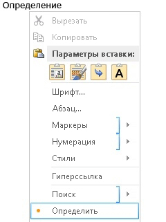
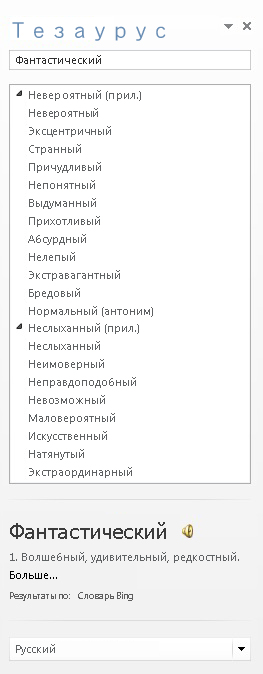
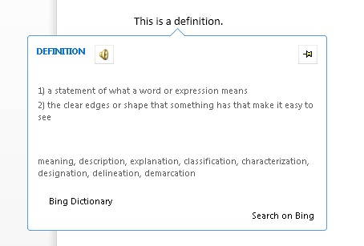
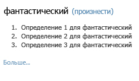

# <a name="create-a-dictionary-task-pane-add-in"></a>Создание надстройки области задач словаря


В этой статье представлены пример надстройки области задач и соответствующая веб-служба, которая предоставляет словарные статьи определений или синонимов из тезауруса к слову, выбранному пользователем в документе Word 2013. 

Надстройка словаря Office базируется на стандартной надстройке области задач с дополнительными функциональными возможностями поддержки запросов и отображения определений из словарной веб-службы XML в дополнительных расположениях пользовательского интерфейса приложения Office. 

В обычной надстройке области задач словаря пользователь выбирает слово или фразу в документе, после чего логика JavaScript надстройки передает выделенный фрагмент в XML-веб-службу поставщика словаря. Затем веб-страница этого поставщика обновляется, чтобы показать пользователю определения выделенного фрагмента. Компонент XML-веб-службы возвращает до трех определений в формате, определенном схемой XML OfficeDefinitions. Эти определения отображаются в ведущем приложении Office (в разных местах его пользовательского интерфейса). На рисунке 1 показано выделение фрагмента и отображение результатов при использовании надстройки словаря Bing, запущенной в Word 2013.

*Рисунок 1. Надстройка словаря, отображающая определения выбранного слова*


Это зависит от вас, чтобы определить, если щелкнув ссылку См. больше в HTML-интерфейсе надстройки словаря отображает дополнительные сведения в области задач или открывает отдельное окно браузера на полную веб-страницу для выбранного слова или фразы.
На рисунке 2 показана команда **контекстного меню Define** , которая позволяет пользователям быстро запускать установленные словари. На рисунках 3–5 перечислены все расположения в пользовательском интерфейсе Office, в которых словарные XML-службы предоставляют определения в Word 2013.

*Рис. 2. Команда определения в контекстном меню*




*Рис. 3. Определения в областях проверки правописания*


*Рис. 4. Определения в области "Тезаурус"*




*Рис. 5. Определения в режиме чтения*



Чтобы создать надстройку области задач, которая выполняет поиск в словаре, необходимо создать два основных компонента: 


- веб-службу XML, которая ищет определения в словарной службе, а затем возвращает результаты в формате XML, которые могут быть отображены в надстройке словаря;
    
- надстройку области задач, которая отправляет выбранное пользователем слово или фразу в словарную веб-службу, отображает определения и может вставить эти значения в документ.
    
В следующих разделах приведены примеры создания этих компонентов.

## <a name="creating-a-dictionary-xml-web-service"></a>Создание словарной веб-службы XML


Веб-служба XML должна возвращать запросы веб-служб в виде XML-кода, который соответствует XML-схеме OfficeDefinitions. В двух следующих разделах описывается XML-схема OfficeDefinitions и предоставлен пример возможности кодирования веб-службы XML, возвращающей запросы в этом формате XML.


### <a name="officedefinitions-xml-schema"></a>XML-схема OfficeDefinitions

В следующем коде отображается XSD для XML-схемы OfficeDefinitions.


```XML
<?xml version="1.0" encoding="utf-8"?>
<xs:schema
  xmlns:xsi="http://www.w3.org/2001/XMLSchema-instance"
  xmlns:xs="https://www.w3.org/2001/XMLSchema"
  targetNamespace="http://schemas.microsoft.com/NLG/2011/OfficeDefinitions"
  xmlns="http://schemas.microsoft.com/NLG/2011/OfficeDefinitions">
  <xs:element name="Result">
    <xs:complexType>
      <xs:sequence>
        <xs:element name="SeeMoreURL" type="xs:anyURI"/>
        <xs:element name="Definitions" type="DefinitionListType"/>
      </xs:sequence>
    </xs:complexType>
  </xs:element>
  <xs:complexType name="DefinitionListType">
    <xs:sequence>
      <xs:element name="Definition" maxOccurs="3">
        <xs:simpleType>
          <xs:restriction base="xs:normalizedString">
            <xs:maxLength value="400"/>
          </xs:restriction>
        </xs:simpleType>
      </xs:element>
    </xs:sequence>
  </xs:complexType>
</xs:schema>
```

Возвращенный XML, соответствующий схеме OfficeDefinitions `Result` `Definitions` `Definition` , состоит из корневого элемента, который содержит элемент с от нуля до трех детских элементов, каждый из которых содержит определения длиной не более 400 символов. Кроме того, в элементе `SeeMoreURL` должен быть указан URL-адрес полной страницы на сайте словаря. В следующем примере показана структура возвращенного XML-кода, соответствующего схеме OfficeDefinitions.

```XML
<?xml version="1.0" encoding="utf-8"?>
<Result xmlns="http://schemas.microsoft.com/NLG/2011/OfficeDefinitions">
  <SeeMoreURL xmlns="">www.bing.com/dictionary/search?q=example</SeeMoreURL>
  <Definitions xmlns="">
    <Definition>Definition1</Definition>
    <Definition>Definition2</Definition>
    <Definition>Definition3</Definition>
  </Definitions>
 </Result>

```


### <a name="sample-dictionary-xml-web-service"></a>Пример словарной веб-службы XML

Приведенный ниже код C# предоставляет простой пример написания кода для веб-службы XML, которая возвращает результат запроса словаря в XML-формате OfficeDefinitions.


```cs
using System;
using System.Collections.Generic;
using System.Linq;
using System.Web;
using System.Web.Services;
using System.Xml;
using System.Text;
using System.IO;
using System.Net;

/// <summary>
/// Summary description for _Default
/// </summary>
[WebService(Namespace = "http://tempuri.org/")]
[WebServiceBinding(ConformsTo = WsiProfiles.BasicProfile1_1)]
// To allow this web service to be called from script, using ASP.NET AJAX, uncomment the following line. 
// [System.Web.Script.Services.ScriptService]
public class WebService : System.Web.Services.WebService {

    public WebService () {

        // Uncomment the following line if using designed components 
        // InitializeComponent(); 
    }

    // You can replace this method entirely with your own method that gets definitions
    // from your data source, and then formats it into the OfficeDefinitions XML format. 
    // If you need a reference for constructing the returned XML, you can use this example as a basis.
    [WebMethod]
    public XmlDocument Define(string word)
    {

        StringBuilder sb = new StringBuilder();
        XmlWriter writer = XmlWriter.Create(sb);
        {
            writer.WriteStartDocument();
            
                writer.WriteStartElement("Result", "http://schemas.microsoft.com/NLG/2011/OfficeDefinitions");

            // See More URL should be changed to the dictionary publisher's page for that word on their website.
                    writer.WriteElementString("SeeMoreURL", "http://www.bing.com/search?q=" + word);

                    writer.WriteStartElement("Definitions");
            
                        writer.WriteElementString("Definition", "Definition 1 of " + word);
                        writer.WriteElementString("Definition", "Definition 2 of " + word);
                        writer.WriteElementString("Definition", "Definition 3 of " + word);
                   
                    writer.WriteEndElement();


                writer.WriteEndElement();
            
            writer.WriteEndDocument();
        }
        writer.Close();

        XmlDocument doc = new XmlDocument();
        doc.LoadXml(sb.ToString());

        return doc;
    }
}
```


## <a name="creating-the-components-of-a-dictionary-add-in"></a>Создание компонентов надстройки словаря


Надстройка словаря состоит из трех основных файлов компонентов.


- XML-файл манифеста, который описывает надстройку.
    
- HTML-файл, который предоставляет пользовательский интерфейс надстройки.
    
- Файл JavaScript, который содержит логику для получения выделенного пользователем фрагмента из документа, отправки выбранного слова или фразы в веб-службу и отображения возвращенных результатов в пользовательском интерфейсе надстройки.
    

### <a name="creating-a-dictionary-add-ins-manifest-file"></a>Создание файла манифеста надстройки словаря

Ниже приведен пример файла манифеста для надстройки словаря.


```XML
<?xml version="1.0" encoding="utf-8"?>
<OfficeApp xmlns="http://schemas.microsoft.com/office/appforoffice/1.0" xmlns:xsi="http://www.w3.org/2001/XMLSchema-instance" xsi:type="TaskPaneApp">
  <Id>7164e750-dc86-49c0-b548-1bac57abdc7c</Id>
  <Version>15.0</Version>
  <ProviderName>Microsoft Office Demo Dictionary</ProviderName>
  <DefaultLocale>en-us</DefaultLocale>
  <!--DisplayName is the name that will appear in the user's list of applications.-->
  <DisplayName DefaultValue="Microsoft Office Demo Dictionary" />
  <!--Description is a 2-3 sentence description of this dictionary. -->
  <Description DefaultValue="The Microsoft Office Demo Dictionary is an example built to demonstrate how a publisher could create a dictionary that integrates with Office. It does not return real definitions." />
  <!--IconUrl is the URI for the icon that will appear in the user's list of applications.-->
  <IconUrl DefaultValue="http://officeimg.vo.msecnd.net/_layouts/images/general/office_logo.jpg" />
  <SupportUrl DefaultValue="[Insert the URL of a page that provides support information for the app]" />
  <!--Capabilities specifies the kind of Office application your dictionary add-in will support. You shouldn't have to modify this area.-->
  <Capabilities>
    <Capability Name="Workbook"/>
    <Capability Name="Document"/>
    <Capability Name="Project"/>
  </Capabilities>
  <DefaultSettings>
    <!--SourceLocation is the URL for your dictionary-->
    <SourceLocation DefaultValue="http://christophernlg/ExampleDictionary/DictionaryHome.html" />
  </DefaultSettings>
  <!--Permissions is the set of permissions a user will have to give your dictionary. If you need write access, such as to allow a user to replace the highlighted word with a synonym, use ReadWriteDocument. -->
  <Permissions>ReadDocument</Permissions>
  <Dictionary>
    <!--TargetDialects is the set of regional languages your dictionary contains. For example, if your dictionary applies to Spanish (Mexico) and Spanish (Peru), but not Spanish (Spain), you can specify that here. Do not put more than one language (for example, Spanish and English) here. Publish separate languages as separate dictionaries. -->
    <TargetDialects>
      <TargetDialect>EN-AU</TargetDialect>
      <TargetDialect>EN-BZ</TargetDialect>
      <TargetDialect>EN-CA</TargetDialect>
      <TargetDialect>EN-029</TargetDialect>
      <TargetDialect>EN-HK</TargetDialect>
      <TargetDialect>EN-IN</TargetDialect>
      <TargetDialect>EN-ID</TargetDialect>
      <TargetDialect>EN-IE</TargetDialect>
      <TargetDialect>EN-JM</TargetDialect>
      <TargetDialect>EN-MY</TargetDialect>
      <TargetDialect>EN-NZ</TargetDialect>
      <TargetDialect>EN-PH</TargetDialect>
      <TargetDialect>EN-SG</TargetDialect>
      <TargetDialect>EN-ZA</TargetDialect>
      <TargetDialect>EN-TT</TargetDialect>
      <TargetDialect>EN-GB</TargetDialect>
      <TargetDialect>EN-US</TargetDialect>
      <TargetDialect>EN-ZW</TargetDialect>
    </TargetDialects>
    <!--QueryUri is the address of this dictionary's XML web service (which is used to put definitions in additional contexts, such as the spelling checker.)-->
    <QueryUri DefaultValue="http://christophernlg/ExampleDictionary/WebService.asmx/Define?word="/>
    <!--Citation Text, Dictionary Name, and Dictionary Home Page will be combined to form the citation line (for example, this would produce "Examples by: Microsoft", where "Microsoft" is a hyperlink to http://www.microsoft.com).-->
    <CitationText DefaultValue="Examples by: " />
    <DictionaryName DefaultValue="Microsoft" />
    <DictionaryHomePage DefaultValue="http://www.microsoft.com" />
  </Dictionary>
</OfficeApp>
```

Элемент `Dictionary` и его детские элементы, специфические для создания файла манифеста надстройки словаря, описаны в следующих разделах. Сведения о других элементах в файле манифеста см. в Office [XML-манифеста надстройки](../develop/add-in-manifests.md).


### <a name="dictionary-element"></a>Элемент Dictionary


Определяет параметры надстроек словаря.

 **Родительский элемент**

 `<OfficeApp>`

 **Дочерние элементы**

 `<TargetDialects>`, `<QueryUri>`, `<CitationText>`, `<DictionaryName>`, `<DictionaryHomePage>`

 **Замечания**

Элемент `Dictionary` и его детские элементы добавляются в манифест надстройки области задач при создании надстройки словаря.


#### <a name="targetdialects-element"></a>Элемент TargetDialects


Определяет региональные языки, которые поддерживает этот словарь. Обязательный для надстроек словаря.

 **Родительский элемент**

 `<Dictionary>`

 **Дочерний элемент**

 `<TargetDialect>`

 **Замечания**

Элемент `TargetDialects` и его детские элементы указывают набор региональных языков, которые содержатся в словаре. Например, если словарь применяется к испанскому языку, на котором разговаривают в Мексике и Перу, но не в Испании, это можно указать в данном элементе. Не указывайте в этом манифесте более одного языка (например, испанский и английский). Публикуйте разные языки для отдельных словарей.

 **Пример**

```XML
<TargetDialects>
  <TargetDialect>EN-AU</TargetDialect>
  <TargetDialect>EN-BZ</TargetDialect>
  <TargetDialect>EN-CA</TargetDialect>
  <TargetDialect>EN-029</TargetDialect>
  <TargetDialect>EN-HK</TargetDialect>
  <TargetDialect>EN-IN</TargetDialect>
  <TargetDialect>EN-ID</TargetDialect>
  <TargetDialect>EN-IE</TargetDialect>
  <TargetDialect>EN-JM</TargetDialect>
  <TargetDialect>EN-MY</TargetDialect>
  <TargetDialect>EN-NZ</TargetDialect>
  <TargetDialect>EN-PH</TargetDialect>
  <TargetDialect>EN-SG</TargetDialect>
  <TargetDialect>EN-ZA</TargetDialect>
  <TargetDialect>EN-TT</TargetDialect>
  <TargetDialect>EN-GB</TargetDialect>
  <TargetDialect>EN-US</TargetDialect>
  <TargetDialect>EN-ZW</TargetDialect>
</TargetDialects>
```


#### <a name="targetdialect-element"></a>Элемент TargetDialect


Определяет региональный язык, который поддерживает этот словарь. Обязательный для надстроек словаря.

 **Родительский элемент**

 `<TargetDialects>`

 **Примечания**

Укажите значение регионального языка в формате тегов `language` RFC1766, например EN-US.

 **Пример**


```XML
<TargetDialect>EN-US</TargetDialect>
```


#### <a name="queryuri-element"></a>Элемент QueryUri


Определяет конечную точку службы запросов словаря. Обязательный элемент для надстроек словаря.

 **Родительский элемент**

 `<Dictionary>`

 **Замечания**

Это универсальный код ресурса (URI) XML-веб-службы поставщика словаря. К этому URI добавляется строка запроса с надлежащими escape-символами. 

 **Пример**


```XML
<QueryUri DefaultValue="http://msranlc-lingo1/proof.aspx?q="/>
```


#### <a name="citationtext-element"></a>Элемент CitationText


Определяет текст, который будет использоваться в ссылках. Обязательный элемент для надстроек словаря.

 **Родительский элемент**

 `<Dictionary>`

 **Замечания**

В этом элементе указывается начальный текст ссылки, который будет отображаться в строке под контентом, возвращенным из веб-службы (например, "Источник:" или "Предоставлено:").

Для этого элемента можно указать значения для дополнительных локализов с помощью `Override` элемента. Например, если пользователь использует версию Office на испанском языке, но задействует английский словарь, то в строке ссылки будет написано "Resultados por: Bing", а не "Results by: Bing" или "Источник: Bing". Дополнительные сведения о том, как указать значения для дополнительных локализов, см. в разделе "Предоставление параметров для различных локализов" в манифесте [XML надстройки Office надстройки](../develop/add-in-manifests.md).

 **Пример**


```XML
<CitationText DefaultValue="Results by: " />
```


#### <a name="dictionaryname-element"></a>Элемент DictionaryName


Определяет имя этого словаря. Обязательный элемент для надстроек словаря.

 **Родительский элемент**

 `<Dictionary>`

 **Замечания**

В этом элементе указывается текст ссылки на источник. Текст ссылки на источник отображается в строчке под контентом, возвращенным веб-службой.

В этом элементе можно задать значения для дополнительных языковых стандартов.

 **Пример**

```XML
<DictionaryName DefaultValue="Bing Dictionary" />
```


#### <a name="dictionaryhomepage-element"></a>Элемент DictionaryHomePage


Определяет URL-адрес домашней страницы словаря. Обязательный элемент для надстроек словаря.

 **Родительский элемент**

 `<Dictionary>`

 **Замечания**

В этом элементе указывается URL-адрес источника. Текст ссылки на источник отображается в строчке под контентом, возвращенным веб-службой.

В этом элементе можно задать значения для дополнительных языковых стандартов.

 **Пример**


```XML
<DictionaryHomePage DefaultValue="http://www.bing.com" />
```


### <a name="creating-a-dictionary-add-ins-html-user-interface"></a>Создание пользовательского интерфейса HTML для надстройки словаря

В двух следующих примерах показаны HTML- и CSS-файлы для пользовательского интерфейса демонстрационной надстройки словаря. Чтобы просмотреть, как отображается пользовательский интерфейс в надстройке области задач, изучите рис. 6, который приведен сразу после кода. Чтобы узнать, как реализация JavaScript в файле Dictionary.js предоставляет логику программирования для этого пользовательского интерфейса HTML, см. раздел "Составление реализации JavaScript" ниже.

```HTML
<!DOCTYPE html>
<html>

<head>
<meta http-equiv="X-UA-Compatible" content="IE=Edge"/>

<!--The title will not be shown but is supplied to ensure valid HTML.-->
<title>Example Dictionary</title>

<!--Required library includes.-->
<script type="text/javascript" src="http://ajax.microsoft.com/ajax/4.0/1/MicrosoftAjax.js"></script>
<script type="text/javascript" src="office.js"></script>

<!--Optional library includes.-->
<script type="text/javascript" src="http://ajax.aspnetcdn.com/ajax/jQuery/jquery-1.5.1.js"></script>

<!--App-specific CSS and JS.-->
<link rel="Stylesheet" type="text/css" href="style.css" />
<script type="text/ecmascript" src="dictionary.js"></script>
</head>

<body>
<div id="mainContainer">
    <div id="header">
        <span id="headword"></span>
        <span id="pronunciation">(<a id="pronunciationLink">Pronounce</a>)</span>
    </div>
    <ol id="definitions">
    </ol>
    <div id="SeeMore">
    <a id="SeeMoreLink">See More...</a>
    </div>
</div>
</body>

</html>
```

В приведенном ниже примере показано содержание Style.css.

```CSS
#mainContainer
{
    font-family: Segoe UI;
    font-size: 11pt;
}

#headword
{
    font-family: Segoe UI Semibold;
    color: #262626;
}

#pronunciation
{
    margin-left: 2px;
    margin-right: 2px;
}

#definitions
{
    font-size: 8.5pt;
}
a
{
    font-size: 8pt;
    color: #336699;
    text-decoration: none;
}
a:visited
{
    color: #993366;
}
a:hover, a:active
{  
    text-decoration: underline;
}
```

*Рис. 6. Демонстрационный пользовательский интерфейс словаря*




### <a name="writing-the-javascript-implementation"></a>Реализация JavaScript


В приведенном ниже примере показана реализация JavaScript в файле Dictionary.js, которая вызывается с HTML-страницы надстройки и предоставляет программную логику для надстройки Demo Dictionary. В этом сценарии используется вышеописанная XML-веб-служба. Если поместить сценарий в тот же каталог, что и пример веб-службы, он будет получать определения из этой службы. Его можно использовать с общедоступной XML-веб-службой, соответствующей схеме OfficeDefinitions. Для этого измените переменную `xmlServiceURL` в начале файла, а затем замените ключ API Bing для произношений на правильно зарегистрированный.

Основные участники API Office JavaScript (Office.js), которые вызваны из этой реализации, являются следующими:


- [](/javascript/api/office/office.document) Событие [](/javascript/api/office) инициализации `Office` объекта, которое повышается при инициализации контекста надстройки, и предоставляет доступ к экземпляру объекта Document, который представляет документ, с которым взаимодействует надстройка.
    
- Метод [addHandlerAsync](/javascript/api/office/office.document#office-office-document-addhandlerasync-member(1)) `Document` объекта, `initialize` который вызван в функцию, чтобы добавить обработник событий для события [SelectionChanged](/javascript/api/office/office.documentselectionchangedeventargs) документа для прослушивания изменений выбора пользователя.
    
- Метод [getSelectedDataAsync](/javascript/api/office/office.document#office-office-document-getselecteddataasync-member(1)) `Document` объекта, `tryUpdatingSelectedWord()` `SelectionChanged` который вызывается в функции при поднятии обработника событий, чтобы получить выбранное пользователем слово или фразу, принудить его к простому тексту, `selectedTextCallback` а затем выполнить функцию асинхронного вызова.
    
- Когда выполняется `selectTextCallback`  `getSelectedDataAsync` асинхронная функция обратного вызова, которая передается в качестве аргумента обратного вызова метода, она получает значение выбранного текста при возвращении обратного вызова. Оно получает это значение из аргумента _selectedText_ обратного вызова (который имеет тип [AsyncResult](/javascript/api/office/office.asyncresult)) с помощью свойства значения возвращаемого [](/javascript/api/office/office.asyncresult#office-office-asyncresult-status-member) `AsyncResult` объекта.
    
- Остальной код функции `selectedTextCallback` отправляет XML-веб-службе запрос на определения. Кроме того, он вызывает API-интерфейсы Microsoft Translator для получения URL-адреса WAV-файла с произношением выделенного слова.
    
- Остальной код в файле Dictionary.js служит для отображения списка определений и ссылок на произношения в пользовательском интерфейсе HTML надстройки.
    


```js
// The document the dictionary add-in is interacting with.
var _doc; 
// The last looked-up word, which is also the currently displayed word.
var lastLookup; 
// For demo purposes only!! Get an AppID if you intend to use the Pronunciation service for your feature.
var appID="3D8D4E1888B88B975484F0CA25CDD24AAC457ED8"; 

// The base URL for the OfficeDefinitions-conforming XML web service to query for definitions.
var xmlServiceUrl = "WebService.asmx/Define?Word="; 

// Initialize the add-in. 
// The initialize function is required for all add-ins.
Office.initialize = function (reason) {
    // Checks for the DOM to load using the jQuery ready function.
    $(document).ready(function () {
    // After the DOM is loaded, app-specific code can run.
    // Store a reference to the current document.
    _doc = Office.context.document; 
    // Check whether text is already selected.
    tryUpdatingSelectedWord(); 
    _doc.addHandlerAsync("documentSelectionChanged", tryUpdatingSelectedWord); //Add a handler to refresh when the user changes selection.
    });
}

// Executes when event is raised on user's selection changes, and at initialization time. 
// Gets the current selection and passes that to asynchronous callback method.
function tryUpdatingSelectedWord() {
    _doc.getSelectedDataAsync(Office.CoercionType.Text, selectedTextCallback); 
}

// Async callback that executes when the add-in gets the user's selection.
// Determines whether anything should be done. If so, it makes requests that will be passed to various functions.
function selectedTextCallback(selectedText) {
    selectedText = $.trim(selectedText.value);
    // Be sure user has selected text. The SelectionChanged event is raised every time the user moves the cursor, even if no selection.
    if (selectedText != "") { 
        // Check whether user selected the same word the pane is currently displaying to avoid unnecessary web calls.
        if (selectedText != lastLookup) { 
            // Update the lastLookup variable.
            lastLookup = selectedText; 
            // Set the "headword" span to the word you looked up.
            $("#headword").text(selectedText); 
            // AJAX request to get definitions for the selected word; pass that to refreshDefinitions.
            $.ajax(xmlServiceUrl + selectedText, { dataType: 'xml', success: refreshDefinitions, error: errorHandler }); 
            // AJAX request to the Microsoft Translator APIs. Gets the URL of a WAV file with pronunciation, which is passed to refreshPronunciation. See http://www.microsofttranslator.com/dev for details.
            $.ajax("http://api.microsofttranslator.com/V2/Ajax.svc/Speak?oncomplete=refreshPronunciation&amp;appId=" + appID + "&amp;text=" + selectedText + "&amp;language=en-us", { dataType: 'script', success: null, error: errorHandler }); 
        }
    }
}

// This function is called when the add-in gets back the definitions target word.
// It removes the old definitions and replaces them with the definitions for the current word.
// It also sets the "See More" link.
function refreshDefinitions(data, textStatus, jqXHR) {
    $(".definition").remove();
    // Make a new list item for each returned definition that was returned, set the CSS class, and append it to the definitions div.
    $(data).find("Definition").each(function () {
        $(document.createElement("li")).text($(this).text()).addClass("definition").appendTo($("#definitions"));
    });
    $("#SeeMoreLink").attr("href", $(data).find("SeeMoreURL").text()); //Change the "See More" link to direct to the correct URL.
}

// This function is called when the add-in gets back the link to the pronunciation
// to set the "Pronounce" link to the URL of the .WAV file.
function refreshPronunciation(data) {
    $("#pronunciationLink").attr("href", data);
}

// Basic error handler that writes to a div with id='message'.
function errorHandler(jqXHR, textStatus, errorThrown) {
    document.getElementById('message').innerText += errorThrown;
}

```
