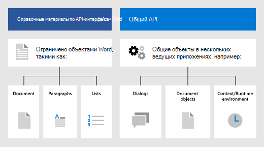

# Объектная модель JavaScript для Word в надстройках OfficeWord JavaScript object model in Office Add-ins

В этой статье описаны основные принципы использования [API JavaScript для Word](../reference/overview/word-add-ins-reference-overview.md) для создания надстроек. Представлены основные понятия, важные для использования API.This article describes concepts that are fundamental to using the [Word JavaScript API](../reference/overview/word-add-ins-reference-overview.md) to build add-ins. It introduces core concepts that are fundamental to using the API.

> [!IMPORTANT]
> Сведения об асинхронном типе API-интерфейсов Word и принципах их работы с документами см. в статье [Использование модели API, зависящей от приложения](../develop/application-specific-api-model.md).See [Using the application-specific API model](../develop/application-specific-api-model.md) to learn about the asynchronous nature of the Word APIs and how they work with the document.

## API-интерфейсы Office.js для WordOffice.js APIs for Word

Надстройка Word взаимодействует с объектами в Word с помощью API JavaScript для Office, включающего две объектных модели JavaScript:A Word add-in interacts with objects in Excel by using the Office JavaScript API, which includes two JavaScript object models:

* **API JavaScript для Word**. [API-интерфейс JavaScript для Word](../reference/overview/word-add-ins-reference-overview.md) предоставляет строго типизированные объекты, с помощью которых можно получать доступ к документам, диапазонам, таблицам, спискам, форматированию и другим объектам.**Word JavaScript API**: The [Word JavaScript API](../reference/overview/word-add-ins-reference-overview.md) provides strongly-typed objects that you can use to access the document, ranges, tables, lists, formatting, and more.

* **Общие API-интерфейсы**. [Общий API](/javascript/api/office) можно использовать для доступа к таким компонентам, как пользовательский интерфейс, диалоговые окна и параметры клиентов, общие для нескольких типов приложений Office.**Common APIs**: The [Common API](/javascript/api/office) can be used to access features such as UI, dialogs, and client settings that are common across multiple types of Office applications.

Скорее всего, вы будете разрабатывать большую часть функций надстроек для Word с помощью API JavaScript для Word, но вам также потребуются объекты из общего API.While you'll likely use the Word JavaScript API to develop the majority of functionality in add-ins that target Word, you'll also use objects in the Common API. Пример.For example:

* [Context](/javascript/api/office/office.context). объект `Context` представляет среду выполнения надстройки и предоставляет доступ к ключевым объектам API.[Context](/javascript/api/office/office.context): The `Context` object represents the runtime environment of the add-in and provides access to key objects of the API. Он состоит из данных конфигурации документа, например `contentLanguage` и `officeTheme`, а также предоставляет сведения о среде выполнения надстройки, например `host` и `platform`.It consists of document configuration details such as `contentLanguage` and `officeTheme` and also provides information about the add-in's runtime environment such as `host` and `platform`. Кроме того, он предоставляет метод `requirements.isSetSupported()`, с помощью которого можно проверить, поддерживается ли указанный набор обязательных элементов приложением Excel, в котором работает надстройка.Additionally, it provides the `requirements.isSetSupported()` method, which you can use to check whether a specified requirement set is supported by the Excel application where the add-in is running.
* [Document](/javascript/api/office/office.document). Объект `Document` предоставляет метод `getFileAsync()`, позволяющий загрузить файл Word, в котором работает надстройка.[Document](/javascript/api/office/office.document): The `Document` object provides the `getFileAsync()` method, which you can use to download the Word file where the add-in is running.

## Объектная модель для WordWord-specific object model

Чтобы понять API-интерфейсы Word, нужно понимать, как компоненты документа связаны друг с другом.To understand the Word APIs, you must understand how the components of a document are related to one another.

* Объект **Document** содержит объекты **Section**, а также объекты уровня документа, например параметры и настраиваемые части XML.The **Document** contains the **Section**s, and document-level entities such as settings and custom XML parts.
* Объект **Section** содержит объект **Body**.A **Section** contains a **Body**.
* Объект **Body** предоставляет доступ к объектам **Paragraph**, **ContentControl** и **Range**, а также к другим объектам.A **Body** gives access to **Paragraph**s, **ContentControl**s, and **Range** objects, among others.
* Объект **Range** представляет собой непрерывную область содержимого, включающую текст, пробелы, объекты **Table**, а также изображения.A **Range** represents a contiguous area of content, including text, white space, **Table**s, and images. Он также содержит большую часть методов обработки текста.It also contains most of the text manipulation methods.
* Объект **List** представляет текст в виде нумерованного или маркированного списка.A **List** represents text in a numbered or bulleted list.

## См. такжеSee also

- [Обзор API JavaScript для WordWord JavaScript API overview](../reference/overview/word-add-ins-reference-overview.md)
- [Создание первой надстройки WordBuild your first Word add-in](../quickstarts/word-quickstart.md)
- [Руководство по надстройкам WordWord add-in tutorial](../tutorials/word-tutorial.md)
- [Справочник по API JavaScript для WordWord JavaScript API reference](/javascript/api/word)
- [Сведения о программе для разработчиков Microsoft 365Learn about the Microsoft 365 Developer Program](https://developer.microsoft.com/microsoft-365/dev-program)