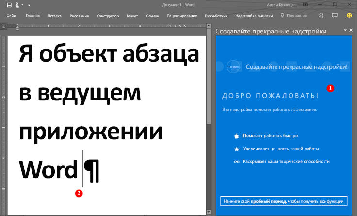

# <a name="word-add-ins-overview"></a>Обзор надстроек Word

Хотите создать решение для автоматического составления документов или привязки и доступа к данным в документе Word из других источников? Чтобы расширить возможности клиентов Word на компьютере с Windows, Mac или в облаке, используйте платформу надстроек Office, которая включает API JavaScript для Word и API JavaScript для Office.

На [платформе надстроек Office](../overview/office-add-ins.md) можно разрабатывать не только надстройки Word. Используя команды надстроек, вы можете расширять интерфейс Word и запускать области задач, которые выполняют сценарий JavaScript, взаимодействующий с содержимым документа. Любой код, который работает в браузере, будет работать в надстройке Word. Надстройки, взаимодействующие с содержимым документа Word, создают запросы на совершение действий с объектами Word и синхронизацию состояния этих объектов.

[!INCLUDE [publish policies note](../includes/note-publish-policies.md)]

Ниже показан пример надстройки Word, работающей в области задач.

*Рис. 1. Надстройка, работающая в области задач Word*



Надстройка Word может (1) отправлять запросы в документ Word и (2) обновлять, удалять или перемещать абзац, используя JavaScript для доступа к объекту paragraph. Например, в приведенном ниже коде показано, как добавить в абзац новое предложение.

```js
Word.run(function (context) {
    var paragraphs = context.document.getSelection().paragraphs;
    paragraphs.load();
    return context.sync().then(function () {
        paragraphs.items[0].insertText(' New sentence in the paragraph.',
                                       Word.InsertLocation.end);
    }).then(context.sync);
});

```

Для размещения надстройки Word можно использовать любой веб-сервер, в частности ASP.NET, NodeJS и Python. Используйте любимую клиентскую платформу — Ember, Backbone, Angular, React —для разработки своего решения; или продолжайте работу с VanillaJS. Для [аутентификации](../develop/overview-authn-authz.md) и размещения приложения можно использовать Azure.

API JavaScript для Word предоставляют приложению доступ к объектам и метаданным документа Word. С помощью этих API можно создавать надстройки, предназначенные для:

* Word 2013 или более поздней версии для Windows
* Word в Интернете
* Word 2016 или более поздней версии для Mac
* Word для iPad

Написанные вами надстройки будут работать во всех версиях Word на различных платформах. Дополнительные сведения см. в статье [Доступность клиентских приложений и платформ для надстроек Office](../overview/office-add-in-availability.md).

## <a name="javascript-apis-for-word"></a>API JavaScript для Word

Для взаимодействия с объектами и метаданными в документе Word можно использовать два набора API JavaScript. Первый — [общий API](/javascript/api/office), представленный в Office 2013. Многие объекты общего API можно использовать в надстройках, размещенных в двух или более клиентах Office. В этом API широко используются обратные вызовы.

Второй — [API JavaScript для Word](/javascript/api/word). Это [зависящая от приложений модель API](../develop/application-specific-api-model.md), которая появилась в Word 2016. Это строго типизированная объектная модель, с помощью которой можно создавать надстройки Word, предназначенные для Word 2016 для Mac и Windows. Эта объектная модель использует обещания и предоставляет доступ к объектам Word, в частности [Body](/javascript/api/word/word.body), [ContentControl](/javascript/api/word/word.contentcontrol), [InlinePicture](/javascript/api/word/word.inlinepicture) и [Paragraph](/javascript/api/word/word.paragraph). API JavaScript для Word включает определения TypeScript и файлы vsdoc, чтобы вы могли получать подсказки кода в своей интегрированной среде разработки.

В настоящее время все клиенты Word поддерживают общий API JavaScript для Office, а большинство из них поддерживают и API JavaScript для Word. Дополнительные сведения о поддерживаемых клиентах см. в статье [Доступность клиентских приложений и платформ Office для надстроек Office](../overview/office-add-in-availability.md).

Рекомендуем начать с API JavaScript для Word, так как с объектной моделью проще работать. Используйте API JavaScript для Word, если вам нужно:

* получить доступ к объектам в документе Word.

Используйте общий API JavaScript для Office, если вам нужно:

* создать надстройки для Word 2013;
* выполнить начальные действия для приложения;
* проверить поддерживаемый набор требований;
* получить доступ к метаданным документа, его параметрам и сведениям о среде;
* создать привязку к разделам документа и записать события;
* использовать пользовательские XML-части;
* открыть диалоговое окно.

## <a name="next-steps"></a>Дальнейшие действия

Готовы [создать свою первую надстройку Word](../quickstarts/word-quickstart.md)? Используйте [манифест надстройки](../develop/add-in-manifests.md), чтобы указать ведущее приложение, имя, разрешения и другие сведения.

Чтобы узнать больше о том, как создать качественную и привлекательную надстройку Word, см. [руководство по разработке](../design/add-in-design.md) и [рекомендации](../concepts/add-in-development-best-practices.md).

После разработки надстройку можно [опубликовать](../publish/publish.md) в сетевой папке, каталоге приложений или AppSource.

## <a name="see-also"></a>См. также

* [Разработка надстроек Office](../develop/develop-overview.md)
* [Сведения о программе для разработчиков Microsoft 365](https://developer.microsoft.com/microsoft-365/dev-program)
* [Обзор платформы надстроек Office](../overview/office-add-ins.md)
* [Справочные материалы по API JavaScript для Word](../reference/overview/word-add-ins-reference-overview.md)